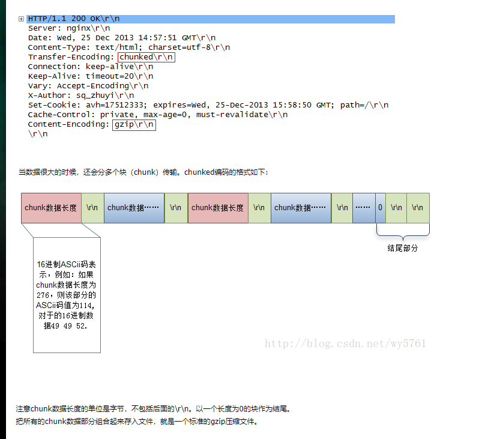

## django

https://www.cnblogs.com/liwenzhou/p/8258992.html

#### 理论

https://www.cnblogs.com/liwenzhou/articles/8620663.html


|websocket请求头格式


Sec-WebSocket-Key是客户端随机生成并进行base64的字符串，它的原始内容是什么服务器不需要关心，服务器需要将这个字符串，与”258EAFA5-E914-47DA-95CA-C5AB0DC85B11″这个字符串进行拼接，然后对这个拼接好的字符串进行sha-1运算，再把sha-1散列得到的20字节进行base64编码即为响应头Sec-WebSocket-Accept的值


```
Upgrade: websocket
Connection: Upgrade
Sec-WebSocket-Key: x3JJHMbDL1EzLkh9GBhXDw==
Sec-WebSocket-Protocol: chat, superchat
Sec-WebSocket-Version: 13
```


| websocket响应格式


###### 注释：

###### 	1.HTTP响应必须要有状态行

###### 	2.浏览器请求你的服务器，首次会请求两次，第一次会去请求 favicon.ico, 第二次才是去请求你的其他东西

###### 	3.请求头的URL 就是路径,比如我浏览器上输入127.0.0.1:21567/xiaohei?a=2, 路径就是/xiaohei?a=2，他就是url

###### 	URL --- Uniform resource locator (同意资源定位器)


#### 动态网站和静态网站

1. 动态网页本质上就是字符串的替换， 字符串替换发生在什么地方： 发生在服务端替换完再返回给浏览器


#### 总结一下

1. web框架的本质：

   1. socket服务端  与 浏览器的通信

2. socket 服务端功能划分

   ​    a.负责与浏览器收发消息（socket通信）   ----> 常见的第三方 wsgiref /  uWsgi/  gunicorn

   ​	b.根据用户访问不同的路径执行不同 函数

   ​	c. 从HTML 读取出内容，并且完成字符串替换    ----> jinja2

3. Python中 web框架的分类

   ​	一、按上面第二点的3个功能划分：

   ​		1. 框架自带a, b, c                                        -------->  tornadao(Tornado不光是一个web框架，还实现了WSGI容器的功能)

   ​        2. 框架自带b和c，使用第三方的a             --------> Django(自带的wsgiref不行，在真实生产环境还是要借助其他的)

   ​        3.框架自带b， 使用第三方的a和c            ---------> Flask

      二、按另外一个维度来划分:

   ​	

   ​         1.Django       ------> 大而全（你做一个网站能用到的他都有）

   ​          2.其他             ------> Flask 轻量级

   4.  第二点中 a 和 b or c需要通信，也要遵循一个协议WSGI

#### WSGI（web server gateway interface -- web服务网关接口）  去了解一下


#### 如何借助其他工具提高Django的性能

http://www.jquerycn.cn/a_39186


#### django下载（有讲究）

官网：https://www.djangoproject.com/download/


我们使用LTS版本


#### settings


```python
D://origin//学习代码//my_django_project//my_django_project//settins.py


1. BASE_DIR = os.path.dirname(os.path.dirname(os.path.abspath(__file__)))  # 这一句定位整个项目的项目跟路径，以后无论放到哪里my_django_project都是跟目录
    

    
2. TEMPLATES = [
    {
        'BACKEND': 'django.template.backends.django.DjangoTemplates',
        
        # 所以这里可以改变我们存放HTML文件的存放路径， 而且也告诉我们，我们把HTML文件放到templates里面，render会到这里面来给你读取出来，比你的f.read()高效的多
        
        'DIRS': [os.path.join(BASE_DIR, 'templates')],
        'APP_DIRS': True,
        'OPTIONS': {
            'context_processors': [
                'django.template.context_processors.debug',
                'django.template.context_processors.request',
                'django.contrib.auth.context_processors.auth',
                'django.contrib.messages.context_processors.messages',
            ],
        },
    },
]

🔺# 'DIRS': [os.path.join(BASE_DIR, 'templates')] 为什么不用 '{}\\{}'.format() 来拼接，因为每个系统的分割符号不一样，window是\\， 那么Linux上呢，代码推到linux上能跑？
```


#### django的注意点

- ```
  django服务万能启动：PYTHONENCODING=UTF-8 python manage.py runserver
  ```

#### django的模块

* ```python
  from django.views.generic import View(通用类)
  ```

* ```
  from django.urls import path,include
  ```

* ```python
  from django.http import HttpResponse,JsonResponse
  ```


#### 创建一个django对象

```python
1.	django-admin startproject + "项目名称"
2.	cd /d "项目名称"
3.	python manage.py startapp + "应用项目名称"
```


#### request对象的方法

* `request.GET -> 获取url上？形式的参数`

* `request.POST ->获取post提交的数据`

* `request.path ->请求的路径，比如127.0.0.1/test/1`

  `那个这个值就是test/1`

* `request.method ->请求的方法get or post`

* `request.COOKIES ->请求过来的cookies`

* `request.user -> 请求的用户对象，可以通过它判断用户是否登     录，并获取用户信息`

* `request.session -> 一个既可读又可写的类似于字典的对象，表示当前的会话`

* `request.META ->一个标准的Python 字典，包含所有的HTTP 首部。具体的头部信息取决于客户端和服务器(有很多信息)`

#### django常用的返回对象

```
* HttpResponse 可以直接返回一些字符串内容

* render 将数据在模版中渲染并显示

* JsonResponse 返回一个json类型 通常用于与前端进行ajax交互

	from django.http import HttpResponse
	from django.shortcuts import render
	from django.http import JsonResponse

```


# 二、HTTP


## 2.1 请求方式

- **get**
- **post**
- **delete**
- **put**
- **options**


## 2.2 连接方式

备注：HTTP是无状态的，短链接。每次请求都是新的请求。

状态保持：Cookie、Session

#### 2.2.1 HTTP无状态协议和Connection:Keep-Alive容易犯的误区

名词解释：
HTTP无状态：无状态是指协议对于事务处理没有记忆能力，服务器不知道客户端是什么状态。从另一方面讲，打开一个服务器上的网页和你之前打开这个服务器上的网页之间没有任何联系
如果你要实现一个购物车，需要借助于Cookie或Session或服务器端API（如NSAPI and ISAPI）记录这些信息，请求服务器结算页面时同时将这些信息提交到服务器
当你登录到一个网站时，你的登录状态也是由Cookie或Session来“记忆”的，因为服务器并不知道你是否登录
优点：服务器不用为每个客户端连接分配内存来记忆大量状态，也不用在客户端失去连接时去清理内存，以更高效地去处理WEB业务
缺点：客户端的每次请求都需要携带相应参数，服务器需要处理这些参数

容易犯的误区：
1、HTTP是一个无状态的面向连接的协议，无状态不代表HTTP不能保持TCP连接，更不能代表HTTP使用的是UDP协议（无连接）
2、从HTTP/1.1起，默认都开启了Keep-Alive，保持连接特性，简单地说，当一个网页打开完成后，客户端和服务器之间用于传输HTTP数据的TCP连接不会关闭，如果客户端再次访问这个服务器上的网页，会继续使用这一条已经建立的连接
3、Keep-Alive不会永久保持连接，它有一个保持时间，可以在不同的服务器软件（如Apache）中设定这个时间


#### 2.2.2 为什么要有Connection: keep-alive？

在早期的HTTP/1.0中，每次http请求都要创建一个连接，而创建连接的过程需要消耗资源和时间，为了减少资源消耗，缩短响应时间，就需要重用连接。在后来的HTTP/1.0中以及HTTP/1.1中，引入了重用连接的机制，就是在http请求头中加入Connection: keep-alive来告诉对方这个请求响应完成后不要关闭，下一次咱们还用这个请求继续交流。协议规定HTTP/1.0如果想要保持长连接，需要在请求头中加上Connection: keep-alive，而HTTP/1.1默认是支持长连接的，有没有这个请求头都行。

当然了，协议是这样规定的，至于支不支持还得看服务器（比如tomcat）和客户端（比如浏览器）的具体实现。在实践过程中发现谷歌浏览器使用HTTP/1.1协议时请求头中总会带上Connection: keep-alive，另外通过httpclient使用HTTP/1.0协议去请求tomcat时，即使带上Connection: keep-alive请求头也保持不了长连接。如果HTTP/1.1版本的http请求报文不希望使用长连接，则要在请求头中加上Connection: close，接收到这个请求头的对端服务就会主动关闭连接。

但是http长连接会一直保持吗？肯定是不会的。一般服务端都会设置keep-alive超时时间。超过指定的时间间隔，服务端就会主动关闭连接。同时服务端还会设置一个参数叫最大请求数，比如当最大请求数是300时，只要请求次数超过300次，即使还没到超时时间，服务端也会主动关闭连接。

#### 2.2.3 Transfer-Encoding和Content-Length

谈到http长连接，都绕不开这两个请求/响应头。其中Transfer-Encoding不建议在请求头中使用，因为无法知道服务端能否解析这个请求头，而应该在响应头中使用，因为客户端浏览器都能解析这个响应头。<span style="color:red;">Content-Length在请求方法为GET的时候不能使用，在请求方法为POST的时候需要使用，同时也常常出现在响应头中</span>。为了方便描述，下面只说明响应头中出现这两个属性的情况。

要实现长连接很简单，只要客户端和服务端都保持这个http长连接即可。但问题的关键在于保持长连接后，浏览器如何知道服务器已经响应完成？在使用短连接的时候，服务器完成响应后即关闭http连接，这样浏览器就能知道已接收到全部的响应，同时也关闭连接（TCP连接是双向的）。在使用长连接的时候，响应完成后服务器是不能关闭连接的，那么它就要在响应头中加上特殊标志告诉浏览器已响应完成。

一般情况下这个特殊标志就是Content-Length，来指明响应体的数据大小，比如Content-Length: 120表示响应体内容有120个字节，这样浏览器接收到120个字节的响应体后就知道了已经响应完成。

由于Content-Length字段必须真实反映响应体长度，但实际应用中，有些时候响应体长度并没那么好获得，例如响应体来自于网络文件，或者由动态语言生成。这时候要想准确获取长度，只能先开一个足够大的内存空间，等内容全部生成好再计算。但这样做一方面需要更大的内存开销，另一方面也会让客户端等更久。这时候Transfer-Encoding: chunked响应头就派上用场了，该响应头表示响应体内容用的是分块传输，此时服务器可以将数据一块一块地分块响应给浏览器而不必一次性全部响应，待浏览器接收到全部分块后就表示响应结束。

以分块传输一段文本内容：“人的一生总是在追求自由的一生 So easy”来说明分块传输的过程，如下图所示




图中每个分块的第一行是分块内容的大小，十六进制表示，后面跟CRLF(\r\n)，第一行本身以及分块内容末尾的CRLF不计入大小。第二行是分块内容，后面也跟CRLF。最后一个分块虽然大小为零，但是必不可少，表示分块的结束，后面也跟CRLF，同时内容为空。最后，响应体以CRLF结束。将它们结合起来的响应内容就是：

```bash
HTTP/1.1 200 OK 
Content-Type: text/plain;charset=utf-8
Connection: keep-alive
Transfer-Encoding: chunked

21\r\n
人的一生总是在追求自由\r\n
11\r\n
的一生 So easy\r\n
0\r\n
\r\n
```


不过以上格式的响应体内容用浏览器自带的调试工具是看不出来的，浏览器自带调试工具对分块传输和非分块传输响应体的显示是一样的，要想看到区别，需要用Wireshark、Fiddler等抓包工具查看。

不过以上格式的响应体内容用浏览器自带的调试工具是看不出来的，浏览器自带调试工具对分块传输和非分块传输响应体的显示是一样的，要想看到区别，需要用Wireshark、Fiddler等抓包工具查看。

#### 2.2.4 HTTP keep-alive和TCP keepalive的区别

TCP keepalive指的是TCP保活计时器（keepalive timer）。设想有这样的情况：客户已主动与服务器建立了TCP连接。但后来客户端的主机突然出故障。显然，服务器以后就不能再收到客户发来的数据。因此，应当有措施使服务器不要再白白等待下去。这就是使用保活计时器。服务器每收到一次客户的数据，就重新设置保活计时器，时间的设置通常是两小时。若两小时没有收到客户的数据，服务器就发送一个探测报文段，以后则每隔75秒发送一次。若一连发送10个探测报文段后仍无客户的响应，服务器就认为客户端出了故障，接着就关闭这个连接。

 ——摘自谢希仁《计算机网络》

针对linux系统，TCP保活超时时间、探测报文段发送间隔、探测报文段最大发送次数都是可以设置的，如下

```bash
# cat /proc/sys/net/ipv4/tcp_keepalive_time  7200 当keepalive启用的时候，TCP发送keepalive消息的频度。缺省是2小时
# cat /proc/sys/net/ipv4/tcp_keepalive_intvl  75  当探测没有确认时，重新发送探测的频度。缺省是75秒
# cat /proc/sys/net/ipv4/tcp_keepalive_probes  9  探测尝试的次数。如果第1次探测包就收到响应了，则后8次的不再发
```


