[翻译网站](https://yiyibooks.cn/information/qy/django2/)

[官网](https://docs.djangoproject.com/zh-hans/2.2/)


# 一、HTTP

## 2.1 请求方式

- **get**
- **post**
- **delete**
- **put**
- **options**


## 2.2 连接方式

备注：HTTP是无状态的，短链接。每次请求都是新的请求。

状态保持：Cookie、Session

#### 2.2.1 HTTP无状态协议和Connection:Keep-Alive容易犯的误区

名词解释：
HTTP无状态：无状态是指协议对于事务处理没有记忆能力，服务器不知道客户端是什么状态。从另一方面讲，打开一个服务器上的网页和你之前打开这个服务器上的网页之间没有任何联系
如果你要实现一个购物车，需要借助于Cookie或Session或服务器端API（如NSAPI and ISAPI）记录这些信息，请求服务器结算页面时同时将这些信息提交到服务器
当你登录到一个网站时，你的登录状态也是由Cookie或Session来“记忆”的，因为服务器并不知道你是否登录
优点：服务器不用为每个客户端连接分配内存来记忆大量状态，也不用在客户端失去连接时去清理内存，以更高效地去处理WEB业务
缺点：客户端的每次请求都需要携带相应参数，服务器需要处理这些参数

容易犯的误区：
1、HTTP是一个无状态的面向连接的协议，无状态不代表HTTP不能保持TCP连接，更不能代表HTTP使用的是UDP协议（无连接）
2、从HTTP/1.1起，默认都开启了Keep-Alive，保持连接特性，简单地说，当一个网页打开完成后，客户端和服务器之间用于传输HTTP数据的TCP连接不会关闭，如果客户端再次访问这个服务器上的网页，会继续使用这一条已经建立的连接
3、Keep-Alive不会永久保持连接，它有一个保持时间，可以在不同的服务器软件（如Apache）中设定这个时间


#### 2.2.2 为什么要有Connection: keep-alive？

在早期的HTTP/1.0中，每次http请求都要创建一个连接，而创建连接的过程需要消耗资源和时间，为了减少资源消耗，缩短响应时间，就需要重用连接。在后来的HTTP/1.0中以及HTTP/1.1中，引入了重用连接的机制，就是在http请求头中加入Connection: keep-alive来告诉对方这个请求响应完成后不要关闭，下一次咱们还用这个请求继续交流。协议规定HTTP/1.0如果想要保持长连接，需要在请求头中加上Connection: keep-alive，而HTTP/1.1默认是支持长连接的，有没有这个请求头都行。

当然了，协议是这样规定的，至于支不支持还得看服务器（比如tomcat）和客户端（比如浏览器）的具体实现。在实践过程中发现谷歌浏览器使用HTTP/1.1协议时请求头中总会带上Connection: keep-alive，另外通过httpclient使用HTTP/1.0协议去请求tomcat时，即使带上Connection: keep-alive请求头也保持不了长连接。如果HTTP/1.1版本的http请求报文不希望使用长连接，则要在请求头中加上Connection: close，接收到这个请求头的对端服务就会主动关闭连接。

但是http长连接会一直保持吗？肯定是不会的。一般服务端都会设置keep-alive超时时间。超过指定的时间间隔，服务端就会主动关闭连接。同时服务端还会设置一个参数叫最大请求数，比如当最大请求数是300时，只要请求次数超过300次，即使还没到超时时间，服务端也会主动关闭连接。

#### 2.2.3 Transfer-Encoding和Content-Length

谈到http长连接，都绕不开这两个请求/响应头。其中Transfer-Encoding不建议在请求头中使用，因为无法知道服务端能否解析这个请求头，而应该在响应头中使用，因为客户端浏览器都能解析这个响应头。<span style="color:red;">Content-Length在请求方法为GET的时候不能使用，在请求方法为POST的时候需要使用，同时也常常出现在响应头中</span>。为了方便描述，下面只说明响应头中出现这两个属性的情况。

要实现长连接很简单，只要客户端和服务端都保持这个http长连接即可。但问题的关键在于保持长连接后，浏览器如何知道服务器已经响应完成？在使用短连接的时候，服务器完成响应后即关闭http连接，这样浏览器就能知道已接收到全部的响应，同时也关闭连接（TCP连接是双向的）。在使用长连接的时候，响应完成后服务器是不能关闭连接的，那么它就要在响应头中加上特殊标志告诉浏览器已响应完成。

一般情况下这个特殊标志就是Content-Length，来指明响应体的数据大小，比如Content-Length: 120表示响应体内容有120个字节，这样浏览器接收到120个字节的响应体后就知道了已经响应完成。

由于Content-Length字段必须真实反映响应体长度，但实际应用中，有些时候响应体长度并没那么好获得，例如响应体来自于网络文件，或者由动态语言生成。这时候要想准确获取长度，只能先开一个足够大的内存空间，等内容全部生成好再计算。但这样做一方面需要更大的内存开销，另一方面也会让客户端等更久。这时候Transfer-Encoding: chunked响应头就派上用场了，该响应头表示响应体内容用的是分块传输，此时服务器可以将数据一块一块地分块响应给浏览器而不必一次性全部响应，待浏览器接收到全部分块后就表示响应结束。

以分块传输一段文本内容：“人的一生总是在追求自由的一生 So easy”来说明分块传输的过程，如下图所示

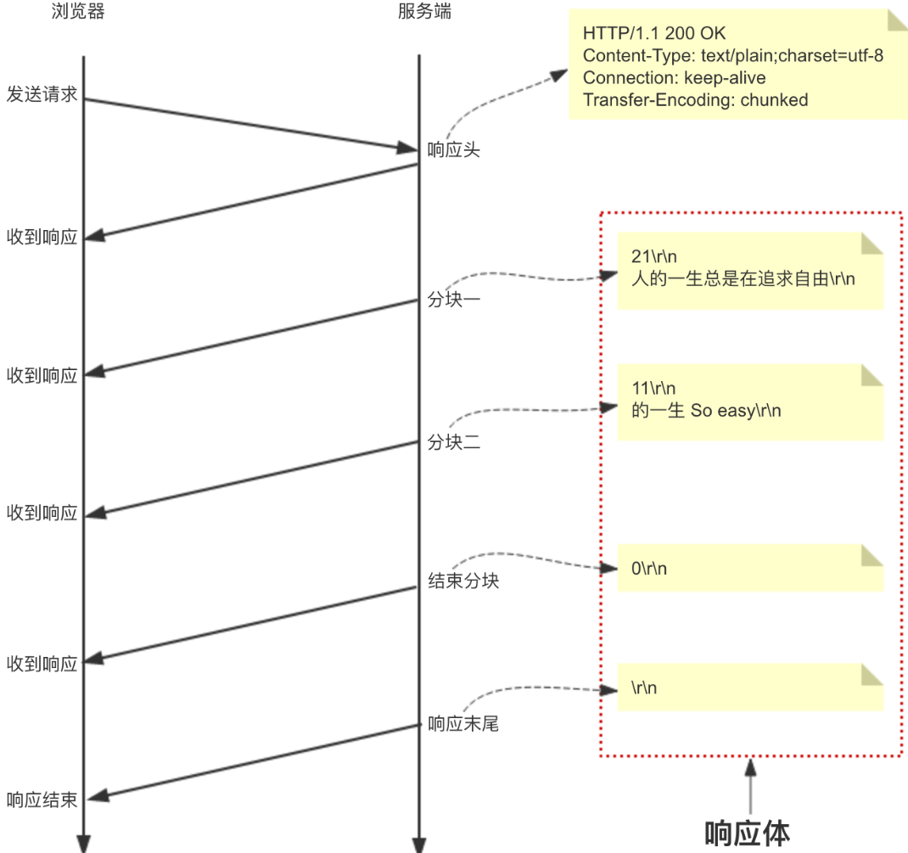


图中每个分块的第一行是分块内容的大小，十六进制表示，后面跟CRLF(\r\n)，第一行本身以及分块内容末尾的CRLF不计入大小。第二行是分块内容，后面也跟CRLF。最后一个分块虽然大小为零，但是必不可少，表示分块的结束，后面也跟CRLF，同时内容为空。最后，响应体以CRLF结束。将它们结合起来的响应内容就是：

```bash
HTTP/1.1 200 OK 
Content-Type: text/plain;charset=utf-8
Connection: keep-alive
Transfer-Encoding: chunked

21\r\n
人的一生总是在追求自由\r\n
11\r\n
的一生 So easy\r\n
0\r\n
\r\n
```


不过以上格式的响应体内容用浏览器自带的调试工具是看不出来的，浏览器自带调试工具对分块传输和非分块传输响应体的显示是一样的，要想看到区别，需要用Wireshark、Fiddler等抓包工具查看。

不过以上格式的响应体内容用浏览器自带的调试工具是看不出来的，浏览器自带调试工具对分块传输和非分块传输响应体的显示是一样的，要想看到区别，需要用Wireshark、Fiddler等抓包工具查看。

#### 2.2.4 HTTP keep-alive和TCP keepalive的区别

TCP keepalive指的是TCP保活计时器（keepalive timer）。设想有这样的情况：客户已主动与服务器建立了TCP连接。但后来客户端的主机突然出故障。显然，服务器以后就不能再收到客户发来的数据。因此，应当有措施使服务器不要再白白等待下去。这就是使用保活计时器。服务器每收到一次客户的数据，就重新设置保活计时器，时间的设置通常是两小时。若两小时没有收到客户的数据，服务器就发送一个探测报文段，以后则每隔75秒发送一次。若一连发送10个探测报文段后仍无客户的响应，服务器就认为客户端出了故障，接着就关闭这个连接。

 ——摘自谢希仁《计算机网络》

针对linux系统，TCP保活超时时间、探测报文段发送间隔、探测报文段最大发送次数都是可以设置的，如下

```bash
# cat /proc/sys/net/ipv4/tcp_keepalive_time  7200 当keepalive启用的时候，TCP发送keepalive消息的频度。缺省是2小时
# cat /proc/sys/net/ipv4/tcp_keepalive_intvl  75  当探测没有确认时，重新发送探测的频度。缺省是75秒
# cat /proc/sys/net/ipv4/tcp_keepalive_probes  9  探测尝试的次数。如果第1次探测包就收到响应了，则后8次的不再发
```


# 二、HTTPS


**前言：一般采用RSA非对称加密**

**前言：实际生产过程中，一般采用同时使用对称加密和非对称加密**

- 因为非对称加密慢啊
- 实际生产过程中，一般使用CA证书认证服务器，并带上公钥，然后客户端使用公钥加密客户端的一个对称加密密码，发送给服务端，服务端使用私钥解密得到对称加密密码，然后使用这个对称加密密码加密数据，返回给客户端，客户端使用对称加密密码解密

## 1. 请求流程

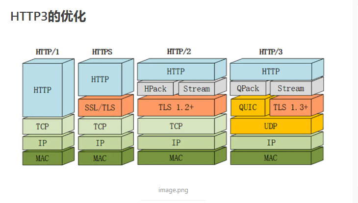

实现客户端通过SSL（安全套接字）去服务端请求公钥，服务器怎么返回公钥呢？  服务器通过返回一个CA证书、这个CA证书你是需要申请的，需要花钱的，这个CA证书里面包含了公钥，这个证书里面还有一些其他的信息。。具体看TLS和CA证书这一篇

**taobao 证书  https的通信过程**

taobao 证书内容包含 SCA(Ptaobao) 密钥加密签名过的taobao公钥 + CA证书描述+过期时间+证书其它信息 taobao网站把证书发给客户端

  客户端由于信任CA并且拿到了CA的公钥,就可以解密SCA(Ptaobao) 获得taobao的公钥 Ptaobao

  客户端(浏览器)会在本地生成一个对称密钥(key)用taobao的公钥加密发送给taobao Ptaobao(key)  sendto taobao

  taobao通过自己的私钥解密得到客户端发送过来的key  Staobao(Ptaobao(key)) = key 这样在客户端和服务端都存在相同的对称密钥key

  客户端和服务端就可以通过key(data)对大量的网页数据进行对称加密,实现通信双方的安全通信

 

> ​	SSL是Netscape开发的专门用户保护Web通讯的，目前版本为3.0。最新版本的TLS 1.0是IETF(工程任务组)制定的一种新的协议，它建立在SSL 3.0协议规范之上，是SSL 3.0的后续版本。两者差别极小，可以理解为SSL 3.1，它是写入了RFC的。SSL安全套接字和SSL证书不一样的。SSL是别人开发的协议，SSL证书是CA机构颁发的，收费的。。


```HTML
CA机构属于一个主体，比如：Gworg CA机构，然而CA机构可以颁发各种数字证书，其中包括SSL证书、邮件证书、加密证书、软件数字证书等等。

解释原因：

1. CA证书，是指CA颁发机构，颁发的数字证书。
2. CA机构主要业务是颁发数字证书。
3. SSL证书属于数字证书的一种，用于HTTPS加密协议。

解决办法：Gworg CA机构获得SSL证书
```

。

**图解**

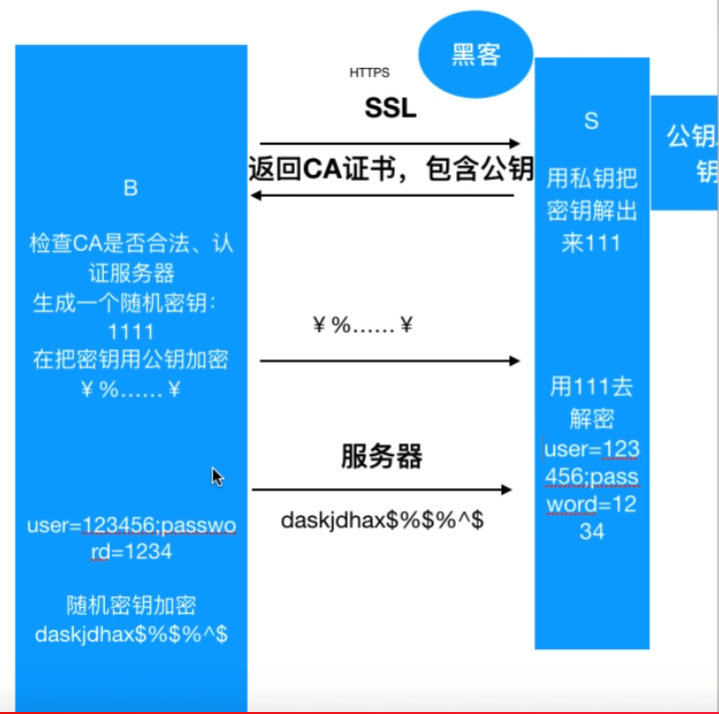


# 三、django

https://www.cnblogs.com/liwenzhou/p/8258992.html

#### 理论

https://www.cnblogs.com/liwenzhou/articles/8620663.html


**Response Headers**

```bash
HTTP/1.1 200 OK
Date: Sun, 29 Aug 2021 18:42:15 GMT
Content-Type: application/json; charset=utf-8
Content-Length: 24
Connection: keep-alive
Server: Tengine/2.3.2
Access-Control-Allow-Credentials: true
Access-Control-Allow-Headers: 
Access-Control-Allow-Methods: POST, GET, OPTIONS, DELETE, PUT,PATCH
Access-Control-Allow-Origin: http://jd.xiaoduoai.com
X-B3-Traceid: d5872cb4e90f48390000001630262536
```


**Request Header**

```bash
POST /api/admin/xdservice/edit_my HTTP/1.1
Host: jd.xiaoduoai.com
Connection: keep-alive
Content-Length: 292
Accept: application/json
X-B3-Spanid: d5872cb4e90f4839
X-B3-Traceid: d5872cb4e90f48390000001630262536
User-Agent: Mozilla/5.0 (Windows NT 10.0; Win64; x64) AppleWebKit/537.36 (KHTML, like Gecko) Chrome/92.0.4515.159 Safari/537.36
Xiaoduo-Platform: jd
Content-Type: multipart/form-data; boundary=----WebKitFormBoundaryucqwow6PweDNNJNl
Origin: http://jd.xiaoduoai.com
Referer: http://jd.xiaoduoai.com/setting/faq
Accept-Encoding: gzip, deflate
```


**备注：上面这个两个是浏览器F12里面，已经格式化处理过了。所以没有回车和换行**


|websocket请求头格式


Sec-WebSocket-Key是客户端随机生成并进行base64的字符串，它的原始内容是什么服务器不需要关心，服务器需要将这个字符串，与”258EAFA5-E914-47DA-95CA-C5AB0DC85B11″这个字符串进行拼接，然后对这个拼接好的字符串进行sha-1运算，再把sha-1散列得到的20字节进行base64编码即为响应头Sec-WebSocket-Accept的值


```
Upgrade: websocket
Connection: Upgrade
Sec-WebSocket-Key: x3JJHMbDL1EzLkh9GBhXDw==
Sec-WebSocket-Protocol: chat, superchat
Sec-WebSocket-Version: 13
```


| websocket响应格式


###### 注释：

###### 	1.HTTP响应必须要有状态行

###### 	2.浏览器请求你的服务器，首次会请求两次，第一次会去请求 favicon.ico, 第二次才是去请求你的其他东西

###### 	3.请求头的URL 就是路径,比如我浏览器上输入127.0.0.1:21567/xiaohei?a=2, 路径就是/xiaohei?a=2，他就是url

###### 	URL --- Uniform resource locator (同意资源定位器)


#### 动态网站和静态网站

1. 动态网页本质上就是字符串的替换， 字符串替换发生在什么地方： 发生在服务端替换完再返回给浏览器


#### 总结一下

1. web框架的本质：

	1. socket服务端  与 浏览器的通信

2. socket 服务端功能划分

	​    a.负责与浏览器收发消息（socket通信）   ----> 常见的第三方 wsgiref /  uWsgi/  gunicorn

	​	b.根据用户访问不同的路径执行不同 函数

	​	c. 从HTML 读取出内容，并且完成字符串替换    ----> jinja2

3. Python中 web框架的分类

	​	一、按上面第二点的3个功能划分：

	​		1. 框架自带a, b, c                                        -------->  tornadao(Tornado不光是一个web框架，还实现了WSGI容器的功能)

	​        2. 框架自带b和c，使用第三方的a             --------> Django(自带的wsgiref不行，在真实生产环境还是要借助其他的)

	​        3.框架自带b， 使用第三方的a和c            ---------> Flask

	   二、按另外一个维度来划分:

	​	

	​         1.Django       ------> 大而全（你做一个网站能用到的他都有）

	​          2.其他             ------> Flask 轻量级

	4.  第二点中 a 和 b or c需要通信，也要遵循一个协议WSGI

#### WSGI（web server gateway interface -- web服务网关接口）  去了解一下


#### 如何借助其他工具提高Django的性能

http://www.jquerycn.cn/a_39186


#### django下载（有讲究）

官网：https://www.djangoproject.com/download/


我们使用LTS版本


#### settings


```python
D://origin//学习代码//my_django_project//my_django_project//settins.py


1. BASE_DIR = os.path.dirname(os.path.dirname(os.path.abspath(__file__)))  # 这一句定位整个项目的项目跟路径，以后无论放到哪里my_django_project都是跟目录
    

    
2. TEMPLATES = [
    {
        'BACKEND': 'django.template.backends.django.DjangoTemplates',
        
        # 所以这里可以改变我们存放HTML文件的存放路径， 而且也告诉我们，我们把HTML文件放到templates里面，render会到这里面来给你读取出来，比你的f.read()高效的多
        
        'DIRS': [os.path.join(BASE_DIR, 'templates')],
        'APP_DIRS': True,
        'OPTIONS': {
            'context_processors': [
                'django.template.context_processors.debug',
                'django.template.context_processors.request',
                'django.contrib.auth.context_processors.auth',
                'django.contrib.messages.context_processors.messages',
            ],
        },
    },
]

🔺# 'DIRS': [os.path.join(BASE_DIR, 'templates')] 为什么不用 '{}\\{}'.format() 来拼接，因为每个系统的分割符号不一样，window是\\， 那么Linux上呢，代码推到linux上能跑？
```


#### django的注意点

- ```
	django服务万能启动：PYTHONENCODING=UTF-8 python manage.py runserver
	```

#### django的模块

* ```python
	from django.views.generic import View(通用类)
	```

* ```
	from django.urls import path,include
	```

* ```python
	from django.http import HttpResponse,JsonResponse
	```


#### 创建一个django对象

```python
1.	django-admin startproject + "项目名称"2.	cd /d "项目名称"3.	python manage.py startapp + "应用项目名称"
```


#### request对象的方法

* `request.GET -> 获取url上？形式的参数`

* `request.POST ->获取post提交的数据`

* `request.path ->请求的路径，比如127.0.0.1/test/1`

	`那个这个值就是test/1`

* `request.method ->请求的方法get or post`

* `request.COOKIES ->请求过来的cookies`

* `request.user -> 请求的用户对象，可以通过它判断用户是否登     录，并获取用户信息`

* `request.session -> 一个既可读又可写的类似于字典的对象，表示当前的会话`

* `request.META ->一个标准的Python 字典，包含所有的HTTP 首部。具体的头部信息取决于客户端和服务器(有很多信息)`

#### django常用的返回对象

```
* HttpResponse 可以直接返回一些字符串内容* render 将数据在模版中渲染并显示* JsonResponse 返回一个json类型 通常用于与前端进行ajax交互	from django.http import HttpResponse	from django.shortcuts import render	from django.http import JsonResponse
```


https://edu.csdn.net/course/detail/26980

# 四、django中的MTV与MVC模式详解


### 一、Django MVT模式

谈到MTV这里不得不说MVC，MVC的全拼为Model-View-Controller，有一种程序设计模式叫MVC，
核心思想：分层，解耦，分离了 数据处理 和 界面显示 的代码，使得一方代码修改了不会影响到另外一方，提高了程序的可扩展性和可维护性
MVC的思想被应用在了Ｗeb开发方面，被称为Ｗeb MVC框架。

**Web开发中的MVC**

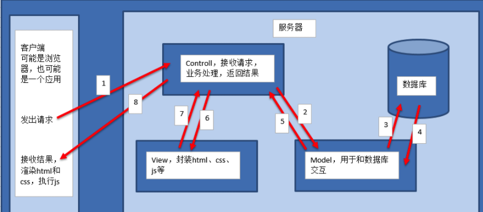


- M全拼为 Model，主要封装对数据库层的访问，对数据库中的数据进行增、删、改、查操作。

- V全拼为 View，用于封装结果，生成页面展示的html内容。

- C全拼为 Controller，用于接收请求，处理业务逻辑，与Model和View交互，返回结果。


**Django MVT模式**

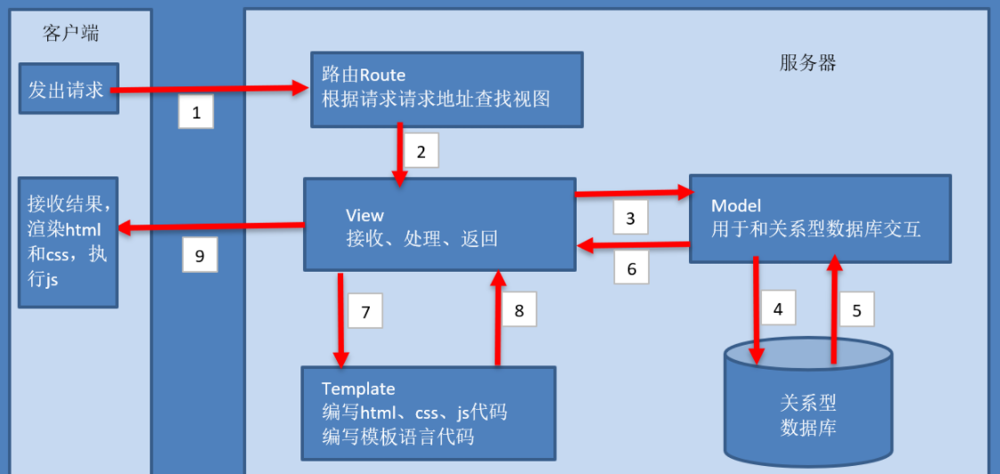

- M 代表模型（Model），即数据存取层。 该层处理与数据相关的所有事务： 如何存取、如何验证有效

- T 代表模板(Template)，即表现层。 该层处理与表现相关的决定： 如何在页面或其他类型文档中进行显示。

- V 代表视图（View），即业务逻辑层。 该层包含存取模型及调取恰当模板的相关逻辑。 你可以把它看作模型与模板之间的桥梁。


**MTV与MVC的区别：**
其实两者在本质上是没啥区别的，
Django follows the MVC pattern closely, however it does use its own logic in the implementation. Because the “C” is handled by the framework itself

让我们来看看官方是怎样说的


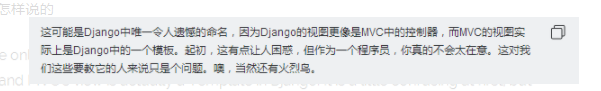


🔺🔺  写项目，我们首先写 V


# 五、Django开始

**Model（模型）：主要负责数据，跟数据库进行交互**

**Template（模板）： 主要负责模板**

**View（视图）：接收用户请求，处理业务逻辑**


**框架：提供了路由和视图**


### 5.1 基础命令

**创建一个项目**

```bash
# 进入项目文件夹xxx，然后执行如下命令（CMD下执行）
django-admin startproject wangzhe

# 上面的命令将生成一个wangzhe项目，这个项目下有一个和项目名同名的包，是django的管理包
```


**创建一个APP**

```bash
# 在manage.py的同级目录下，执行如下命令
python manage.py startapp app的名字
```


### 5.2 应用下的文件简单介绍


migrations: 迁移文件时使用

admin：应用管理后台

apps：应用里面名字

models：数据库模型

tests：测试

views：视图

问题：为什么没有urls路由文件呢？  后续解决

### **5.3 问题：如何将全部APP放到一个APPS文件里面呢？**

前言：在django中需要创建多个app，这个就需要创建一个apps文件，把所有的app放到同个文件夹，这个比较清楚，看起来也比较规范


**第一步：创建apps和app文件夹**


**第二步：将app文件夹移动到apps中**

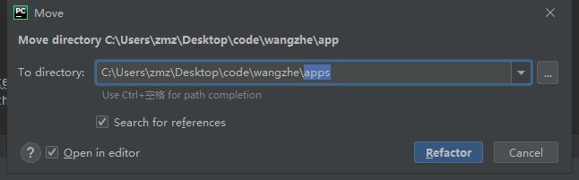

**注意：不要勾选 “Search for references”**

**提示：如果勾选了“Open in editor”，当我们移动完成以后，会在pycharm的编辑器打开全部app文件夹中的文件，如果不勾选则不打开，看自己的需求吧**


**第三步：修改配置**

上面完成以后如果我们。这个时候运行点击run，可能会出现运行错误

需要在setting.py文件中加入

```
sys.path.insert(0,os.path.join(BASE_DIR,'apps'))
```


# 六、认识文件

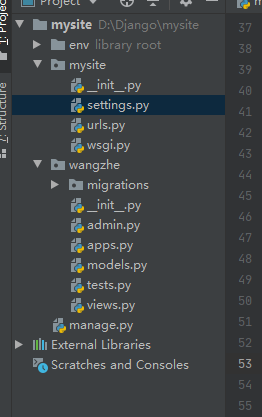

## 6.1 setting文件

```python
# app 注册配置
INSTALLED_APPS = [
    'django.contrib.admin',
    'django.contrib.auth',
    'django.contrib.contenttypes',
    'django.contrib.sessions',
    'django.contrib.messages',
    'django.contrib.staticfiles',

]


# 中间件
MIDDLEWARE = [
    'django.middleware.security.SecurityMiddleware',
    'django.contrib.sessions.middleware.SessionMiddleware',
    'django.middleware.common.CommonMiddleware',
    'django.middleware.csrf.CsrfViewMiddleware',
    'django.contrib.auth.middleware.AuthenticationMiddleware',
    'django.contrib.messages.middleware.MessageMiddleware',
    'django.middleware.clickjacking.XFrameOptionsMiddleware',
]


# 根及路由地址
ROOT_URLCONF = 'mysite.urls'
"""
我们看看，这个根及路由地址，是mysite.urls,这说明，我们的网站访问进来，首先是去mysite.urls文件中去找对于的地址，所以后面我们的路由都要在mysite.urls文件中进行注册
"""

# 模板
TEMPLATES = [
    {
        'BACKEND': 'django.template.backends.django.DjangoTemplates',
        'DIRS': [],
        'APP_DIRS': True,
        'OPTIONS': {
            'context_processors': [
                'django.template.context_processors.debug',
                'django.template.context_processors.request',
                'django.contrib.auth.context_processors.auth',
                'django.contrib.messages.context_processors.messages',
            ],
        },
    },
]

# 部署上线
WSGI_APPLICATION = 'mysite.wsgi.application'


# 配置数据库
DATABASES = {
    'default': {
        'ENGINE': 'django.db.backends.sqlite3',
        'NAME': os.path.join(BASE_DIR, 'db.sqlite3'),
    }
}


# Internationalization 国际化
# https://docs.djangoproject.com/en/2.2/topics/i18n/

LANGUAGE_CODE = 'en-us'

TIME_ZONE = 'UTC'

USE_I18N = True

USE_L10N = True

USE_TZ = True


# Static files (CSS, JavaScript, Images)
# https://docs.djangoproject.com/en/2.2/howto/static-files/

# 静态
STATIC_URL = '/static/'
```


# 七、流程


**第一步：创建项目django-admin startproject xxxx**


**第二步：创建我们的app**

```bash
python manage.py startapp app
```


**第三步：注册我们的app**

在setting中注册我们的app

```python
INSTALLED_APPS = [
    'django.contrib.admin',
    'django.contrib.auth',
    'django.contrib.contenttypes',
    'django.contrib.sessions',
    'django.contrib.messages',
    'django.contrib.staticfiles',
    'app',			# 注册我们的app, 注意了，这后面是有一个逗号的
    
]
```


**第四步：构建models**

```python
from django.db import models

# Create your models here.

# django的models新增数据库表时，如果不设置主键，会默认新增一个id为主键，如果我们想自己设置一个字段为主键，需加个参数primary_key=True
# 英雄类型表


class HeroType(models.Model):

    title = models.CharField(verbose_name='名称', max_length=5)   # verbose_name 相当于我们的comment注释


# 英雄表
class Hero(models.Model):

    name = models.CharField(verbose_name='姓名', max_length=10)
    gender = models.IntegerField(verbose_name='性别', max_length=1)
    age = models.IntegerField(verbose_name='年龄', max_length=3)
    ht = models.ForeignKey(to=HeroType, on_delete=models.CASCADE)
```


**第五步：创建模板**

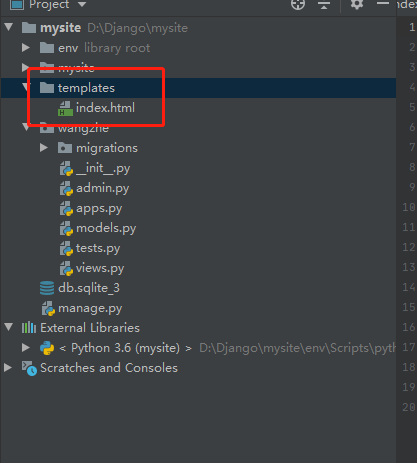


**第六步：配置模板路径**

进入setting.py文件

```python
TEMPLATES = [
    {
        'BACKEND': 'django.template.backends.django.DjangoTemplates',
        'DIRS': [os.path.join(BASE_DIR, 'templates')],	# 配置模板
        'APP_DIRS': True,
        'OPTIONS': {
            'context_processors': [
                'django.template.context_processors.debug',
                'django.template.context_processors.request',
                'django.contrib.auth.context_processors.auth',
                'django.contrib.messages.context_processors.messages',
            ],
        },
    },
]
```


**第七步：建立视图**

```python
from django.shortcuts import render

# Create your views here.

from wangzhe.models import *


def index(request):
    """
    接收用户请求，处理业务逻辑
    :param request:
    :return:
    """
    return render(request, template_name='index.html')
```


```python
def render(request, template_name, context=None, content_type=None, status=None, using=None):
    """
    Return a HttpResponse whose content is filled with the result of calling
    django.template.loader.render_to_string() with the passed arguments.
    """
    content = loader.render_to_string(template_name, context, request, using=using)
    return HttpResponse(content, content_type, status)
```


**第八步：创建路由**

```python
from django.contrib import admin
from django.urls import path
from wangzhe import views				# 导入我们的视图

urlpatterns = [
    path('admin/', admin.site.urls),
    path('index/', views.index),		# 注册路由
]

```


# 八、models --- ORM 对象关系映射


## 8.1 ORM讲解

O:	object

R:	relation

M:	map

他的作用是大大简化操作 原生SQL 去操作数据，采用对象的方式去编写SQL

比如我们创建mysql表的时候，我们需要 

```SQL
create table `testmd5` (
	`id` int(4) not null,
	`name` varchar(20) not null,
	`pwd` varchar(50) not null,
	primary key (`id`)
) engine = innodb default character set = utf8
```

我们完全可以创建一个类，这个类就叫这个表名

```python
class testmd5:
	id = int(4)
	name = xxx
	pwd = yyy
```

一个对象通过ORM 以后，变成一个原生的SQL语句， 也可以反过来


## 8.2 举例实战


#### 8.2.1 分析

已王者荣耀英雄来距离

跟进数据的三大范式，每一列数据都和主键直接相关，而不能间接相关

我们设计两张表

一个英雄类表

- 类型 -- title


英雄表

- 性别
- 姓名
- 年龄


#### 8.2.2 设计模型类


##### **第一步：在models.py 中设计模型**

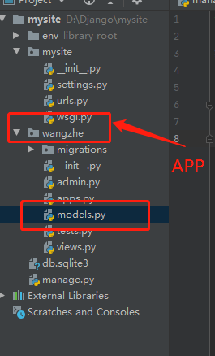


```python
from django.db import models

# Create your models here.

# django的models新增数据库表时，如果不设置主键，会默认新增一个id为主键，如果我们想自己设置一个字段为主键，需加个参数primary_key=True
# 英雄类型表


class HeroType(models.Model):

    t_id = models.IntegerField(verbose_name='英雄类型ID', primary_key=True)
    title = models.CharField(verbose_name='名称', max_length=5)   # verbose_name 相当于我们的comment注释


# 英雄表
class Hero(models.Model):

    name = models.CharField(verbose_name='姓名', max_length=10)
    gender = models.IntegerField(verbose_name='性别', max_length=1)
    age = models.IntegerField(verbose_name='年龄', max_length=3)
    t_id = models.IntegerField(verbose_name='英雄类型ID')
```


##### **第二步：迁移文件**

https://www.cnblogs.com/jiarenanhao/p/9975781.html

- django的model会自动给我们创建主键
- python manage.py makemigrations      # 迁移数据库，这个时候会在migrations目录下生成一个0001_inital.py文件


**这里有一个坑：**

那就是我执行python manage.py makemigrations 的时候提示我们No changes detected

这是为什么呢？ 这是因为我没有在setting中注册我的app。只要在setting中注册了以后就好了


**其他收集**

```python
# 暂时不知道有什么用
python manage.py makemigrations --empty wangzhe
```


**第三步：生成数据库表**

python manage.py migrate                     # 根据上一句代码生成数据表


这个时候我们的项目根目录下会生成一个db.sqlite3，小型数据库（因为我们还没有关联我们的mysql）

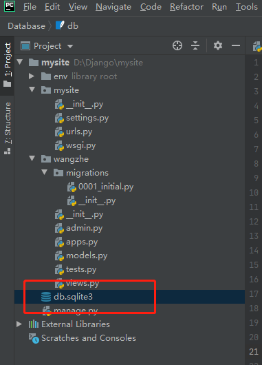


**第四步：配置sqlite3**

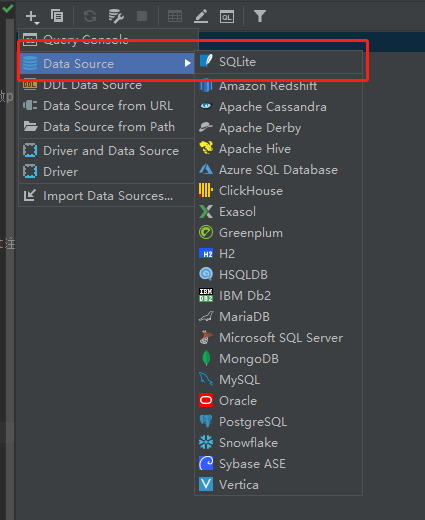

下载依赖

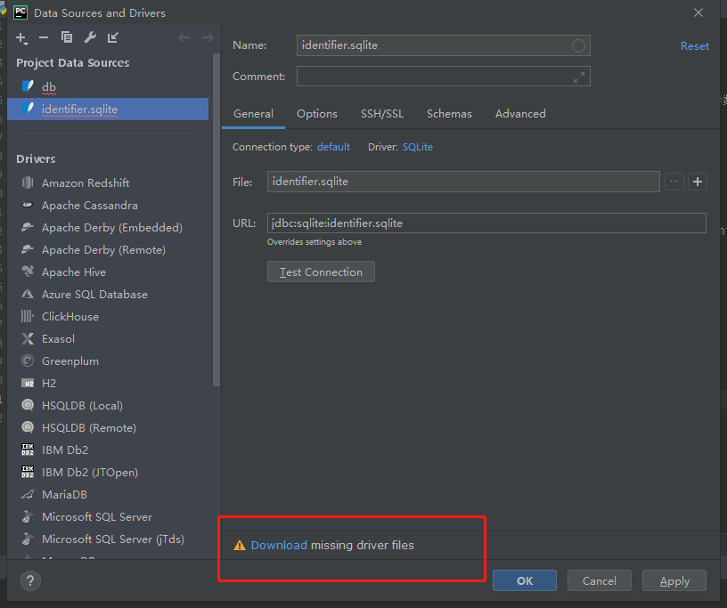

找到我们的db

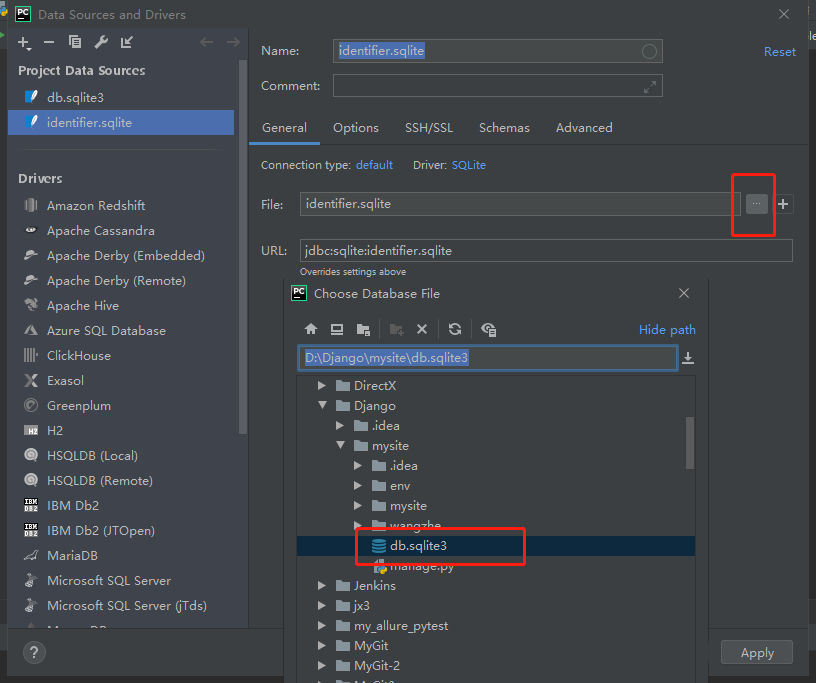


https://blog.csdn.net/qq_21182587/article/details/69573850


## 8.2.3 常用的操作手法


#### 1、时间的使用技巧

```python
gmt_create = models.DateField(verbose_name='创建时间', auto_now_add=True)
gmt_update = models.DateField(verbose_name='更新时间', auto_now=True)
```

- auto_now_add=True , 创建速度的时候自动给你添加当前的时间
- auto_now=True , 修改数据的时候，自动更新为当前时间


#### 2、选择型结构的设计

```python
class Student(models.Model):
    """
    学生表
    """

    name = models.CharField(verbose_name='姓名', max_length=5)
    age = models.IntegerField(verbose_name='年龄', max_length=3)
    # 选择型数据库结构
    gender = (
        ('0', '男'),
        ('1', '女'),
        ('2', '未知')
    )
    gender = models.CharField(verbose_name='性别', choices=gender, max_length=10)
    grade = models.ForeignKey(to=Grade, on_delete='CASCADE')
    gmt_create = models.DateTimeField(verbose_name='创建时间', auto_now_add=True)
    gmt_update = models.DateTimeField(verbose_name='更新时间', auto_now=True)

```

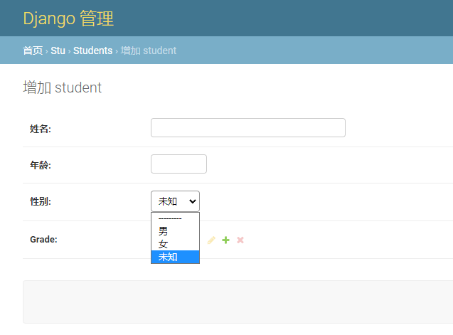


```bash
# django setting
🔺https://docs.djangoproject.com/zh-hans/2.1/topics/settings/

# 在django setting 中设置全局变量，并导入
https://www.cnblogs.com/ccorz/p/django-zhong-desetting-quan-ju-bian-liang-de-dao-r.html
https://www.cnblogs.com/apollo1616/p/10386847.html
🔺https://blog.csdn.net/weixin_40744265/article/details/84981976

# django - 其他人的笔记
https://www.cnblogs.com/yoyo008/category/1221693.html


```


# 九、模板语言的使用


#### 1、render的context参数怎么传

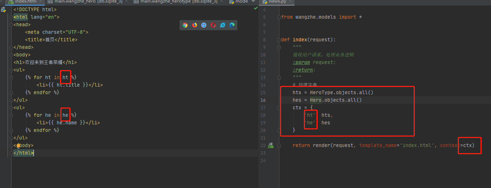

> 配合模板语言使用的时候，render的context参数必须是一个字典
>
> 模板语言是根据字段的键，找到对应的值，如ht这个键对应hts这个iterable对象。然后再遍历


#### 2、显示别名

当我们使用选择性数据类型的时候，页面中显示他的别名。

models模板如下

```python
class StudentInfo(models.Model):

    name = models.CharField(verbose_name='学生姓名', max_length=20)
    gender_choice = (
        ('0', '女'),
        ('1', '男'),
        ('2', '未知')
    )
    gender = models.CharField(verbose_name='学生姓名', choices=gender_choice, max_length=20)
    age = models.IntegerField(verbose_name='学生年龄', max_length=3, null=False)
    id_delete = models.BooleanField(verbose_name='是否伪装删除', default=False)
    create_time = models.DateTimeField(verbose_name='创建时间', auto_now_add=True)
    update_time = models.DateTimeField(verbose_name='更新时间', auto_now=True)
    grade = models.ForeignKey(verbose_name='外键连接-Grade表', to=Grade, on_delete=True)
```

其中: `gender`字段使用了`gender_choice`

```python
gender_choice = (
        ('0', '女'),
        ('1', '男'),
        ('2', '未知')
    )
```

这里有一个问题：那就是我们在模板中直接使用`{{ student.gender }}`的时候，显示的却是0、1、2这种样式，这样用户就不知道这到底是什么意思了

所以我们可以在模板在这样做

```python

            <li>{{ student.name }}</li>
            <li>{{ student.get_gender_display }}</li>		# student.get_我们的字段名_display
            <li>{{ student.age }}</li>
            <li>-----------------</li>
 
```

- 写法是固定的，前面get + 下划线 + 字段名 + 下划线 + display


# 十、路由的设置

## 10.1 正则匹配路由

- 必须导入re_path

```python
# 路由

from django.urls import path, re_path
urlpatterns = [
    path('admin/', admin.site.urls),
    path('index/', views.index),
    re_path(r'^type/\d', views.show_hero)
]

# 视图
def show_hero(request):
    """
    英雄的视图
    :return:
    """
    all_hero = HeroType.objects.all()
    hero_context = {
        'he': all_hero
    }
    return HttpResponse(content=b'ok')
```


## 10.2 关键字

- 采用`<int:id>`这关键字的时候，我们要注意，这个id是会传到视图里面去的，所以我们在视图那边必须接收这个参数，不然报错
- 如果路由里面是传入的id， 那边视图里面也必须是id，他们的名字必须一样，不然报错。也就是说当我们路由里面是`<int:id>`, 那么我们视图里面的形参也必须叫id，不能是`show_hero(request, id1)`

```python
# 路由
from django.contrib import admin
from django.urls import path
from wangzhe import views

urlpatterns = [
    path('admin/', admin.site.urls),
    path('index/', views.index),
    path('show_hero/<int:id>', views.show_hero)
]

# 视图
def show_hero(request, id):
    """
    英雄的视图
    :return:
    """
    all_hero = HeroType.objects.all()
    hero_context = {
        'he': all_hero
    }
    return HttpResponse(content=str(id).encode())
```


```
from django.shortcuts import HttpResponse
from django.http import HttpResponse

from django.db import models
from django.urls import path, re_path
```


# 十一、管理后台的使用


### 注册管理后天账号

```python
python manage.py createsuperuser
```

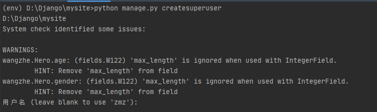

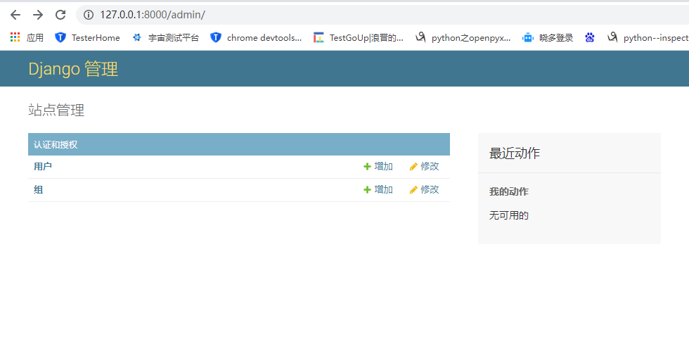


#### 注册我们的数据库到我们的管理后台

也可以不用把我们的数据库注册到我们的管理后台，因为我是为了学习嘛。学学也无妨

**wangzhe > admin.py**

```python
# admin.py
from django.contrib import admin
from wangzhe.models import HeroType, Hero

# Register your models here.


admin.site.register(Hero)
admin.site.register(HeroType)
```

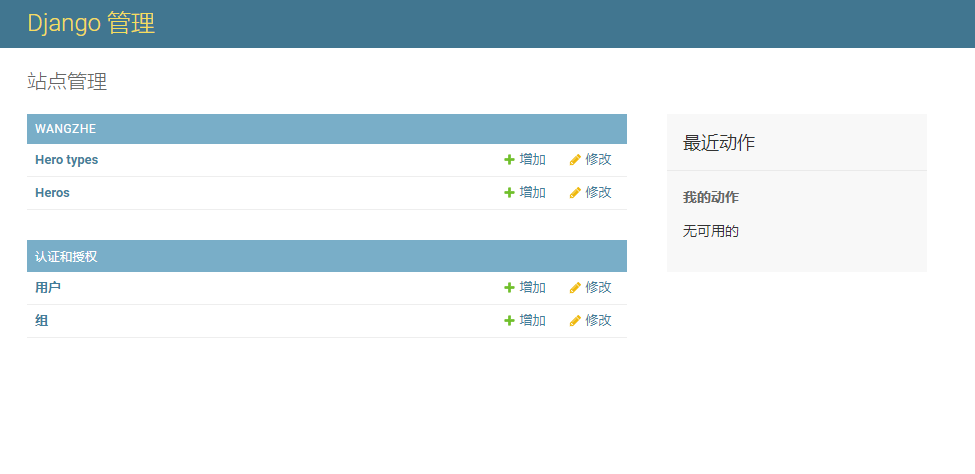

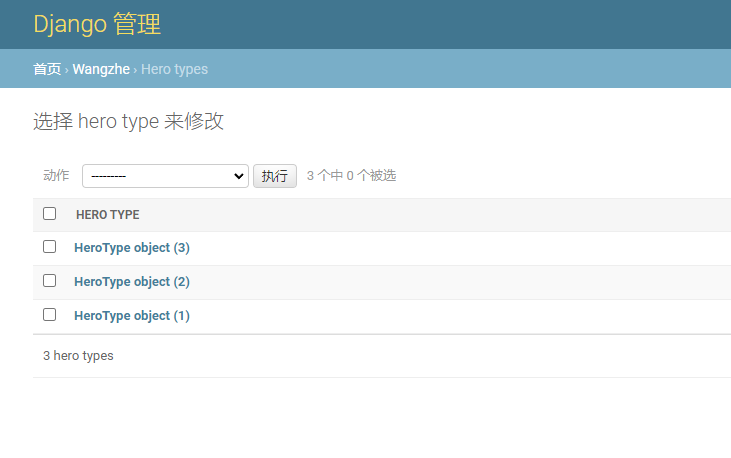

#### 美化的后台显示

```python
class HeroType(models.Model):

    title = models.CharField(verbose_name='名称', max_length=5)  # verbose_name 相当于我们的comment注释

    def __str__(self):
        return self.title


# 英雄表
class Hero(models.Model):

    name = models.CharField(verbose_name='姓名', max_length=10)
    gender = models.IntegerField(verbose_name='性别', max_length=1)
    age = models.IntegerField(verbose_name='年龄', max_length=3)
    ht = models.ForeignKey(to=HeroType, on_delete=models.CASCADE)

    def __str__(self):
        return self.name
```

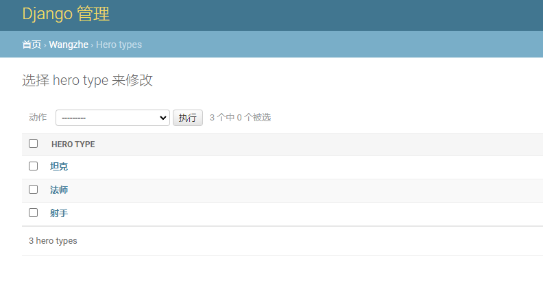


# 十二、其他设置


## 1、时区设置

文件setting.py

```python
LANGUAGE_CODE = 'en-us'

TIME_ZONE = 'Asia/Shanghai'

USE_I18N = True

USE_L10N = True

USE_TZ = False

```

- 修改`TIME_ZONE = 'Asia/Shanghai'`
- 修改`USE_TZ = False`

源码为证

路径`env\Lib\site-packages\django\utils\timezone.py`(224-232)

```python
def now():
    """
    Return an aware or naive datetime.datetime, depending on settings.USE_TZ.
    """
    if settings.USE_TZ:
        # timeit shows that datetime.now(tz=utc) is 24% slower
        return datetime.utcnow().replace(tzinfo=utc)
    else:
        return datetime.now()
```


## 2、注册APP（注册应用）

注册应用有两种方式

```
'front_page.apps.FrontPageConfig',
```

**第一种：直接在我们的setting.py的installed_apps中填写我们的应用名字**

```python
INSTALLED_APPS = [
    'django.contrib.admin',
    'django.contrib.auth',
    'django.contrib.contenttypes',
    'django.contrib.sessions',
    'django.contrib.messages',
    'django.contrib.staticfiles',
    'front_page',
]
```


**第二种：以类的方式进行添加，模仿django**

```python
INSTALLED_APPS = [
    'django.contrib.admin',
    'django.contrib.auth',
    'django.contrib.contenttypes',
    'django.contrib.sessions',
    'django.contrib.messages',
    'django.contrib.staticfiles',
    'front_page.apps.FrontPageConfig',
]
```

这个`front_page.apps.FrontPageConfig`就是 apps.py中的类

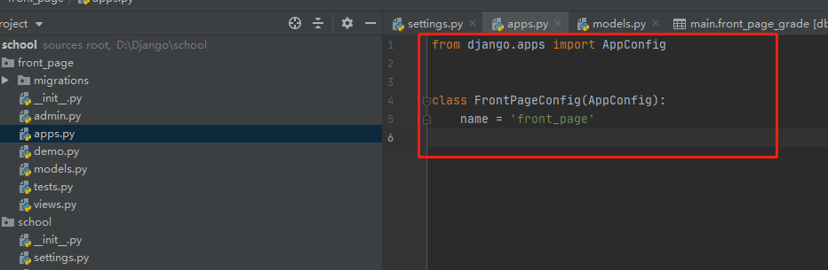

