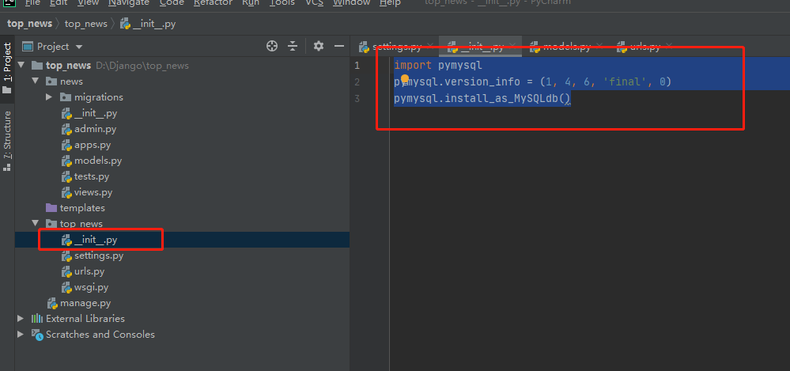

# 一、设置mysql数据库


#### 第一步： 创建数据

- 通过mysql命令
- 通过navicate


#### 第二步：修改Django配置

进入到django的setting.py中,找到DATABASES参数(是个字段)，他的默认配置如下

```python
DATABASES = {
    'default': {
        'ENGINE': 'django.db.backends.sqlite3',
        'NAME': os.path.join(BASE_DIR, 'db.sqlite3'),
    }
}
```

修改成如下：

```python
DATABASES = {
    'default': {
        'ENGINE': 'django.db.backends.mysql',
        'NAME': 'db_1907',      # 数据库名字
        'USER': 'zmz',          # 操作用户
        'PASSWORD': '123456',   # 登录密码
        'HOST': '139.9.154.77', # 数据库远程地址
        'PORT': '3306'          # 端口
    }
}
```

- 字段中的键名，不能自定义，比如PASSWORD 你使用passwd,这是不行的


#### 第三步：安装pymyql驱动

首先`pip install pymysql`

MySQLdb要快点，原因是这个是C写的，速度快

**MySQLdb**只支持Python2.x，还不支持3.x
可以用PyMySQL代替。安装方法：pip install PyMySQL
然后在需要的项目中，把 __**init**__.py中添加两行：

import pymysql
pymysql.install_as_MySQLdb()

说白了就是，Django底层使用的是MySQLdb，但是python3不支持，所以我们要执行一个替换命令。这样，我们就可以使用pymysql了，为什么可以替换了，因为install_as_MySQLdb()命令别人已经做好了命令迁移替换了。


所以我们要在我们的Django项目的`__init__.py`中写入这样下面的代码



```python
import pymysql
pymysql.version_info = (1, 4, 6, 'final', 0)
pymysql.install_as_MySQLdb()
```

- `pymysql.version_info = (1, 4, 6, 'final', 0)`的目的是，手动改版本，不然可能要报错。

其实把，我试了试，在news目录下的`__init__.py`中添加也有效果


# 二、响应码

- 404 :   not found
- 405：
- 403：
- 500：  服务器错误
- 301：  永久重定向
- 302：   临时重定向
- 200


# 三、XHR

案例： 有道在线翻译


# 四、登录状态的判断方式

#### 1、第一种-通过cookie判断

网站有很多权限控制，登录用户和未登录用户显示的内容有差别。
前后端分离后，前端怎样判断用户是否已登录？有哪些方式？
我目前了解的有：
1.登录成功后，后端返回一个cookie，根据这个cookie的有无来判断；退出登录时，后端会删除这个cookie；
2.登录成功后，前端设置cookie，比如'`isLogin = true`'，根据isLogin的值去判断；退出登录时删除cookie`isLogin` 或设置'`isLogin = false`'。


#### 2、第二种 - token

1. 前台发送登录请求
2. 后台返回token，前台得到后台返回的token，将其写入到localStorage中，后续请求中都携带token
3. 后台判断token是否过期，如果过期就对前台的请求响应过期标识或者状态码
4. 前台得到过期标识后，清除localStorage中的token，然后重定向到login路由
