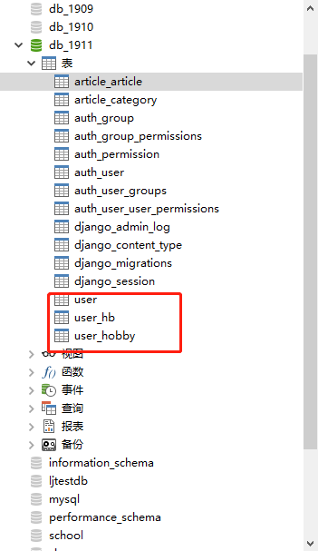

# 一、ORM

## ORM概念
对象关系映射（Object Relational Mapping，简称ORM）模式是一种为了解决面向对象与关系数据库存在的互不匹配的现象的技术。

简单的说，ORM是通过使用描述对象和数据库之间映射的元数据，将程序中的对象自动持久化到关系数据库中。

ORM在业务逻辑层和数据库层之间充当了桥梁的作用。

## ORM由来
让我们从O/R开始。字母O起源于"对象"(Object),而R则来自于"关系"(Relational)。

几乎所有的软件开发过程中都会涉及到对象和关系数据库。在用户层面和业务逻辑层面，我们是面向对象的。当对象的信息发生变化的时候，我们就需要把对象的信息保存在关系数据库中。

按照之前的方式来进行开发就会出现程序员会在自己的业务逻辑代码中夹杂很多SQL语句用来增加、读取、修改、删除相关数据，而这些代码通常都是重复的。

## ORM的优势
ORM解决的主要问题是对象和关系的映射。它通常把一个类和一个表一一对应，类的每个实例对应表中的一条记录，类的每个属性对应表中的每个字段。

ORM提供了对数据库的映射，不用直接编写SQL代码，只需像操作对象一样从数据库操作数据。

让软件开发人员专注于业务逻辑的处理，提高了开发效率。

## ORM的劣势
ORM的缺点是会在一定程度上牺牲程序的执行效率。

ORM用多了SQL语句就不会写了，关系数据库相关技能退化...

## ORM总结
ORM只是一种工具，工具确实能解决一些重复，简单的劳动。这是不可否认的。

但我们不能指望某个工具能一劳永逸地解决所有问题，一些特殊问题还是需要特殊处理的。

但是在整个软件开发过程中需要特殊处理的情况应该都是很少的，否则所谓的工具也就失去了它存在的意义。

## Django框架中ORM示意图


## 1. 创建项目test2

今天演示使用MySQL数据库，这是Web项目首选的数据库。并且今天我们用Pycharm开发软件来创建项目


修改为使用MySQL数据库，代码如下:

> 将引擎改为mysql，提供连接的主机HOST、端口PORT、数据库名NAME、用户名USER、密码PASSWORD。
```python
DATABASES = {
    'default': {
      'ENGINE': 'django.db.backends.mysql',
        'NAME': 'db_1907',  # 数据库名字，
        'USER': 'root',  # 数据库登录用户名
        'PASSWORD': '123456',  # 数据库登录密码
        'HOST': 'localhost',  # 数据库所在主机
        'PORT': '3306',  # 数据库端口
    }
}
```

> 注意：数据库xxx Django框架不会自动生成，需要我们自己进入mysql数据库去创建。

下面是手动创建数据库，打开新终端，在命令行登录mysql，创建数据库test2。

> 注意：设置字符集为utf8
```python
create database db_1907 charset=utf8;
```


> 注意：使用mysql 需要安装pymysql
>
> 并在toutiao/\__init__文件中加如下代码：

```
import pymysql

pymysql.install_as_MySQLdb()

```


```

python manage.py makemigrations

python manage.py migrate

python manage.py createsuperuser
```


### models 和 真实数据库中的联系




