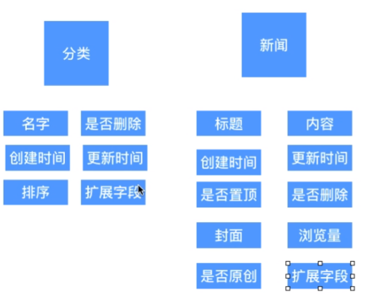
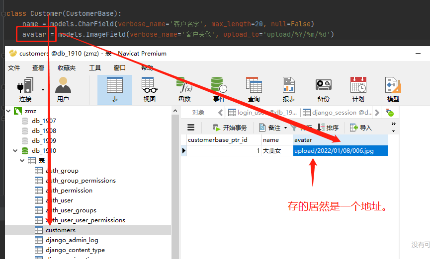
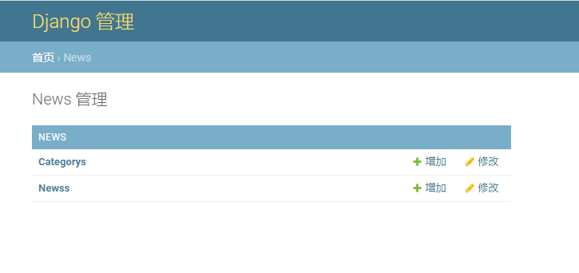
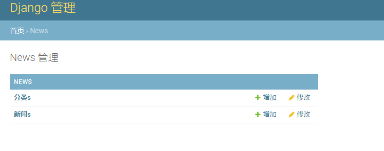
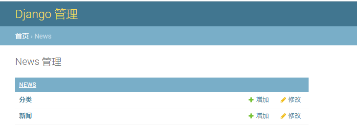
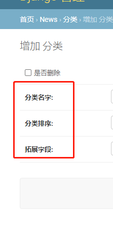

数据库建模工具 padman

# 一、模型设计要领

首先画数据库结构图

必要字段设计

```html
id			主键
version		用于乐观锁
is_delete	伪删除字段，什么意思呢？ 比如我们后面是不是要到数据库中去查数据，但是我们不希望这个数据真正的被删掉，我们用一个标记来判断，假如被删除的判断标记为1，当我们查询数据的时候发现这个字段为1，我们就认为他被删掉了。但是这条数据在数据库中还存在，这样管理员可以查看被删除的东西，用于数据的健壮性和安全性
gmt_create	创建时间
gmt_update	x
扩展字段	  这玩意太重要了，玩意哪天突然要加字段，你死的心都有了，一定要预留字段，用于拓展，我们一般添加几个varchar类型的字段。
```

为什么要预留呢？

因为当你的数据量大到一定程度以后，你添加一个字段，可能需要很长的时间，几个小时都有可能。这是线上啊，大哥，你业务中断几个小时，我的妈哟， 你想想，那是什么损失，那是致命的。所以啊 我们一定要有预留字段的习惯





# 二十、字段说明


```python
class Category(models.Model):

    name = models.CharField(verbose_name='分类名字', max_length=5)
    create_time = models.DateTimeField(verbose_name='创建时间', auto_now_add=True)
    update_time = models.DateTimeField(verbose_name='更新时间', auto_now=True)
    is_deleted = models.BooleanField(verbose_name='是否删除', default=False)
```


## 字段类型


- BooleanField:  布尔字段

- CharField(max_length=字符长度)：  字符串
	- 参数max_length表示最大字符个数。
	- 必须指定max_length

- TextField：大文本字段，一般超过4000个字符时使用。

	- 注意：TextField不能设置成unique，不然迁移报错，这是因为mysql的原因，mysql中TextField不能设置成unique

- IntegerField：整数。

- DecimalField(max_digits=None, decimal_places=None)：十进制浮点数。

  - 参数max_digits表示总位数。
  - 参数decimal_places表示小数点保留多少位数。

- FloatField：浮点数。

	- 数据要求精准的话，使用DecimalField

- DateField[auto_now=False, auto_now_add=False])：日期。

  - 参数auto_now表示每次保存对象时，自动设置该字段为当前时间，用于"最后一次修改"的时间戳，它总是使用当前日期，默认为false。
  - 参数auto_now_add表示当对象第一次被创建时自动设置当前时间，用于创建的时间戳，它总是使用当前日期，默认为false。
  - 参数auto_now_add和auto_now是相互排斥的，组合将会发生错误。
  - 格式为2021-10-22 ，只有日期没有时间

- TimeField：时间，参数同DateField。

	- 只有时间，没有日期， 17：42：12

- DateTimeField：日期时间（最详细），参数同DateField。

- FileField：上传文件字段。

  - >
  	> | 参数           |                         说明                          |
  	> | :------------- | :---------------------------------------------------: |
  	> | upload_to = "" | 上传文件的保存路径如：upload_to = "uploads/%Y/%m/%d/“ |
  	

- ImageField：继承于FileField，对上传的内容进行校验，确保是有效的图片。

  -         > | 参数              |                           说明                            |
    > | :---------------- | :-------------------------------------------------------: |
    > | upload_to = ""    |                    上传文件的保存路径                     |
    > | storage = None    | 存储组件，默认django.core.files.storage.FileSystemStorage |
    > | width_field=None  |        上传图片的高度保存的数据库字段名（字符串）         |
    > | height_field=None |        上传图片的宽度保存的数据库字段名（字符串）         |

  

- URLField: 真实的地址


**关于图片，或者资源存放我们首先要了解**

- 我们使用图片的时候，有两种形式
	- `src/11111.jpg`	本地存储，放到服务器上了，是相对路径
		- 
	- `http://www.baidu.com/src/1.jpg`  网络形式
		- 使用URLField


## Meta

- db_table:  指定表名， 因为django生成表名，是默认 应用名 + 模型类，我们可以通过这个玩意指定迁移到数据库中时候创建的表名

```python
class Category(models.Model):

    name = models.CharField(verbose_name='分类名字', max_length=5, null=False, unique=True)
    is_deleted = models.BooleanField(verbose_name='是否删除', default=False)
    position = models.IntegerField(verbose_name='分类排序', null=False)
    category_extend = models.CharField(verbose_name='拓展字段', default='', max_length=255)
    create_time = models.DateTimeField(verbose_name='创建时间', auto_now_add=True)
    update_time = models.DateTimeField(verbose_name='更新时间', auto_now=True)

    def __str__(self):
        return self.name
    
    class Meta:
        db_table = 'category'
```


- abstract:  指定是否是抽象类,这个很有用，就是用于继承的
	- 因为我们在创建表的时候，一些关键性字段，如果is_deleted、create_time、delete_time这些字段，我们每一张表都要去写，太麻烦了。我们使用的是python，根据python的开发原则，使用多态继承，但是我们在迁移表的时候，又不想把这种表生成为真实的表，所以加上这个字段，这时候，他就不会在我们迁移的时候生成真实的数据表了
- ordering: 排序
- verbose_name:  让字段可读
- verbose_name_plural: 让复数字段可读


#### 1、ordering的使用


#### 2、谈谈Meta中的verbose_name和 verbose_name_plural

当我们不指定他的时候，我们在管理后台看到的是这个样子的

```python
模型名字如下：
class Category(BaseModel):
	pass
	
class News(BaseModel):
	pass
```



当我们加上`verbose_name`以后

```python
class Category(BaseModel):
	class Meta:
		verbose_name = '分类'
	
class News(BaseModel):
	class Meta:
		verbose_name = '新闻'
```



很难看，后面还是有一个复数S

但我们再加上`verbose_name_plural`

```python
class Category(BaseModel):
	class Meta:
		verbose_name = '分类'
        verbose_name_plural = verbose_name
	
class News(BaseModel):
	class Meta:
		verbose_name = '新闻'
        verbose_name_plural = verbose_name
```




## 普通参数选项

- verbose_name :  用于在管理后台中显示字段的别名



当我们不指定字段的verbose_name的时候，他显示出来的，将会是我们的models中写的英文字段名


## 约束参数选项

通过选项实现对字段的约束，选项如下：

- null：如果为True，表示允许为空，默认值是False，不允许为空。
- blank：如果为True，则该字段允许为空白，默认值是False，不允许为空。
- **对比：null是数据库范畴的概念（什么意思呢？如果我们使用mysql，使用了null，那么真实的数据库中这个字段是否为空受模板中这个参数控制），blank是表单验证范畴的(在amin后台中，创建数据的时候如果blank=False，这个字段必须填，不然不让提交)。我们在设计表的时候，一般都是使null和blank保持一致，这样真实数据库和admin这边才能一致。如果你有特殊需要也可以不这样做**
- 如果blank=True ，null=False， 那么数据库中该字段没 not null = True，我们在admin后台中这个字段为空的时候，数据空中用''空字符
- 再次说一点：blank是admin后台的表单提交的限制，如果设置了blank=False，那么我们在admin后台必须填写值，不然在admin后台不让我们提交。但是如果我们**使用代码进行新增数据的时候**，这时候让不让我们提交是看数据中这个字段是不是null=True了，如果null=True，我们可以不填，如果null=False，那么我们在代码提交的时候一定要输入值。
- db_column：字段的名称，如果未指定，则使用属性的名称。
	- 就是说如果没有指定，那么我们数据库中的名字和模型中的这个属性名字，相同，如果指定了的话，数据库中显示db_column=xxx,设置的名字，但是我们通过django操作数据库的时候，使用模型中属性的名字。这个没啥屌用
- db_index：若值为True, 则在表中会为此字段创建索引，默认值是False。
- default：默认值。
- primary_key：若为True，则该字段会成为模型的主键字段，默认值是False，一般作为AutoField的选项使用。
- unique：如果为True, 这个字段在表中必须有唯一值，默认值是False。


所谓的NULL就是什么都没有，连\0都没有，\0在字符串中是结束符，但是在物理内存是占空间的，等于一个字节，而NULL就是连这一个字节都没有。在数据库里是严格区分的，任何数跟NULL进行运算都是NULL, 判断值是否等于NULL，不能简单用=，而要用IS关键字， Mysql3.23.0或以后支持用<=>用来比较两个NULL值是否相等, 即 select * from table where id <=> NULL.  当字段为not null = True的时候，当我们填入 vlaues（null）会报错，填入''空字符串则不会

当我们在models中定义了blank=True允许表单为空，null=False，数据库不能为null，那么当我们在表当blank字段为空的时候，django会给数据库中的字段一个''空字符。。 一定要知道null和''空字符不一样的，null是真的内存空间中都没有数据，''空字符是占用内存空间的


## 关联数据 on_delete

-  CASCADE:这就是默认的选项，级联删除。
-  PROTECT: 保护模式，如果采用该选项，删除的时候，会抛出`ProtectedError`错误。
-  SET_NUL`: 置空模式，删除的时候，外键字段被设置为空，前提就是`blank=True, null=True`,定义该字段的时候，允许为空。
-  SET_DEFAULT: 置默认值，删除的时候，外键字段设置为默认值，所以定义外键的时候注意加上一个默认值。
-  SET(): 自定义一个值，该值当然只能是对应的实体了

```python
# 官方案例
def get_sentinel_user():
    return get_user_model().objects.get_or_create(username='deleted')[0]

class MyModel(models.Model):
    user = models.ForeignKey(
        settings.AUTH_USER_MODEL,
        on_delete=models.SET(get_sentinel_user),
    )
```


## 大牛的总结

https://www.cnblogs.com/yoyoketang/p/10331049.html

```
字段类型
django的models里面字段类型除了上面的常用的 models.CharField和models.IntegerField，还有更多的类型

1、models.AutoField　　自增列= int(11)
　　如果没有的话，默认会生成一个名称为 id 的列，如果要显示的自定义一个自增列，必须将给列设置为主键 primary_key=True。
2、models.CharField　　字符串字段
　　必须 max_length 参数
3、models.BooleanField　　布尔类型=tinyint(1)
　　不能为空，Blank=True
4、models.ComaSeparatedIntegerField　　用逗号分割的数字=varchar
　　继承CharField，所以必须 max_lenght 参数
5、models.DateField　　日期类型 date
　　对于参数，auto_now =True则每次更新都会更新这个时间；auto_now_add 则只是第一次创建添加，之后的更新不再改变。
6、models.DateTimeField　　日期类型 datetime
　　同DateField的参数
7、models.Decimal　　十进制小数类型= decimal
　　必须指定整数位max_digits和小数位decimal_places
8、models.EmailField　　字符串类型（正则表达式邮箱）=varchar
　　对字符串进行正则表达式
9、models.FloatField　　浮点类型= double
10、models.IntegerField　　整形
11、models.BigIntegerField　　长整形
　　integer_field_ranges ={
　　　　'SmallIntegerField'😦-32768,32767),
　　　　'IntegerField'😦-2147483648,2147483647),
　　　　'BigIntegerField'😦-9223372036854775808,9223372036854775807),
　　　　'PositiveSmallIntegerField':(0,32767),
　　　　'PositiveIntegerField':(0,2147483647),
　　}
12、models.IPAddressField　　字符串类型（ip4正则表达式）
13、models.GenericIPAddressField　　字符串类型（ip4和ip6是可选的）
　　参数protocol可以是：both、ipv4、ipv6
　　验证时，会根据设置报错
14、models.NullBooleanField　　允许为空的布尔类型
15、models.PositiveIntegerFiel　　正Integer
16、models.PositiveSmallIntegerField　　正smallInteger
17、models.SlugField　　减号、下划线、字母、数字
18、models.SmallIntegerField　　数字
　　数据库中的字段有：tinyint、smallint、int、bigint
19、models.TextField　　字符串=longtext
20、models.TimeField　　时间 HH:MM[:ss[.uuuuuu]]
21、models.URLField　　字符串，地址正则表达式
22、models.BinaryField　　二进制
23、models.ImageField图片
24、models.FilePathField文件

字段参数
对应的字段参数如下：

1、null=True
　　数据库中字段是否可以为空
2、blank=True
　　django的 Admin 中添加数据时是否可允许空值
3、primary_key = False
　　主键，对AutoField设置主键后，就会代替原来的自增 id 列
4、auto_now 和 auto_now_add
　　auto_now 自动创建---无论添加或修改，都是当前操作的时间（创建和修改的时候，会自动创建或者x时间）
　　auto_now_add 自动创建---永远是创建时的时间
5、choices
GENDER_CHOICE = (
(u'M', u'Male'),
(u'F', u'Female'),
)
gender = models.CharField(max_length=2,choices = GENDER_CHOICE)
6、max_length
7、default　　默认值
8、verbose_name　　Admin中字段的显示名称
9、name|db_column　　数据库中的字段名称
10、unique=True　　不允许重复
11、db_index = True　　数据库索引
12、editable=True　　在Admin里是否可编辑
13、error_messages=None　　错误提示
14、auto_created=False　　自动创建
15、help_text　　在Admin中提示帮助信息
16、validators=[]
17、upload-to
```

模型转字典、转json、转list

https://www.cnblogs.com/yoyoketang/p/10339055.html


