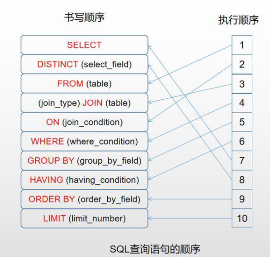
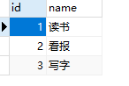
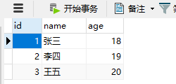
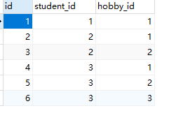
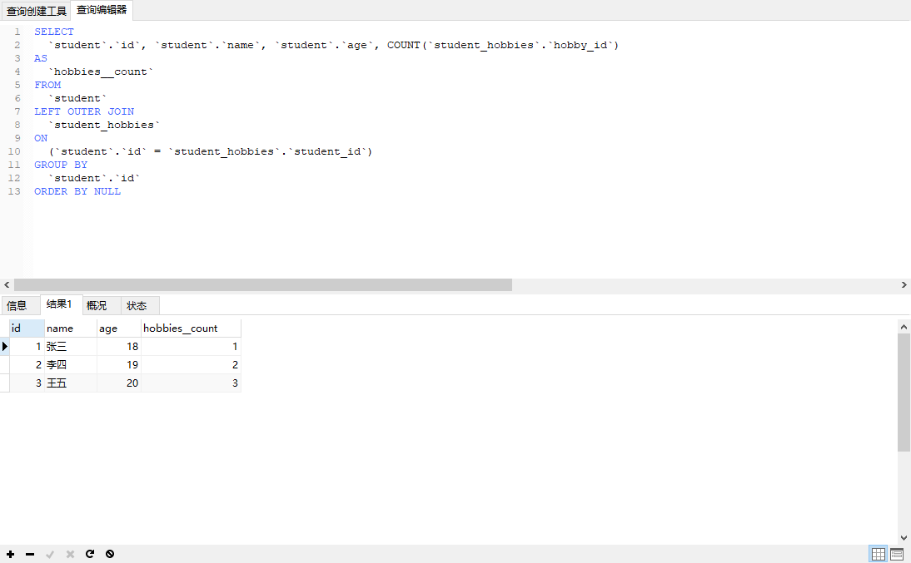

联表查询：https://blog.csdn.net/weixin_44256972/article/details/119348987


## 前言

在介绍查询之前，我们要先明白一个概念，那就是django在数据库迁移时候的一些规则

- 如果不在Meta中指定db_table时，数据库的命名是以 app名字 + 下划线 + 模型类名的小写的格式在数据库生产表名的
- ORM查询对应表中数据时候，最后解析出来的原始SQL，也是通过app名字 + 下划线 + 模型类的小写的方式去数据库中查表的，所以当我们的app名字发生改变的时候，数据库中名字我们也需要去改一下（这是我目前想到的方法哈），注意几个地方 setting中注册的app， view中导入数据库时候的路径、admin中注册数据库导入的路径、migrations文件中的名字
- 第一db_table我感觉还是挺重要的，这样我们只关注代码层面的导入就行了。不用去改数据库中的东西
- 在Django代码层面，我们使用的数据库表名是以model中模型类名的小写的形式。


## 一、字段查询



###  查询等

exact：表示判等。

```python
list=Article.objects.filter(id__exact=1)
可简写为：
list=Article.objects.filter(id=1, coten)
```


### 查询单一对象

```
Article.objects.get(pk=1)
```

> **注意**：使用get()方法和使用filter()方法然后通过[0]的方式分片，有着不同的地方。看似两者都是获取单一对象。但是，**如果在查询时没有匹配到对象，那么get()方法将抛出DoesNotExist异常**。这个异常是模型类的一个属性，在上面的例子中，如果不存在主键为1的Entry对象，那么Django将抛出`Entry.DoesNotExist`异常。
>
> 类似地，**在使用get()方法查询时，如果结果超过1个，则会抛出MultipleObjectsReturned异常**，这个异常也是模型类的一个属性。


###  模糊查询

contains：是否包含。

```python
list = Article.objects.filter(btitle__contains='新')
```
**startswith、endswith：以指定值开头或结尾。**

```python
list = Article.objects.filter(btitle__endswith='哈哈')
```
> 以上运算符都区分大小写，在这些运算符前加上i表示不区分大小写，如iexact、icontains、istartswith、iendswith.


### 空查询

**isnull：是否为null。**

```python
list = Article.objects.filter(title__isnull=False)
```

### 范围查询

**in：是否包含在范围内。**

```python
list = Article.objects.filter(id__in=[1, 3, 5])
```

**range：指定范围,相当于mysql的between and**

```python
num = Article.objects.filter(cnum__range=['0', '10000'])
```


###  比较查询

**gt、gte、lt、lte：大于、大于等于、小于、小于等于。**

- 这几个玩意使用的时候注意了，他妈的都是双下划线

```python
list = Article.objects.filter(id__gt=3)
```
**不等于**

**不等于的运算符，使用exclude()过滤器。**

```python
list = Article.objects.exclude(id=3)
```

### 日期查询

**year、month、day、week_day、hour、minute、second：对日期时间类型的属性进行运算。**

```python
list = Article.objects.filter(create_time__year=2019)
```
查询2019年1月1日后发表的文章。
```python
# 字段中使用的时间DateFiled
from datetime import date
list = Article.objects.filter(create_time__gt=date(2019, 1, 1))
```

如果我们的字段时间使用的时候DateTimeFiled,我们查询的时候可以这样

```python
# 模型字段使用DateTimeFiled
from datetime import datetime, date
list = Article.objects.filter(create_time__gt=date(2019, 1, 1, 1, 1, 1))
datetime(2019, 1, 1, 1, 1, 1)
datetime.datetime(2019, 1, 1, 1, 1, 1)

# 也可以这样
list = Article.objects.filter(create_time__gt='2019-01-01 1:1:4.000000')

# 或者这样
list = Article.objects.filter(create_time__gt=date(2021,1,1))
```


## 二、F对象**

**两个属性做比较的时候使用**

例：查询阅读量大于等于评论量的文章。
```python
# models.py中定义了如下
vnum = models.IntegerField(verbose_name='浏览量')
cnum = models.IntegerField(verbose_name='评论量')


from django.db.models import F

list = Article.objects.filter(vnum__gte=F('cnum'))	# 取评论量大于浏览量的数据
```
可以在F对象上使用算数运算。

例：查询阅读量大于2倍评论量的文章。
```python
list = Article.objects.filter(bread__gt=F('bcomment') * 2) # 还可以使用表达式
```

- 注意了这玩意不能跨表。只能一张表中的属性进行比较


### 为什么引入F呢？

我们好好看看前面的表达式，我们都是表中属性值跟我们传入的值进行筛选比较。但是这样完全不满足我们在实际工作中的要求啊，有时候我们需要用两个字段间的关系，进行赛选，所以这个时候我们引入了F


## 三、Q对象

并且关系(主要是用来做 or 操作的)

例：查询阅读量大于20，并且编号小于3的文章。
```python
list=Article.objects.filter(vnum__gt=20,id__lt=3)
或
list=Article.objects.filter(vnum__gt=20).filter(id__lt=3)
```
例：查询阅读量大于20的文章，改写为Q对象如下。
```python
from django.db.models import Q
...
list = Article.objects.filter(Q(vnum__gt=20))
```
例：查询阅读量大于20，或编号小于3的文章，只能使用Q对象实现
```python
list = Article.objects.filter(Q(vnum__gt=20) | Q(id__lt=3))
```
例：查询编号不等于3的文章。
```python
list = Article.objects.filter(~Q(pk=3))
```

例：Q和F连用

```python
users = Article.objects.filter(
	Q(tnum__gt=F('users_id'))|Q(cnum__gt=F('hnum'))
)
```


## 四、其他多条件查询

```python
users = Article.objects.filter(tnum__gt=F('users_id'), content__contains='香蕉')

# 可以使用Q对象来做，但是我们在实际使用当中，这种并关系，我们就是上面这种方式，Q对象一般用来做 或 or 操作
```


## 五、聚合函数


#### 1、aggregate的简单使用

使用aggregate()过滤器调用聚合函数。聚合函数包括：Avg，Count，Max，Min，Sum，被定义在django.db.models中。

例：查询文章的总阅读量。
```python
from django.db.models import Sum
...
list = Article.objects.aggregate(Sum('vnum'))
```
注意aggregate的返回值是一个字典类型，格式如下：
```
  {'聚合类小写__属性名':值}
  如:{'sum__vnum':3}
```

- 注意了，aggregate相当于使用聚合函数，根据mysql的执行顺序，我们在写的时候，aggregate必须在all()后面如果又all（）的话，不然报错。全部查出来以后才可以计算嘛，从另外一个角度分析，aggregate返回的是一个字典，字典哪里有all方法嘛
- 上面的解释是错误的，因为aggregate返回的不是一个queryset，所以不能使用all()了


#### 2、实操

```python
class Hobby(models.Model):
    name = models.CharField(max_length=20)

    def __str__(self):
        return self.name

    class Meta:
        db_table = 'hobby'
        verbose_name = '爱好表'
        verbose_name_plural = verbose_name


class Student(models.Model):
    name = models.CharField(max_length=20)
    age = models.IntegerField()
    hobbies = models.ManyToManyField(verbose_name='爱好', to=Hobby, db_constraint=False)

    class Meta:
        db_table = 'student'
        verbose_name = '学生表'
        verbose_name_plural = verbose_name

    def __str__(self):
        return self.name

```

数据库中输入如下:

**Hobby表**hobby



**Student表** student




**关联表**   student_hobbies



- 上面反应出一个特性，那就是我们在使用多对多的时候，它会创建一张中间表，实现逻辑上的关联
- 由于我的ManyToManyField定义在Student表里面的，所以我们在管理后台创建数据的时候，先创建爱好表，因为学生表里面要选择爱好。这样才会有数据


**查询学生的平均年龄**

```python
re = Student.objects.all().values().aggregate(Avg('age'))

{'age__avg': 19.0}
```

- all()、values（）是可以不需要的。我写在这里主要是为了证明，aggregate只能在查询集后面使用，同时也证明了objects跟查询查询集合有一样的效果


**查询学生的平均年龄、最大年龄**

```python
re = Student.objects.aggregate(Avg('age'), Max('age'))

{'age__avg': 19.0, 'age__max': 20}
```

**根据Hobby反查学生最大年龄。查询字段student和age间有双下划线哦。**

```python
re = Hobby.objects.all().aggregate(Max('student__age'))

{'student__age__max': 20}
```

- 查询字段 == 小写的表名 + 双下划线 + 字段名

- 在Django层面，我们的数据库表名就是类的小写，这个玩意一定要记清楚了。这个不记清楚，后面查询都查不出来


- 你注意到了吗? aggregate方法返回Dict类型数据和django的内容对象(context object)是一样的哦。你可以很轻松地将结果传递给模板, 在模板中显示。

直接这样传进去

```python
return render(request, 'index.html', context=re)
```

然后在模板中渲染

```HTML
<div>{{ student__age__max }}</div>
```


#### 3、annotate

这个单词有点词不达意，翻译过来明明是注释的意思。一个更好的理解是分组(Group By)。如果你想要对数据集先进行分组然后再进行某些聚合操作或排序时，需要使用annotate方法来实现。与aggregate方法不同的是，annotate方法返回结果的不仅仅是含有统计结果的一个字典，而是包含有新增统计字段的查询集(queryset）.


分组查询一般会用到聚合函数，所以使用前要先从 django.db.models 引入 Avg,Max,Min,Count,Sum（首字母大写）。

```python
from django.db.models import Avg,Max,Min,Count,Sum  #   引入函数
```


**返回值：**

- 分组后，用 values 取值，则返回值是 QuerySet 数据类型里面为一个个字典；
- 分组后，用 values_list 取值，则返回值是 QuerySet 数据类型里面为一个个元组。

MySQL 中的 limit 相当于 ORM 中的 QuerySet 数据类型的切片。

**注意：**

annotate 里面放聚合函数。且当values和values_list的位置变化时候，效果是不一样的

- **values 或者 values_list 放在 annotate 前面：**values 或者 values_list 是声明以什么字段分组，annotate 执行分组。
- **values 或者 values_list 放在annotate后面：** annotate 表示直接以当前表的pk执行分组，values 或者 values_list 表示查询哪些字段， 并且要将 annotate 里的聚合函数起别名，在 values 或者 values_list 里写其别名。


**例子模板源码**

```python
class Hobby(models.Model):
    name = models.CharField(max_length=20)

    def __str__(self):
        return self.name

    class Meta:
        db_table = 'hobby'
        verbose_name = '爱好表'
        verbose_name_plural = verbose_name


class Student(models.Model):
    name = models.CharField(max_length=20)
    age = models.IntegerField()
    hobbies = models.ManyToManyField(verbose_name='爱好', to=Hobby, db_constraint=False)

    class Meta:
        db_table = 'student'
        verbose_name = '学生表'
        verbose_name_plural = verbose_name

    def __str__(self):
        return self.name
```


##### \# 按学生分组，统计每个学生的爱好数量

```sql
re = Student.objects.annotate(Count('hobbies'))	# 按学生分组，统计每个学生的爱好数量

# 原始视图是这样写的
def index(request):
    re = Student.objects.annotate(Count('hobbies'))	# 按学生分组，统计每个学生的爱好数量
    print('-----------------' * 12)
    print(re, type(re))
    for item in re:
        print(item.hobbies__count, type(item))
    return render(request, 'index.html')
    
<QuerySet [<Student: 张三>, <Student: 李四>, <Student: 王五>]> <class 'django.db.models.query.QuerySet'>
1 <class 'nav_homepage_new.models.Student'>	# 查询集中每一个数据，对应数据库中的一条数据，是以Student模型类的一个实例
2 <class 'nav_homepage_new.models.Student'>
3 <class 'nav_homepage_new.models.Student'>

```

返回的结果依然是Student查询集，只不过多了hobbies__count这个字段。如果你不喜欢这个默认名字，你当然可以对这个字段进行自定义从而使它变得更直观。



- 既然然后的仍然是一个查询集，查询集就相当于是一张表，那就是还可以继续进行查询
- 比如 re.filter().order_by()等等操作了


annotate一般是和聚合函数一起使用的，如果没有聚合函数，我们来看看它到底查了个什么

```python
def index(request):
    re = Student.objects.annotate()
    print('-----------------' * 12)
    print(re, type(re))
    print(re.query)
    # for item in re:
    #     print(item.hobbies__count, type(item))
    return render(request, 'index.html')


<QuerySet [<Student: 张三>, <Student: 李四>, <Student: 王五>]> <class 'django.db.models.query.QuerySet'>
SELECT `student`.`id`, `student`.`name`, `student`.`age` FROM `student`

```

如果不加聚合，其实等价于`Student.objects.all()`


##### 按爱好分组，再统计每组学生数量


##### 


##### 其他

```
re = Student.objects.values('hobbies')

SELECT `student_hobbies`.`hobby_id` FROM `student` LEFT OUTER JOIN `student_hobbies` ON (`student`.`id` = `student_hobbies`.`student_id`)

```

- 如果values中填写关联字段的话，它回去做表关联
- 默认会带上id字段

https://blog.csdn.net/weixin_42134789/article/details/84567365


## 六、去重


## 七、查看原始的SQL

```bash
queryset.query
```


## 八、Mysql的limit在ORM中的体现

MySQL 中的 limit 相当于 ORM 中的 QuerySet 数据类型的切片，queryset是可以进行切片的

```
SELECT `nav_homepage_new_student`.`id`,`nav_homepage_new_student`.`name`,`nav_homepage_new_studet`.`age`,COUNT(`nav_homepage_new_student_hobbies`.`hobby_id`) AS `hobbies__count` FROM nav_homepage_new_student` LEFT OUTER JOIN `nav_homepage_new_student_hobbies` ON (`nav_homepage_new_student`.`id` = `nav_homepage_new_student_hobbies`.`student_id`) GROUP BY `nav_homepage_new_student`.`id` ORDER BY NULL
```

