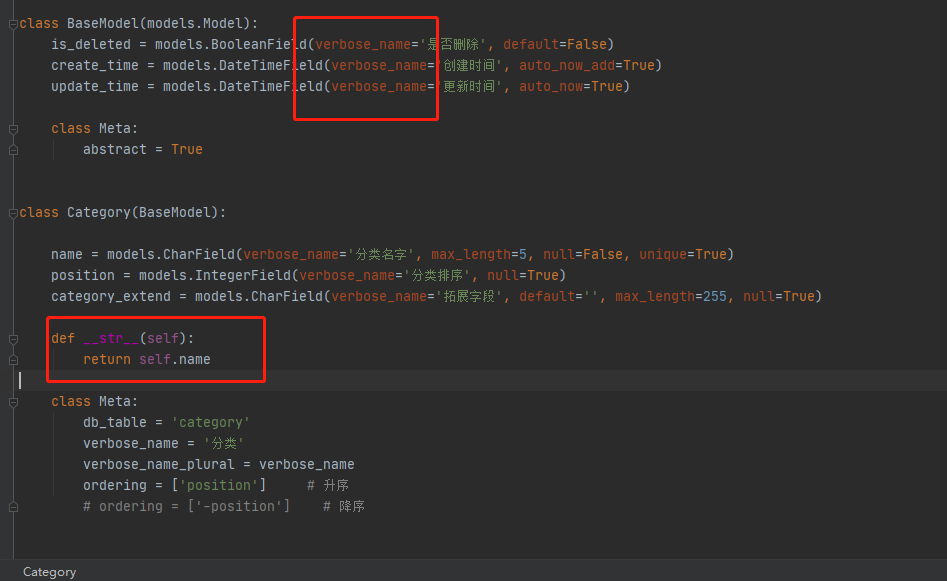

# 一、管理后台和数据库显示设置

#### 1、models.py中的定义--- 控制管理后台字段名的显示

这两配合以后显示效果如下，控制表中字段的显示

#### 2、models.py中的定义--- 控制管理后台表名的显示

这两配合以后显示效果如下，控制管理后台数据表名的显示

#### 3、models.py中的定义--- 控制数据迁移时，数据库中的表名后

这两配合以后显示效果如下，控制数据库迁移时，在真实数据库中生成的表名

#### 4、admin.py中定义：控制管理后台显示多个字段

我们要定义个后台管理器，这个管理器继承于django.contrib.admin.ModelAdmin

然后我们看看效果

这个ModeAdmin中还有很多预留参数，以后慢慢学习

- 如果指定了list_display，如果只针对admin后台显示的话，可以不用写`__str__`了
- 如果你要在view中，print(object)的话还是要写上，不然又变成object(1) object(2)这种了，我建议是写上

我们加上`__str__`

- 坏处，但是有时候我们就是想看他到底是什么类型的时候，才用print的方式，给我们返回了一个字符串，这也很伤
