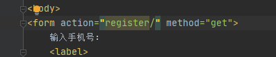

**后端写代码永远遵循一个信条：前端是裸奔的，哪怕前端已经做了数据校验，我们还是要自己进行数据校验**


# 一、HttpRequest对象

当客户端像服务器发起一个请求后，会创建一个名为HttpRequest对象。视图中的第一个参数必须是HttpRequest对象。

## 属性

- path：一个字符串，表示请求的页面的完整路径，不包含域名和参数部分。
- method：一个字符串，表示请求使用的HTTP方法，常用值包括：'GET'、'POST'。
    - 在浏览器中给出地址发出请求采用get方式，如超链接。
    - 在浏览器中点击表单的提交按钮发起请求，如果表单的method设置为post则为post请求。
- encoding：一个字符串，表示提交的数据的编码方式。
    - 如果为None则表示使用浏览器的默认设置，一般为utf-8。
    - 这个属性是可写的，可以通过修改它来修改访问表单数据使用的编码，接下来对属性的任何访问将使用新的encoding值。
- GET：QueryDict类型对象，类似于字典，包含get请求方式的所有参数。
- POST：QueryDict类型对象，类似于字典，包含post请求方式的所有参数。
- FILES：一个类似于字典的对象，包含所有的上传文件。
- COOKIES：一个标准的Python字典，包含所有的cookie，键和值都为字符串。🔺这个还是经常用的
- session：一个既可读又可写的类似于字典的对象，表示当前的会话，只有当Django 启用会话的支持时才可用，详细内容见"状态保持"。
- 运行服务器，在浏览器中浏览首页，可以在浏览器“开发者工具”中看到请求信息如下图：


- 编辑views.py文件，代码如下：


```python 
def index(request):
    content='%s,%s'%(request.path,request.encoding)
    return render(request, 'index.html', {'content':content})
```

- 在templates下创建index.html文件，代码如下：

```html
<html>
<head>
    <title>首页</title>
</head>
<body>
{{ content }}
<br/>
</body>
</html>
```
## 方法

**备注：下面采用form表单的样式进行演示**

#### GET

- 编写视图


```python
def index(request):
    return render(request, 'index.html')
```

-  模板代码如下

```html
<form action="/register" method="get">
    输入手机号：<input type="text" name="phone" ><br>
    输入密码：<input type="password" name="password"><br>
    确认密码：<input type="password" name="password1"><br>
    性别：男<input type="radio" value="1" name="gender">
    女<input type="radio" value="0" name="gender"><br>
    爱好
    抽烟：<input type="checkbox" value="抽烟" name="hobby">
    喝酒 <input type="checkbox" value="喝酒" name="hobby">
    喝酒 <input type="checkbox" value="烫头" name="hobby">


    <input type="submit" value="注册">

</form>


// 美化版本
<form action="/register" method="get">
    输入手机号：
    <label>
        <input type="text" name="phone">
    </label><br>
    输入密码：
    <label>
        <input type="password" name="password">
    </label><br>
    确认密码：
    <label>
        <input type="password" name="password1">
    </label><br>
    性别：
    男
    <label>
        <input type="radio" value="1" name="gender">
    </label>
    女
    <label>
        <input type="radio" value="0" name="gender">
    </label><br>
    爱好
    抽烟：
    <label>
        <input type="checkbox" value="抽烟" name="hobby">
    </label>
    喝酒
    <label>
        <input type="checkbox" value="喝酒" name="hobby">
    </label>
    喝酒
    <label>
        <input type="checkbox" value="烫头" name="hobby">
    </label><br>
    <input type="submit" value="注册">

</form>
```


- 编写注册视图▲🔺▲🔺▲🔺▲🔺▲🔺

```python
# 提交参数如下
http://127.0.0.1:8000/login/register/?phone=18996696040&password=111111111111111111&password1=122222222222222222&gender=1&hobby=%E6%8A%BD%E7%83%9F&hobby=%E5%96%9D%E9%85%92&hobby=%E7%83%AB%E5%A4%B4
        
        
<QueryDict: {'phone': ['18996696040'], 'password': ['1111111111111111'], 'password1': ['1222222222222222'], 'gender': ['1'],'hobby': ['抽烟', '喝酒', '烫头']}>
    
    
# 对比get和getlist的区别    
def register(request):
    hobby = request.GET.get('hobby')				#  得到 "抽烟" 这个字符串，通过get只能获取 第一个值
    hobby_list = request.GET.getlist('hobby')		#  得到['抽烟', '喝酒', '烫头']一个列表
    return HttpResponse('接到参数了')
```


#### POST

- 模板代码如下

```python
<form action="/register" method="get">
    输入手机号：<input type="text" name="phone" ><br>
    输入密码：<input type="password" name="password"><br>
    确认密码：<input type="password" name="password1"><br>
    性别：男<input type="radio" value="1" name="gender">
    女<input type="radio" value="0" name="gender"><br>
    爱好
    抽烟：<input type="checkbox" value="抽烟" name="hobby">
    喝酒 <input type="checkbox" value="喝酒" name="hobby">
    喝酒 <input type="checkbox" value="烫头" name="hobby">


    <input type="submit" value="注册">

</form>
```

- 视图代码

```python
def register(request):
    phone = request.POST.get('phone')
    hobby = request.POST.getlist('hobby')
    return HttpResponse('接到参数了')
```


**▲注意一：这里存在一个域的问题，那就是**



- 如果form表单中，action="register/" 或者 action="register"表示重当前跳转页面的url后面添加一个register

比如我们的表单页面url是http://127.0.0.1:8000/login/show_test_method/

那么提交跳转的时候请求的url是http://127.0.0.1:8000/login/show_test_method/register?表单信息


- 如果form表单中，action="other/register/" 表示从当前跳转页面的url后面添加一个other/register

比如我们的表单页面url是http://127.0.0.1:8000/login/show_test_method/

那么提交跳转的时候请求的url是http://127.0.0.1:8000/login/show_test_method/other/register?phone=zmz&password=123456&password1=表单信息

- 如果form表单中，action="/register" 表示从根目录开始

比如我们的表单页面url是http://127.0.0.1:8000/login/show_test_method/

那么提交跳转的时候请求的url是http://127.0.0.1:8000/register?phone=zmz&password=123456&password1=


# 二、Cookie结合例子简单讲解

#### 1、请求资源的整体流程

浏览器输入网站


路由（或者叫寻址）


找到对应的视图


渲染

- 在渲染的时候发现`html`的表单中存在crfs数据
- 这个时候服务器后端就会在响应头中加入Set-Cookie字段，告诉浏览器，你需要设置cookie

**Django中csrf-token验证原理：https://blog.csdn.net/bocai_xiaodaidai/article/details/108679437**

浏览接收到数据

- 发现响应头中有set-cookie字段，于是乎设置cookie
- 显示页面

#### 2、cookie的表现

- 常用的直接表现就是，你是否登录过
- 用户上一步做了什么

- 🔺🔺🔺当浏览器请求某网站时，会将浏览器存储的跟网站相关的所有Cookie信息提交给网站服务器，只要浏览器有这个域名的cookie，它都会给他传过去，服务器就可以根据这些cookie知道用户的动作（比如：是否登录过，干过什么），通过这些动作设置限制，比如服务器校验cookie发现你没有登录，就给出相应的处理

🔺如果一个表单通过GET进行提交，且表单里面定义了,我们在提交表单的时候，会多一个组csrf_token数据.同事POST请求的时候也一样
