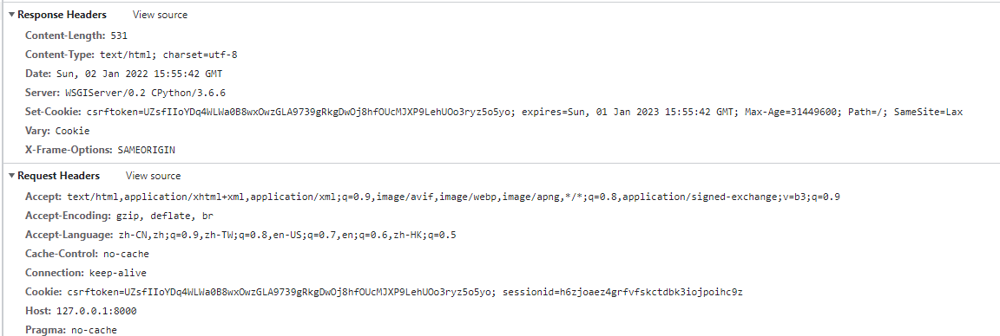
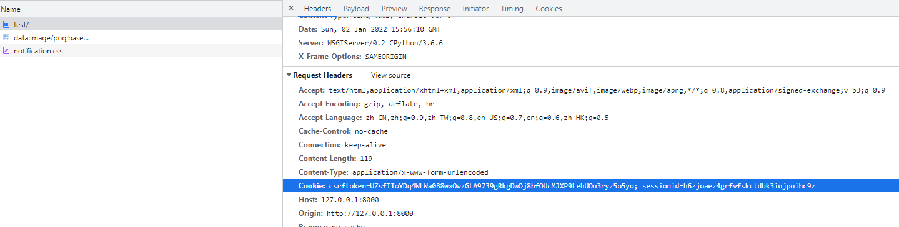

### HttpResponse对象

当视图接到请求后，会做一些业务处理，然后返回HttpResponse对象。


## 属性
- content：表示返回的内容。
- charset：表示response采用的编码字符集，默认为utf-8。
- status_code：返回的HTTP响应状态码。
- content-type：指定返回数据的的MIME类型，默认为'text/html'。

## 方法
- _init_：创建HttpResponse对象后完成返回内容的初始化。
- set_cookie：设置Cookie信息。

​	

- cookie是网站以键值对格式存储在浏览器中的一段纯文本信息，用于实现用户跟踪。
	- max_age是一个整数，表示在指定秒数后过期。
	- expires是一个datetime或timedelta对象，会话将在这个指定的日期/时间过期。
	- max_age与expires二选一。
	- 如果不指定过期时间，在关闭浏览器时cookie会过期。
	- 其他（后面研究）
- delete_cookie(key)：删除指定的key的Cookie，如果key不存在则什么也不发生。
- write：向响应体中写数据。

每一次前端请求的时候都会把所有Cookie带过来，我们有两种方式可以获取我们的请求，第一中在header中去拿request.headers.get('Cookie') 或者 request.Cookie.get('uid')

```python
# 常用参数
set_cookie(key, value='', max_age=None, expires=None)

# 源码全部参数
set_cookie(key, value='', max_age=None, expires=None, path='/', domain=None, secure=False, httponly=False, samesite=None)

# 使用方法HttpResponse.set_cookie(...)
response = redirect(to='/index/')
response.set_cookie(key='uid', value=phone_query_result[0].id)
response.set_cookie(key='is_login', value=1)		# 🔺这里注意了，value我们一般使用字符串，因为前端请求头里面会变成字符串，最好保持一致，不然容易造成w
print('响应头', response.__dict__)
return response


响应头 {'_headers': {'content-type': ('Content-Type', 'text/html; charset=utf-8'), 'location': ('Location', '/index/')}, '_closable_objects': [], '_handler_class': None, 'cookies': <SimpleCookie: is_login='1' uid='2'>, 'closed': False, '_reason_phrase': None, '_charset': None, '_container': [b'']}


# 拿前端传过来的cookie 前端传过来的cookie是这样的'Cookie': 'csrftoken=qmhZhlODJEmn56dU2ZxcCAEOxGxKUigRWnV6z6ZnWsz0lQs9QvEkrWzeLuzjTK4O;uid=2; is_login=1'
cookies = request.COOKIES
print('我的cookie', cookies)
>>> 我的cookie {'csrftoken': 'qmhZhlODJEmn56dU2ZxcCAEOxGxKUigRWnV6z6ZnWsz0lQs9QvEkrWzeLuzjTK4O', 'uid': '2', 'is_login': '1'}
# 他会帮我把格式处理好，非常的nice
```


## 特点

- Cookie以键值对的格式进行信息的存储。
- Cookie基于域名安全，不同域名的Cookie是不能互相访问的，如访问sina.cn时向浏览器中写了- Cookie信息，使用同一浏览器访问baidu.com时，无法访问到sina.cn写的Cookie信息。
- 🔺🔺🔺当浏览器请求某网站时，会将浏览器存储的跟网站相关的所有Cookie信息提交给网站服务器

### JsonResponse
给前端返回json格式的数据

- 编写View视图

```python
def get_json(request):
    ctx = {
        'data': [
            {"name": "1", "age": 12},
            {"name": "2", "age": 12}
        ]
    }

    return JsonResponse(ctx, safe=False)
```
- 编写路由

```python
urlpatterns = [
    path('get_json/', views.get_json),
]
```
- 访问地址


### 重定向Redirect

重定向：https://jingyan.baidu.com/article/39810a23985af4b636fda690.html

重定向(Redirect)就是通过各种方法将各种网络请求重新定个方向转到其它位置返回的状态码为302。

- 永久重定向

  301 被请求的资源已永久移动到新位置，并且将来任何对此资源的引用都应该使用本响应返回的若干个URI之一。如果可能，拥有链接编辑功能的客户端应当自动把请求的地址修改为从服务器反馈回来的地址。除非额外指定，否则这个响应也是可缓存的。

- 临时重定向

  302 请求的资源现在临时从不同的URI响应请求。由于这样的重定向是临时的，客户端应当继续向原有地址发送以后的请求。只有在Cache-Control或Expires中进行了指定的情况下，这个响应才是可缓存的。

  

编写视图

```python
from django.shortcuts import redirect, reverse
def test2(request, id1):
    return HttpResponse("0k")

def test1(request):
    return redirect(reverse('app01:test2', kwargs={'id1': 1123}))
```
编写路由

```python
from django.contrib import admin
from django.urls import path, register_converter
from . import views
from django.urls import re_path

urlpatterns = [
    path('test1/', views.test1, name='test1'),
    re_path('test2/(?P<id1>[0-9]{4})/', views.test2, name='test2'),
]

```
```
from django.contrib import admin
from django.urls import path, include

urlpatterns = [
    path('admin/', admin.site.urls),
    path('app01/', include(('app01.urls', 'toutiao'), namespace='app01')),
]

```

访问

```python
http://127.0.0.1:8000/app01/test1/
```





