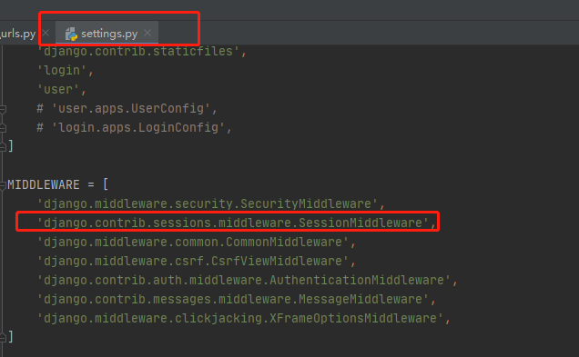
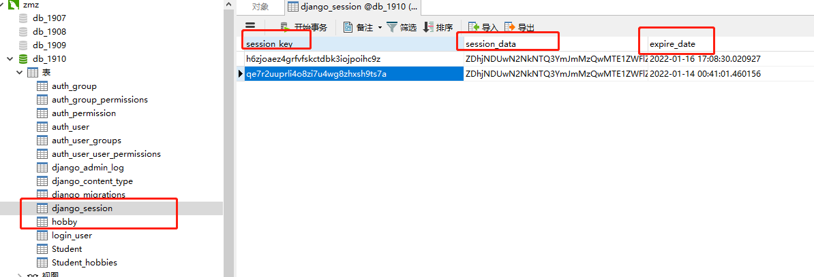
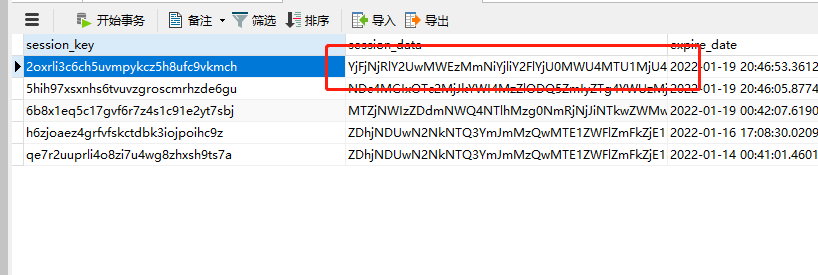
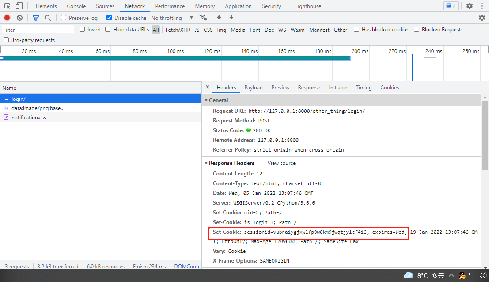
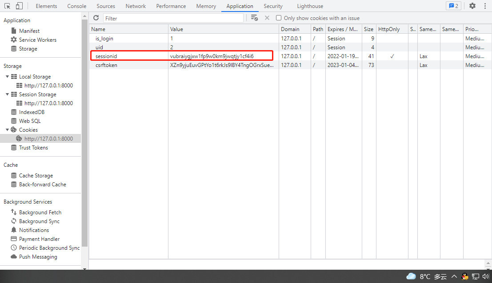
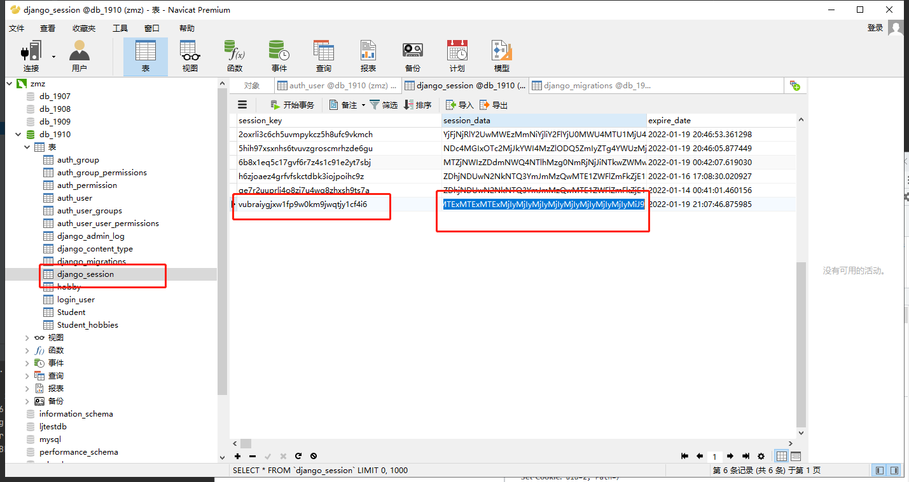

# 状态保持
浏览器请求服务器是无状态的。无状态指一次用户请求时，浏览器、服务器无法知道之前这个用户做过什么，每次请求都是一次新的请求。无状态的应用层面的原因是：浏览器和服务器之间的通信都遵守HTTP协议。根本原因是：浏览器与服务器是使用Socket套接字进行通信的，🔺服务器将请求结果返回给浏览器之后，会关闭当前的Socket连接，🔺而且服务器也会在处理页面完毕之后销毁页面对象。

有时需要保存下来用户浏览的状态，比如用户是否登录过，浏览过哪些商品等。 实现状态保持主要有Cookieh和Session

# Session

对于敏感、重要的信息，建议要储在服务器端，不能存储在浏览器中，如用户名、余额、等级、验证码等信息。


## 启用Session

Django在中间键默认启用了Session。






## 存储方式
- 存储在数据库中，默认存储方式，可以不写。


```python
SESSION_ENGINE='django.contrib.sessions.backends.db'
```

- 存储在缓存中：存储在本机内存中，如果丢失则不能找回，比数据库的方式读写更快。


```python
SESSION_ENGINE='django.contrib.sessions.backends.cache'
```

- 混合存储：优先从本机内存中存取，如果没有则从数据库中存取。

```python
SESSION_ENGINE='django.contrib.sessions.backends.cached_db'
```

- 如果存储在数据库中，需要在项INSTALLED_APPS中安装Session应用。


- 迁移后会在数据库中创建出存储Session的表。


- 表结构包括三个数据：键，值，过期时间。


## 依赖于Cookie
所有请求者的Session都会存储在服务器中，服务器如何区分请求者和Session数据的对应关系呢？

答：在使用Session后，会在Cookie中存储一个sessionid的数据，每次请求时浏览器都会将这个数据发给服务器，服务器在接收到sessionid后，会根据这个值找出这个请求者的Session。

结果：如果想使用Session，浏览器必须支持Cookie，否则就无法使用Session了。

存储Session时，键与Cookie中的sessionid相同，值是开发人员设置的键值对信息，进行了base64编码，过期时间由开发人员设置。



**Session_data解密**

```python
session_data = 'YjFjNjRlY2UwMWEzMmNiYjliY2FlYjU0MWU4MTU1MjU4NTRlY2FhYzp7ImNhcHRjaGEiOiIzNDczIn0='
base64.b64decode(session_data)
>>>  b'b1c64ece01a32cbb9bcaeb541e815525854ecaac:{"captcha":"3473"}'
```


## 方法流程剖析

命令

```python
request.session['session_key'] = session_data
```

等价于

```python
# 第一步: 设置response响应头,携带set_cookie字段，浏览器根据set_cookie字段设置cookie报错在浏览器
response = HttpResponse
response.set_cookie(key='sessionid', value='加密后的session_key')

# 第二步: 在服务器数据库中存如session数据
session_data 采用base64.b64encode()进行加密
```

**第一步: 设置response响应头,携带set_cookie字段，浏览器根据set_cookie字段设置cookie报错在浏览器**






**第二步: 在服务器数据库中存如session数据**



```python
# 通过b64解密session_data看看数据结果>>> 
session_data = 'ODIwNTM2NTE4Y2ZlOTY2OWQyODIxYTA5NjRhNjE1NGY3NWZhNjA1MTp7ImNhcHRjaGEiOiI0OTcyIiwieHh4eHgiOiIxMTExMTExMTExMTExMjIyMjIyMjIyMjIyMjIyMjIyMjIyMjIyMiJ9'
>>> base64.b64decode(session_data)
b'820536518cfe9669d2821a0964a6154f75fa6051{"captcha":"4972","xxxxx":"11111111111112222222222222222222222222"}'
```


## 方法
- 写入session。

```python
request.session['键']=值
```
- 获取Session值。

```python
request.session.get('键',默认值)
```
- 清除所有session，在存储中删除值部分。

```python
request.session.clear()
```
- 清除session数据，在存储中删除session的整条数据。

```python
request.session.flush()
```
- 删除session中的指定键及值，在存储中只删除某个键及对应的值。

```python
del request.session['键']
```
- 设置会话的超时时间，如果没有指定过期时间则两个星期后过期。

```python
request.session.set_expiry(value)
```
- 如果value是一个整数，会话将在value秒没有活动后过期。
- 如果value为0，那么用户会话的Cookie将在用户的浏览器关闭时过期。
- 如果value为None，那么会话永不过期。
- 如果value为datetime，那么会话具体日期过期


### 

### 编写视图

```python
def set_session(request):
    request.session['uid'] = '123'
    return HttpResponse('设置Session')


def get_session(request):
    uid = request.session.get('uid')
    return HttpResponse(uid)


def clear_session(request):
    request.session.clear()
    return HttpResponse('删除Session')
```
编写路由

```
from django.contrib import admin
from django.urls import path, register_converter
from . import views
from django.urls import re_path

urlpatterns = [
    path('set_session/', views.set_session, name='set_session'),
    path('get_session/', views.get_session, name='get_session'),
    path('clear_session/', views.clear_session, name='clear_session'),

]

```

运行

```python
http://127.0.0.1:8000/set_session/
```


### 读session


### 删除Session


### 用Redis存储Session

- 安装

```
pip install django-redis-sessions==0.5.6
```

- 配置项

```python
SESSION_ENGINE = 'redis_sessions.session'
SESSION_REDIS_HOST = 'localhost'
SESSION_REDIS_PORT = 6379
SESSION_REDIS_DB = 2
SESSION_REDIS_PASSWORD = ''
SESSION_REDIS_PREFIX = 'session'
```


csrf


```python
    def _get_new_session_key(self):
        "Return session key that isn't being used."
        while True:
            session_key = get_random_string(32, VALID_KEY_CHARS)
            if not self.exists(session_key):
                return session_key
                
                
 VALID_KEY_CHARS = string.ascii_lowercase + string.digits
 
 
from django.utils.crypto import get_random_string

def get_random_string(length=12,
                      allowed_chars='abcdefghijklmnopqrstuvwxyz'
                                    'ABCDEFGHIJKLMNOPQRSTUVWXYZ0123456789'):
    if not using_sysrandom:
        random.seed(
            hashlib.sha256(
                ('%s%s%s' % (random.getstate(), time.time(), settings.SECRET_KEY)).encode()
            ).digest()
        )
    return ''.join(random.choice(allowed_chars) for i in range(length))
```

