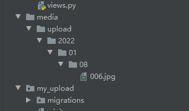
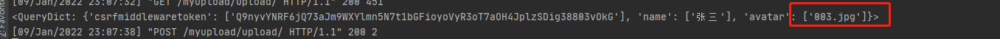

## 上传图片

上传图片有两种形式，一种是在管理后台添加图片， 还有一种是在前端往服务器上添加图片。管理后台添加图片，我感觉还是一样的啊。

安装pillow
```
pip install Pillow
```
## 设置配置

图片是多媒体资源（图片、视频、音频...）

```python
# 上传图片
MEDIA_ROOT = os.path.join(BASE_DIR, 'media').replace("\\", "/")		# 多媒体资源跟目录
MEDIA_URL = '/media/'												# 多媒体资源访问路径	
```

## 编写模型类

```python
class Article(models.Model):
    title = models.CharField(verbose_name='文章名字', max_length=10)
    cover = models.ImageField(verbose_name='封面', upload_to='u/%y/%m/%d')
```

**news/%y/%m/%d**

- %y  --- 22   (2022年去后两位)
- %Y  --- 2022
- %m --- 月
- %d  --- 日

## 上传图片


## 效果展示

我们在model中采用了models.ImageField字段，且配置了upload_to，并配置了setting中的多媒体资源路径.所有它会自动给我们生成一个media文件夹，且在media文件夹中自动化添加图片路径和资源




## 编写视图

```
def show_media(request):
    article =  Article.objects.all()
    return render(request,'show_media.html',locals())
```

### 配置路由

```
from django.conf.urls.static import static
from django.conf import settings
urlpatterns = [
                  path('admin/', admin.site.urls),
              ] + static(settings.MEDIA_URL, document_root=settings.MEDIA_ROOT)
```

## 配置模板全局变量

```python
TEMPLATES = [
    {
        'BACKEND': 'django.template.backends.django.DjangoTemplates',
        'DIRS': [os.path.join(BASE_DIR, 'templates')]
        ,
        'APP_DIRS': True,
        'OPTIONS': {
            'context_processors': [
                'django.template.context_processors.debug',
                'django.template.context_processors.request',
                'django.contrib.auth.context_processors.auth',
                'django.contrib.messages.context_processors.messages',
                'django.template.context_processors.media'	# 添加这一段，是为了在模板中获取MEDIA_URLz
            ],
        },
    },
]
```

添加'django.template.context_processors.media'这一段的作用是什么呢？

如果我们不添加这一段的话，在模板中我们就不能直接使用{{ MEDIA_URL }}来获取setting中的MEDIA_URL 参数。。我试过了，我定义的其他参数好像拿不到


## 编写模板

```html
<!DOCTYPE html>
<html lang="en">
<head>
    <meta charset="UTF-8">
    <title>Title</title>
</head>
<body>

    <h1>{{ article.title }}</h1>
    

</body>
</html>
```

## 效果如下


## 自定义form表单中上传图片

## 编写视图

```python
def pic_upload(request):
    return render(request,'pic_upload.html')
```

## 编写路由

```
path('pic_upload/', views.pic_upload),
path('upload/', views.upload),
```

## 编写模板

```html 
<html>
<head>
    <title>上传图片</title>
</head>
<body>
<form method="post" action="/upload/" enctype="multipart/form-data">
    
    <input type="file" name="pic"/><br>
    <input type="submit" value="上传">
</form>
</body>
</html>
```

- 当我们的表单要上传type="file"类型的东西的时候，我们要指定加密类型enctype="multipart/form-data"，否则我们拿到的将会是如下的东西,它根本就不是一个图片




## 编写上传视图

```python
def upload(request):
    file = request.FILES.get('pic')
    media_root = settings.MEDIA_ROOT
    path = 'news/{}/{}/{}/'.format(datetime.now().year, datetime.now().month, datetime.now().day)
    full_path = media_root + '/' + path
    print(full_path)
    if not os.path.exists(full_path):
        os.makedirs(full_path)
    with open(full_path + file.name, 'wb') as pic:
        for c in file.chunks():
            pic.write(c)
    Article.objects.create(title='ces', cover=path + file.name).save()
    return redirect('/show_media/')
```

效果如下


