# 一、常规设置


## 1、正则路由

- 必须导入re_path

```python
# 路由

from django.urls import path, re_path
urlpatterns = [
    path('admin/', admin.site.urls),
    path('index/', views.index),
    re_path(r'^type/\d', views.show_hero)
]

# 视图
def show_hero(request):
    """
    英雄的视图
    :return:
    """
    all_hero = HeroType.objects.all()
    hero_context = {
        'he': all_hero
    }
    return HttpResponse(content=b'ok')
```


- 路由设置的时候首字母前面不要加斜杠，不管是一次路由还是二次分发路由，都不要加


## 2、传参路由

- 采用`<int:id>`这关键字的时候，我们要注意，这个id是会传到视图里面去的，所以我们在视图那边必须接收这个参数，不然报错
- 如果路由里面是传入的id， 那边视图里面也必须是id，他们的名字必须一样，不然报错。也就是说当我们路由里面是`<int:id>`, 那么我们视图里面的形参也必须叫id，不能是`show_hero(request, id1)`

```python
# 路由
from django.contrib import admin
from django.urls import path
from wangzhe import views

urlpatterns = [
    path('admin/', admin.site.urls),
    path('index/', views.index),
    path('show_hero/<int:id>', views.show_hero)
]

# 视图
def show_hero(request, id):
    """
    英雄的视图
    :return:
    """
    all_hero = HeroType.objects.all()
    hero_context = {
        'he': all_hero
    }
    return HttpResponse(content=str(id).encode())
```


# 二、路由二次分发

前言：按照我们以前的方式，全部路由写到项目的主路由urls.py当中，但是这样不好。为什么了，当我们的应用特别多的时候，如果全部写到一个urls.py当中的话，我们维护起来非常麻烦，经常找不到谁是谁了。所以如果每一个应用自己维护自己的路由那就不舒服了。


#### 第一步：给应用创建urls.py文件

我是直接把主路由的urls.py文件复制了一份搞了过来


#### 第二步：配置主路由分发

- 首先导入include方法，配置分发规则


在主路由中，我们根据开发习惯，经常讲我们的应用名作为一级路径，这样的划分更加清晰明了


#### 第三步：配置应用路由

这里就没什么变化了


# 三、正则路由取参数


**用法：django是通过正则模块来取值的**

举例的请求URL： http://127.0.0.1:8000/get_name_and_age/zhangsan20

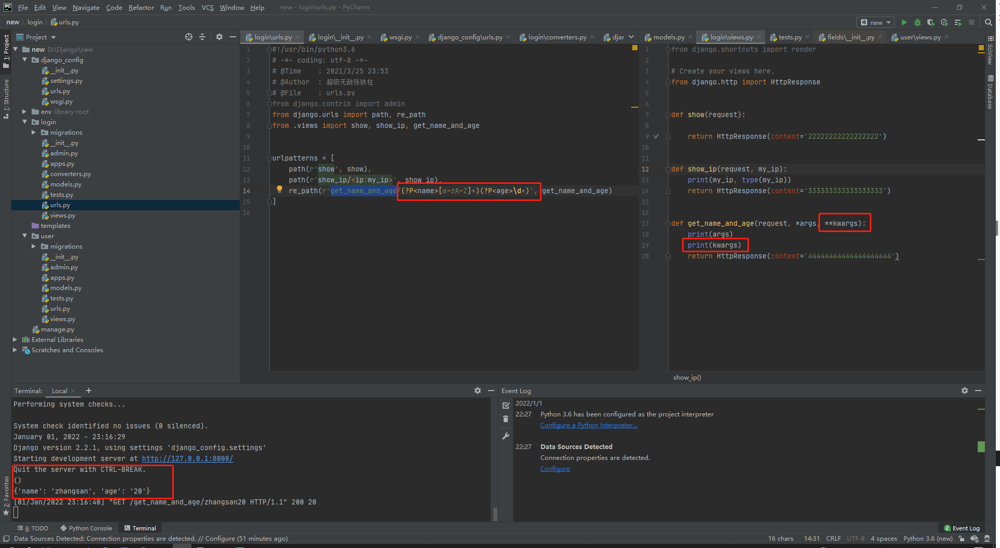


**注意事项：**

- 如果都采用匿名分组，视图函数通过*args来接收参数，返回一个元组
- 如果都采用具名分组，视图函数通过**kwargs来接收参数，返回一个字典
- 🔺如果混合使用，那么只能接收到具名分组的参数，通过**kwargs，这一点很重要
- 根据上面第三点，我们推测作者的意图是要我们采用统一的，要么使用分组，要么使用匿名，这一点也可以在重定向中体现，当我们采用关键字参数和形式参数混合使用的时候，他会给我们报错

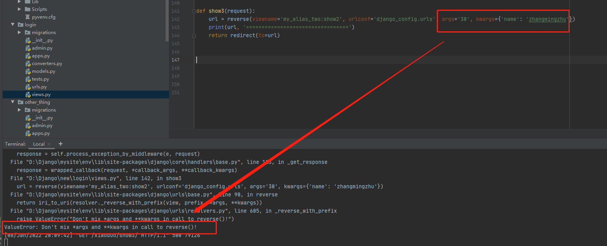

- 🔺重点：浏览器会将中文解析成十六进制然后通过百分号替换\xe 通过*号代替空格,所有我们在写正则的时候，需要注意匹配


# 四、 重定向

导入重定向模块

```python
from django.shortcuts import redirect
```

```python
def delete_new(request):
    path = request.path
    pattern = r'/news/delete_news/(?P<id>\d)'
    match_result = re.search(pattern, path)
    news_id = match_result.groupdict()['id']
    delete_news_content_by_id = News.objects.filter(id=news_id)
    print(delete_news_content_by_id)
    if delete_news_content_by_id:
        delete_news_content_by_id[0].is_deleted = True
        delete_news_content_by_id[0].save()
        return redirect(to='/news/index')
    # return render(request, template_name='news_content.html', context=news_context)
    return HttpResponse(content='数据不存在 !!!!!!')
```

源码

```python
def redirect(to, *args, permanent=False, **kwargs):
    """
    将 HttpResponseRedirect 返回到传递的参数的适当 URL。
    这个参数可以是
        一个模块：这个模块的`get_absolute_url()` 函数将被调用。
        视图名称，可能带有参数：`urls.reverse()` 将用于反向解析名称。
        一个 URL，将按原样用于重定向位置。
    默认情况下发出临时重定向；
    通过 Permanent=True 发出永久重定向
    resolve_url ： j
    """
    redirect_class = HttpResponsePermanentRedirect if permanent else HttpResponseRedirect
    return redirect_class(resolve_url(to, *args, **kwargs))
```


#### 1、简单使用

```python
from django.shortcuts import redirect
```

**301: 临时重定向**： 主机域名没有发生改变

**302：永久重定向**：主机域名都发送了改变

源码一下：

```python
def redirect(to, *args, permanent=False, **kwargs):
    """
    将 HttpResponseRedirect 返回到传递的参数的适当 URL。
    这个参数可以是
        一个模块：这个模块的`get_absolute_url()` 函数将被调用。  比如 resolve_url 模板（他们是黄金搭档）
        视图名称，可能带有参数：`urls.reverse()` 将用于反向解析名称，比如to=login视图
        一个 URL，将按原样用于重定向位置。 这个就是最简单的了
    默认情况下发出临时重定向；
    通过 Permanent=True 发出永久重定向
    """
    redirect_class = HttpResponsePermanentRedirect if permanent else HttpResponseRedirect
    return redirect_class(resolve_url(to, *args, **kwargs))
```

- ```python
	return redirect(to='/')				# 临时重定向到127.0.0.1：8080/,y
	```

- ```
	return redirect(to='/news/xxx')		# 重定向到其他地方，根据url
	```

	


#### 2、参数详细剖析

**to**

- 可以是一个路由地址

	- '/'   表示重定向到根基路由 127.0.0.1
	- '/login/'  表示重定向到127.0.0.1/login/
	- 'login/'    表示从location位置开始。 比如起始路由地址是127.0.0.1/test/ , 那么重定向路由为 127.0.0.1/test/login/

- 还可以是一个模块，一个视图名称

	- ```python
		def redirect(to, *args, permanent=False, **kwargs):
		    """
		    将 HttpResponseRedirect 返回到传递的参数的适当 URL。
		    这个参数可以是
		        一个模块：这个模块的`get_absolute_url()` 函数将被调用。     比如reverse
		        视图名称，可能带有参数：`urls.reverse()` 将用于反向解析名称。  redirect(to=login)
		        一个 URL，将按原样用于重定向位置。 最常用的方式
		    默认情况下发出临时重定向；
		    通过 Permanent=True 发出永久重定向
		    resolve_url ： j
		    """
		    redirect_class = HttpResponsePermanentRedirect if permanent else HttpResponseRedirect
		    return redirect_class(resolve_url(to, *args, **kwargs))
		```

		

	- 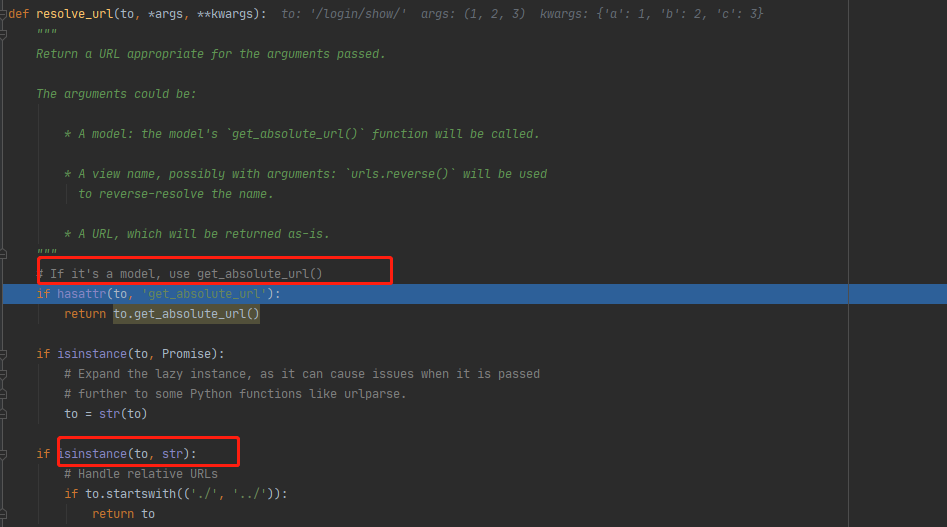


#### 3、重定向别名配置


**根基路由（路由分发）配置 **

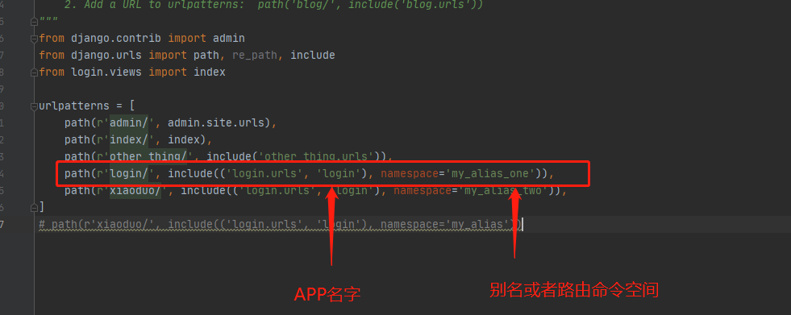


****

**路由视图配置**

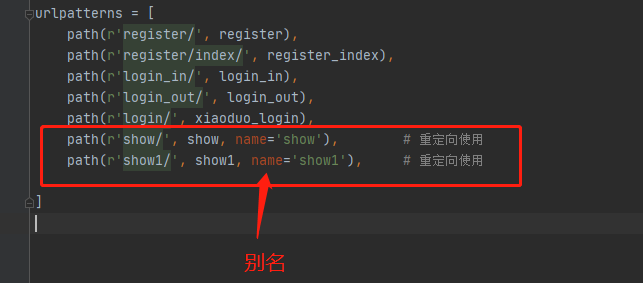


**注意点:**

- namespace 和 name 不能重复，不然报错。name和name可以重复
- 配置namespace，就一定要配置二级路由的name， 不然是无法被反向解析的，而且反向解析时还会报错
- 在反向解析中如果使用了namespace那就只能使用 viewname='namespaece: name'的方式进行方向解析，不再使用viewname=视图函数的方式进行解析了
- 如果没有配置namspace， 只配置二级路由的name， 此时可以通过 viewname='name' 或者  viewname = 视图函数的方式进行方向解析，当存在多个二级路由name相同时候，谁在主路由中后定义，谁优先

**三种方向解析的方式**

- 配置了namespace 和 name的时候只能采用viewname='namespaece: name'
- 配置了name的时候，可以采用viewname='name'      和            viewname = 视图函数的方式        
- 没有配置name的时候，只能采用viewname = 视图函数的方式   


#### 4、通过别名反向生成url

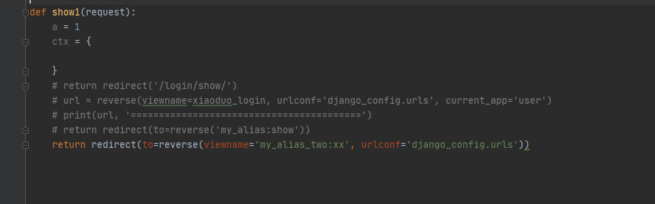


#### 5、不使用别名通过viewname方向生成url

**前提条件：没有配置namespace， 如果配置了namespace就会报错了。 参看点3中的注意点**

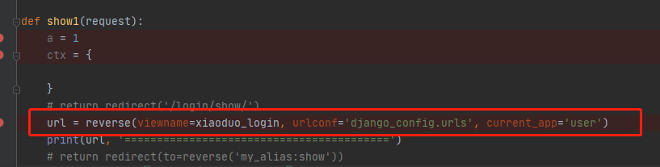

**注意点：**

- current_app这个参数我胡乱指定，他还是能正确逆向解析
- urlconf 这个可以不用指定，他会找到我们的根基路由分发模块.应该是也可以进行自行定义的
- viewname 指定对应的视图函数, 🔺不能是视图函数名的字符串，必须是视图函数名。不然是要报错的
- retrun :  返回路径字符  如果 /login/xiaoduo/


**特别注意点:**

- 存在多个路由指向同一个视图时，如果这多个路由都未指定namespace别名的情况下，通过viewname=函数方式逆向解析，会返回urlpatterns中后定义的地址

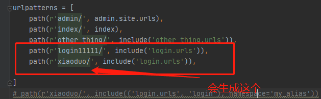

- 存在多个路由指向同一个视图时，如果在其中一个路由指定了namespece的情况下，通过viewname=函数方式逆向解析，会自动剔除指定了namespace的路由，找到与之解析匹配的地址

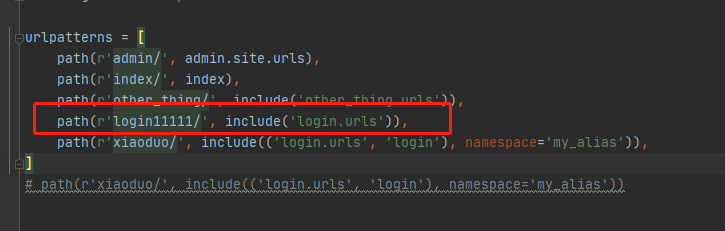

- 配置name没有配置namespace的时候，如果多个路由别名一样的时候，名字后定义的

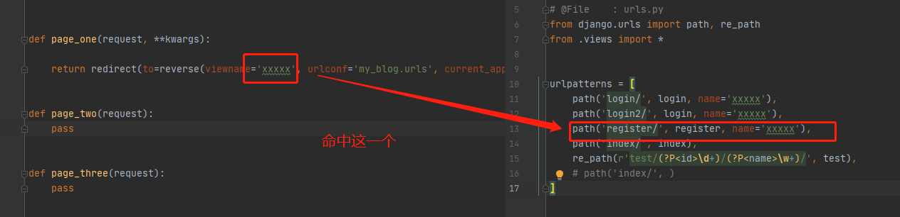


#### 6、反向解析传参

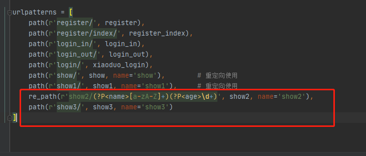


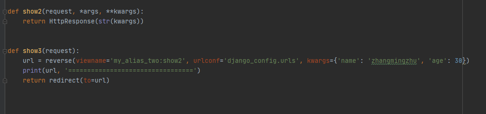


- 如果重定向的采用的是具名分组，reverse中使用kwargs进行传参，如果重定向路由采用的时候匿名分组，使用args进行传参
- kwargs和args不能混合使用，否则报错


# 五、修改工程名

**备注： 将 new改成 django_config, 这样我们可以更好的知道这是一个配置文件夹**


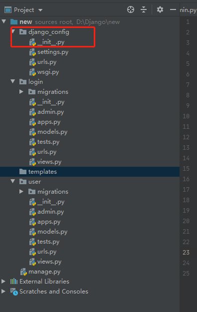

#### 1、修改django_config目录下的setting文件

**ROOT_URLCONF**

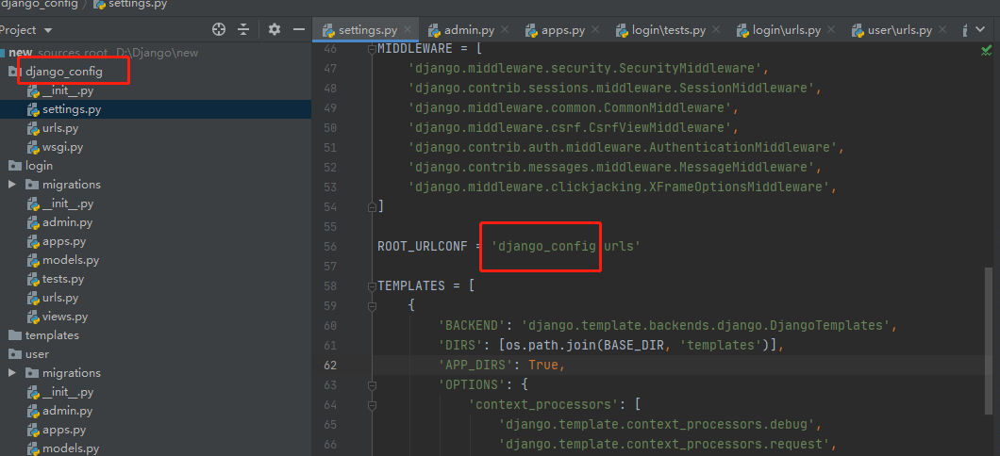


**WSGI_APPLICATION**

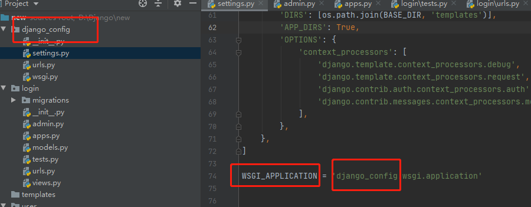


#### 2、修改django_config目录下的wsgi文件

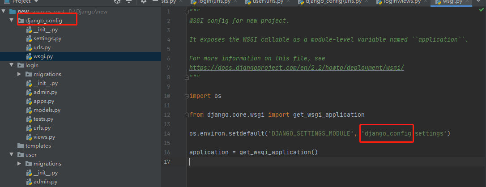


#### 3、修改manage.py文件

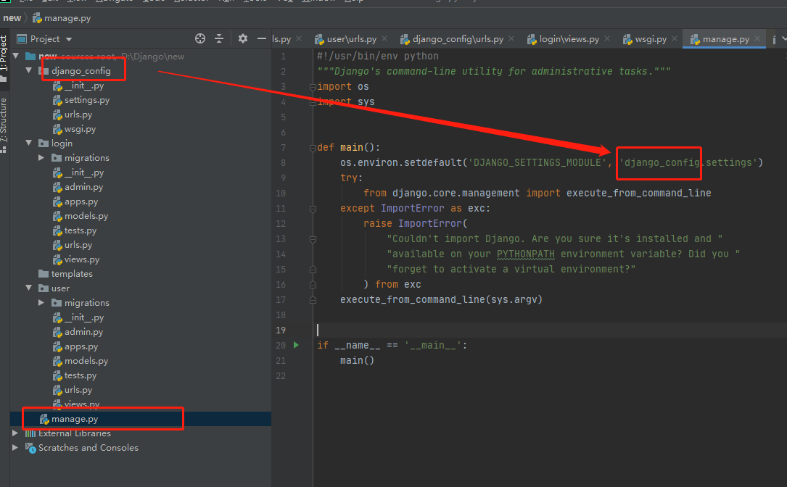


# 六、自定义路由解析

先看看django的源码

```python
# D:\Django\mysite\env\Lib\site-packages\django\urls\converters.py

import uuid
from functools import lru_cache


class IntConverter:
    regex = '[0-9]+'

    def to_python(self, value):
        return int(value)

    def to_url(self, value):
        return str(value)


class StringConverter:
    regex = '[^/]+'

    def to_python(self, value):
        return value

    def to_url(self, value):
        return value


class UUIDConverter:
    regex = '[0-9a-f]{8}-[0-9a-f]{4}-[0-9a-f]{4}-[0-9a-f]{4}-[0-9a-f]{12}'

    def to_python(self, value):
        return uuid.UUID(value)

    def to_url(self, value):
        return str(value)


class SlugConverter(StringConverter):
    regex = '[-a-zA-Z0-9_]+'


class PathConverter(StringConverter):
    regex = '.+'


DEFAULT_CONVERTERS = {
    'int': IntConverter(),
    'path': PathConverter(),
    'slug': SlugConverter(),
    'str': StringConverter(),
    'uuid': UUIDConverter(),
}


REGISTERED_CONVERTERS = {}


def register_converter(converter, type_name):
    REGISTERED_CONVERTERS[type_name] = converter()
    get_converters.cache_clear()


@lru_cache(maxsize=None)
def get_converters():
    return {**DEFAULT_CONVERTERS, **REGISTERED_CONVERTERS}


def get_converter(raw_converter):
    return get_converters()[raw_converter]
```


#### 1、自定义路由解析转换器（转换模块中进行注册）

**首先：我们在我们的APP中创建一个转换模块,通常转换模块的名字我们也使用converters.py，这样好理解（见字识意）**

**然后编写我们的转换代码，跟django的源码保持一致**

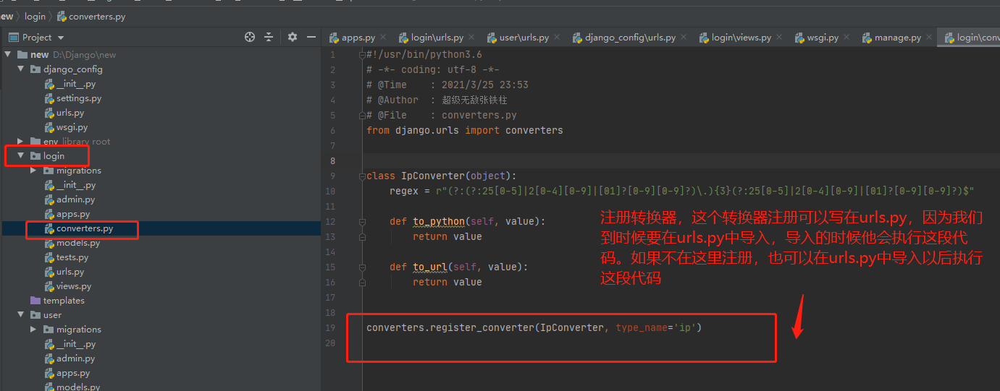

- to_python 转换url，通过正则去匹配
- to_url: 反向解析，后面介绍

**然后在我们的urls.py中导入我们的转换器。导入转换器的目的是为了执行注册命令，在导入模块的时候，python会执行我们convertes.py中的注册命令。**

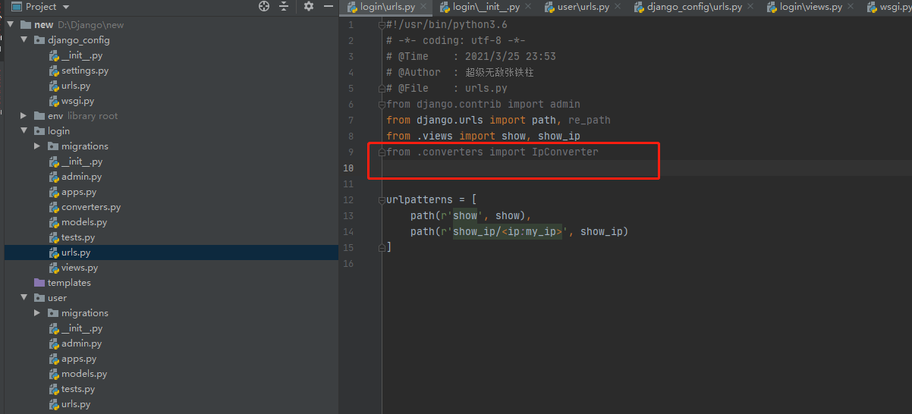

**你别看这个导入的模块是灰色的，没有他，我们的代码就报错了。所以啊，这里其实有一个习惯上的风险，那就是当我们看到这些灰色的模块的时候，有时候以为他没用，就想给他删了**


#### 2、自定义路由解析转换器（在urls.py中进行注册）

**在urls.py中进行注册**

这个时候我们可以把我们的convertes.py中的多余代码清理以下，如下，里面啥都不留了。就一个模板

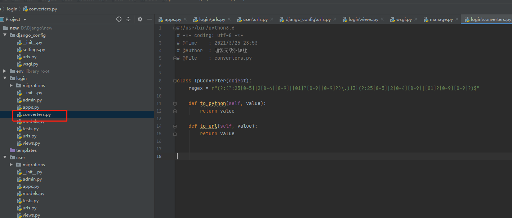

我们看看urls.py

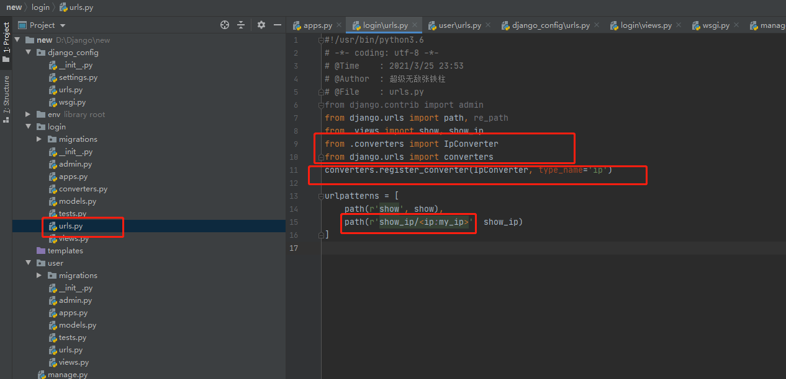

这时候就要将我们的转换器，还有django的注册函数弄进来了


#### 3、终极全局注册

**备注：上面两种方式都有一个缺点，要么就是造成书写上的不规范（导入模块未使用，置灰），第二个就是复用性不高，只能在导入了转换器的urls中生效**


**看看前面学习的pymysql的导入。我们也可以在init文件中进行注册，在项目启动的时候就给他注册了**


**转换器文件保持如上**


**在init文件中进行注册**

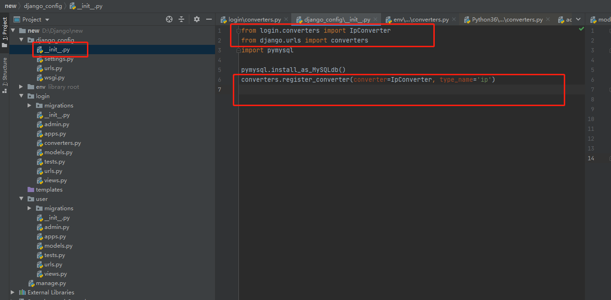

**这样我们的全局都能使用了**


# 八、CSRF（403）

**浅谈：CSRF**

https://zhuanlan.zhihu.com/p/22521378
