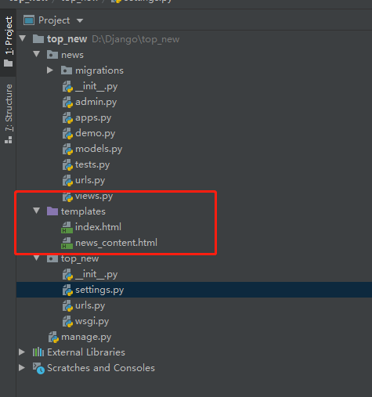
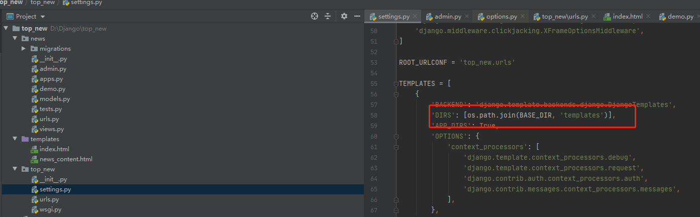
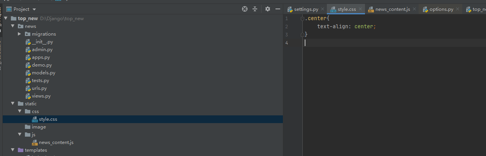
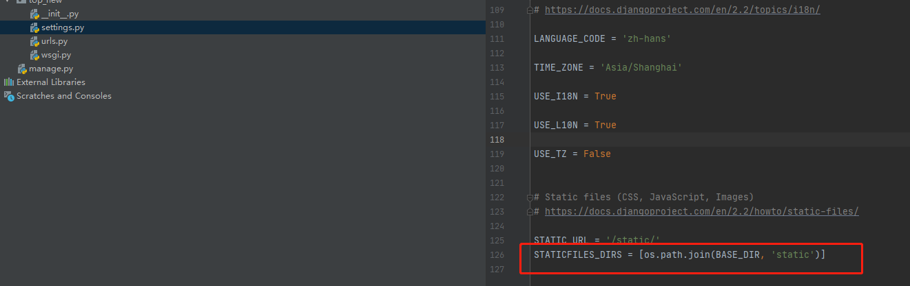
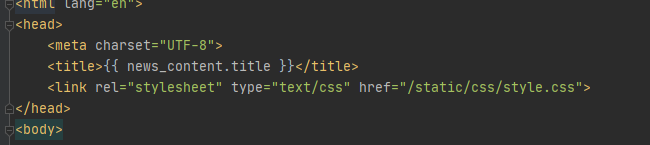

#### 一、配置HTML路径

1、首先，在我们的项目路径下创建一个templates目录

2、进入setting.py当中，配置我们的HTML资源路径

#### 二、配置CSS、JS、image路径配置

1、在我们的项目下创建一个static目录

2、进入到我们的setting.py当中

在最后加上这样一句话

这句话的作用，我说一下哈，这就是定义绝对路径，这样我们在引入css、js等文件的时候，就可以直接从项目根路径开始填写。 

3、引入我们的CSS

