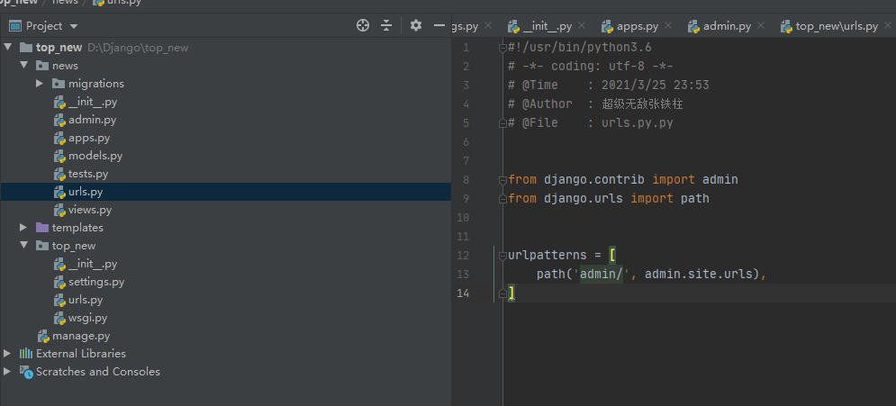
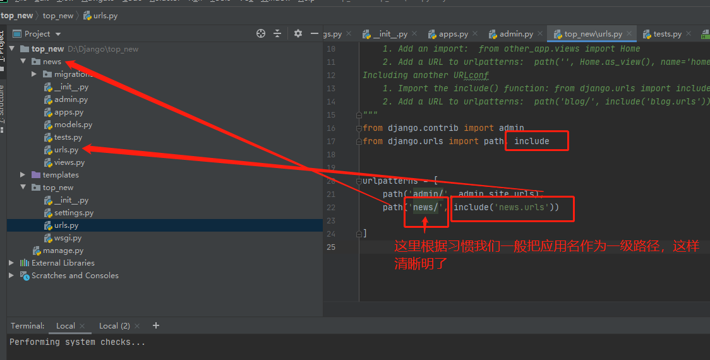

# 一、常规设置


## 1、正则路由

- 必须导入re_path

```python
# 路由

from django.urls import path, re_path
urlpatterns = [
    path('admin/', admin.site.urls),
    path('index/', views.index),
    re_path(r'^type/\d', views.show_hero)
]

# 视图
def show_hero(request):
    """
    英雄的视图
    :return:
    """
    all_hero = HeroType.objects.all()
    hero_context = {
        'he': all_hero
    }
    return HttpResponse(content=b'ok')
```


- 路由设置的时候首字母前面不要加斜杠，不管是一次路由还是二次分发路由，都不要加


## 2、传参路由

- 采用`<int:id>`这关键字的时候，我们要注意，这个id是会传到视图里面去的，所以我们在视图那边必须接收这个参数，不然报错
- 如果路由里面是传入的id， 那边视图里面也必须是id，他们的名字必须一样，不然报错。也就是说当我们路由里面是`<int:id>`, 那么我们视图里面的形参也必须叫id，不能是`show_hero(request, id1)`

```python
# 路由
from django.contrib import admin
from django.urls import path
from wangzhe import views

urlpatterns = [
    path('admin/', admin.site.urls),
    path('index/', views.index),
    path('show_hero/<int:id>', views.show_hero)
]

# 视图
def show_hero(request, id):
    """
    英雄的视图
    :return:
    """
    all_hero = HeroType.objects.all()
    hero_context = {
        'he': all_hero
    }
    return HttpResponse(content=str(id).encode())
```


# 二、路由二次分发

前言：按照我们以前的方式，全部路由写到项目的主路由urls.py当中，但是这样不好。为什么了，当我们的应用特别多的时候，如果全部写到一个urls.py当中的话，我们维护起来非常麻烦，经常找不到谁是谁了。所以如果每一个应用自己维护自己的路由那就不舒服了。


#### 第一步：给应用创建urls.py文件

我是直接把主路由的urls.py文件复制了一份搞了过来




#### 第二步：配置主路由分发

- 首先导入include方法，配置分发规则



在主路由中，我们根据开发习惯，经常讲我们的应用名作为一级路径，这样的划分更加清晰明了


#### 第三步：配置应用路由

这里就没什么变化了


# 三、 重定向

导入重定向模块

```python
from django.shortcuts import redirect
```

```python
def delete_new(request):
    path = request.path
    pattern = r'/news/delete_news/(?P<id>\d)'
    match_result = re.search(pattern, path)
    news_id = match_result.groupdict()['id']
    delete_news_content_by_id = News.objects.filter(id=news_id)
    print(delete_news_content_by_id)
    if delete_news_content_by_id:
        delete_news_content_by_id[0].is_deleted = True
        delete_news_content_by_id[0].save()
        return redirect(to='/news/index')
    # return render(request, template_name='news_content.html', context=news_context)
    return HttpResponse(content='数据不存在 !!!!!!')
```

源码

```python
def redirect(to, *args, permanent=False, **kwargs):
    """
    将 HttpResponseRedirect 返回到传递的参数的适当 URL。
    这个参数可以是
        一个模块：这个模块的`get_absolute_url()` 函数将被调用。
        视图名称，可能带有参数：`urls.reverse()` 将用于反向解析名称。
        一个 URL，将按原样用于重定向位置。
    默认情况下发出临时重定向；
    通过 Permanent=True 发出永久重定向
    resolve_url ： j
    """
    redirect_class = HttpResponsePermanentRedirect if permanent else HttpResponseRedirect
    return redirect_class(resolve_url(to, *args, **kwargs))
```


**`redirect`**

- `to` : 重定向路由
- 
