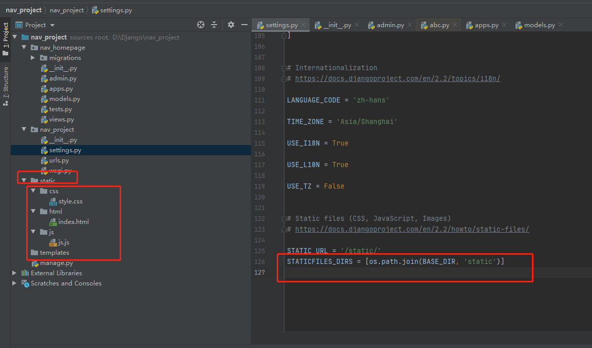
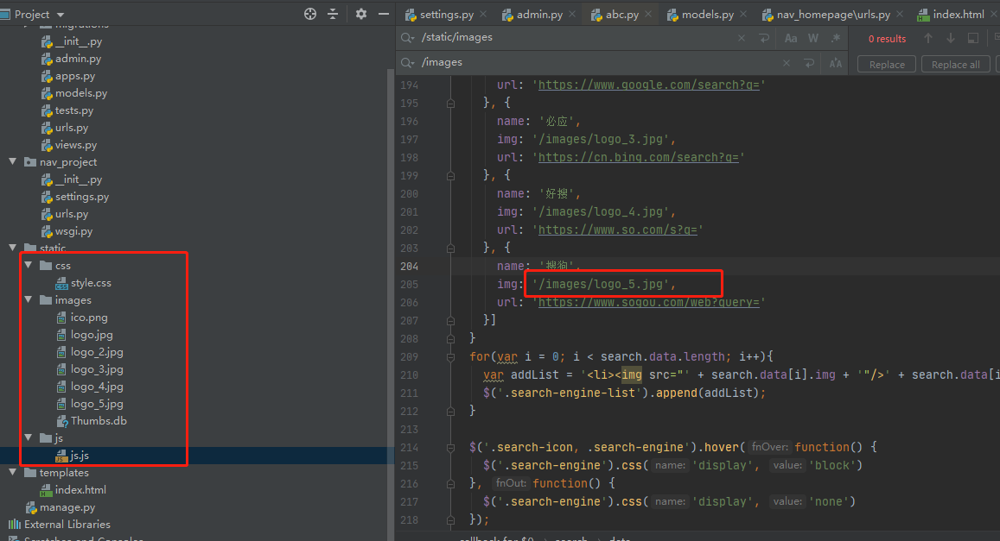

#### 一、配置静态资源



```python
# 这里的必须是一个列表或者元组
STATICFILES_DIRS = [os.path.join(BASE_DIR, 'static')]
```


**具体作用**



- 作用一： 我们在静态资源中，引用静态资源的时候可以使用相对路径，但是这里有点坑，还是要将/static给加上
- 作用二：我们在模板中可以使用/static/js/js.js ，将static作为前端的项目根目录
