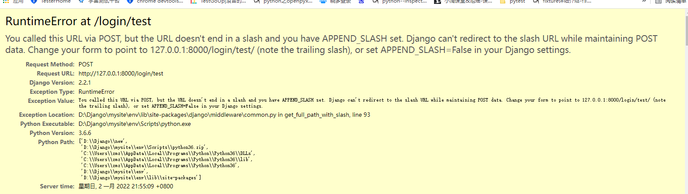
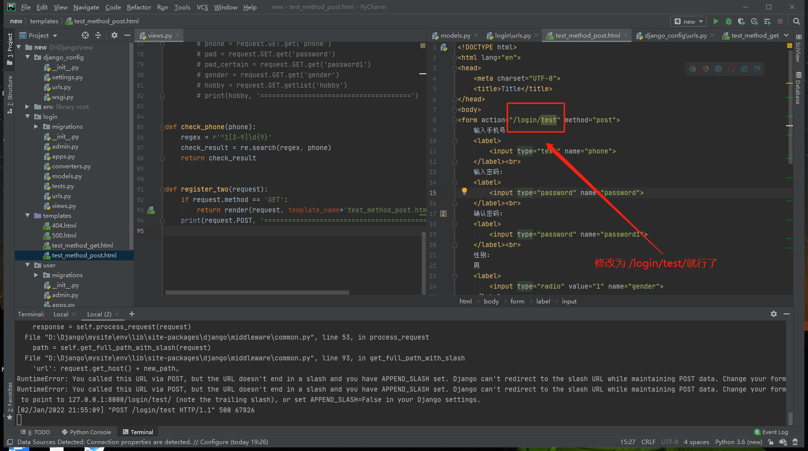
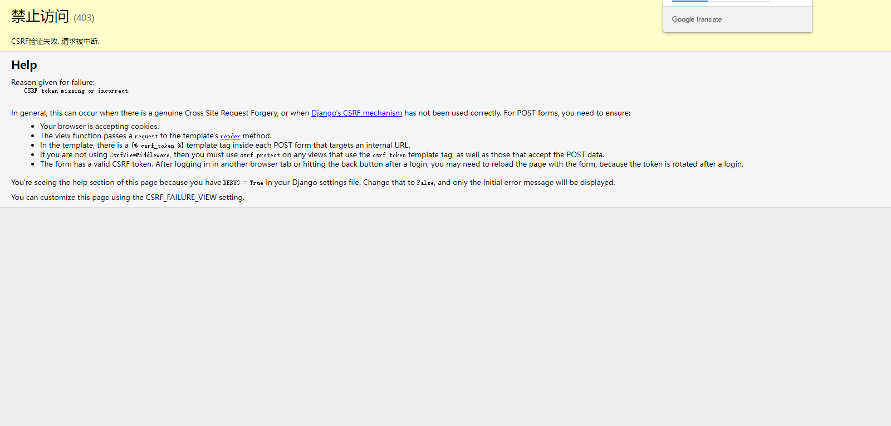
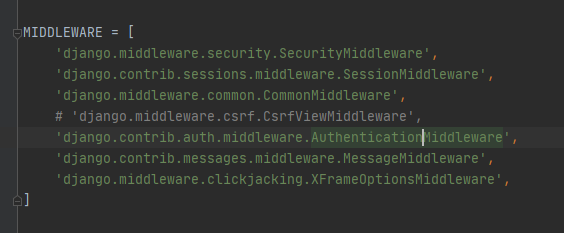
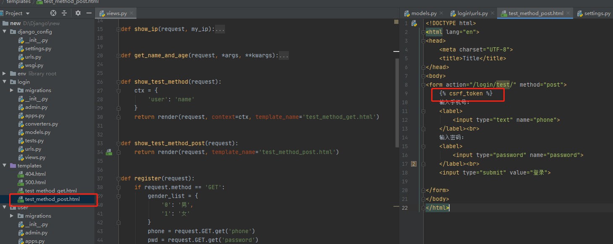
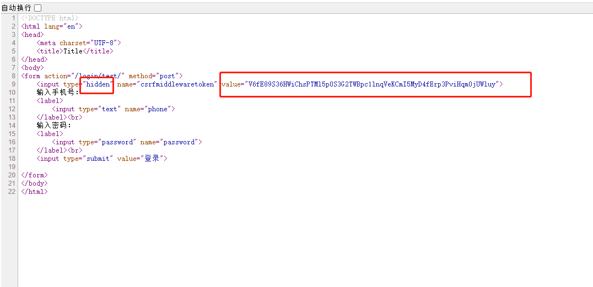
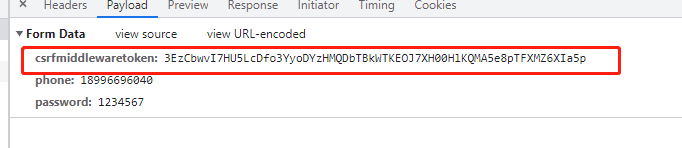
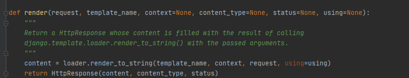
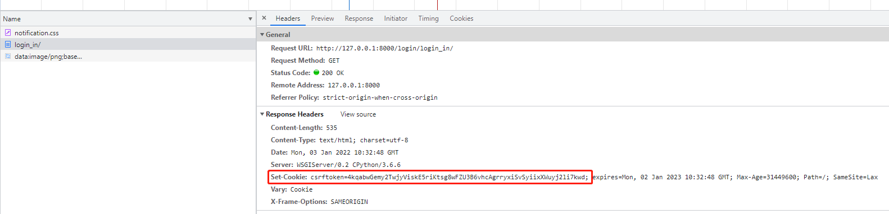
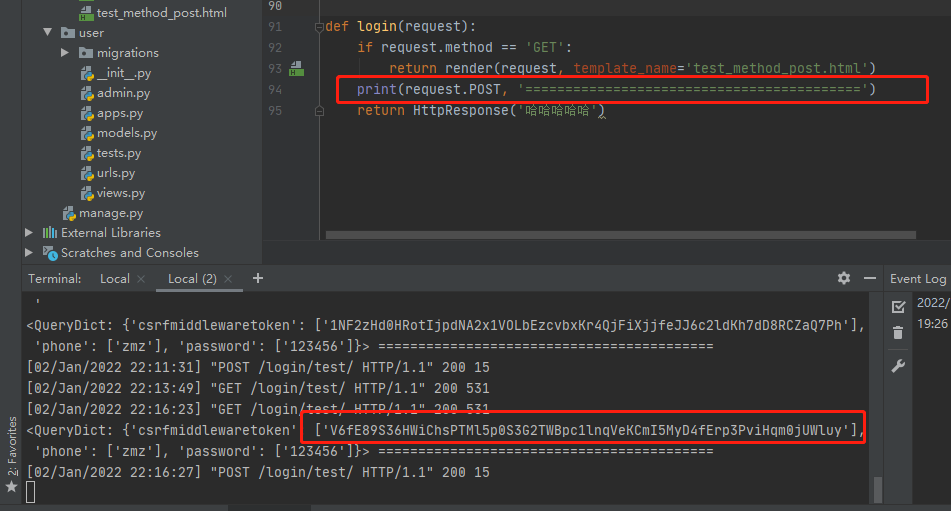

# 一、**报错：AttributeError: 'str' object has no attribute 'decode'**

## 1、版本信息

https://blog.csdn.net/qq_36274515/article/details/89043481

python 版本 : 3.6.6

Django 版本: 2.2.1

这是一个线上的问题， 在后续的Django版本中已经修复。那我们来怎么修改呢？

找到django的 `operations.py` 文件

路径： site-packages/django/db/backends/mysql/operations.py

想象：执行python manage.py migrate的时候报错

## 2、调试思路

首先我们是通过 `python manage.py makemigrations`命令进行数据迁移时报错的，那么我们从入口函数入手。打开manage.py文件


我们看到他是通过sys.argv接收我们命令参数的，那么我们可以自己构造传入的参数，然后打断点进行调试

sys.argv == ['manage.py', 'makemigrations']

将['manage.py', 'makemigrations']替换到sys.argv


然后我们再看看报错信息，看最后一条，看看到底是在哪一行代码报错的？


发现是`D:\Django\mysite\env\lib\site-packages\django\db\backends\mysql\operations.py"`的146行。

那么我们找到这个行代码，打上两个端点。我们在回到manage.py文件中


点击debug按钮


我们看到如下信息


然后下面

```python
query = query.decode(errors='replace') , 字符串类型是没有decode方法的，所以报错了
```


怎么改呢？

- 第一种方法，那就是注释掉


第二种方法：

在operations.py中导入如下包

```
from django.utils.encoding import force_text
```

然后将`last_executed_query`改成如下

```python
    def last_executed_query(self, cursor, sql, params):
        # With MySQLdb, cursor objects have an (undocumented) "_executed"
        # attribute where the exact query sent to the database is saved.
        # See MySQLdb/cursors.py in the source distribution.
        # query = getattr(cursor, '_executed', None)
        # if query is not None:
        #     query = query.decode(errors='replace')
        # return query
        force_text(getattr(cursor, '_executed', None), errors='replace')
```

这个改发是官方后续修复的版本


# 二、报错：django.db.utils.OperationalError: (1170, "BLOB/TEXT column 'content' used in key specification without a key length")

错误模型如下：


报错原因：mysql创建唯一键值的时候不能使用text要使用varchar

所以我们要把 unique 这个玩意给他删除了，就可以了


# 三、报错：news.News.category: (fields.E300) Field defines a relation with model 'Category', which is either not installed, or is abstract.

news.News.category: (models.E006) The field 'category' clashes with the field 'category' from model 'news.basemodel'.


在使用模型抽象方式的时候报错

```python
from django.db import models

# Create your models here.
from django.db import models
from abc import ABCMeta
# Create your models here.


class BaseModel(models.Model):
    is_deleted = models.BooleanField(verbose_name='是否删除', default=False)
    create_time = models.DateTimeField(verbose_name='创建时间', auto_now_add=True)
    update_time = models.DateTimeField(verbose_name='更新时间', auto_now=True)
    
    class Meta:
        db_table = 'news_base'
        # abstract = True			🔺🔺🔺🔺🔺必须加这个玩意，不然报错，q


class Category(BaseModel):

    name = models.CharField(verbose_name='分类名字', max_length=5, null=False, unique=True)
    position = models.IntegerField(verbose_name='分类排序', null=False)
    category_extend = models.CharField(verbose_name='拓展字段', default='', max_length=255)

    def __str__(self):
        return self.name

    class Meta:
        db_table = 'category'


class News(BaseModel):

    title = models.CharField(verbose_name='分类名字', max_length=255, null=False, unique=True)
    content = models.TextField(verbose_name='内容', null=False, max_length=4000)
    is_top = models.BooleanField(verbose_name='是否置顶', default=False)
    src = models.URLField(verbose_name='封面', null=False)
    is_original = models.BooleanField(verbose_name='是否原创')
    news_extend = models.CharField(verbose_name='拓展字段', default='', max_length=255)
    watch_number = models.IntegerField(verbose_name='流量量', default=0)
    category = models.ForeignKey(to=Category, on_delete=models.CASCADE)

    def __str__(self):
        return self.title

    class Meta:
        db_table = 'news'
```

这是我故意的，解决办法就是，只要在class Meta中添加abstract = True就行了


# 四、Django的ORM模型去重问题

#### **问题解决链接：**

- https://www.cnblogs.com/cpl9412290130/p/11777633.html

- https://www.jianshu.com/p/78d5cdf2904a

#### 现象：我想查差评数量大于1的，去重已被删除的字段


```bash
num = Article.objects.filter(cnum__gt=10).distinct('id_delete')
```

#### 报错：

```bash
django.db.utils.NotSupportedError: DISTINCT ON fields is not supported by this database backend
# distinct on 字段不支持这个数据库后端
```

查阅网上资料：官网提到了上面这种错误的写法，在mysql中是不支持的，支持postgresql，也就是distinct()里面不能指定字段。

先看一下distinct的源码：

```python
1 def distinct(self, *field_names):
2     """
3     Return a new QuerySet instance that will select only distinct results.
	  返回一个新的 QuerySet 实例，它将只选择不重复的结果。
4     """
5     assert self.query.can_filter(), \
6         "Cannot create distinct fields once a slice has been taken."
7     obj = self._chain()
8     obj.query.add_distinct_fields(*field_names)
9     return obj
```

使用distinct会返回一个新的查询集合，会显示不重复的结果，达到去重的目的。我们可以看到它接受的是一个或多个field_names参数，也就是各字段名称

#### 错误解决：

但是mysql不能传参数到distinct里面啊，不能这样，那我们可以把数据写到values或者values_list里面去不就好了。

为什么呢？因为distinct本来就是针对查询集来操作的，那么我们直接使用查询集，给这个查询集去重，然后新的查询集不久OK了。。

values（）方法就是生成查询集

values可以接收多个字段名

```
num = Article.objects.values('id_delete').distinct()
```


**其他问题：数据不对啊，按照这样来去重，应该只有一条数据才对啊**

**问题原因：**

distinct()具有去重功能是没有必要怀疑的，distinct()函数有一个隐藏特性，当使用distinct()函数的时候，如果不使用order_by()函数做跟随，那么该函数会自动把当前表中的默认排序字段作为DISTINCT的一个列，所以上述问题出现的原因是因为我没有使用order_by('id_delete')来屏蔽distinct()的那个特性，从而得出的distinct结果并不是仅仅以id_delete一个列作为参数的，而是以id+id_delete两列的值作为distinct参数，可以看到id列里面的值全部都是唯一值，所以得出来的结果必然是以id列的值为标准的，这也就是的原因，而如果想要实现上述例子需求，正确的代码写法是

```bash
num = Article.objects.values('id_delete').filter(cnum__gt=1).distinct().order_by('id_delete')
```


这里order_by('id')是无效的，因为他默认就是这个玩意

当values中有多个参数的时候，随便找一个过来order_by就可以了


# 五、原始SQL查询报错（原始查询必须包括主键）

django.db.models.query_utils.InvalidQuery: Raw query must include the primary key

现象：我执行原始SQL的时候，在navicate中可以正确查询，但是在python代码中就不行提示django.db.models.query_utils.InvalidQuery: Raw query must include the primary key

```
article = Article.objects.raw('select user.name, article.title from user join article on user.id = article.users_id')
print(article.query)
print('3333333333333333333333333333333', article, type(article))
for item in article:
print(item.name, item.title, item.id,  type(item))

```

解决办法：

加上主键查询就行了

```python
    article = Article.objects.raw('select user.name, article.title, article.id from user join article on user.id = article.users_id')

```

引入的新问题：

- 这个article.id不能像sql原生语句一样，取别名，如果取了别名以后，还是会报必须指定主键

- 当我们在联表查询的时候，指定一个表的主键即可

- 如果把两张表的id都指定了的话，谁在前面取谁的值，这个时候，我们就可以给其中一个主键的id指定别名

```python
article = Article.objects.raw('select user.name, article.title, article.id, user.id as user_id from user join article on user.id = article.users_id')


article = Article.objects.raw('select `user`.`name`, `article`.`title`, article.id, user.id as user_id from user join article on user.id = article.users_id')
```

- 完全按照SQL一样，对一些关键字段加上双``也是没问题的，混合使用也是没问题的。为什么要加，是因为可以排除掉sql的本身的占用字符，加上以后就相当于python的r'' 一样，变成原始字符


# 六、数据库迁移时候无法生产数据库表

  No migrations to apply.

想象：我删除了 django项目中app目录下migrations文件夹下的所有文件，并情况了_py缓存文件。执行迁移的时候，一直给我提示No migrations to apply

解决办法：

通过navicate进入我们的数据库

找到下面这张表


执行情况表的命令


# 七、form表单发送post请求的时候，路由地址未以斜杠结尾报错

**错误信息：**

**错误码：500（服务器错误）**

```
RuntimeError: You called this URL via POST, but the URL doesn't end in a slash and you have APPEND_SLASH set. Django can't redirect to the slash URL while maintaining POST data. Change your form to point to 127.0.0.1:8000/login/test
/ (note the trailing slash), or set APPEND_SLASH=False in your Django settings.

RuntimeError：您通过 POST 调用了此 URL，但该 URL 不以斜杠结尾，并且您设置了 APPEND_SLASH。 Django 无法在维护 POST 数据的同时重定向到斜杠 URL。 将您的表单更改为指向 127.0.0.1:8000/login/test/（注意尾部斜杠），或在 Django 设置中设置 APPEND_SLASH=False。
```



**怎么修改呢？**




# 八、CSRF -- 403（拒绝访问错误）

**报错信息：**

**错误码：403**

```
Forbidden (CSRF token missing or incorrect.): /login/test/
```



CSRF 跨域工具保护

**浅谈：CSRF**

https://zhuanlan.zhihu.com/p/22521378

**备注：后面学习，原理，现在先学习解决版本**


#### 第一种临时解决办法

在setting.py > MIDDLEWARE  的中间件配置中，将CSRF中间件配置给注释了（这个玩意啊，这是临时办法）




#### 第二种解决办法

在form表单中加入一段代码

```html
<body>
<form action="/login/test/" method="post">
    	🌂加入一个csrf_token
    输入手机号：
    <label>
        <input type="text" name="phone">
    </label><br>
    输入密码：
    <label>
        <input type="password" name="password">
    </label><br>
    <input type="submit" value="登录">

</form>
</body>
```




**此时我们打开这个页面渲染后的源代码**




**我们发现**

- 源代码里面多了一个隐藏的输入框

- 这个输入框在我们提交表单数据的时候，也会加入到参数当中（这个参数是浏览器自动生成的好像）

	

- 我们在get这个页面的时候，响应头中有一个set_cookie的命令，浏览器接到这个cookie以后就会设定cookie（证明set-cookie字段是后端返回的,因为响应头是后端定义的，我们可以大胆猜测，后端在render渲染页面的时候，发现页面中存在crsf，就会在响应头中返回set-cookie（因为render底层也是调用了HttpResponse），浏览器接收到这个响应头以后 ，执行set-cookie操作）




- 我在通过requests模块模拟登录的时候，我首先要get，在respones.headers 响应头中拿到cookie值，然后再模拟登录的post请求中构造请求头，然后还要将crsf这个隐藏表单输入项数据传入

```python
import requests
import re
url = 'http://127.0.0.1:8000/login/login_in/'
res = requests.get(url=url)
print(res.headers)
regex = r'(?<=csrftoken=)\w+(?=;)'
regex_result = re.search(regex, res.headers['Set-Cookie']).group()
print(regex_result)
data = {'csrfmiddlewaretoken': regex_result, 'phone': '18996696040', 'password': '1234567'}
headers = {'Cookie': 'csrftoken=' + regex_result}
res = requests.post(url=url, data=data, headers=headers)
print(res)

```


**此时我们打印post传过来的参数我们会发现里面多了一个东西**

- **csrfmiddlewaretoken**




#### 第三种解决办法（装饰器）

后面再说
