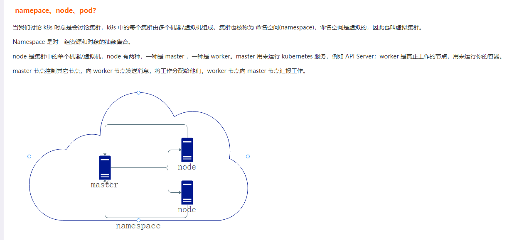
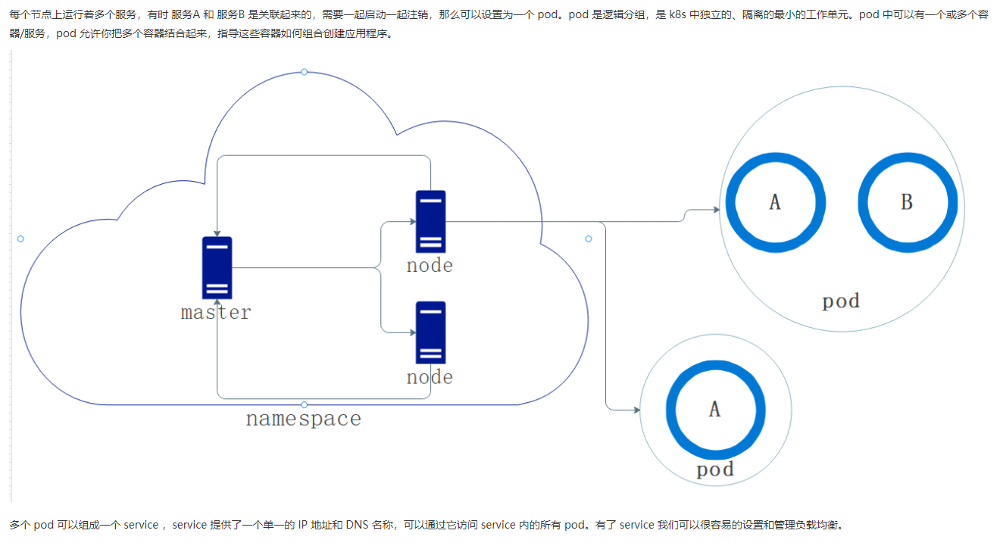

https://www.cnblogs.com/whuanle/p/14669827.html







```
k -n test-cm get pods | grep mongo   查看
k -n test-cm exec -it mongo-42-0 bash  进入一层 mongo 进入二层
db.collection.find().pretty()

k -n  test-cm get pods | grep user-service 查看服务状态
kubectl -n test-mctdl describe pods redis-cluster-0 查看该pod详细描述

kc edit deploy user-service-deploy
kc rollout restart deploy user-service-deploy

服务器修改配置文件，需要进入master节点
/root/envctl-conf/k8s/test-cm/configmap/conf-after-sale  //路径
vim after-sale.json  //修改配置文件
k -n test-cm delete configmaps conf-after-sale  //删除原有conf
k -n test-cm create configmap conf-after-sale --from-file=./after_sale.json  //创建新的configmap


查看所有节点：
k get nodes -o wide --show-labels


查看所有的资源信息 
kubectl get all 
# 查看pod列表 
kubectl get pod 
# 显示pod节点的标签信息 
kubectl get pod --show-labels 
# 根据指定标签匹配到具体的
pod kubectl get pods -l app=example 
# 查看node节点列表 kubectl get node 
# 显示node节点的标签信息 
kubectl get node --show-labels 
# 查看pod详细信息，也就是可以查看pod具体运行在哪个节点上（ip地址信息） 
kubectl get pod -o wide 
# 查看服务的详细信息，显示了服务名称，类型，集群ip，端口，时间等信息 
kubectl get svc [root@master ~]# kubectl get svc NAME TYPE CLUSTER-IP EXTERNAL-IP PORT(S) AGE go-service NodePort 10.10.10.247 <none> 8089:33702/TCP 29m java-service NodePort 10.10.10.248 <none> 8082:32823/TCP 5h17m kubernetes ClusterIP 10.10.10.1 <none> 443/TCP 5d16h nginx-service NodePort 10.10.10.146 <none> 88:34823/TCP 2d19h # 查看命名空间 kubectl get ns # 查看所有pod所属的命名空间 kubectl get pod --all-namespaces # 查看所有pod所属的命名空间并且查看都在哪些节点上运行 kubectl get pod --all-namespaces -o wide # 查看目前所有的replica set，显示了所有的pod的副本数，以及他们的可用数量以及状态等信息 kubectl get rs


kubectl rollout SUBCOMMAND # 回滚到之前的deployment kubectl rollout undo deployment/abc # 查看daemonet的状态 kubectl rollout status daemonset/foo


4、更新服务配置
进入master节点
# 服务器修改配置文件
/root/envctl-conf/k8s/{namespace} /configmap/ //路径
vim ./conf-qc-tb/qc-tb.conf //修改配置文件
k -n {namespace} delete configmaps conf-qc-tb //删除原有conf
k -n {namespace} create configmap conf-qc-tb --from-file=./conf-qc-tb/qc-tb.conf //创建新的configmap    指定json的配置文件
#在重启服务
kubectl -n test-cm rollout restart deployment qc-tb-deploy

在部署后，发现配置异常，也可通过命令行修改配置文件后解决。
例如：修改proxy 的配置，以解决添加白名单时效的问题
1.k -n test-sw edit cm conf-proxy 
```


```
测服k8s环境部署：
1.不修改配置，只更新镜像
2.修改配置，更新镜像
3.修改配置，不更新镜像（需要重启服务）
命令一些简写：
kubectl         k
configmap    cm
namespace  n
service         svc

修改配置：
1. 进入对应平台的机器
kubectl -n {namespace} edit cm --save-config conf-timer
kubectl -n {namespace} edit cm conf-timer
eg：k -n test-yxz edit cm --save-config conf-timer


更新镜像：
1. 进入对应平台的master主机
kubectl -n {namespace} edit deployments proxy-deploy 编辑保存后会自动重启，前提是镜像有修改


重启服务（2种方法）：
1. kubectl -n {namespace} rollout restart deployment proxy-deploy
```


```
1、更新镜像
kubectl -n {namespace} edit deployments proxy-deploy
2、重启服务
kubectl -n {namespace} rollout restart deployment proxy-deploy
3、查看服务是否重启成功
kubectl -n {namespace} rollout status deployment proxy-deploy

4、更新服务配置
进入master节点
# 服务器修改配置文件
/root/envctl-conf/k8s/{namespace} /configmap/ //路径
vim ./conf-qc-tb/qc-tb.conf //修改配置文件
k -n {namespace} delete configmaps conf-qc-tb //删除原有conf
k -n {namespace} create configmap conf-qc-tb --from-file=./conf-qc-tb/qc-tb.conf //创建新的configmap    指定json的配置文件
#在重启服务
kubectl -n test-cm rollout restart deployment qc-tb-deploy

在部署后，发现配置异常，也可通过命令行修改配置文件后解决。
例如：修改proxy 的配置，以解决添加白名单时效的问题
1.k -n test-sw edit cm conf-proxy 
将之前的域名修改为本次的test-sw
```


```
二、k8s环境的使用
首先，上对应环境平台下的master主机
1、更新镜像
kubectl -n {namespace} edit deployments proxy-deploy
2、重启服务
kubectl -n {namespace} rollout restart deployment proxy-deploy
3、查看服务是否重启成功
kubectl -n {namespace} rollout status deployment proxy-deploy

4、更新服务配置
进入master节点
# 服务器修改配置文件
/root/envctl-conf/k8s/{namespace} /configmap/ //路径
vim ./conf-qc-tb/qc-tb.conf //修改配置文件
k -n {namespace} delete configmaps conf-qc-tb //删除原有conf
k -n {namespace} create configmap conf-qc-tb --from-file=./conf-qc-tb/qc-tb.conf //创建新的configmap    指定json的配置文件
#在重启服务
kubectl -n test-cm rollout restart deployment qc-tb-deploy

在部署后，发现配置异常，也可通过命令行修改配置文件后解决。
例如：修改proxy 的配置，以解决添加白名单时效的问题
1.k -n test-sw edit cm conf-proxy 
将之前的域名修改为本次的test-sw

2.kubectl rollout restart deployment/proxy-deploy -n test-sw
重启服务
5、查看服务日志
第一种、master上操作：先任意选择一个服务的pod进入bash
kubectl -n {namespace} exec -it proxy-deploy-847f5f675d-2x4h7 bash
日志路径：/var/log/xiaoduo/     用tail查看指定服务即可
第二种、去对应的namespace指定node的主机上
日志路径：/var/log/xiaoduo/{namespace}/      再用tail查看指定服务日志
附：如何知道对应namespace的node？
kubectl –n {namespace}  get pods    -o wide
6、更新前端资源
Jenkins构建：
                    对应平台：xd-co-test    统一管理平台
                                      xd-mc-test    明察
                                      xd-mp-root   知更后台
                                      xd-mp          mp后台
                                      qn-seller        多销
具体构建如下mp后台：选择构建环境，选择需构建的平台，选择分支（一般分支与namespace保持一致）
                     
7、数据库
命令： kubectl -n {namespace} get pods | grep redis/mongo
可查看所有的redis&mongo，可具体根据需要选择数据库进行操作
如：
例：
进入指定数据库：
kubectl -n {namespace} exec -it mongo-308-0 --container=mongo-308 mongo
kubectl -n {namespace} exec -it redis-cluster-0 --container=redis-6380 redis-cli
8、有nginx配置更新
Nginx配置和web文件在哪里？
1.nginx 在每个环境的 namespace 下面
2.进入/opt/data/nginx/namespace-{namespace} 目录
3.修改其中的nginx-out下的conf配置
4.登录到 k8s 集群的 master 机器，执行下面的命令：

#检查 nginx 配置是否正确：
kubectl -n {namespace} exec -it nginx-0 -- nginx -t
#重启 nginx 服务：
kubectl -n {namespace} exec -it nginx-0 -- nginx -s reload

9、重启所有deploy
kubectl -n {namespac
```

