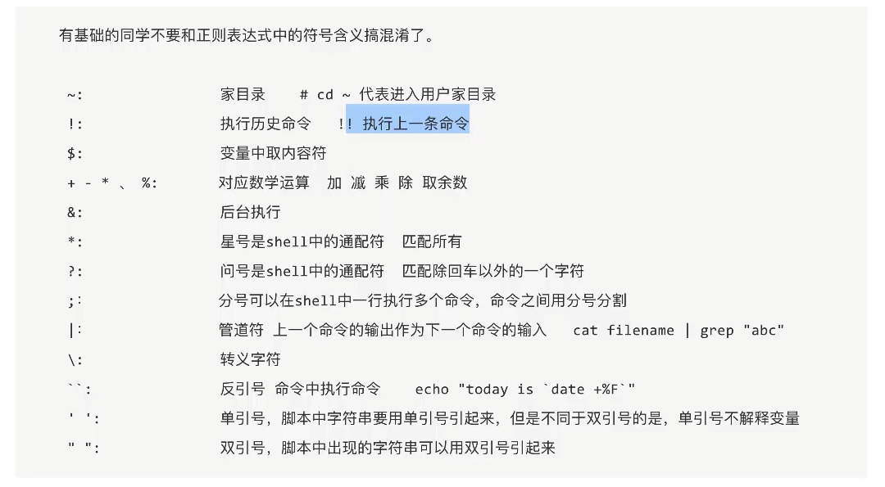
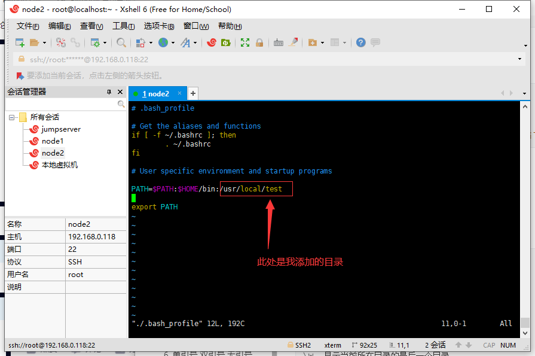
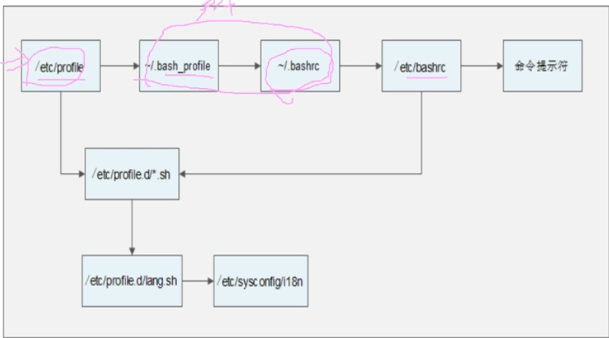
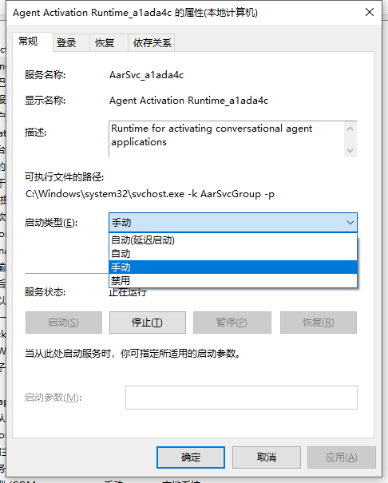

目前知道，只有中括号内部两边必须加空格

赋值语言不能有空格

（（））计算符中间可以随便加空格：((foo   = 1   +2))这样他妈的都能计算成功

((foo='1'  +4))这样也行，计算运行命令，会将其他类型的数字型数据强制转换数字类型

当在（（））引用变量的时候，变量名可以不加$,感觉这鸡巴玩意跟linux的语言格格不入啊，想其他语言写的，多半是C写的


　shell script:

　　有两种方法执行shell scripts，一种是新产生一个shell，然后执行相应的shell scripts;一种是在当前shell下执行，不

再启用其他shell。

　　新产生一个shell然后再执行scripts的方法是在scripts文件开头加入以下语句

　　#!/bin/sh

　　一般的script文件(.sh)即是这种用法。这种方法先启用新的sub-shell(新的子进程),然后在其下执行命令。

　　另外一种方法就是上面说过的source命令，不再产生新的shell，而在当前shell下执行一切命令。

　　source:

　　source命令即点(.)命令。


## 文本处理工具


```HTML
<td> 是table data cell 的缩写，单元格

<tr> 是table row 的缩写，表格中的一行

<th> 是table header cell 的缩写，表头单元格
 
colspan=2 是合并列2列，
    
rowspan=3 是合并3行
    
align="center"	剧中
```


**权限**

```bash
file    		r:cat/more/less/tail/head
				w:vim
				x:bash

dictionary		r:ls, ll
				w:touch rm
				x:cd, 文件没有执行权限，你进都进不去
				
r=4 w=2 x=1
所以 chmod 755 file  中的
7 等于 rwx=4 + 2 + 1 这是拥有者的权限
5 等于 r-x=4 + 0 + 1 这是组的权限
5 等于 r-x=4 + 0 + 1 这是其他人的权限
```


#### 黑洞文件

> - ​	用来将一些不需要的输出的数据，重定向到黑洞当中

> - ​	`/dev/null`


## 1. grep 工具

> **grep是<span style='color:blue'>行</span>过滤工具；用于根据关键字进行过滤,egrep就是grep -E,比grep更加强大**	

**\\{n, m\\}**

<span>这里的匹配次数这玩意跟python的不一样，大括号必须加转义字符，才代表多次，不加转义字符，就表示匹配大括号。跟python刚好相反</span>

🔺在用grep的时候我们经历使用单引号代表原始字符，跟python的r''一样


```bash
grep 'a*' test.txt
```

**上面这个是没有意义的，当*等于0的时候，表示匹配了一个空字符，空字符无处不在，所以上面代表匹配所有行。没有意义啊**


linux和python中空格就是 键盘上的 space,不要和\b\v\t\n混为一坛，space是一个字符，完全可以使用的

```bash
egrep '^ +' test.sh
#表示匹配所有以一个或多个空格开头的行
```


> ​	技巧
>
> - -v 是取反

我们可以grep 'xxxx' | grep -v 'yyyy'

**我们可以使用上面这种方式,把xxxx查询到的数据中,取yyyy查询到的数据行的反义,达到筛选的目的**


## 2. Vim命令

命令格式[operation] [motion] ，操作 + 动作 

| vim 模式   | 快捷键                     | 作用                                      | 备注                                  |
| ---------- | -------------------------- | ----------------------------------------- | ------------------------------------- |
| 普通模式   | x                          | 删除当前光标下的字符                      |                                       |
| 普通模式   | dd                         | 剪切一整行，单不进入insert模式            |                                       |
| 普通模式   | d3→                        | 剪切右边3个字符                           |                                       |
| 普通模式   | p(小写)                    | 粘贴                                      | 在光标后面粘贴                        |
| 普通模式   | P(大写)                    | 粘贴                                      | 在光标前面粘贴                        |
| 普通模式   | shift+a                    | 在行的末尾添加                            | a->append                             |
| 普通模式   | y3→                        | 复杂我光标往右3个字符                     |                                       |
| 普通模式   | yi + w                     | 复制整个单词                              | 复杂 in word，复制这个单词            |
| 普通模式   | yi + "                     | 复制整个引号中的字符                      | yank 复制                             |
| 普通模式   | yy                         | 复制整行                                  |                                       |
| 命令行模式 | set nu                     | 显示行号                                  |                                       |
| 命令行模式 | set nu!                    | 删除行号                                  |                                       |
| 普通模式   | u                          | 回退上一步操作                            |                                       |
| 普通模式   | w                          | 移动关闭到下一个词，光标放在词前面        |                                       |
| 普通模式   | e                          | 移动光标到下一个词,   光标放在词后面      |                                       |
| 普通模式   | c                          | 剪切并进入insert模式                      | change                                |
| 普通模式   | ci + " 或者 ci+w           | 改变                                      | change, 改变引号内得字符，改变        |
| 普通模式   | o                          | 光标移动到下一行                          |                                       |
| 普通模式   | v                          | 进入视图模式                              | 就是相当于鼠标左键按按住选中          |
| 命令行模式 | :%!python     -m json.tool | 使用python格式化JSON字符串                |                                       |
| 普通模式   | 0 (number 0) / home        | 跳转行首                                  |                                       |
| 普通模式   | shift+$ / end              | 跳转行尾                                  |                                       |
| 普通模式   | gg                         | 跳转到文本得最前面一行的首字母            |                                       |
| 普通模式   | G                          | 跳转到文本的最后一行的首字母              |                                       |
| 普通模式   | f + 单字符                 | 光标移动到当前行的 ”字符处“，从最近开始找 | 一般我们home一样，然后开始find        |
| 普通模式   | a                          | 在光标后面insert                          |                                       |
| 普通模式   | shift + a                  | 在行的末尾insert                          | a->append                             |
| 普通模式   | i                          | 在光标前面插入                            | i ->insert                            |
| 普通模式   | number + ↓                 | 下几行                                    |                                       |
| 普通模式   | number + ↑                 | 上几行                                    |                                       |
| 普通模式   | /字符                      | 搜索字符                                  | 太会全部高亮，这个时候可以:nohlsearch |
| 普通模式   | ctrl + f                   | 向下翻整页                                |                                       |
| 普通模式   | ctrl + b                   | 向上翻整页                                |                                       |
| 普通模式   | zz                         | 让光标所在的行居屏幕中间                  |                                       |
| 普通模式   | zt                         | 让光标所杂的行居屏幕最上一行              | t == top                              |
| 普通模式   | zb                         | 让光标所杂的行居屏幕最下行                | b == bottom                           |


#### chmod number(命令号) 文件名 给定执行权限 

chmod 755 文件名称

```bash
r=4 w=2 x=1
所以 chmod 755 file  中的
7 等于 rwx=4 + 2 + 1 这是拥有者的权限
5 等于 r-x=4 + 0 + 1 这是组的权限
5 等于 r-x=4 + 0 + 1 这是其他人的权限
```


**快捷键**

| 快捷键   | 作用      | 备注            |
| -------- | --------- | --------------- |
| ctrl + l | linux清屏 | 相当于命令clear |


**bash内置命令查看帮助时使用 man +  命令**


## 3. shell中的特殊符号




**3.0 &**

> ​	**后台执行**

```bash
find /root -name hello.sh &

#使用find命令在root目录下查找hello.sh文件
```


##### 3.1 解释 $，

```bash
#在linux系统启动的时候有很多变量名，比如USER SHELLS是系统级别全局变量,我们可以通过echo $USER 在脚本中引用这个全局变量，并打印出来
echo $USER
echo $SHELLS
```


##### 3.2 单双引号

> ​	单元只返回原始字符，双引号中还可以执行其他命令，单引号用于保留字符的字面含义，各种特	殊字符在单引号里面，都会变为普通字符，比如星号（ *）、美元符号 （ $ ）、反斜杠（ \ ）	    等。 
>
> ​    🔺一定搞清楚哈，这里是单双引号，不TM是``这个玩意

```bash
echo "$USER"
>root

echo '$USER'
>$USER
```


##### 3.3 `` ，在命令中执行命令

```bash
echo `ll`
echo `ls`
echo `ps`
```


##### 3.4 ${} 和 $ 取变量值


##### 3.4 shell的重定向

###### llinux中的三种IO设备：

1. 标准输入（STDIN）,文件描述符号为：0，默认从键盘获取输入
2. 标准输出（STDOUT）,文件描述符号位：1，默认输出到显示终端
3. 标准错误（STDERR）,文件描述符号为：2，默认输出到显示终端

##### IO重定向是为了改变默认输入、输出的位置：

###### 

###### 输出：下面不输出到终端了，输出到文件中

```bash
echo hehe > ./test.txt  等价于 echo hehe 1> ./test.txt
# 将hehe 覆盖输入到text.txt文件中

echo hehe >> ./test.txt 等价于 echo hehe 1>> ./test.txt
#正确输出的换行追加输入

cat a.txt >> ./test.txt
#讲cat a.txt正确输出结果追加输入到test.txt中

```

> ​	**前面可以加上文件描述符号，代表是正确输出还是错误输出**


<table border=2>
    <th colspan='3' align='center'>详细信息</th>
    <tr>
        <td>类型</td>
        <td>符号</td>
        <td>作用</td>
    </tr>
    <tr>
    	<td rowspan='2'>标准正确输出重定向</td>
    	<td>命令 > 文件</td>
    	<td>覆盖正确输出重构定向</td>
    </tr>
    <tr>
    	<td>命令 >> 文件</td>
    	<td>追加正确输出重定向</td>
    </tr>
    <tr>
    	<td rowspan='2'>标准错误输出重定向</td>
        <td>命令 2> 文件</td>
        <td>以覆盖的方式将错误的输出重定向到文件</td>
    </tr>
    <tr>
    	<td>命令 2>> 文件</td>
        <td>以追加的方式将错误的输出重定向到文件</td>
    </tr>
    <tr>
    	<td rowspan='5'>正确输出和错误输出同时保存</td>
    	<td>命令>文件 2>&1 </td>
    	<td>以覆盖的方式将正确和错误的输出都保持到同一个文件中</td>
    </tr>
    <tr>
    	<td>命令>>文件 2>&1</td>
    	<td>以追加的方式将正确和错误的输出都保持到同一个文件中</td>
    </tr>
    <tr>
    	<td>命令&>文件</td>
    	<td>以覆盖的方式将正确和错误的输出都保持到同一个文件中</td>
    </tr>
    <tr>
    	<td>命令&>>文件</td>
        <td>以追加的方式将正确和错误的输出都保持到同一个文件中</td>
    </tr>
    <tr>
    	<td>命令>>文件one 2>>文件two</td>
    	<td>把正确的输出追加到文件1，把错误的追加到文件2中</td>
    </tr>
</table>


##### history 查看所有历史记录命令，配合 !命令号 再次执行， ！！表示执行上次一次命令

```bash
#!!执行上一条命令

#! + 命令id号， 执行指定历史命令
!1000 #去执行命令ID号为1000的命令, 命令ID号通过history去查看
```


## 4. shell中的语法规范

**Shell 接收到用户输入的命令以后，会根据空格将用户的输入，拆分成个个词元（token）。然后，Shell 会扩 展词元里面的特殊字符，扩展完成后才会调用相应的命令**

**Bash 是先进行扩展，再执行命令。因此，扩展的结果是由 Bash 解释器负责的，与所要执行的命令无关。命令本身并不存 在参数扩展，收到什么参数就原样执行。这点务必需要记住。**


##### 4.1 文件解释

```bash
#第一种
#!/bin/bash

#第二种
#!/bin/bash/env bash|python|java|perl
```


##### 4.2 	执行sh的三种方法

**前置条件：当前文件中存在一个test.sh文件**

```bash
#1 给执行权限以后执行运行
chmod 700 test.sh
./test.sh

#2 使用解释器直接运行，这个无所谓执行不执行权限,但是如果在脚本要引用外面的变量自定义的变量，就需要使用export命令来指定一下
bash test.sh

#3 source 方法，这个方法，shell脚本可以调用外部的环境变量
source test.sh
```


#### 4.3	 空格

**bash使用空格和Tab来区分不同的参数,如果参数间存在多个空格，bash会自动忽略多余的空格**

```bash
echo a      b
>a b
```


#### 4.4	命令的组合符号&&或|| 和分号(;)

**除了分号（；），bash还提供了两个命令组合符号$$ 和 ||，允许更好的控制多个命令之间的继发关系**


```bash
1. command1 && command2
```

**如果<span style='color:red'>Command1</span>命令返回的状态码为0，就继续运行<span style='color:red'>Command2</span>，如果第一个就失败了或未执行或者状态码不为0，那后面的也不会执行**


```bash
1. command1 || command2
```


**如果<span style='color:red'>Command1</span>命令运行失败了（失败包括命令错误和未执行，返回值的状态码不为0），就运行<span style='color:red'>Command2</span>，如果第一个成功了，那后面的也不会执行**


```bash
1. command1;command2
```

**分号(;)是命令的结束符，使得一行可以放置多个命令，上一个命令执行结束后，再执行第二个命令,不管前面的是否执行成功，都会执行后面的command2**


🔺 **&& 前一条命令返回的状态码为0，后一条命令才会执行, ||前一条命令不正确执行或者状态码不为0，后面一条命令才会执行,他们是其实是通过$?（去上一次命令的返回值）来判断前一条命令是否正确执行**


**组合用法**

```bash
ls && echo yes || echo no
#判断结构是： ||是根据前面的echo yes是否执行来判断的，如果echo yes执行了，那么echo no就不执行了，反之
```


****


## 5. bash 的扩展模式


#### 通配符扩展和其他扩展


**Shell 接收到用户输入的命令以后，会根据空格将用户的输入，拆分成个个词元（token）。然后，Shell 会扩 展词元里面的特殊字符，扩展完成后才会调用相应的命令**

**Bash 是先进行扩展，再执行命令。因此，扩展的结果是由 Bash 解释器负责的，与所要执行的命令无关。命令本身并不存 在参数扩展，收到什么参数就原样执行。这点务必需要记住。** 

> ​	 详细信息查看阮一峰的脚本教程简介

**<span style='color:red'>前四个和后四个还是有区别， 前面四个是通配符，他们用于匹配路径的，不能放到引号当中(双引号和单引号)，后面四个扩展，可用于匹配字符、变量、命令的</span>>**

1. 波浪线扩展   路径扩展，只能在无符号字符中

2. ? 字符扩展    路径扩展，只能在无符号字符中

3. \*  字符扩展   路径扩展，只能在无符号字符中

5. 方括号扩展     路径扩展，只能在无符号字符中，能找到文件就扩展，不然保持原样

6. 大括号扩展     不是文件名扩展。它会扩展成所有给定的值，而不管是否有对应的文件存在，但是必须在<span style='color:blue'>无括号下进行</span>

7. 变量扩展      

8. 子命令扩展 

9. 算术扩展 


## 6. 单引号 双引号 无引号

**单引号**

可以说是**所见即所得**：即将单引号内的内容原样输出，或者描述为单引号里面看到的是什么就会输出什么。

**双引号**

特殊符号，有了原本的特殊意思，$LANG $() ``  支持6.7.8 通配符

把双引号内的内容输出出来；如果内容中有命令、变量等，会先把变量、命令解析出结果，然后在输出最终内容来。

双引号内命令或变量的写法为 `命令或变量`或$(命令或变量)。

**无引号**

  与双引号类似，**但是它支持通配符**。

 把内容输出出来，可能不会将含有空格的字符串视为一个整体输出, 如果内容中有命令、变量等，会先把变量、命令解析出结果，然后在输出最终内容来，如果字符串中带有空格等特殊字符，则不能完整的输出，需要改加双引号，一般连续的字符串，数字，路径等可以用，不过最好用双引号替代之


https://blog.csdn.net/yychuyu/article/details/107621280?ops_request_misc=%257B%2522request%255Fid%2522%253A%2522161858327016780269833519%2522%252C%2522scm%2522%253A%252220140713.130102334..%2522%257D&request_id=161858327016780269833519&biz_id=0&utm_medium=distribute.pc_search_result.none-task-blog-2~all~top_positive~default-1-107621280.first_rank_v2_pc_rank_v29&utm_term=linux%E9%87%8D%E5%AE%9A%E5%90%91


https://blog.csdn.net/huanjinghui/article/details/103743719


https://blog.csdn.net/u013008795/article/details/88697577?ops_request_misc=%257B%2522request%255Fid%2522%253A%2522161842977416780265450568%2522%252C%2522scm%2522%253A%252220140713.130102334..%2522%257D&request_id=161842977416780265450568&biz_id=0&utm_medium=distribute.pc_search_result.none-task-blog-2~all~sobaiduend~default-1-88697577.first_rank_v2_pc_rank_v29&utm_term=LInux%E7%9A%84%E9%87%8D%E5%AE%9A%E5%90%91


## 7. 变量

#### 前言

```HTML
在linux系统中，变量默认的类型都是字符串型，如果要进行数值运算，则必须指定变量类型为数值型
```

- **等号左右两侧不能有空格**
- **变量值如果有空格，需要使用单引号或双引号把他变成一个整体**

```bash
1. a=abc cde #在linux中使用空格表示，命令 选项 参数的分割，所有a=abc cde表示两个命令，a=abc赋值命令，然后还有一个cde命令，就报错了
+ a=abc
+ cdf
-bash: cdf: command not found

```


- **变量值中可以使用\\来转义**
- **如果需要增加变量的值，那么可以进行变量值的叠加（感觉像拼接）。不过变量需要用双引号包含如"$变量名" ，如果不想用双引号可以使用 $(变量名)包含**

```bash
aa=123
bb="$aa"456
echo $bb
>123456
#或者
aa=123
bb=$aa456
echo $bb
```


#### 7.1 创建变量

**Shell 接收到用户输入的命令以后，会根据空格将用户的输入，拆分成个个词元（token）。然后，Shell 会扩 展词元里面的特殊字符，扩展完成后才会调用相应的命令**

**Bash 是先进行扩展，再执行命令。因此，扩展的结果是由 Bash 解释器负责的，与所要执行的命令无关。命令本身并不存 在参数扩展，收到什么参数就原样执行。这点务必需要记住。**

> ​	export  NAME=value
>
> 或者
>
> ​	NAME=value
>
> ​	export NAME


**🔺由于linux是根据空格来拆分词元的，所有我们在赋值的时候不能像python一样，变量和赋值之间随意用空格，例子如下**

```bash
1. a= 'date' 
2. echo $time
--------------------

```

`date +%F    date +%Y-%m-%d%H%M%S`

🔺建议：我们单个字符不使用引号，多个字符的时候用双引号


#### **7.2	变量扩展**

##### **bash 将美元符号 <span style='color:red'>$</span>开头的词视为变量，将其扩展成变量值**

```bash
echo $SHELL
>/bin/bash
```


##### **变量名除了放在美元符号后面，也可以放到${}里面**

```bash
echo ${SHELL}
>/bin/bash
```

**<span style='color:red'>${!string*}或者${!string@}</span>返回所有匹配给定的字符串`string`的变量名**

```bash
echo "${!U*}"	# 匹配所有以U开头的变量名
[root@iZ8vbjbq1n4ejerpoqat7zZ src]# echo "${!U*}"
UID USER
```


#### **7.3	参看变量和删除变量**

##### **set**

```bash
set
```

> ​	**上面的命令将查看所有的变量包括系统变量、环境变量和我们自定义的变量等等**


##### **unset name 删除变量**

```bash
a="123"
unset a
echo $a
>输出空
```


#### 7.4	自定义设置环境变量

##### **export**

> **申明一个变量为环境变量**

```bash
export name="zhangmingzhu"
#或者
name="zhangmingzhu"
export name


#环境变量是可以在子shell中进行直接调用的
bash
echo ${name}

#删除变量还是使用unset name
```


##### **env**

> ​	**查看环境变量**

```bash
#env 只查看环境变量
env

#set 是查看所有变量
set
```


#### 7.5	PAHT 和 PSI 环境变量


##### **PATH**

> ​	**他是系统查找命令的路径,格式如下**

`PATH=/usr/local/sbin:/usr/local/bin:/usr/sbin:/usr/bin:/root/bin`

**解释:我们执行的命令基本都在sbin和bin目录下,所有我们才可以直接执行ll,pwd这些命令.如果我们要让我们写的程序也可以直接运行(不使用绝对路径或者相对路径),首先我给你写一个脚本,然后chmod 755 script_name, 然后将这个文件放到/usr/local/bin目录下,这个时候我们也可以直接执行了**

```bash
#前置条件:在/urs/local/test 中存在一个脚本hello.sh,脚本内容为echo 'hello world!'

#给定执行权限
chmod 755 hello.sh

#移动到/usr/bin目录下
mv hello.sh /usr/local

# 在/usr/local/test中直接执行

hello.sh
> hello world!
```


##### **修改环境变量PAT**

> ​	**由于PATH已经是环境变量了,所有我们没有必要使用export进行申明了**

```bash
#修改环境变量, 下面这种修改时临时生效的,重新启动Xshell连接虚拟机以后就失效了
PATH=${PATH}:/usr/local/test
```


##### **永久生效环境变量**

```bash
#进入到home 加目录下
1. cd ~

#vim ./.bash_profille 进入到隐藏文件.bash_profile中，代码如下
2. vim ./.bash_profile
```




```bash
#重新运行.bash_profile这个环境变量脚本文件
source ./.bash_profile #使用source，因为source可以读取环境和系统变量
```


##### **PS1**

> ​	定义系统提示符变量

```bash
\d	显示日期, 显示格式为"星期 月 日"
\h	显示主机名,如默认主机名 "localhost"
\t	显示24小时制时间,显示格式为 "HH:MM:SS"
\T	显示12小时制时间,显示格式为 "HH:MM"
\A	显示24小时制时间,显示格式为  "HH:MM"
\u	显示当前用户名
\w	显示当前所在目录的完整名称
\W	显示当前所在目录的最后一个目录
\#	执行第几个命令
\S	提示符号,如果是root用户会显示提示符为'#',如果是普通用户会显示提示符为'$'
```


#### 7.6 位置参数变量

> ​	**主要是为了接收我们用户对我们这个脚本传入的值**

| 位置参数变量          | 作用                                                         | 举例 |
| --------------------- | ------------------------------------------------------------ | ---- |
| $n                    | n为数字，$0代表命令本身即脚本名，$1-9代表第一个到第九个参数，十以上的参数需要用大括号包含，如${10} |      |
| $*                    | 这个变量代表命令行中所有的参数，$*把所有参数看成一个整体.在for循环中"$\*"表示一个整体,$\*表示多个词元 |      |
| $@                    | 这个变量也代表命令行中所有参数，不过$@把每一个参数区分对待.在for循环中"$@"表示多个词元,$@也表示多个词元 |      |
| $#                    | 这个变量代表命令行中所有参数的个数                           |      |
| ${varname:-word}      | varname存在且不为空,则返回varname变量的值,否则返回word       |      |
| ${varname:?"message"} | varname存在且不会为空,则返回varname变量的值,否则打印message的值并中断程序退出.如果message省略则输出默认的信息"parameter null or not set".他的目的是防止变量未定义 |      |
| ${varname:=word}      | varname存在且不为空,则返回varname变量的值,否则返回word,并把word赋值给varname. |      |
| ${varname:+word}      | varname存在且不为空,则返回word的值,否则返回空                |      |
| ${n:?"message"}       | 在脚本中,我们可以使用n(数字来表示传入的参数),如果参数存在且不为空,返回参数n的值,否则中断程序,打印message |      |

```bash
#!/bin/bash
num1=${1:?"没有传入数字1"}
num2=${2:?"没有传入数字2"}
num3=$(( $num1+$num2 ))
echo $num3

#上面这个脚本在没有传入参数的是否会报错,给出提示
```


> ​	**前四个的例子**

**例子1:**

 `1.创建一个名为canshu.sh的脚本`

`2. 脚本内容如下`

```bash
#!/bin/bash/env bash|sh
echo "脚本本身: ${0}"
echo "第一个参数:"$1    #打印第一个参数
echo "第二个参数:"$2    #打印第二个参数
echo "第三个参数:"$3    #打印第三个参数
echo "第四个参数:"$4    #打印第四个参数
echo "全部参数:"$*      #打印所有参数
echo "一共有多少个参数:"$#
```

`3.执行命令如下`

```bash
bash canshu1.sh
```

`4.执行结果如下`

```bash
脚本本身: canshu1.sh
第一个参数:11
第二个参数:22
第三个参数:33
第四个参数:44
全部参数:11 22 33 44
一共有多少个参数:4
```


> ​	后四个特殊语法，跟变量的默认值有关，目的是保证变量是否存在。在linux系统中空值也是也是一个数据，如果空值赋值给一个变量，那么这个辅助也是成立的
>
> ​	加：表示空值也算不存在，不加:表示空值也算存在,所以下面的扩展首先看有无：，然后判断varname是否存在，存在怎么样，不存在怎么样

##### **扩展**


```bash
1.${varname:-word}
```

**上面的语法含义是，如果变量varname值存在且不为空时，返回他的变量值，反之返回word。**

```bash
1.${varname-word}
```

**上面的语法含义是，如果变量varname不存在返回word，如果varname为空时，返回空值,varname存在且不为空时，返回varname**


```bash
${varname:?message}
```

**上面语法的含义是，如果变量varname存在且不为空，则返回他的值，否则<span style='color:red'>打印出</span>message的值<span style='color:red'>并中断加脚本的执行</span>，如果message省略则输出默认的信息"parameter null or not set".他的目的是防止变量未定义**


```bash
2.${varname:=word}
```

**上面的语法含义是，如果变量 varname值存在且不为空时，返回他的变量值，否则返回word，并将varname的值设定为word**


```bash
${varname:+word}
```

**上面的语法含义是，如果变量varname值存在且不为空时，返回word，否则返回空值。他的目的是测试变量是否存在，比如${count:+1},表示变量count存在时返回1，否则返回空值**


**<span style='color:red'>上面四种语法如果用在脚本中，变量名的部分可以用到数字1到9，表示脚本的参数</span>>**

```bash
filename=${1:?"filename missing"}
```

**上面的代码出现在脚本中，1 表示脚本的第一个参数。如果该参数不存在，就退出脚本并报错**


#### 7.7	预定义变量

> ​	**预定义变量是特殊的位置参数**

##### **（1） $?** 

 **<span style='color:red'>$? </span>为上一个命令的退出码,用来判断上一个命令是否执行成功。执行成功返回值是 0 ，执行失败返回非 0，有的命令没有返回码**

```bash
ls ddasdasdad
echo $?
>2
```

##### **（2） $$** 

 **<span style='color:red'>$ $</span>返回当前shell的进程ID**

```bash
echo $$
>37403
```

还可以用来命令临时文件

```
LOGFILE=/tmp/output_log.$$
```

#####   **(3) $!**

<span style='color:red'>**查看后台最后运行的程序的进程ID**</span>


## 8.	数值运算和运算符

**首先看一个例子**

```bash
aa=11
bb=22
cc=$aa+$bb
echo $cc

>>>11+22
```

> **因为在linux中默认数据都是字符型,所以才会有上面的结果**


#### 8.1	declare

> **申明一个变量的类型**
>
> - \-     **给变量设定类型属性**
> - \+    **取消变量的类型属性**
> - -i    **将变量声明为整数型**
> - -x   **将变量声明为环境变量**
> - -p   **显示指定变量的被声明的类型**

```bash
aa=11
bb=22
declare -i cc
cc=$aa+$bb
echo cc
>>>33

declare -p cc
>>>declare -i cc="33"

declare +i cc
declare -p cc
>>>declare -- cc="33"
```

`**上面将cc申明成了的整形变量以后,就可以进行加法了**`


#### 8.2	(())计算命令,整数运算

> ​	**(())是一个<span style='color:red'>命令</span>，$(())是取他的运算结果值**


**<span style='color:red'>((...))</span> 语法可以进行整数的算术运算**

```bash
((foo=5+5))
echo $foo
>>10

-------------------------------------------------
aa=11
bb=22
((foo=$aa+$bb))
echo $foo
>>333
```

> ​	**🔺上面这样就不用上面的declare进行申明了，还可以直接赋值比如((foo=$aa+$bb)),多方便,我们以后就用这种,🔺而且在(())调用变量可以不用$,直接使用 比如((foo=aa+bb))**
>
> ​	**🔺注意了, (())运算命令是没有返回值的,我们怎么拿到计算结果呢?, 我们使用$(())来获取结果,也可以使用上面的方面,在里面使用一个变量来接收结果**


**🔺加减乘除还有&&(与)和||(或)!(非)都是算数运算符,都要放到运行格式中去**

> - ​	== 和 !=
> -    && 逻辑或
> -    || 逻辑与
> -   & 按位与
>
> **🔺🔺在linux中，&&和|| 只返回1 或者 0 即真或假，跟python还不一样**


## 9.	环境变量配置文件


##### source**命令**

> ​	使配置文件立即生效,  我们也可以通过重启机器使配置文件生效
>
> - source 配置文件 🔺注意了
> - . 配置文件


##### 五类配置文件

> - /etc/profile
> - /etc/profile.d/*.sh
> - /etc/bashrc
> - ~/.bash_profile
> - ~/.bashrc

**🔺noted:只要是保存在etc目录下的配置文件,都是对所有登录linux系统的用户都生效**

**对于保存在家目录下的配置文件只对当前用户生效,比如我在root权限下修改了家目录下的配置文件,这个时候只对root生效**


**调用顺序**




## 10	命令别名

> ​	**Linux中命令赋值和变量赋值是强行分开的**


#### 10.1	命令别名 or 命令赋值

`alias 别名='原命令'`

> ​	**下面看看官方的命名样式**

```bash
vim /root/.bashrc

alias rm='rm -i'
alias cp='cp -i'
alias mv='mv -i'

# Source global definitions
if [ -f /etc/bashrc ]; then
        . /etc/bashrc
fi

```


#### **通过别名来调用命令**

> ​	**在bash中断中调用时，直接输入别名名字**

```bash
alias a='ll'
a
```


> ​	**在脚本中他可以能独自成行使用的,只能别人引用,别名就是用来引用的,不是用来直接调用的,直接调用你还是完整的自己写**

下面有一个脚本

```bash
#!/bin/bash
alias a='ll'
a
```

我们执行的时候他是会报错的.我们只能在其他命令当中进行引用比如:`echo $(a)`


> ​	**在脚本中调用**

下面有一个脚本

```bash
#!/bin/bash
alias wocao='pwd'
wocao
```

**这个脚本使用bash+脚本名会说命令不存在,使用sh+脚本名 和 source+脚本就可以,其中使用source+脚本名执行以后,我在脚本外面也可以使用,我勒个操了**


> ​	**unalias 删除别名**

```
alias a='ll'
unalias a
```


## 12 字符截取命令cut awk sed


#### cut [选项] 文件名

> ​	grep是在文件中,提取符合条件的行,cut提取符合条件的列
>
> ​	cut是一个字段字段的提取

> ​	**选项**
>
> - -f	序号:		提取第几列
> - -d   分隔符:    按照指定分隔符分割列

> ​	注意点
>
> - cut的默认分隔符是制表符tab键
>
> - cut对于不对称的分割，不适用，比如一列是7个空格，1列是2个，再一列是11个。你就没办法了
>
>   


```bash
[root@localhost test]# ll
total 52
-rw-r--r--. 1 root root  19 Apr 23 21:36 awk_test.txt
-rw-r--r--. 1 root root  63 Apr 24 12:10 bieming.sh
-rw-r--r--. 1 root root 134 Apr 24 11:44 case_test.sh
-rw-r--r--. 1 root root  44 Apr 21 23:39 cut1.sh
-rwx------. 1 root root 491 Apr 24 08:40 dbbeifen.sh
-rwxr-xr-x. 1 root root 218 Apr 23 03:22 disk_use.sh
drwxr-xr-x. 3 root root 225 Apr 24 21:56 Japan
[root@localhost test]# ll|cut -d " " -f5


134

491
218
225
#为什么会输出这个玩意呢，那是因为有些地方是一个空格，有些地方是两个空格，导致的


```


#### **printf '输出类型输出格式'  输出内容**

> ​	输出类型
>
> - %ns:	 输出字符串。n是数字指代输出几个字符，比如'%s %s %s'
> - %ni:      输出整数。n是数字指代输出几个数字
> - %m,nf:  输出浮点数。m和n是数字，指代输出的整数位数和小数位数。如%8.2f代表输出9位数，其中6位是整数，2位是小数

> ​	输出格式
>
> - \n:		换行
> - \t          回车，也就是enter
> - \t          水平输出退格键，也就是tab键位

> ​	注意
>
> - 它不能通过管道符或传入文件方式来添加输入
> - 它只能通过$()在命令中执行子命令或者手动输入数据的方式传入数据
> - <span style='color:red'>printf会根据空格和制表符将一个个字符或者字符串拆分成一个个字符，比如ab 1 2这一串数据，ab是一个字符，1，2分别是一个字符</span>
> - 源文件中存在多行数据的时候，忽略换行符
> - <span style='color:red'>输出类型中的n代表几个连写，如''%s %s %s %s'千万别写成'%4s'</span>
> - <span style='color:red'>多个输出类型必须用单引号括起来</span>
> - <span style='color:red'>'%s  %s'表示两个字符为一组，且两个字符中间用空格分开</span>
> - 多个输出类型代表按几个字符或者整数位一个整体进行输出
> - 输出格式代表，每一组输出完毕以后以什么结束
> - 每一个%s后面也可以添加输出格式，比如%s\t,就是每一个字符后面加一个tab制表符

```bash
printf '%s %s\n' $(cat test.txt)
#代表以2个字符为一组两个字符之间用空格分割，以换行符结束进行输出

```


🔺在awk命令的输出中支持print和printf命令

> - ​	print: print 会在每个输出之后自动加入一个换行符号（Linux默认没有print命令，但是awk中有，哈哈）
> - ​    printf：printf是标准格式的输出命令，并不会自动加入换行符，如需要换行，需要自己手动加入换行符（awk中可以使用）


#### awk ‘条件1 {动作1} 条件2 {动作2}...’ 文件名

> ​	**如果条件1符合执行动作1，如果条件2符合执行动作2**

```bash
cat sop-lite.access.log |awk -F 'time' '{print $2}'|awk -F '-' '{print $2}'|awk -F '?' '{print $1}'|sort -n -r|uniq -c
```

> **条件(Pattern):**
>
> ​	一般使用关系表达式作为条件如一下
>
> - ​	x>10		判断变量x是否大于10
> - ​    x>=10      大于等于
> - ​    x<=10      小于等于

> ​	**动作(Action)**
>
> -    格式化输出{printf $s "\t" $s "\n"},这里面使用双引号，因为外面使用了单引号，awk是一门语言了，它遵循外单内双，且这里的$s 和 \t 都有空格
> -    流程控制语句
> -    {FS=":"}, FS动作是进行分割，改变默认分割规则

> ​	**注意点**
>
> - `awk`通过空格和制表符将每一行拆分成不同的列，printf也是根据空格和制表符来分割，直到遇见下一个字符
> - `awk`的已经是一门语言了（好像是python写的），这玩意啊，我们要严格遵循外单内双，尤其是print这些玩意，如果打印的是一串字符串，一定要加双引号，不然不给你打印了


**例子：自定义分隔符以后，首行不进行处理**

```bash
awk '{FS=":"}{printf $1 "\t" $3 "\n"}' /etc/passwd
root:x:0:0:root:/root:/bin/bash	
bin	1
daemon	2
adm	3
lp	4
sync	5

#为什么第一行没有进行处理第二行才开始处理了呢？
#首先我们要知道awk的流程是，先读入第一行数据（使用默认分隔符“空格和制表符”），然后执行动作和条件，在指定分割和执行后面的输出格式动作的时候第一行数据已经读入了，所以才没有处理，所以啊，awk这玩意，对第一行数据很不友好，但是它给我们给了一个BEGIN动作，看如下例子
```


**例子2：BEGIN解决自定义分隔符首行不处理的问题**

> - ​	BEGIN 优先执行，且只执行一次
> - ​    想在开始优先执行多个动作，可以BEGIN{动作}BEGIN{动作}
> - ​    紧跟BEGIN后面的第一个动作被认为是优先首次执行

```bash
awk 'BEGIN{FS=":"}{printf $1 "\t" $3 "\n"}' /etc/passwd
root	0
bin	1
daemon	2
adm	3
lp	4
sync	5
#这下就可以了

#多个BEGIN首次执行
awk 'BEGIN{FS=":"}BEGIN{print "这是用户信息统计"}{print $1 "\t" $3}' /etc/passwd
这是用户信息统计
root	0
bin	1
daemon	2
adm	3
lp	4
sync	5

# 加空格，条理更加清晰
awk 'BEGIN {FS=":"} BEGIN {print "这是用户信息统计"} {print $1 "\t" $3}' /etc/passwd

```


**例子3：关系表达式**

> - ​	条件只对紧跟他的动作生效

```bash
awk 'BEGIN {FS=":"} BEGIN {print "这是用户信息统计"} $3>=30&&$3<=900 {print $1 "\t" $3}' /etc/passwd

这是用户信息统计
nobody	99
systemd-network	192
dbus	81
sshd	74
postfix	89
```


#### sed [选项] '[动作]' 文件名 或者 从管道符接收流数据

> ​	**他是一个轻量级的数据流编辑器（可以在管道符后面接收数据，直接修改，不用像VIM一样，需要将命令的结果放到文件中，再通过vim进去修改。），sed主要是用来将数据进行选取、替换、删除、新增的命令**

**选项**

> - -n	一般sed命令会把所有数据都输出到屏幕，如果加入此选择，则只会把经过sed命令处理的行输出到 屏幕
> - -e     允许对输入数据应用多条sed命令编辑
> - -i      用sed的修改结果直接修改读取数据的文件，而不是由屏幕输出


**动作**

> - a \     追加，在当前行后添加一行或多行。添加多行时，除最后 一行外，每行末尾需要用 "\\"代表数据未完结。
> - c \       行替换， 用c后面的字符替换原数据行，替换多行时， 除最后一行外，每行末尾需要用“\\”代表数据未结束。
> - i \      插入， 在当前行前插入一行或多行。插入多行时， 除最后 一行外， 每行末尾需要用  “\\”代表数据未完结
> - d       删除， 删除指定行
> - p       打印， 输出指定行
> - s        字符替换， 用一个字符串替换另外一个字符串。格式为 "行范围s/旧字符串/新字符串/g"(和vim中的替换格式类似)：替换这个范围内的所有字符，🔺旧字符串支持正则表达式


**前置文件student.txt**

> - ​	都是tab作为分隔符

```bash
ID      Name    PHP     Linux   MySQL   Average
1       Liming  82      95      86      87.66
2       Sc      74      96      87      85.66
3       Gao     99      83      93      91.66
```


**例子1：查看文件第二行**

`sed '2p' student.txt 输出如下`

```bash
[root@localhost test]# sed '2p' student.txt 
ID	Name	PHP	Linux	MySQL	Average
1	Liming	82	95	86	87.66
1	Liming	82	95	86	87.66
2	Sc	74	96	87	85.66
3	Gao	99	83	93	91.66

#它不只输出了第二行，把整个文件也输出了一遍
```

`sed -n '2p' student.txt输出如下`

```bash
[root@localhost test]# sed -n '2p' student.txt 
1	Liming	82	95	86	87.66

#加上 -n 就只输出第二行
```


**例子2：删除第二行到第四行**

`sed '2,4d' student.txt`

```bash
[root@localhost test]# sed '2,4d' student.txt 
ID	Name	PHP	Linux	MySQL	Average

#从第二行开始一直删除到第四行
```


**例子3：在第二行后面追加一行，hello字符串**

`sed '2a hello' student.txt`

```bash
[root@localhost test]# sed '2a hello' student.txt 
ID	Name	PHP	Linux	MySQL	Average
1	Liming	82	95	86	87.66
hello
2	Sc	74	96	87	85.66
3	Gao	99	83	93	91.66
```


**例子4： 在第二行前面插入两行数据**

`sed '2i hello\ world' student.txt`

```bash
#!/bin/bash
sed '2i hello\
world' student.txt
```

> - ​	在脚本中，我们在'\\'后面也必须换行，不然当一行数据插入，就是在第二行前面插入hello\world这一行数据
> -    在bash终端中直接执行的时候，也需要换行，不然也当成一个整体数据


**例子5：替换第四行(替换整行)**

`sed '4c ===============================================' student.txt`

```bash
[root@localhost test]# sed '4c ===============================================' student.txt  
ID	Name	PHP	Linux	MySQL	Average
1	Liming	82	95	86	87.66
2	Sc	74	96	87	85.66
===============================================

```


**例子6：替换第四行的MySQL成绩为鸭蛋**

`sed '4s/93/鸭蛋/g' student.txt `       s前面不加行号，代表所有行

```bash
[root@localhost test]# sed '4s/93/鸭蛋/g' student.txt 
ID	Name	PHP	Linux	MySQL	Average
1	Liming	82	95	86	87.66
2	Sc	74	96	87	85.66
3	Gao	99	83	鸭蛋	91.66
```


**例子7：把所有Sc替换李毅，把所有的Gao替换成张铁柱**

`sed -e 's/Sc/李毅/g; s/Gao/张铁柱/g' student.txt`

```bash
[root@localhost test]# sed -e 's/Sc/李毅/g ; s/Gao/张铁柱/g' student.txt 
ID	Name	PHP	Linux	MySQL	Average
1	Liming	82	95	86	87.66
2	李毅	74	96	87	85.66
3	张铁柱	99	83	93	91.66
```


## 13	字符处理命令


#### sort  排序命令

#### sort [选项] 文件名或者目录命令或者通过管道符接收数据

> - ​	-f	忽略大小写
> - ​    -n   以数值型进行排序，默认使用字符串型排序
> - ​    -r    反向排序
> - ​    -t    指定分隔符，默认分隔符是制表符
> - ​    -k n[, m]    按照指定的字段范围排序。 从第n字段开始，m字段结束（默认是行尾）


**常见用法**

> - ​	sort + 文件：以每一行得首字符进行排序
> -    接收管道符得数据进行排序


**前置数据**

存在一个文件，里面得数据如下：

```bash
c1
2a
a2
1c
明
张
```


**例子1：sort +文件 排序**

`sort /usr/local/test/sort_test.txt`

```bash
[root@localhost test]# sort sort_test.txt 
1c
2a
a2
c1
张
明
```

**解释：从第一个字母开始排序，先排数字，在排字母，再排汉字**


**例子2：取反排序**

**sort -r 文件**

`sort -r /usr/local/test/sort_test.txt`

```bash
[root@localhost test]# sort -r sort_test.txt 
明
张
c1
a2
2a
1c
```


**例子3：指定分隔符为“：”， 然后用第三个字段开头，第三个字段结尾排序，就是只用第三个字段进行排序**

`sort -t ":" -k 3,3 /etc/passwd  | cut -d ':' -f 3`

```bash
[root@localhost etc]# sort -t ":" -k 3,3 /etc/passwd | cut -d ":" -f 3
0
1
11
12
14
192
2
3
4
5
6
7
74
8
#上面的cut是以sort的排序结果，按":"进行分割，然后取得第三列
#上面有一个问题啊，由于我们没有指定为数值型大小比较进行排序，所有我们是字符串型排序，导致192比2都靠前，当我们加上 -n 选项，指定按照数值型进行排序就不一样了，请看下面
```


`sort -n -t ':' -k 3,3 /etc/passwd | cut -d ':' -f 3`

```bash
[root@localhost etc]# sort -n -t ':' -k 3,3 /etc/passwd | cut -d ':' -f 3
0
1
2
3
4
5
6
7
8
11
12
14
74
81
89
99
192
```


## 14	条件判断

也是根据状态码来判断执行那一条语句；$?返回上一条命令的状态码


<table>
    <th align='center' colspan='2'>按照文件类型进行判断</th>
    <tr>
        <td align>测试选项</td>
        <td align='center'>作用</td>
    </tr>
    <tr>
        <td>[-d 文件] </td>
        <td align='center'>判断该文件是否存在，并且是否为目录文件(是目录为真)</td>
    </tr>
    <tr>
        <td>[-e 文件]</td>
        <td align='center'>判断该文件是否存在(存在为真),linux一切皆文件</td>
    </tr>
    <tr>
        <td>[-f 文件]</td>
        <td align='center'>判断该文件是否存在，并且是否为普通文件(是普通文件为真)</td>
    </tr>
</table>


​    判断文件可以使用方法2种

> - ​	test -e 文件
> - ​    [  -e 文件  ]   这种最常用，用于脚本种进行判断，中括号两边必须加空格

**注意**

> - ​	他没有返回值
> - ​    我们可以通过$?来判断上一次的判断是否正确执行,$?不是命令，跟取变量值一样
> - ​     [ -e 文件 ]这种方式，中括号两边必须加空格
> - ​    [   !       -e  文件   ]  这个玩意是可以取反的，有空格，我这里写这么多空格是为显示出来有空格


<table>
    <th align='center' colspan='2'>按照文件权限进行判断</th>
    <tr>
        <td align>测试选项</td>
        <td align='center'>作用</td>
    </tr>
    <tr>
        <td>[-r 文件] </td>
        <td align='center'>判断该文件是否存在，并且是否拥有读权限（有读权限为真）</td>
    </tr>
    <tr>
        <td>[-w 文件]</td>
        <td align='center'>判断该文件是否存在，并且是否拥有写权限（有写权限为真）</td>
    </tr>
    <tr>
        <td>[-x 文件]</td>
        <td align='center'>判断该文件是否存在，并且是否拥有执行权限（有执行权限为真）</td>
    </tr>
</table>


<table>
    <th align='center' colspan='2'>两个整数之间比较</th>
    <tr>
        <td align>测试选项</td>
        <td align='center'>作用</td>
    </tr>
    <tr>
        <td>[整数1 -eq 整数2] </td>
        <td align='center'>判断整数1是否和整数2相等（相等为真）</td>
    </tr>
    <tr>
        <td>[整数1 -ne 整数2]</td>
        <td align='center'>判断整数1是否和整数2不相等（不相等为真）</td>
    </tr>
    <tr>
        <td>[整数1 -gt 整数2]</td>
        <td align='center'>判断整数1是否大于整数2（大于为真）</td>
    </tr>
    <tr>
        <td>[整数1 -lt 整数2]</td>
        <td align='center'>判断整数1 是否小于整数2 （小于为真）</td>
    </tr>
    <tr>
        <td>[整数1 -ge 整数2]</td>
        <td align='center'>判断整数1 是否大于等于整数2 （大于等于为真）</td>
    </tr>
    <tr>
        <td>[整数1 -le 整数2]</td>
        <td align='center'>判断整数1是否小于等于整数2（小于等于为真）</td>
    </tr>
</table>
等于 、不等于、小于、不小于、大于、不大于


> - ​	后面这两种分类，我们使用 [ xx -qt yy] 这种形式


<table>
    <th align='center' colspan='2'>字符串的判断</th>
    <tr>
        <td align>测试选项</td>
        <td align='center'>作用</td>
    </tr>
    <tr>
        <td>[-z 字符串] </td>
        <td align='center'>判断字符串是否为空（为空返回为真）</td>
    </tr>
    <tr>
        <td>[-n 字符串]</td>
        <td align='center'>判断字符串是否为非空（非空返回真）</td>
    </tr>
    <tr>
        <td>[字符串1     ==     字符串2]</td>
        <td align='center'>判断字符串1和字符串2是否相等（相等为真）</td>
    </tr>
    <tr>
        <td>[字符串1      !=     字符串2]</td>
        <td align='center'> 判断字符串1和字符串2是否不相等（不相等为真）</td>
</table>


> - 字符判断好像只能使用[ ] 这种形式，使用test 格式的时候 始终返回真，待确定
> - 等号这些玩意也他妈是一个命令， 命令与命令之间使用 空格，不然就变成一个字符叠加了比如$a==$b，他是一个命令，这个命令就是字符叠加 ，最后结果是一个字符，操了如下，才是

```
[  字符串1      !=     字符串2  ]	#全尼玛是空格
[  字符串1     ==     字符串2   ]	#全尼玛是空格, 一定要加空格，一定要加空格
```


**例子：**

```bash
#!/bin/bash
a="CON"
if [ "CON" == $a ];then	# 全尼玛是空格 看着都难受，还是用这个把 if echo $a | grep 'CON';then s
        echo yes
else
        echo no
fi
```


<table>
    <th align='center' colspan='2'>正则判断</th>
    <tr>
        <td align>测试选项</td>
        <td align='center'>作用</td>
    </tr>
    <tr>
        <td>[[ 需要匹配的目标 =~ 正则表达式 ]] </td>
        <td align='center'>判断字符串是否为空（为空返回为真）</td>
    </tr>
</table>

> - ​	=~       表示采用正则判断，也是一个命令， 需要空格隔开
> -    正则表达式不能加引号（不管是单引号还是双引号），加引号以后，元字符就失效了，就变成完全的字符串进行匹配了
> -   必须完全匹配才会返回真
> -  需要匹配的目标，最好加上双引号

**例子1：正则判断**

```bash
#!/bin/bash
a=$(ls -l) #这里不能写成ll，因为ll的alias别名的使用环境是外部,为什么是外部呢？因为他是别名是系统启动的时候，调用了一个脚本，才整出的别名，这个别名属于操作系统这个项目或者程序的命令空间，而且她又没有被申明成全局的。所以我们在我们自己的脚本中无法调用外部的别名
if [[ $a =~ total.* ]];then  #total.*加引号以后，就变成一个字符了
        echo 'yes'
else
        echo 'no'

fi
```


<table>
    <th align='center' colspan='2'>其他判断</th>
    <tr>
        <td align>测试选项</td>
        <td align='center'>作用</td>
    </tr>
    <tr>
        <td>if ((3 > 2))</td>
        <td align='center'>算数判断</td>
    </tr>
    <tr>
        <td align>if ((foo=5-5))或者if ((5-5))</td>
        <td align='center'>当算数返回的是值零的时候表示false。</td>
    </tr>
    <tr>
        <td>if true</td>
        <td align='center'>特殊判断</td>
    </tr>
    <tr>
        <td>if command</td>
        <td align='center'>如果if后面的command的返回状态码为0，就会执行then里面的动作</td>
    </tr>
    <tr>
        <td>if command1;command2</td>
        <td align='center'>由于if后面跟的是命令，所以多个命令之间用分隔符分开。但是if只判断最后一个命令是否为真。哪怕前面全部失败，最后一条命令返回0，也表示真</td>
    </tr>
</table>


<table>
    <th align='center' colspan='2'>多重判断(逻辑判断)</th>
    <tr>
        <td align>测试选项</td>
        <td align='center'>作用</td>
    </tr>
    <tr>
        <td>[ 判断1 -a 判断2 ]</td>
        <td align='center'>逻辑与，判断1和判断2都成立，最终结果才为真</td>
    </tr>
    <tr>
        <td align>[ 判断1 -o 判断2 ]</td>
        <td align='center'>逻辑或</td>
    </tr>
    <tr>
        <td>[ ！判断 ]</td>
        <td align='center'>如果if后面的command的返回值为0，就会执行then里面的动作
</table>


## 15	条件语句

🔺注意， if 关键字后面是条命令（while 也一样，后面跟命令或者命令或者变量替换出来的命令），该条命令执行成功（返回值 0 ），就意味着判断条件成立，所以我们可以存在很多种判断方式

🔺如果if后面的命令返回的数值是1，但是状态码是0的话，它还是判断为真，， if true判断一定为真，因为true也是一个命令，返回状态码永远为0

🔺注意，字符串判断时（test命令），变量要放在双引号之中，比如[-n"$COUNT"]，否则变量替换成字符串以后，test或者[[]]命令可能会报错，提示参数过多。另外，如果不放在双引号之中，变量为空时，命令会变成[-n]，这时会判断为真。如果放在双引号之中，[-n""]就判断为伪。

🔺 整数判断的时候，也同上，去变量的时候，把她放到引号当中，这样安全

#### if 条件语句 - 单分支

```bash
if [ 条件表达式 ];then
	程序
fi
#或者
if [ 条件表达式 ]
	then
		程序
fi
```


**例子1:检查磁盘占用脚本**

```bash
#!/bin/bash
rate=$(df -h | egrep '/dev/map.*' | awk '{print $5}' | cut -d "%" -f1)

#上面这种切片是常用的取值方法，最后的cut是为了分割出%，是使用率变成数字

if [ $rate -eq 80 ];then
        echo "warning 磁盘要占满了，请检查"
fi

if [ $rate -lt 15 ];then
        echo "磁盘还安全的很"
fi
```


#### if 条件语句 - 多分支

```bash
if [ 条件表达式 ]
	then
		条件成立时，执行的程序
	else
		条件不成立时，执行另外一个程序
fi
```


**例子2:数据库大小统计**

```bash
#!/bin/bash
#全量数据库备份，后面整增量数据库备份

ntpdate asia.pool.ntp.org $>/dev/null
#同步系统时间，将我服务器时间与亚洲服务器时间一致

date=$(date +%y%m%d)
#把当前系统时间按照‘年月日’格式赋值给变量date

size=$(du -sh /usr/lib64/mysql)
#统计mysql数据库的大小， 并把大小赋值给size变量

echo $size
#还不知道怎么备份，我们就大于一下数据库的大小吧

```


**例子3: 数据库备份**

```bash
#!/bin/bash
"""
由于我的机器上没有安装Mysql，所以
将/etc 目录备份到 /tmp/dbback下面
"""
date=$(date +%Y%m%d)
size=$(du -sh /etc)

if [ -d /tmp/dbback ]
        then
                echo "Date is: $date" > /tmp/dbback/db.txt
                echo "size is: $size" >> /tmp/dbback/db.txt
                cd /tmp/dbback
                tar -zcf etc_$date.tar.gz /etc db.txt &> /dev/null
                rm -rf /tmp/dbback/db.txt
        else
                mkdir /tmp/dbback
                echo "Date is: $date" > /tmp/dbback/db.txt
                echo "size is: $size" >> /tmp/dbback/db.txt
                cd /tmp/dbback
                tar -zcf etc_$date.tar.gz /etc db.txt &> /dev/null
                rm -rf /tmp/dbback/db.txt

fi

```


**例子4：<span style='color:red'>判断apache是否启动</span>**

**前置需要掌握的知识:怎么判断一个服务是正常运行的**

ps命令来检查(通过检查apache进程是否存在)

> - ​	ps aux | grep 'httpd'	通过ps aux检查apache进程是否存在来判断

```bash
[root@localhost dbback]service httpd start 	#启动一下apache
[root@localhost dbback]ps aux | grep 'httpd'#检查apache进程是否存在
root      23159  0.6  0.1 224072  5036 ?        Ss   08:51   0:00 /usr/sbin/httpd -DFOREGROUND
apache    23160  0.0  0.0 224072  2952 ?        S    08:51   0:00 /usr/sbin/httpd -DFOREGROUND
apache    23161  0.0  0.0 224072  2952 ?        S    08:51   0:00 /usr/sbin/httpd -DFOREGROUND
apache    23162  0.0  0.0 224072  2952 ?        S    08:51   0:00 /usr/sbin/httpd -DFOREGROUND
apache    23163  0.0  0.0 224072  2952 ?        S    08:51   0:00 /usr/sbin/httpd -DFOREGROUND
apache    23164  0.0  0.0 224072  2952 ?        S    08:51   0:00 /usr/sbin/httpd -DFOREGROUND
root      23193  0.0  0.0 112708   976 pts/0    S+   08:51   0:00 grep --color=auto httpd	#这里的玩意不是apache的，这是grep的进程

```

ps的不足之处

> - ​	如果某些情况下，apache死机了，他的进程是存在，但是他已经不能响应了


netstat -tlnu （通过检查80端口是否存在来检查apache是正常）

```bash
[root@localhost dbback]# netstat -tlnu
Active Internet connections (only servers)
Proto Recv-Q Send-Q Local Address           Foreign Address         State      
tcp        0      0 0.0.0.0:56743           0.0.0.0:*               LISTEN     
tcp        0      0 127.0.0.1:9100          0.0.0.0:*               LISTEN          
tcp6       0      0 :::80                   :::*                    LISTEN     

```

netstat -tlnu不足之处

> - ​	同样的，在apache司机了，他的端口依然在监听，但是他可能已经不能响应了
> - ​    像nginx这些玩意也是占用的80端口


<span style='color:red'>nmap -sT 命令来扫描检查</span>

yum -y install nmap

> - ​	使用nmap命令来扫描当前计算机，并截取apache服务状态


#### if elif else

> - ​	退出代码或者脚本我们使用exit
> - ​     exit 后面可以给定状态码，比如exit 2,必须是数字哈，必须是数字哈，必须是数字
> - ​    不指定exit退出码，正确执行默认返回0

```bash
if [条件];then
	动作
elif;then
	动作
elif;then
	动作
else
	动作	
fi
#如果想在执行玩某个动作以后退出脚本，可以使用exit
```

> - ​	true 和 false 是两个特殊命令,可以直接 if true 或者 if false
> - ​     if 关键字后面也可以是条命令，该条命令执行成功（返回值 0 ），就意味着判断条件成立


#### case

**语法规则如下**

```bash
case 表达式 in
	pattern)
		动作;;
	pattern)
		动作;;
	pattern)
    	动作;;
    	  *)
    	如果都不满足，执行此动作
esac
```


**case的匹配模式可以使用各种通配符**

> - ​	`a)`			匹配 `a`
> - ​    `a|b`          匹配`a` 或者 `b`
> - ​    `[[:alpha:]]` 匹配单个字母 等价于 `[[:lower:]]|[[:upper:]]`
> - ​    `???)`         匹配3个字符的单词
> - ​    `*.txt`       匹配.txt结尾
> - ​    `*)`              匹配任意输入，通常作为case结构的最后一个模式


```bash
case "${1}" in
        [[:alpha:]])	# 单个字母 [[:alpha:]][[:alpha:]]这样表示2个字母，好蠢啊
                echo "这是一个alpha:"$1;;
        [[:digit:]])	#单个数字
                echo "这是一个digit:"$1;;
        *)
                echo "不知道这是什么鬼:"${1}a
esac 
```


## 16	循环

#### for ... in 循环

```bash
for variable in list
do
	commands
done
```

```bash
#!/bin/bash
for i in $*;do
        echo $i
done
```

运行结果

```bash
[root@iZ8vbjbq1n4ejerpoqat7zZ tmp]# demo.sh 1 2 3
1
2
3
```


**上面的语法中，`for`循环会依次从`list`列表中取出一项，跟其他语言for循环一样**

**list的取值**

> - ​	word1 word2 word3  比如：1 2 3 4 5
> - ​    🔺🔺🔺已文件内容或者命令返回值，比如cat 文件,ls等命令的返回值。但是它不是以行为单位，而是以空白字符或换行符将内容分解成一个个词元，这些词元作为list中的元素，每次循环以一个词元作为variable
> -    使用{1...100} 这种扩展语法来作为list

**for 循环支持C 语言的循环语法**

```bash
for ((i=1; i<20; i++));do
	echo $i
done
```


**例子：批量解压文件**

```bash
ls>ls.log       #将全部文件名放到ls.log当中
for i in $(cat ls.log);do
        if [[ "$i" =~ gz$ ]];then       #判断文件名是否不是gz结尾
                echo "找到压缩文件"$i
                tar -zxvf $i
        else
                continue
        fi
done
=====================================================
#上面的正则表达式可以这样玩
ls>ls.log       #将全部文件名放到ls.log当中
for i in $(cat ls.log);do
         
        if echo $i|grep '.*gz'>/dev/null;then    #它提供的正则太TM 拉跨了，还是这样玩舒服
                echo "找到压缩文件"$i
                tar -zxvf $i 
        else
                continue
        fi
done

```


****


## 17	服务分类


#### **Linux服务 **

- ​	RPM包默认安装的服务（linux系统都是RPM包安装得）
  - 独立的服务（linux系统当中绝大多服务都是独立，啥意思呢？就是服务直接就在内存当中，当有用户访问，这个服务直接响应用户，但是耗费内存资源越多）
  - 基于xinetd服务（超级守护进程）（这个服务本身是独立得，他在内存当中，它本身没有任何功能，只做管理。比如rsync服务，他是linux系统中网络备份的服务，客户想要直接访问这个服务，是没有办法的，因为rsync这个服务没有在内存里面，只能先找xinetd，然后通过xinetd来访问rsync，因为他是被xinetd管理的，当rsync要响应的时候，他是响应xinetd，xinetd响应客户。他的好处呢？就是后面这些基于xinetd的服务，不占用内存，但是响应速度比独立服务要慢一些）
- ​    源代码包安装的服务


#### 启动与自启动

**服务启动：**

- 就是在当前系统中让服务运行，并提供功能

**服务自启动：**

- 自启动是指让服务在系统开机或重启之后，随着系统的启动而启动启动的服务


**window的服务启动**




**启动状态（windows中当前服务状态）：**

- 如果服务状态这里选择了启动，代表当前服务在当前系统当中已经运行了，可以直接访问


**启动类型（windows开机启动类型）：**

- 自动：windows开机，随着系统启动，服务也自动启动
- 手动：这个服务随着开机并不会自动启动，但是当有其他的服务需要他的时候，调用它了，这个服务不需要管理员允许，它就会自动启动
- 禁用：就是不允许开机自动启动


#### 查询已安装的服务

**RPM包安装的服务**

- chkconfig  --list    (查看服务自启动状态，所以可以看到所有RPM包安装的服务，但是不代表这个服务在当前系统中已经运行了，因为它查看的是服务自启动状态啊)
  - 现在版本的centos此命令仅显示sysv服务，不包括本机系统服务。SysV配置数据可能会被本机systemd配置覆盖。如果要列出系统服务，请使用“ systemctl list-unit-files”。要查看在特定目标上启用的服务，请使用'systemctl list-dependencies [target]'。
- systemctl list-unit-files 

```bash
chkconfig --list
[root@localhost local]# chkconfig --list

Note: This output shows SysV services only and does not include native
      systemd services. SysV configuration data might be overridden by native
      systemd configuration.

      If you want to list systemd services use 'systemctl list-unit-files'.
      To see services enabled on particular target use
      'systemctl list-dependencies [target]'.

netconsole     	0:off	1:off	2:off	3:off	4:off	5:off	6:off
network        	0:off	1:off	2:on	3:on	4:on	5:on	6:off

```

0:关机	1：单用户	2：不完全多用户	3：字符界面	4：未分配	5：图形界面	6：重启 （centos7已经不行了，centos7将全面使用systemctl）

我们来看看systemctl list-unit-files

```bash
UNIT FILE                                     STATE   
proc-sys-fs-binfmt_misc.automount             static  
sys-kernel-config.mount                       static  
sys-kernel-debug.mount                        static  
tmp.mount                                     disabled
brandbot.path                                 disabled
systemd-ask-password-console.path             static  
systemd-ask-password-plymouth.path            static  
systemd-ask-password-wall.path                static  
session-2.scope                               static  
session-3.scope                               static  
arp-ethers.service                            disabled
auditd.service                                enabled 
autovt@.service                               enabled 
blk-availability.service                      disabled

```


**源代码安装的服务**

- 查看服务安装的位置，一般是/usr/local下


#### RPM安装服务和源码包安装服务的区别

**RPM**

> - ​	**rpm包不需要指定安装位置**
> - ​    **rpm包默认安装位置(这些路径是约定俗成的)**
>   - /etc/ 配置文件安装目录
>   - /usr/bin/ 可执行命令安装目录
>   - /usr/lib/ 程序所使用的函数库保存位置
>   - /usr/share/doc/ 基本的软件使用手册保存位置
>   - /usr/share/man/ 帮助文件保存位置
>   - /var/log  日志
>   - /var/lib   服务产生的数据放在这里
>   - centos7 RPM服务启动脚本放在/usr/lib/systemd/system目录下


**离线安装RPM文件**

-  rpm -ivh 安装包的名字（安装）
- rpm -e 安装包的名字（卸载）
- rpm -qa | grep 名字  （搜索所有RPM文件，这个不分离线还是在线）


**源码包**

> - ​	源码包的安装需要手动指定安装位置
> - ​    源码包一般安装在/usr/local下。
> - ​    源码包的保存位置：/usr/local/src/， 我们一般放这里
> - ​    源码包卸载，一般就是直接在/usr/local中的apache源码文件夹干掉就完事，因为linux没有任何的垃圾文件，所以的文件都在一个目录下


**安装位置不同带来的影响**

> **rpm包安装的服务可以使用系统服务管理命令**

```bash
如rpm包安装的apache启动服务的方式：
systemctl start httpd #可以使用服务管理命令
```

> **源码包安装的服务不能被服务管理命令管理，只能用绝对路径管理服务：**

```bash
如：/usr/local/apache/bin/apachectl start
```

🔺centos6RPM服务的启动脚本在/etc/int.d目录下，centos7 RPM服务启动脚本放在/usr/lib/systemd/system目录下，服务器管理命令就是默认在这个目录下找到启动服务文件，然后启动


https://www.cnblogs.com/Mike_Chang/p/9509157.html 源码包安装教程


## Shell 的常用命令


#### 1. dd

> ​	**按指定的速度和次数，将一个文件 、设备拷贝到指定的文件中**

```bash
dd if=输入文件 of=输出文件 bs=字节数 count=个数

[option]
	if=输入文件		指定源文件或设备
	of=输出文件		指定目标文件或目标设备
	bs=字节数		指定一次输入/输出多少个字节，即把这些字节看做一个数据块
	count=个数	 指定输入/输出多少个数据块
```


#### 2. 压缩、解压

###### .zip格式

**在window和linux下都不需要按照解压软件都可以解压压缩的格式就是zip**

###### .gz

> - ​	linux下很常见
> - ​    将文件压缩成.gz格式可以，gzip 文件名 进行压缩
> - ​     gunzip + 压缩包，进行解压  
> - ​     gzip -d + 压缩包   ， 进行解压，和上面的gunzip 一样的
> - ​     gzip 只能压缩文件，不能压缩目录
> - ​    gzip 压缩以后，源文件会消失
> - ​    gunzip 解压以后，压缩包会消失

范例: gzip 


###### .tar

命令所在路径: /bin/tar

语法: tar [选项] [压缩后文件名] [需要打包压缩的目录]

下载: yum -y install tar


#### 压缩

**选项**

> - ​	-c	打包
> - ​    -v    显示详细信息
> - ​    -f    指定文件名 
> - ​    -z    打包同时压缩

功能描述: 打包目录  

压缩后文件格式: .tar.gz

范例如下:

前置条件: 在当前目录下有一个Japan目录

```bash
1. tar -vcf Japan.tar Japan	#在Linux中打包文件不一定有后缀名,我们可以手动指定一个tar后缀,表示是一个打包文件, tar就是打包的意思.将整个文件夹打包以后,变成一个文件,就可以使用gzip 进行文件压缩了
2. gzip Japan.tar
>>Japan.tar.gz  #生成Japan.tar.gz这个压缩文件,同时删除源文件Japan.tar 

========================================
#上面的步骤可以合并成一个步骤
1.tar -zcvf Japan.tar.gz Japan
```


注意点

> - ​	-f  	这个参数必须放到第四个参数, 不然会报错
> - ​    gz 是linux下最常见的源代码文件的压缩格式


#### 解压

**选项**

> - ​	-x	解包
> - ​    -v    查看详情
> - ​    -f     指定解压文件
> - ​    -z     解压缩

范例:tar -zxvf   Japan.tar.gz

前置条件:现在有一个Japan.tar.gz的压缩包

```bash
#用gunzip 进行解压, 同时删除源文件
1. gunzip Japan.tar.gz      #解压得到Japan.tar 打包文件,同时删除源文件Japan.tar.gz
#用tar 进行解包
2. tar -xvf Japan.tar		#解包得到Japan文件夹, 不删除打包文件Japan.tar

===========================================
#上面的步骤合成一步
tar -zxvf Japan.tar.gz		#他会保留Japan.tar.gz 这个源文件,再生成一个Japan文件夹

```


#### 同时压缩多个文件

**格式: tar -zcvf  压缩后文件名 文件1 文件文件2**

> - ​	文件1和文件2可以在不同的目录当中
> - ​    多个文件之间使用空格隔开


#### 查看压缩包里面的内容，不解压缩和解包

tar -ztvf  Japan.tar.gz


# 一、命令集合

```bash
🔺🔺🔺linux中返回有两种一种是echo， 一种是return（必须放在function中）， 被前面的视频误导了，说这是打印，CTMD， echo就是return的意思，跟return一样， linux在一个shell中可以有多个返回。。。echo可以作为另外一个命令的参数，通过$(cmd)或者`cmd`

echo 有一个小技巧， echo $(ps) 中 $(ps)不加双引号，输出的内容没有格式 如果使用echo "$(ps)"就有格式，按照ps的格式原封不动得输出，所以我们以后写东西的时候还是要习惯用引号，同理a=$(ps);echo "$a" 和echo $a也一样，要习惯用引号


🔺🔺🔺linux判断一个命名或者shell脚本是否正确，是以最后一条命令来判断，如果最后一条没有报错，状态码就是0，就表示是true，如果最后一条命令报错，🔺🔺🔺


命令 >>file_one 2>>file_two	# 将正确的追加输入到file_one, 将错误的追加输入到file_two
命令 &>>文件		  # 将错误和正确的都追加输入到一个文件中
linux
bash				# 进入子shell中
echo $USER			# 获取变量值
echo ${USER}		# 获取变量值
echo ${!U*}			# 返回所有以U开头的变量名，根据这个变量名，我们可以获取变量值
🔺在linux系统中，变量默认的类型都是字符串型，如果要进行数值运算，则必须指定变量类型为数值型
# 预定义变量
$$					# 返回当前shell的进程ID
$?					# 为上一个命令的退出码,用来判断上一个命令是否执行成功。执行成功返回值是 0 ，执行失败返回非 0，有的命令没有返回码
$!					# 查看后台最后运行的程序的进程ID 

echo ${?}			# 获取上一次命令执行的退出状态码，正确执行一般就是0，e
set					# 查看所有的变量包括系统变量、环境变量和我们自定义的变量等 a=1,这种是自定义变量 exprot NAME=VALUE是自定义环境变量
env					# 只查看环境变量，特别注意环境PATH，以后我们经常遇见，PATH环境变量的值是路径，在该路径下的sh脚本可以直接被执行
unset variable_name	# 通过变量名删除变量，可以s
export	NAME=VALUE	# 申明一个变量为临时环境变量，可以在子shell和脚本中调用，不会影响其他人（别人也进入了该机器，但是你的变量她是看不见的），你重新通过xshell进入，被情况


chmod 700 test.sh	# 给执行权限以后执行运行

./test.sh			#1 第一种执行脚本的方法
bash test.sh		#2 使用解释器直接运行，这个无所谓执行不执行权限,但是如果在脚本要引用外面的🔺变量自定义的变量，就需要使用export命令来指定一下，她可以读取系统变量和环境变量
source test.sh		#3 source 方法，就牛逼了，他可以读取所有变量，所有我们执行配置脚本的时候，都用他

command1 && command2	# command1执行成功，就执行command2，反正command1执行失败（状态码不为0），command2也不会执行
command1 || command2	# command1执行失败，失败包括命令错误和未执行，返回值的状态码不为0，就执行command2，&&和||都是根据前一个状态码来觉得的后面的
command1;command2		# command1执行了，就执行command2，不管command1是否错误，command2都会执行，返回的状态码根据command2的执行情况而定

ls && echo yes || echo no	# 组合用法很常用

a=abc cde 			# 在linux中使用空格表示，命令 选项 参数的分割，所有a=abc cde表示两个命令，a=abc赋值命令，然后还有一个cde命令，就报错了
echo aa   bb		# echo 这个命令中aa 和bb 代表参数，而且echo这个shell命令他会忽略aa和bb中多余的空格，保留一个


#序列
seq 1 10
[root@iZ8vbjbq1n4ejerpoqat7zZ ~]# seq 1 3
1
2
3

#序列结合for 循环 （x）
for port in $(seq 1 3);do
	mkdir -p ${port}/conf \
	&& PORT=${port} envsubst < redis-cluster.tmpl > ${port}/conf/redis.conf \
	&& mkdir -p ${port}/data;\
done
```


```bash
PAHT # 把我们的脚本放到如下目录中可以直接运行
PATH=/usr/local/sbin:/usr/local/bin:/usr/sbin:/usr/bin:/root/bin
PATH=/usr/local/sbin:/usr/local/bin:/usr/sbin:/usr/bin:/root/bin`
**解释:我们执行的命令基本都在sbin和bin目录下,所有我们才可以直接执行ll,pwd这些命令.如果我们要让我们写的程序也可以直接运行(不使用绝对路径或者相对路径),首先我给你写一个脚本,然后chmod 755 script_name, 然后将这个文件放到/usr/local/sbin目录下,这个时候我们也可以直接执行了**


PATH=${PATH}:/usr/local/test #由于PATH已经是环境变量了,所有我们没有必要使用export进行申明了，修改环境变量, 下面这种修改时临时生效的,重新启动Xshell或者重新连接虚拟机以后就失效了
```

```bash
#前置条件:在/urs/local/test 中存在一个脚本hello.sh,脚本内容为echo 'hello world!'

#给定执行权限
chmod 755 hello.sh

#移动到/usr/bin目录下
mv hello.sh /usr/local

# 在/usr/local/test中直接执行

hello.sh
> hello world!
```


**linux永久生成环境变量的逻辑**

```bash
1.	我们都知道export生成的环境变量不是永久性的，怎么才能永久性生效呢？（就是进入linux系统环境变量就生效）
2.  其实linux是每次我们进入linux系统的时候，他会自动执行一些sh脚本，这些shell中，申明了环境变量，下面我们看看PATH环境变量的linux官方的shell脚本
```


**#`vim ./.bash_profille` 进入到隐藏文件.bash_profile中，代码如下**

```bash
# .bash_profile

# Get the aliases and functions
if [ -f ~/.bashrc ]; then
        . ~/.bashrc
fi

# User specific environment and startup programs

PATH=$PATH:$HOME/bin:/user/src	# 其实就是这两句代码，给变量赋值，然后export申明成环境变量

export PATH
```

**解释：我们登录linux系统的时候，他会执行这份代码，将PATH申明成环境变量，所以，感觉就像，永久生效了一样**

**所以永久生效PATH环境的，就可以在该脚本中修改`PATH=$PATH:$HOME/bin:/user/src`的值**


# 二、子shell

- **我们可以通过bash命令进行子shell**
- **在子shell中的变量操作不会影响他上一层的操作**
	- 比如：在子shell中声明了变量（普通变量或者环境变量），外层是不受影响，也不能调用的，退出子shell以后，临时子shell中临时生效的环境变量也会被清空
	- 每次重新进入子shell变量都将重置
- **如果我们在子shell中执行了mkdir这种命令，也会创建一个文件夹**
- **子shell中执行的export声名环境变量，退出子shell后，会被释放**
- **子shell中执行命令有3中方式**
	- **第一种：$(cmd1;cmd2)**
	- **第二种：`cmd1;cmd2'**
	- **第三种: bash 进入子shell再执行 **
- 


# 三、括号

## 2.1	小括号

- ​     $()是命令替换，是用来捕获任何命令的输出，作为另一个命令的参数。实现是通过子进程实现的

- ​	$（）命令组。 在括号中的命令列表，将会作为一个子shell来运行。

	 括号中多个命令之间用分号隔开，最后的命令可以没有分号$（cmd1;cmd2;cmd3）

		在括号中的变量，由于是在子shell中，所以对于脚本剩下部分是不可用的。父进程，也就是脚本本身，将不能够读取子进程中建的变量，也就是在子shell中创建的变量

- ​      初始化数组。 Array=(element1 element2 element3)

- ​      在命令中执行命令 $(cmd), 等同于\'cmd`.

  ​	  得到其标准输出，再将此输出放到原来命令.

  ```bash
  [root@iZ8vbjbq1n4ejerpoqat7zZ tmp]# echo "$(ls)"	# 等同于 echo "`ls`"
  error.txt
  mod.sh
  test.sh
  truck
  zmz.txt
  ```


**例子1：Shell 命令替换将命令的输出结果赋值给某个变量，已便我们进行字符处理，比如正则匹配找到我们想要的东西**

```bash
[root@iZ8vbjbq1n4ejerpoqat7zZ tmp]# a=$(ll)
[root@iZ8vbjbq1n4ejerpoqat7zZ tmp]# echo $a		# 不加双引号没有格式
total 28 -rw-r--r-- 1 root root 4 Jul 17 23:32 a.txt -rw-r--r-- 1 root root 22 Jul 18 00:03 be.sh -rw-r--r-- 1 root root 146 Jul 17 23:34 demo.sh -rw-r--r-- 1 root root 0 Jul 15 00:14 error.txt -rwxr-xr-x 1 root root 39 Jul 14 15:19 mod.sh -rwxr-xr-x 1 root root 286 Jul 17 23:34 test.sh drwxr-xr-x 2 root root 4096 Jul 14 15:40 truck -rw-r--r-- 1 root root 84 Jul 13 22:10 zmz.txt
[root@iZ8vbjbq1n4ejerpoqat7zZ tmp]# $(bash be.sh)
  PID TTY          TIME CMD
 2142 pts/0    00:00:00 bash
 5488 pts/0    00:00:00 ps
 [root@iZ8vbjbq1n4ejerpoqat7zZ tmp]# echo "$a"	# 加双引号有格式
total 32
-rw-r--r-- 1 root root    4 Jul 17 23:32 a.txt
-rw-r--r-- 1 root root   22 Jul 18 00:03 be.sh
-rw-r--r-- 1 root root  713 Jul 18 00:10 date.txt
-rw-r--r-- 1 root root  146 Jul 17 23:34 demo.sh
-rw-r--r-- 1 root root    0 Jul 15 00:14 error.txt
-rwxr-xr-x 1 root root   39 Jul 14 15:19 mod.sh
-rwxr-xr-x 1 root root  286 Jul 17 23:34 test.sh
drwxr-xr-x 2 root root 4096 Jul 14 15:40 truck
-rw-r--r-- 1 root root   84 Jul 13 22:10 zmz.txt

```


**例子2：shell命令替换可以直接运行**

```
# be.sh
echo "ps"
```

```bash
[root@iZ8vbjbq1n4ejerpoqat7zZ tmp]# $(bash be.sh)
  PID TTY          TIME CMD
 2142 pts/0    00:00:00 bash
 5488 pts/0    00:00:00 ps
[root@iZ8vbjbq1n4ejerpoqat7zZ tmp]# 

```


## 2.2	（（））

- **计算标识符，只能是整数，linux只有整型，字符串，数组3个数据类型**
- **可以不使用$来调用取变量值**

```bash
1 [root@localhost ~]# a=1
2 [root@localhost ~]# b=-1
3 [root@localhost ~]# declare -i c
4 [root@localhost ~]# c=$a+$b	# 或者c=a+b
5 [root@localhost ~]# echo $c
6 3
```

**运算符号有如下: 下面有test命令，也有运行命令**

- 加减乘除
- 大于小于等于: ((3>2))
- &&||,就是python的and 、or， 但是linux只返回0和1， （（a=22||33））, 这里a=1


**计算的两种写法**

- （（a=1+1））
- a=$（（1+1））


**注意点**

- 一个(())不加$的时候 一般用例做test命令 ，判断整数的数学逻辑（（2>1）） ,其中（（a=1+1））是特殊情况，建议赋值使用a=$（（1+1）），以免混淆
- 作为test命令的时候，如果里面只有一个参数，如((param)),它一个判断，判断这个param是不是整数且不为0，如果是整数且值不为0，状态码返回0，不是整数状态码返回1，结果为0状态码返回1。。(())是整数的test命令，判断里面的值是不是整数，值是不是等于0

```bash
((1))
echo $?
0
----------------------------------------
((0))
echo $?
1
----------------------------------------
((ls))
echo $?
1
---------------------------------------
((1-1))
echo $?
1
---------------------------------------
((1-2))
echo $?
0
```


- $(())表示整数计算


## 2.3	[] 中括号

- []作为一个test命令时，和(())不同的是，(())是判断里面的参数是否是整数，运算结果是0还是1，而[]则是判断里面的参数是不是字符型，字符判断（如：[ param1 == param2 ]）结果是0还是1。由于linux默认使用字符型，所以[]里面单独一个param的时候，表示一直True）， 前面不能有$,有$符号的时候表整数计算同$(())， 当[]作为test命令的时候，就一定要规范书写了，[]左右两边和中间的命令或者比较运算符之间都必须有空格，号TM 多空格


- $[]做运算标识时
	- 当只有一个值的时候，做取值操作，这个值不能是浮点型（不然报错），可以是整数型和字符型，但是当为字符型的时候，统统会被解析成整数0
	- 当$[]里面有多个值的时候，做数学运算，字符型会被解析成数字0

```bash
[root@iZ8vbjbq1n4ejerpoqat7zZ ~]# a=$[1]
[root@iZ8vbjbq1n4ejerpoqat7zZ ~]# echo $a
1
------------------------------------------------
[root@iZ8vbjbq1n4ejerpoqat7zZ ~]# a=$[              2]	#格式很随意的 ,  同$(())一样
[root@iZ8vbjbq1n4ejerpoqat7zZ ~]# echo $a
2
-------------------------------------------------
[root@iZ8vbjbq1n4ejerpoqat7zZ ~]# a=$[100+  xxxx]		#字符型被解析成数字0， g
[root@iZ8vbjbq1n4ejerpoqat7zZ ~]# echo $a
100
```


## 2.4	{}大括号

- ${}：对变量的替换，同$var。替换的结果作为另一个命令的参数


**例子1：shell变量替换可以直接运行**

```bash
[root@iZ8vbjbq1n4ejerpoqat7zZ tmp]# a="ls -l"	# 这里不能是ll, 因为ll是alias，在这里居然无效，不知道为什么
[root@iZ8vbjbq1n4ejerpoqat7zZ tmp]# $a
total 32
-rw-r--r-- 1 root root    4 Jul 17 23:32 a.txt
-rw-r--r-- 1 root root   22 Jul 18 00:03 be.sh
-rw-r--r-- 1 root root  446 Jul 18 00:14 data.txt
-rw-r--r-- 1 root root  146 Jul 17 23:34 demo.sh
-rw-r--r-- 1 root root    0 Jul 15 00:14 error.txt
-rwxr-xr-x 1 root root   39 Jul 14 15:19 mod.sh
-rwxr-xr-x 1 root root  286 Jul 18 00:19 test.sh
drwxr-xr-x 2 root root 4096 Jul 14 15:40 truck
-rw-r--r-- 1 root root   84 Jul 13 22:10 zmz.txt

```


## 2.5 括号总结

## $[] $(()) :

它们是一样的，都是进行数学运算的。支持+ - * / %：分别为 “加、减、乘、除、取模”。**但是注意，bash只能作整数运算，对于浮点数是当作字符串处理的**。

```
a=$[1]			#数字1复制给a
a=$[ 1+1 ]		#计算1+1然后将结果赋值给a
```


# 四、别名和永久别名（PATH环境变量永久生效）

## 4.1	临时重命名

#### **语法**

```
alias 别名="原命令"
```


## 4.2	永久别名


#### 针对特定用户的别名

```bash
vim /root/.bashrc
# .bashrc

# User specific aliases and functions

alias rm='rm -i'
alias cp='cp -i'
alias mv='mv -i'

# Source global definitions
if [ -f /etc/bashrc ]; then
        . /etc/bashrc
fi

# 在这后面添加就行了
```


#### 针对所有用户的别名

```bash
vim /etc/bashrc	# 在这里面添加
```


## 4.3 PATH环境变量永久生效

**`vim ~/.bash_profille` 进入到隐藏文件.bash_profile中，代码如下**

```bash
# .bash_profile

# Get the aliases and functions
if [ -f ~/.bashrc ]; then
        . ~/.bashrc
fi

# User specific environment and startup programs

PATH=$PATH:$HOME/bin:/user/src	# 其实就是这两句代码，给变量赋值，然后export申明成环境变量

export PATH
```

**解释：我们登录linux系统的时候，他会执行这份代码，将PATH申明成环境变量，所以，感觉就像，永久生效了一样**

**所以永久生效PATH环境的，就可以在该脚本中修改`PATH=$PATH:$HOME/bin:/user/src`的值**


**所有用户 vim /etc/profile**

```bash
[root@iZ8vbjbq1n4ejerpoqat7zZ ~]# vim /etc/profile

if [ -x /usr/bin/id ]; then
    if [ -z "$EUID" ]; then
        # ksh workaround
        EUID=`/usr/bin/id -u`
        UID=`/usr/bin/id -ru`
    fi
    USER="`/usr/bin/id -un`"
    LOGNAME=$USER
    MAIL="/var/spool/mail/$USER"
fi

# Path manipulation
if [ "$EUID" = "0" ]; then
    pathmunge /usr/sbin
    pathmunge /usr/local/sbin
else
    pathmunge /usr/local/sbin after
    pathmunge /usr/sbin after
fi

HOSTNAME=`/usr/bin/hostname 2>/dev/null`
HISTSIZE=1000
if [ "$HISTCONTROL" = "ignorespace" ] ; then
    export HISTCONTROL=ignoreboth
else
    export HISTCONTROL=ignoredups
fi

export PATH USER LOGNAME MAIL HOSTNAME HISTSIZE HISTCONTROL
#export PATH=$PATH:/usr/src								#🔺 全部加到这里 j
# By default, we want umask to get set. This sets it for login shell
# Current threshold for system reserved uid/gids is 200
# You could check uidgid reservation validity in
# /usr/share/doc/setup-*/uidgid file
if [ $UID -gt 199 ] && [ "`/usr/bin/id -gn`" = "`/usr/bin/id -un`" ]; then
    umask 002
```


#### 总结：只要是针对所有的配置，基本都是在/etc目录下的shell脚本中进行修改，针对用户的都在/root/.bashrc目录下的shell脚本中修改


# 五、Linux的数据类型（目前发现只有3中）

## 5.1	字符型

字符串是shell编程中最常用最有用的数据类型，字符串可以用单引号，也可以用双引号，也可以不用引号。

建议使用双引号，因为双引号里可以有变量和特殊字符，可以按照变量和特殊字符去使用。

声明字符串类型的变量：


## 5.2	整数型

在Shell中所有的变量默认都是字符串型。也就是说，如果不手工指定变量的类型，那么所有的数值都是不能进行运算的：

```
1 [root@localhost ~]# a=1
2 [root@localhost ~]# b=2
3 [root@localhost ~]# c=$a+$b
4 [root@localhost ~]# echo $c
5 1+2
```

如果想要进行数学运算，可以使用“$((运算式))”或“$[运算式]”方式运算：

```
1 [root@localhost ~]# echo $(($a+$b))
2 3
3 [root@localhost ~]# echo $[$a+$b]
4 3
```

还可以通过指定数据类型进行运行

```bash
1 [root@localhost ~]# a=1
2 [root@localhost ~]# b=-1
3 [root@localhost ~]# declare -i c
4 [root@localhost ~]# c=$a+$b	# 或者c=a+b
5 [root@localhost ~]# echo $c
6 3
```

**declare**

> **申明一个变量的类型**
>
> - \-     **给变量设定类型属性**
> - \+    **取消变量的类型属性**
> - -i    **将变量声明为整数型**
> - -x   **将变量声明为环境变量**
> - -p   **显示指定变量的被声明的类型**


## 5.3	数组

bash支持一维数组（不支持多维数组），并且没有限定数组的大小。用括号来表示数组，数组元素用空格符号分割开。定义数组的一般形式为：

数组元素的下标由0开始编号。获取数组中的元素要利用下标，下标可以是整数或算术表达式，其值应大于或等于0。

声明数组类型的变量：

```
1 数组名=(值1 值2 ... 值n)
```

也可以通过指定下标来声明：

```
1 数组名[下标]=值
```

获取数组指定下标的值：

```bash
1 ${数组名[下标]}	# 数组取值不能用$数组名[下标]，因为会造成语法上的歧义，理论上是可以的
```

使用“@”符号可以获取数组中的所有元素：

```
1 ${数组名[@]}
```

**数组的元素中可以存放里面**

```bash
[root@iZ8vbjbq1n4ejerpoqat7zZ tmp]# my_array[0]="ls"
[root@iZ8vbjbq1n4ejerpoqat7zZ tmp]# declare -a my_array
[root@iZ8vbjbq1n4ejerpoqat7zZ tmp]# ${my_array[0]}	# {}- 对变量的替换，同$var。替换的结果作为另一个命令的参数
a.txt  be.sh  data.txt	demo.sh  error.txt  mod.sh  test.sh  truck  zmz.txt
```


## 5.4 数组的定义

- 第一种

直接赋值：

```
array[0]=”Zero” array[1]=”One” array[2]=”Two”
```

declare声明：

```
declare -a array
```

- 第二种

小括号空格法：

```
array=(Zero One Two)
```

- 第三种

引号空格法：

```
array=”Zero One Two”
```

- 第四种

混合法：

```
array=([0]=”Zero” [1]=”One” [2]=”Two”) 
```


## 5.5 遍历数组

- 第一种

标准for循环：

```bash
for(( i=0;i<${#array[@]};i++));do 
　　echo ${array[i]}
done
Zero
One
Two
```

- 第二种

for…in:

```
for i in ${array[@]}
do 
　　echo $i
done
```


## 5.6 获取数组的长度


**获取数组的长度**

```
echo ${#array[@]}
3
echo ${#array[*]}
3
```


# 六、遍历

- **变量多个参数**

```bash
for i in 1 2 3 4 5 6 7 8;do
        echo $i
done
```

- **变量数组 - 1（linux的写法）**

```bash
a=(f e d c b a)
for i in ${a[*]};do	
        echo $i
done

```

- **遍历数组 - 2（c语言的写法）**

```bash
a=(f e d c b a)
for ((i=0;i<${#a[@]};i++));do
        echo ${a[i]}
done
```


# 七、linux执行逻辑重点

## 7.1	if判断的纠错

**正确例子**

```bash
# test.sh
a=123445345
if echo $a|grep 1234;then		# 正则匹配上就是true
        echo yes
else
        echo no
fi

[root@iZ8vbjbq1n4ejerpoqat7zZ tmp]# bash test.sh
[root@iZ8vbjbq1n4ejerpoqat7zZ tmp]# yes22
```

**错误例子**

```
# test.sh
a=123445345
if $(echo $a|grep 1234);then
        echo yes22
else
        echo no22
fi

[root@iZ8vbjbq1n4ejerpoqat7zZ tmp]# bash test.sh
[root@iZ8vbjbq1n4ejerpoqat7zZ tmp]# /usr/src/python_src/python/tmp/demo.sh: line 53: 123445345: command not found
no22
```

**说明：if判断的时候如果采用命令替换$(cmd),cmd的执行结果还会解析成命令再执行一遍，if的判断是以替换后的命令的执行情况来判断正确的，所以这一点一定要记住，for i in $(cat log.ini),for循环中的$()命令替换，则不会将替换后的命令再执行一遍，他是将替换后的命令直接当成数据进行处理了，这就是区别**

🔺🔺while和if是同理的，替换后的命令会被执行，由于在主shell中，还会显示出来，所以这些替换的命令我们还是重定向一下比较好>/dev/null


## 7.2	命令和变量替换的执行逻辑

**如果使用了命令替换，替换前的命令是在子shell中展示子shell中，主shell中是没有感知的（比如echo，在主shell看不到，因为是在子shell中执行的，同还有，比如他创建了一个文件，是真的创建了，但是我们无法感知）， 替换后的命令在主shell中执行，主shell可以直接感知（比如echo，这是就直接标准输出到了屏幕上 了）**

