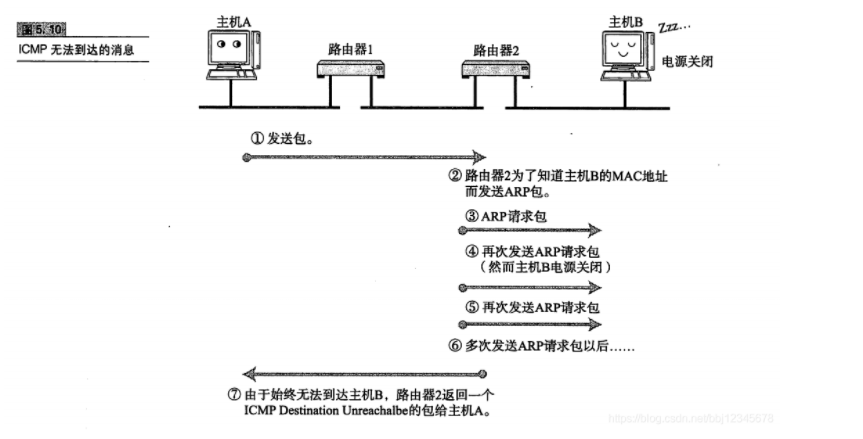
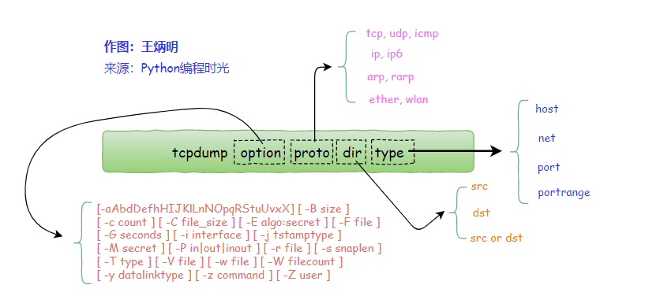
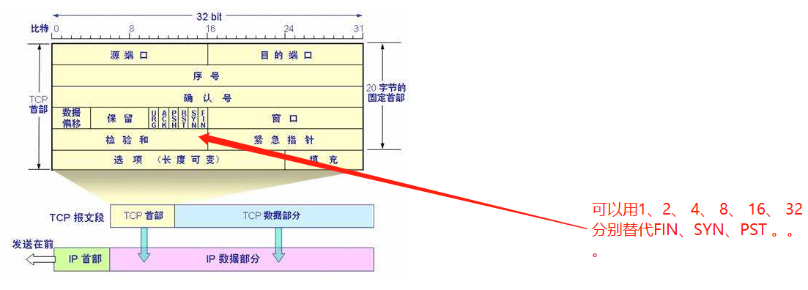

## 一、其他概念


### 1、ARP 协议

ARP协议是“Address Resolution Protocol”（地址解析协议），数据的传输所依懒的是MAC地址而非IP地址，而将已知IP地址转换为MAC地址的工作是由ARP协议来完成的。所以我们要告诉



所以我们在抓包的时候看到这个ARP ，要知道它是用来寻址的。


### 2、测试环境搭建


##### **2.1 测试环境一**

我们采用iperf([网路性能测试工具](https://www.jianshu.com/p/2781fe7a3ee0)来进行

两台linux上都安装如下包

```
   yum -y install  epel-release
   yum install iperf  -y
```


##### **2.2 测试环境二**

我们通过windows的telnet连接 Linux

首先要在win10的控制面板 > 启动或关闭Windows功能 > Telnet客户端（打开）

Linux上要安装telnet-server服务

```bash
yum -y install telnet-server
```

Linux安装xinetd服务（托管服务。又名：超级守护进程）

```bash
yum -y install xinetd
```

启动服务

```bash
 systemctl start telnet.socket
 
 systemctl start xinetd
```


window登录我们的Linux(注意：网上说要开启telnet服务，我实操过程中发现，根本不需要，只要打开telnet客户端就可以了)

```bash
# 在window的CMD中输入
telnet 139.9.154.77
```

**这里有一个坑：那就是输入密码的时候报  `Login incorrect`**

```bash
# 解决办法，在linux上使用root账号创建一个账号，这个账号的密码全部使用大写，然后就可以登录了

useradd tom
passwd
> ASDFGHJK
```


### 3、TCP报文解析

https://www.cnblogs.com/dslx/p/10698673.html


### 4、tcpdump抓包问题：为什么抓取指定端口会抓到arp数据？

https://bbs.csdn.net/topics/396829619

开始TELNET正常，即意味着TCP端到端连接正常。在服务器网线断开后，启动TCP重传机制（源目端口号没有改变），但是服务器的与客户端无法连接，也就是ARP表条目消失，无法进行二层封装，则使用ARP协议，请求服务器的IP地址对应的MAC地址。所以在指定端口中抓包也会抓到arp数据


### 5、ICMP协议

即是我们经常使用的ping 命令


## 二、tcpdump的使用


### 2.1 tcpdump参数结构图




### 2.2 输出结构

```
21:26:49.013621 IP 172.20.20.1.15605 > 172.20.20.2.5920: Flags [P.], seq 49:97, ack 106048, win 4723, length 48
```

第一列：时分秒毫秒 21:26:49.013621
第二列：网络协议 IP
第三列：发送方的ip地址+端口号，其中172.20.20.1是 ip，而15605 是端口号
第四列：箭头 >， 表示数据流向
第五列：接收方的ip地址+端口号，其中 172.20.20.2 是 ip，而5920 是端口号
第六列：冒号
第七列：数据包内容，包括Flags 标识符，seq 号，ack 号，win 窗口，数据长度 length，其中 [P.] 表示 PUSH 标志位为 1（发送），更多标识符见下面

### 2.3 Flags 标识符

使用 tcpdump 抓包后，会遇到的 TCP 报文 Flags，有以下几种：

[S] : SYN（开始连接）-- 2
[P] : PSH（推送数据） -- 8
[F] : FIN （结束连接）-- 1
[R] : RST（重置连接）-- 4
[.] : 没有 Flag （意思是除上面四种类型外的其他情况，有可能是 ACK（ACK标识符也是[.]） 也有可能是 URG）



### 2.4、过滤流向和端口

**备注：我在写这些命令的时候发现一个特性啊，比如我们有TCP、UDP、icmp、ip4、ip6、arp等协议，都是传输层及其以下的，比如我们要转http协议的（http是应用层的协议），它是通过80端口进行传输的，我们就不能指定http协议，这是要报错的，我们只能通过端口80或者http，来指定，这里http是等于80的，同样，如果我们要抓取https的数据，我们可以指定端口为443或者https，同理我们要抓取nfs协议的数据，我们可以直接指定端口nfs就可以了，下面有例子。。得出结论，只有传输层及其以下的协议才可以通过指定协议进行抓包，传输层以上的协议通过指定端口进行抓包**


```bash
# 通过IP进行抓包
tcpdump -i eth0 host 192.168.0.172

# 通过指定流向和IP进行抓包
tcpdump -i eth0 src host 192.168.0.172

# 通过端口进行抓包
tcpdump -i eth0 port 23

# 通过指定端口抓取http、https、nfs协议的数据
tcpdump -i eth0 port http
tcpdump -i eth0 port 80
tcpdump -i eth0 port https
tcpdump -i eth0 port 443
tcpdump -i eth0 port nfs

# 通过指定端口流向抓取http、https、nfs协议数据
tcpdump -i eth0 port http
tcpdump -i eth0 port 80
tcpdump -i eth0 port https
tcpdump -i eth0 port 443
tcpdump -i eth0 port nfs

# IP和端口一起使用，并指定流向
tcpdump -i eth0 src host 192.168.0.172 and dst port nfs


# 通过选项指定流向
-Q： 选择是入方向还是出方向的数据包，可选项有：in, out, inout，也可以使用 --direction=[direction] 这种写法
tcpdump -X -Q in -i eth0 src host 192.168.0.172 and dst port nfs
```

**结论：**

- **direction 可以修饰type，同样，每一个描述之间都使用and进行连接**
- **option可以修饰任何参数或者类型，所以不能使用逻辑运算符**
- **proto 不能修饰 direction，要用逻辑运算符连接比如and 、or**
- **proto 不能修饰 type，要用逻辑运算符连接比如and 、or**


https://pycharm.iswbm.com/c09/c09_05.html


[TCP/IP七层协议](https://blog.csdn.net/qq_27870421/article/details/99843157)


wireshark 数据包分析

http://www.icharm.me/%E3%80%90wireshark%E3%80%91%E6%95%B0%E6%8D%AE%E5%8C%85%E5%88%86%E5%B1%82%E7%BB%93%E6%9E%84.html#1.%E7%89%A9%E7%90%86%E5%B1%82%E7%9A%84%E6%95%B0%E6%8D%AE%E5%B8%A7%E6%A6%82%E5%86%B5


如何开启telnet

http://www.xitongcheng.com/jiaocheng/win10_article_37554.html


iperf

https://www.cnblogs.com/royfans/p/11331613.html


ARP

https://blog.csdn.net/ever_peng/article/details/80008638


网路信息解析

https://blog.csdn.net/langqunxianfeng/article/details/100915867


tcpdump命令详解

https://www.cnblogs.com/ggjucheng/archive/2012/01/14/2322659.html


tcpdump抓包问题

https://bbs.csdn.net/topics/396829619


ICMP协议

https://blog.csdn.net/bbj12345678/article/details/105988848


TCP 报文（包头或者 首部  固定32bit）

https://www.cnblogs.com/dslx/p/10698673.html


如何使用tcpdump

https://blog.csdn.net/weixin_36338224/article/details/107035214?ivk_sa=1024320u


seq ack 分析

https://blog.csdn.net/wang7dao/article/details/16805337

https://blog.csdn.net/gh201030460222/article/details/80573526/
