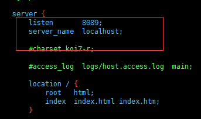
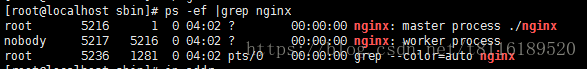

##### 创建脚本文件

三种方式：

1. vim	nginx_install.sh
2. touch nginx_install.sh
3. \> nginx_install.sh


##### 给文件执行权限

```bash
chmod 700 nginx_install.sh
#这里不能使用777，不能什么都给777，很多时候系统都给你锯了
```


##### 网上找到nginx下载连接

> ​	nginx.org网站 或者 http://nginx.org/en/download.html
>
> ​	找到pgp格式文件，右键复制下载连接，连接如下
>
> ​	http://nginx.org/download/nginx-1.6.3.tar.gz


##### 脚本编写

```bash
#!/bin/bash

#1. 安装依赖
yum -y install wget gcc pcre-devel zlib-devel

#2. 下载nginx安装包,安装到当前目录
wget http://nginx.org/download/nginx-1.6.3.tar.gz

#3. 解压nginx，解压到当前文件夹
tar xf nginx-1.6.3.tar.gz

#4. 进入到解压后的文件夹中,改文件夹也在当前目录下
cd ./nginx-1.6.3

#5 .执行nginx-1.6.3文件夹中的configure脚本进行配置
./configure --prefix =/usr/local

#6. 四个CPU 
make -j 4

#7. 编译
make install 
```


##### 附一个nginx的安装教学路径

https://blog.csdn.net/t8116189520/article/details/81909574?ops_request_misc=%257B%2522request%255Fid%2522%253A%2522161852899816780274180771%2522%252C%2522scm%2522%253A%252220140713.130102334..%2522%257D&request_id=161852899816780274180771&biz_id=0&utm_medium=distribute.pc_search_result.none-task-blog-2~all~top_positive~default-1-81909574.first_rank_v2_pc_rank_v29&utm_term=linux%E4%B8%8B%E5%AE%89%E8%A3%85nginx


1.**安装依赖包**

```
//一键安装上面四个依赖
yum -y install gcc zlib zlib-devel pcre-devel openssl openssl-devel
```

2.**下载并解压安装包**

```
//创建一个文件夹
cd /usr/local
mkdir nginx
cd nginx
//下载tar包
wget http://nginx.org/download/nginx-1.13.7.tar.gz
tar -zxvf nginx-1.13.7.tar.gz
```

**3.安装nginx**

```
//进入nginx目录
cd /usr/local/nginx
//进入目录
cd nginx-1.13.7
//执行命令
./configure
//执行make命令
make
//执行make install命令
make install
```

**4.配置nginx.conf**

```
打开配置文件
vi /usr/local/nginx/conf/nginx.conf
```

将端口号改成8089，因为可能apeache占用80端口，apeache端口尽量不要修改，我们选择修改nginx端口。

localhost修改为你服务器ip地址。



**5.启动nginx**

/usr/local/nginx/sbin/nginx -s reload
如果出现报错：nginx: [error] open() ＂/usr/local/nginx/logs/nginx.pid＂ failed

则运行： /usr/local/nginx/sbin/nginx -c /usr/local/nginx/conf/nginx.conf

再次启动即可！

 

查看nginx进程是否启动：

ps -ef | grep nginx



 

**6.若想使用外部主机连接上虚拟机访问端口192.168.131.2，需要关闭虚拟机的防火墙：**

centOS6及以前版本使用命令： systemctl stop iptables.service

centOS7关闭防火墙命令： systemctl stop firewalld.service

随后访问该ip即可看到nginx界面。

 

**7.访问服务器ip查看（备注，由于我监听的仍是80端口，所以ip后面的端口号被省略）**


 

**8. nginx的常用命令**

```
安装完成一般常用命令

进入安装目录中，

命令： cd /usr/local/nginx/sbin

启动，关闭，重启，命令：

./nginx 启动

./nginx -s stop 关闭

./nginx -s reload 重启
```

