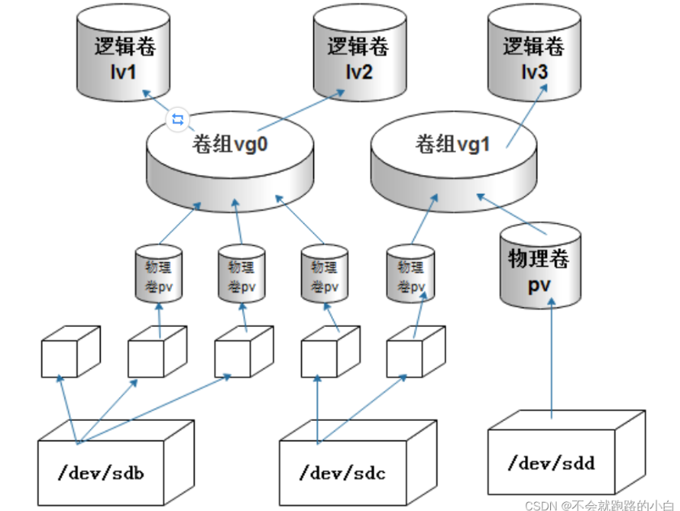
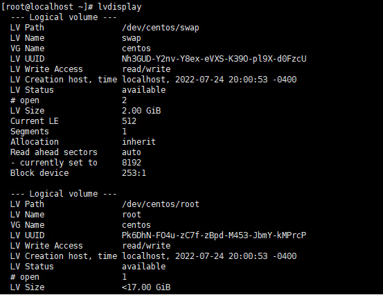
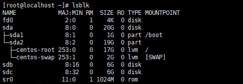
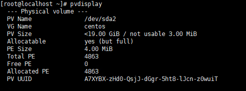
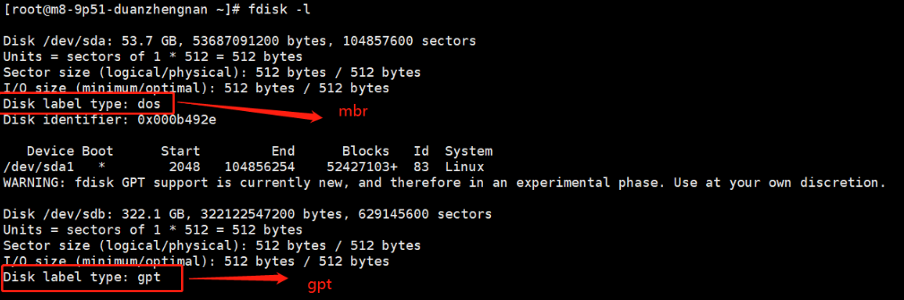
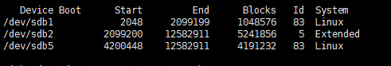

## 一、LVM - 逻辑卷管理

[cat /proc/partitions、fdisk -l、df -h、blkid有啥不同？](https://blog.csdn.net/songyuchaoshi/article/details/109083222)

[centos 7磁盘扩容、扩展分区/dev/mapper/centos-root](https://blog.csdn.net/qq_61189986/article/details/123622986)

[LVM -逻辑卷管理](https://blog.csdn.net/weixin_54217950/article/details/122636799)

LVM是 Logical Volume Manager(逻辑卷管理)的简写，LVM将若干个磁盘或者磁盘分区连接为一个整块的卷组，形成一个存储池。管理员可以在卷组上任意创建逻辑卷，并进一步在逻辑卷上创建文件系统。管理员通过LVM可以方便的调整存储卷组的大小，并且可以对磁盘存储按照组的方式进行命名、管理和分配。
假设有三块磁盘/dev/sdb、/dev/sdc和/dev/sdd用来划分逻辑卷，LVM模型如图所示：




#### 1.1 LVM基本术语

通过LVM技术，屏蔽了磁盘分区的底层差异，在逻辑上给文件系统提供了一个卷的概念，然后在这些卷上建立相应的文件系统。在了解LVM之前，先熟悉LVM中几个常用的术语。
（1）物理存储设备（The physical media）：指系统的存储设备文件，如：/dev/hda1、/dev/sda等等。
（2）物理卷（physical volume）：简称PV，物理卷可以是整个硬盘、硬盘分区或从逻辑上与磁盘分区具有同样功能的设备(如RAID)，是LVM的基本存储逻辑块，但和基本的物理存储介质（如分区、磁盘等）比较，却包含有与LVM相关的管理参数。
（3）卷组（Volume Group）：简称VG，可以看成单独的逻辑磁盘，建立在PV之上，一个卷组中至少要包括一个PV，在卷组建立之后可以动态的添加PV到卷组中。卷组的名称可以自定义。
（4）PE（physical extent）物理区域：物理区域是物理卷中可用于分配的最小存储单元，物理区域的大小默认为4MB。物理区域大小一旦确定将不能更改，同一卷组中的所有物理卷的物理区域大小需要一致。每一个VG最多能够支持65535个PE，如果使用LVM默认参数，则一个VG最大可达256GB的容量。
（5） 逻辑卷（logical volume）：简称LV，相当于物理分区。逻辑卷建立在卷组之上，卷组中的未分配空间可以用于建立新的逻辑卷，逻辑卷建立后可以动态的扩展或缩小空间。系统中的多个逻辑卷，可以属于同一个卷组，也可以属于不同的多个卷组。
（6）LE（logical extent）逻辑区域：逻辑区域是逻辑卷中可用于分配的最小存储单元，逻辑区域的大小取决于逻辑卷所在卷组中的物理区域大小。LE的大小和PE的大小一样。
（7）VGDA（Volume Group Descriptor Area）卷组描述符区域：和非LVM系统将包含分区信息的元数据保存在位于分区的起始位置的分区表中一样，逻辑卷以及卷组相关的元数据也是保存在位于物理卷起始处的卷组描述符区域中。VGDA包括以下内容：PV描述符、VG描述符、LV描述符和一些PE描述符。

（8）8e  指的是虚拟逻辑卷分区

**常用命令**

| 任务         | PV        | VG        | LV        |
| ------------ | --------- | --------- | --------- |
| 创建         | pvcreate  | vgcreate  | lvcreate  |
| 删除         | pvremove  | vgremove  | lvremove  |
| 扫描列表     | pvscan    | vgscan    | lvscan    |
| 显示属性     | pvdisplay | vgdisplay | lvdisplay |
| 显示相关信息 | pvs       | vgs       | lvs       |
| 扩展         | 无        | vgextend  | lvextend  |
| 缩减         | 无        | vgreduce  | lvreduce  |

**`lvdisplay`**



 有连个LV,一个是swap、一个是root

**`lsblk`**



sda硬盘做了两个分区。sda


**`pvdisplay`**




**`pvscan`**


#### 1.2 单盘多分区做逻辑卷管理

分区格式有MBR、GPT、loop

loop是表示整盘分区的，意思就是整个硬盘作为一个独立的分区，比如，一个新的硬盘插到主板上后，Linux系统开机后，如果不出意外，将会lsblk命令可以看到，此时，不使用fdisk或者parted，gparted等分区格式化工具，直接 格式化整个硬盘，格式化完成后，此时的硬盘分区就是loop了。
假设我有一块新的硬盘被Linux系统识别为了sde， 那么，我只执行 mkfs.xfs /dev/sde 这个格式化命令，此时，这个硬盘就是loop分区格式啦！

采用**`fdisk -l`**查看磁盘的是MBR分区还是GPT分区

```
fdisk -l
```




##### 1.2.1 MBR分区

1、 MBR特点

①  最多支持4个主分区

②  最大支持2.1tb硬盘

③  扩展分区一个硬盘只能有一个

单位换算



start 和 end 都是指的扇区，一个扇区==512KB

Blocks等于（End - Start）/2，他们都是指的分区的容量 


分区工具采用fdisk

https://www.likecs.com/show-306404541.html

扩展分区也就是除主分区外的分区，但它不能直接使用，必须再将它划分为若干个逻辑分区才行

**创建物理卷（pv）**

```
[root@localhost ~]#pvcreate /dev/sdb5 /dev/sdb6 /dev/sdb7 （/dev/sdb5 /dev/sdb6 /dev/sdb7都是扩展分区/dev/sdb2下的逻辑分区）
```

**创建卷组,逻辑卷**

```
将PV（物理卷）/dev/sdb5 /dev/sdb6 /dev/sdb7加入卷组rhce_vg；该卷组的PE尺寸为4MB
[root@localhost ~] vgcreate -s 4M rhce_vg /dev/sdb5 /dev/sdb6 /dev/sdb7
第一个逻辑卷的名字为rhce_lv1，所属卷组为rhce_vg，大小为200M,第二个逻辑卷的名字为rhce_lv1，所属卷组为rhce_vg，大小为400M(该逻辑卷由100个PE组成,PE=4)；
[root@localhost ~]lvcreate -L 200M -n rhce_lv1 rhce_vg
[root@localhost ~]lvcreate -l 100 -n rhce_lv2 rhce_vg
[root@localhost ~]lvextend -L +100M  /dev/rhce_vg/rhce_lv1 
[root@localhost ~]lvresize -l -25 /dev/rhce_vg/rhce_lv2
[root@localhost ~]lvs
```

**格式化逻辑卷，创建文件系统，并挂载-至此结束结束**

```
[root@localhost ~] mkfs.ext4 /dev/rhce_vg/rhce_lv1
[root@localhost ~]mkfs  -t xfs /dev/rhce_vg/rhce_lv2
[root@localhost ~]lvs[root@localhost ~]cd /data/
[root@localhost ~]mkdir lv1 lv2
[root@localhost ~]mount /dev/rhce_vg/rhce_lv1 /data/lv1
[root@localhost ~]mount /dev/rhce_vg/rhce_lv2 /data/lv2
```


**备注**

```
lvcreate -L 和 -l的区别
-L	指定逻辑卷的大小，单位为“kKmMgGtT”字节
-l	指定逻辑卷的大小（LE数），LE大小和PE大小一致，默认是4M

lvcreate -l 100%VG -n rhce_lv3 rhce_vg 将剩余的所有容量进行分配
```

