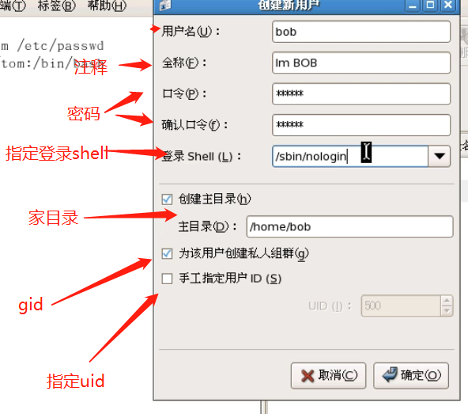
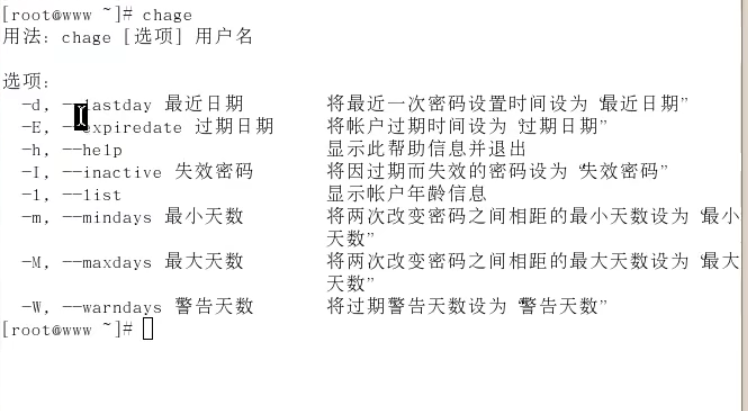
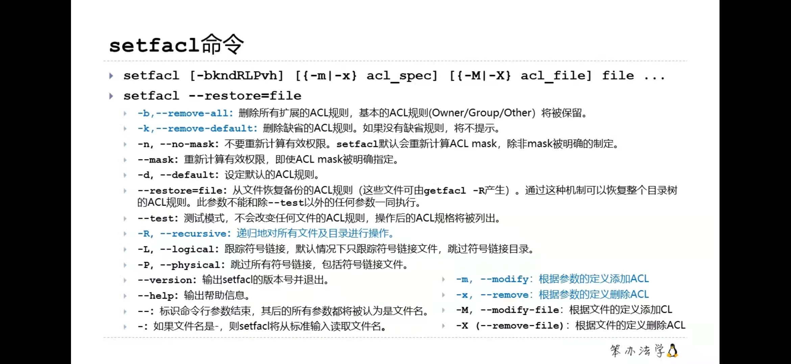

## Linux账号管理与ALC权限设置学习内容如下


Linux的账号与用户组

​				用户标识符：UID与GID

​				用户账号

​				有效与初始用户组：groups，newgrp

账号管理

​				新增与删除用户useradd，相关配置文件，passwd，chage，usermod，userdel

​				用户功能：fingle、 chfn、chsh、id

​				新增与删除用户组

​				账号管理实例

在window下，用户的账户密码信息是存放在SAM数据库中的

在linux下，用户的账号密码信息是存放在/etc/passwd	/etc/shadow


**/etc/passwd文件讲解**

```bash
[root@hecs-263993-0002 ~]# cat /etc/passwd
root:x:0:0:root:/root:/bin/bash
# 第一个部分root
代表这个用户的用户名
# 第二个部分x
在早期的linux中这里是存放密码的，但是由于安全性的问题，后面用x来占位，表示未知
# 第三部分 0
表示uid
# 第四部分 0
表示gid
# 第五部分root
注释信息
# 第六部分/root
用户的家目录，在用户的家目录里面存储了用户特有的一些信息，比如的设置、我的cookie（每个人的家目录里面的东西都不一样），用户级别的用户，默认是/home/用户名 作为家目录，我们一般就遵循别人规则，这样专业啊
# 第七部分 /bin/bash
这个用户登录时默认使用的shell，一般就用它了

bin:x:1:1:bin:/bin:/sbin/nologin
daemon:x:2:2:daemon:/sbin:/sbin/nologin
adm:x:3:4:adm:/var/adm:/sbin/nologin
lp:x:4:7:lp:/var/spool/lpd:/sbin/nologin
sync:x:5:0:sync:/sbin:/bin/sync
shutdown:x:6:0:shutdown:/sbin:/sbin/shutdown
halt:x:7:0:halt:/sbin:/sbin/halt
mail:x:8:12:mail:/var/spool/mail:/sbin/nologin
operator:x:11:0:operator:/root:/sbin/nologin
games:x:12:100:games:/usr/games:/sbin/nologin
ftp:x:14:50:FTP User:/var/ftp:/sbin/nologin
nobody:x:99:99:Nobody:/:/sbin/nologin
systemd-network:x:192:192:systemd Network Management:/:/sbin/nologin
dbus:x:81:81:System message bus:/:/sbin/nologin
polkitd:x:999:998:User for polkitd:/:/sbin/nologin
postfix:x:89:89::/var/spool/postfix:/sbin/nologin
sshd:x:74:74:Privilege-separated SSH:/var/empty/sshd:/sbin/nologin
chrony:x:998:996::/var/lib/chrony:/sbin/nologin
tcpdump:x:72:72::/:/sbin/nologin
rpc:x:32:32:Rpcbind Daemon:/var/lib/rpcbind:/sbin/nologin
rpcuser:x:29:29:RPC Service User:/var/lib/nfs:/sbin/nologin
nfsnobody:x:65534:65534:Anonymous NFS User:/var/lib/nfs:/sbin/nologin
```

- 每一行都表示一个用户
- 每一行都用6冒号，将每一行分割成7个部分，每个部分都用含义


**/etc/shadow讲解**

```bash
root:$6$QB4C0yco$DfTEOVz.K17DPSFt/xyJ0ELwQDPVz0H9ImrvqyPkhPdMCUVSmYZ5o59GzNKNV6WxzxS/Jpv9w7gELbCAdbTfU1:18860:0:99999:7:::
# 第一部分root
表示用户名
# 第二部分$6$QB4C0yco$DfTEOVz.K17DPSFt/xyJ0ELwQDPVz0H9ImrvqyPkhPdMCUVSmYZ5o59GzNKNV6WxzxS/Jpv9w7gELbCAdbTfU1
表示用户的密码，这个密码是经过加密的
# 第三部分18860（从第三部分开始记录的都是密码的属性信息）
18860表示从1970到现在经历了多长时间
# 第四部分0
表示密码最小使用多少天
# 第五部分99999
表示密码最大使用多少天
# 第六部分7
最大使用天数到期停了的时间


bin:*:17834:0:99999:7:::
daemon:*:17834:0:99999:7:::
adm:*:17834:0:99999:7:::
lp:*:17834:0:99999:7:::
sync:*:17834:0:99999:7:::
shutdown:*:17834:0:99999:7:::
halt:*:17834:0:99999:7:::
mail:*:17834:0:99999:7:::
operator:*:17834:0:99999:7:::
games:*:17834:0:99999:7:::
ftp:*:17834:0:99999:7:::
nobody:*:17834:0:99999:7:::
systemd-network:!!:18684::::::
dbus:!!:18684::::::
polkitd:!!:18684::::::
postfix:!!:18684::::::
sshd:!!:18684::::::
chrony:!!:18684::::::
tcpdump:!!:18684::::::
rpc:!!:18937:0:99999:7:::
rpcuser:!!:18937::::::
nfsnobody:!!:18937::::::
```


**其他知识点**

```bash
1、root 用户的uid 为 0

2、uid 是1 ~ 499， 这些用户是系统用户，他们是不能够登录系统的

3、普通用户的uid 是从500 ~ 65535

4、每一个用户都必须属于一个某一个组才可以，即使是root用户 或者 系统用户

5、在window下面我们创建一个普通用户的时候，这个用户它默认是属于user组的，但是在linux系统下，我们创建一个用户，比如Tom， 此时linux在创建这个Tom用户的时候，也会创建一个名为Tom的组，然后把Tom加入到Tom组里面去

6、linux系统中，用户的账号存放在/etc/passwd  密码存放在/etc/shadow 文件中

7、在linux一个用户可以同时属于多个组

8、通过groups 用户名来查询
[root@hecs-263993-0002 home]# groups root
root : root
第一个root 表示用户名
第二个root 表示所属的组

9、将一个用户加入到一个组里面
gpasswd -a 用户名 用户组
eg：gpasswd -a tom technology	# 将tom加入到技术组里面
[root@hecs-263993-0002 home]# groups tom
tom : tom technology
第一个tom 表示用户名
第二个tom 表示tom组，表示主组
第三位technology 表示附属组

10、newgrp 组名，  可以临时将一个组转换成默认主，或者主组（建立一个子shell， 将组名设置设置位主组），要恢复也很简单，因为是在子shell中弄的，我们可以直接exit退出子shell就行了

11、只有root 用户可以不用输入密码切换到指定的用户

12、只有root用户可以给其他用户设置密码

999、如果登录shell 设置成 /sbin/nologin , 那么这个用户是不能够进行登录的，其他用户也不能切换到这个用户里面来，哪怕你是root用户。意义在于：比如我搭建一个服务做共享，我只想你挂载使用我的共享目录，不想让你登录我的系统，这个时候，我就可以给你创建一个账号，这个账号的登录shell设置成/sbin/nologin
```


## 创建用户

**图像创建**




**命令行**


```bash

------------------------创建用户---------------------------------

# 1、创建一个用户
useradd bob			# 所用都采用默认值，shell使用/bin/shell  家目录使用/home/bob,全部使用默认值

# 2、查看创建用户的默认值
useradd -D

GROUP=100
HOME=/home
INACTIVE=-1
EXPIRE=
SHELL=/bin/bash
SKEL=/etc/skel
CREATE_MAIL_SPOOL=yes

# 3、修改默认值模板
vim /etc/default/useradd

GROUP=100
HOME=/home
INACTIVE=-1
EXPIRE=
SHELL=/bin/bash
SKEL=/etc/skel
CREATE_MAIL_SPOOL=yes

# 4、给用户添加注释
useradd -c "这是一个靓仔" bob

# 5、给用户指定shell
useradd -s /sbin/nologin bob

# 6、给用户指定家目录
useradd -d /home/bod bob

# 7、给用户指定一个组（当我创建一个用户的时候，系统会为这个用户创建一个同名的私人组，然后将bob加入到bob组中，但是当我们在创建的时候指定组的时候，系统就不会为bob创建一个bob组，而是直接加入到指定的组中，切这个组作为bob的主组）
useradd -g tom bob

# 8、给用户创建同名主组，并给他指定加入一个附属主
useradd -G tom bob	# 创建bob这个用户，然后创建一个bob同名的主组，将bob加入进去，并也加入到tom这个附属主里面，此时bob同属于两个组，主组bob，附属组tom

# 9、给用户指定主组和附属组
useradd -g tom -G alex bob	# 创建一个bob用户，然后将bob加入到tom组和alex组中，其中tom作为bob的主组，alex作为附属组 

# 10、给用户指定uid
useradd -u 1000 bob		# 这个玩意一般还是让系统自己指定比较好

# 11、批量创建用户,b
[root@hecs-263993-0002 alex]# for i in `seq 1 10`
> do
> useradd user$i
> echo "redhat" | passwd --stdin user$i	# echo是标准输出到屏幕，通过管道将标准输入变成--stdind
> done


---------------------------修改用户 usermod-----------------------------------------------
# 12、修改用户shell
usermod tom -s /bin/bash

# 13、修改用户的家目录
usermod tom -c 'xxxxxx'

----------------------------修改密码 passwd--------------------------------------------
# 14、给我tom添加一个密码（必须是root用户才有权限添加密码，哪怕将这个用户被添加到root组里面也不行）
passwd bob
>请输入密码：

# 15、查看用户的密码信息
passwd -S alex
alex PS 2021-11-07 0 99999 7 -1 (Password set, SHA512 crypt.)

# 16、将一个用户的密码删除
passwd -d bob

---------------------------删除用户 userdel---------------------------------------------
# 17、只删除用户
userdel tom

# 18、删除用户的同时删除它的家目录，邮件，临时文件
userdel -r tom


```

```bash
# 19、chage 的用法
man chage

# 20、更改tom最后一次修改密码的时间
chage -d 2009-09-18 tom

# 21、修改tom用户的失效时间
chage -E 2012-12-21

# 22、密码最小使用时间，必须使用到这个时间以后才可以修改
chage -m 10 tom

# 23、低于多少天必须修改密码，否则失效
chage -M 20 tom

# 24、警告时间
chage -W 7 tom

# 25、列出一个用户的所有密码信息
```



## ALC

🔺🔺 ALC是综合然后取最最小的权限（75 > 71） 那么它的权限就是71

```bash
# 1、获取一个文件得ACL
getfacl test.txt

# file: text.txt
# owner: root
# group: root
user::rw-
group::r--
other::r--


# 2、设置一个用户得ACL
setfacl -m u:alex:rw test.txt		# -m 是 modify
[root@hecs-263993-0002 ~]# getfacl test.txt 
# file: test.txt
# owner: root
# group: root
user::rw-
user:alex:rw-
group::r--
mask::r--
other::r--

# 3、但我们设置了ACL以后，ll的时候我们发现这个文件后面变成了+号
[root@hecs-263993-0002 ~]# ll
total 12
-rw-r--r--  1 root root 32 Nov  7 17:14 demo.txt
-rw-r--r--  1 root root  5 Aug 26 16:52 tcp_keepalive_time~
-rw-r--r--+ 1 root root 38 Nov  7 17:14 test.txt

# 4、删除所有acl
setfacl -b test.txt
# file: test.txt
# owner: root
# group: root
user::rwx
group::r--
other::rwx

# 5、删除指定的acl
setfacl -x u:alex test.txt
# file: test.txt
# owner: root
# group: root
user::rwx
user:jack:rwx
group::r--
mask::rwx
other::rwx

# 6、设置默认的ACL（默认的ACL不会对当前的文件生效，只对之后的文件生效，所以默认ACL一般是针对文件夹的，后面新建的文件，会继承这个默认acl的值）
案例：我们现在想给test文件中，以后新建的所有文件针对alex用户都生成alc（这时候我们就要使用默认acl了，不然每次新建一个文件，我们都要去手动设置，太麻烦了）
setfacl -d -m u:alex:- test
# file: test
# owner: root
# group: root
user::rwx
group::rwx
other::rwx
default:user::rwx
default:user:jack:---
default:group::rwx
default:mask::rwx
default:other::rwx

这个时候我们touch一个新的文件，那么它的acl中，就包含有继承过来的


# 7、mask条目
为文件的owner、other之外的人指定的最大的权限，通过这个mask最大的权限来指定权限的边界。mask是针对特定的用户，tom 、 jack和group的最大的权限

# 8、指定mask
setfacl -m mask:r-- tes
```




https://luoyiran.blog.csdn.net/article/details/80347558?spm=1001.2101.3001.6650.1&utm_medium=distribute.pc_relevant.none-task-blog-2%7Edefault%7ECTRLIST%7Edefault-1.no_search_link&depth_1-utm_source=distribute.pc_relevant.none-task-blog-2%7Edefault%7ECTRLIST%7Edefault-1.no_search_link