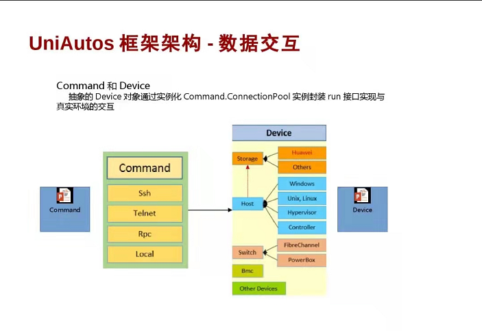
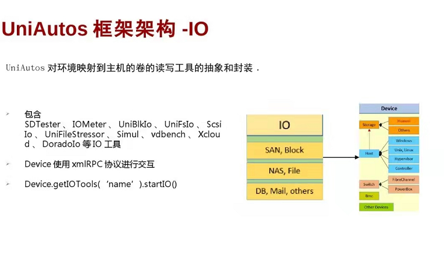
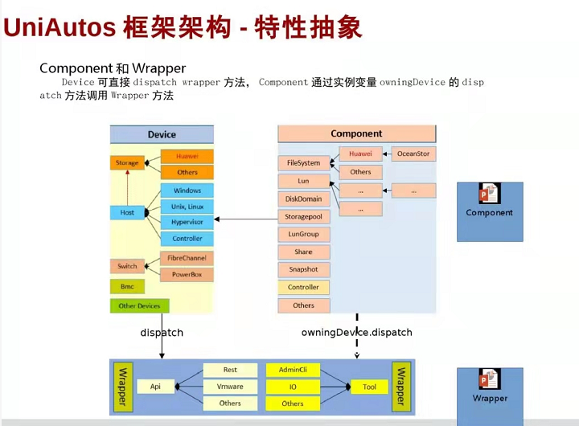
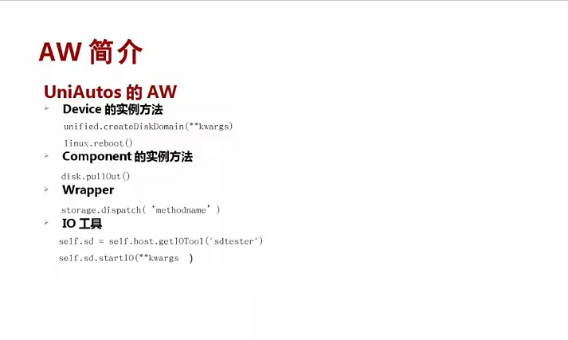
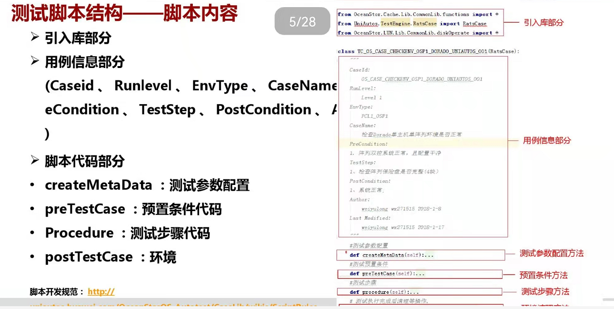
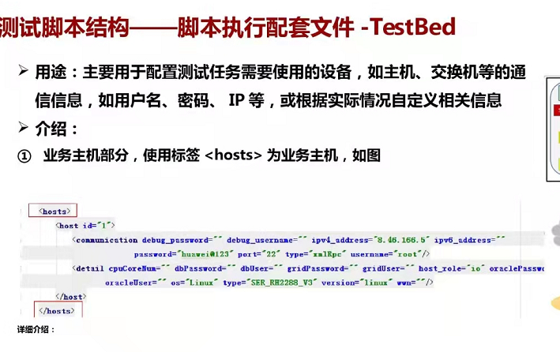
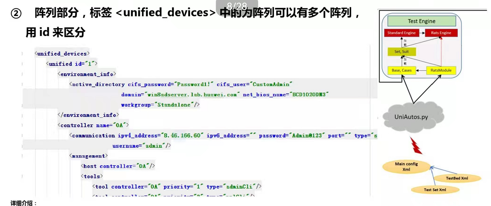
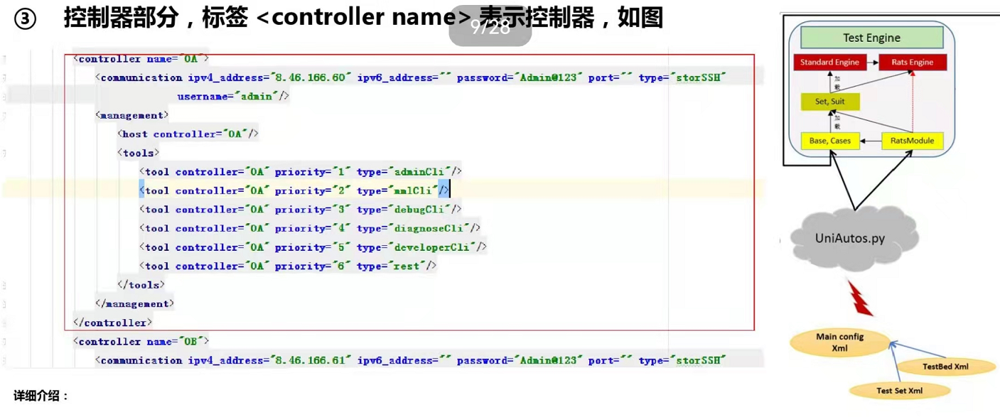
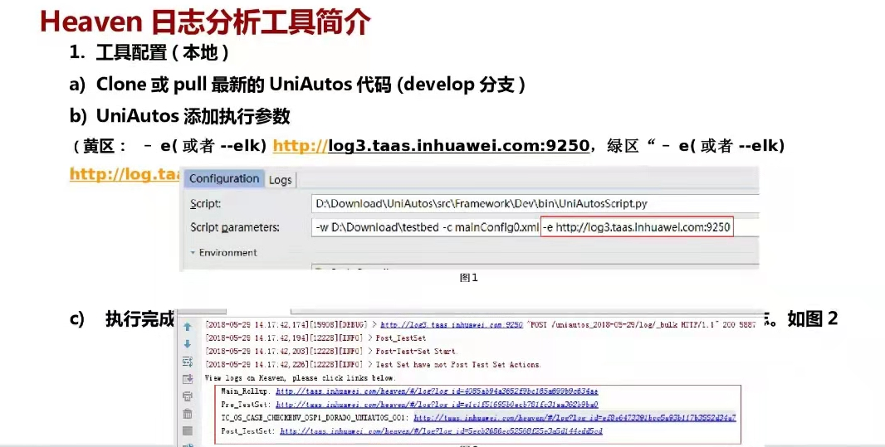

## 一、Hook是怎么和我们的框架搭配起来使用的

问题： 我们书写的用例，hook 本质上是什么？ case 、hook 在运行的时候是交叉进行的

问题：用例的串行流程，如何被框架调度起来


测试套的信息：

- 一个就是Hook
- 一个就是case


test 就是单个用例

resource 就是我们测试床或者说被测资源的信息


## 二、Command 和 Device

​	抽象的Device 对象通过实例化Command.ConnectionPool 实例封装run 接口实现与真实环境交互




## 三、IO



## 四、特性抽象





deviceObj.dispatch(cmd)

ComponentObj.owningDevice.dispatch(cmd)





## 五、脚本内容





## 六、测试床


**主机配置部分**



**阵列的TestBed配置**




**控制器部分**

控制器，就是deviceMange的cli模式， 我们可以指定cli视图的参数 用于切换





## 七、日志工具使用



**主要是parameter里面加上 -e 然后后面一个链接**


## 八、工程配置


```xml
测试套
测试床
<test_set_file>测试套的xml文件的绝对路径</test_set_file>
<testbed_file>测试床的xml文件的绝对路径</testbed_file>
<execution_parameters>
	<param name='stop_on_error' value='1' />
    <param name='logging_level' value='DEBUG'/>
</execution_parameters>
```


## 九、脚本结构

```xml
<test name='deploy_all' run='1' type='case'>	# ②找到这个类名，生成一个实例
	<identities>
    	<identity id='deploy_all_smoke_x86' name='test_id'/> # ③生成的实例就是通过这个test_id id='deploy_all_smoke_x86' 来命名实例的
        <identity id='' name='url' />
    </identities>
    <location>FusionStorage8\deploy\deploy_all</location>		# ①通过这个类文件
    <parameters>
    	<param name='evs_deploy' value='True' />
        <param name='package_type' value='debug' />
    </parameters>
	<tags>
        <tag/>
    </tags>
</test>
# ④然后去执行这个实例， 再把这个结果回填
```

测试套文件命名必须包括'testset' 字符

我们自动化执行的时候，逻辑是这样的，我们回去把所有包含testset资源的xml文件抓出来，把xml文件抓出来以后，我再把我这一次拿到的test_id,在每一个xml文件中去遍历，我遍历到了，我就会把这个结构体给抓出来。所以这里就会出现一个问题，就是大家想要顺序执行的时候，为什么我这个case，最终下发到执行器上不是顺序执行的。


## 十、获取主机

```xml
<hosts>
	<host id=1>
    	<communication debug_password='' debug_username='' ipv4_address='8.44.128.235' ipv6_address='' password='huawei@123' port='22' type='standSSHl' username='root' />
        <detail cpuCoreNum='' dbPassword='' dbUser='' gridPassword='' gridUser='' host_role='NFS_CLIENT' oraclePassword='' os='Linux' tools_path='/home/testTools/' type='Virtual' version='linux' wwn=''/>
    </host>

</hosts>
```


```python
self.nfs_clients = self.resource.getHost('NFS_CLIENT')
self.fi_clients = self.resource.getHost('FI_CLIENT')

# 命令下发
self.nfs_client.run({'command': ['sh', '-c', 'kill -9 %s' % self.process_id]}, 'sessionType': 'adminCli')
sessionType 这个就是切换到哪个命令视图下，不然就在当前命令视图下进行执行命令了


# 下IO
self.sdtester = self.nfs_clients.getIOTool('sdtester') # 如果要vdbench， 这里面就写vdbench就是行了
self.sdtester.startIO(lunlist=self.lunlist,
                      blockSize=['512B', '3K', '128K', '256K', '2M'],
                      rwType = [2, 3],
                      rwMode = [0, 1]
                     )

# 获取改业务的对象的全部属性，不知道企业这边有没有这个玩意
self.region = self.resource.getDevice('region', '1')		# 获取region对象
self.fsm = self.region.getSpecifyServiceNode('fsm')[0]		# 获取具体的fsm
tier_policy = self.fsm.createTierMigrationPolicy(name='125', fs_id='1', stratege='cold', migration_type='Periodic', path_name='/')												# 创建业务对象


```

- run 有回显，但是不会解析回显，是一个字符串
- dispath会回显，返回的是一个字典


## 十一、Wrapper

分布式的wrapper

Wrapper > Template > ProductModel > Roc > cmd > OceanStor100D810.py

这里的就是wrapper， 讲命令的空格转换成了下划线

企业的wrapper

Wrapper > Template > ProductModel > OceanStor > cmd > * 

```python
device.dispatch('create_namespace_general', params)
create_namespace_general 就是我们的wrapper名字， params这个玩意怎么传，就需要去具体的wrapper中查看了
```


## 十二、业务封装

业务模块CLi命令中具有create \ change \delete \show等配套命令，且重用度较高的业务，一般会封装为Component、Component命令一般取CLI命令中间字段然后首字母大写，如

```
create namespace general		component名: Namespace           如果末尾什么general ，就会把general 去掉，取中间的
create tier_deletion_pplicy		component名: TierDeletionPolicy	`
```


我讲讲我在这次测试任务中遇见的 问题 及其暴露的一些问题吧

这次测试过程中，花费时间较多的主要是在环境的搭建上。。


测试中的收获

业务连续行： 控制器单点、双点、多点故障后，业务依然连续运行

协议的可用性： 测试中，测试存储是否能够正确挂载

容灾：


测试意图和方法的实现的理解


基础用例：虚拟机挂载存储，NFS4.1 普通挂载， NFS4.1 + kerberos 验证挂载

特性用例：


这次测试任务中的收获：


我为什么要说这个呢？因为在我们对我们产品的特性有足够了解的前提下，我们在能更好的完成我们的测试，，现在我们是一个用例的执行者，其实当我们拿到清平给我的测试用例的时候，我读了读，在测试过程中我们才能更好，及时的发现问，在第一次就把事情做对。

我们要从一直个执行者，转变成为一个设计者。。

比较我们是测试人员，在对一个新产品，新事物有一个认知的过程，前面对整体质量把控不严谨，你让我现在来设计测试用例。我觉得我在设计用例之初会有很多的遗漏点。。

这一个月主要是对我们测试的产品进行学习，下面我来聊聊我对NAS的测试特性的理解把？

比如数据不一致， 数据问题一定都是大问题


我也回去询问同事，为什么你要设计这样一条用例？ 只有知道为什么，我们才能知道如果这条用例失败，会产生怎么样的后果


兼容性： 能够适用于多平台，比如window linux  unix

我们是兼容性测试部门，


只有知道这条用例设计和指定的目的，我们才能有效的完成我们的测试任务。。


在这次测试任务执行过程中的不足：

EXSI和存储都配置kerberos 并加入域， 但是在挂载存储的时候，就是挂载不上。。在操作上完全是根据操作知道进行操作的 。。 

分析问题：

 ----  硬件问题？ 

 ----  命令错误 ？

 ---- 操作步骤缺失？

 ---- 连通性错误？

我去固化环境中找了一台虚拟机，ping 存储和 EXSI主机都能ping通，说明存储和EXSI主机都是联通的 没有问题

检查关键字：  是不是在操作中，是否存在关键字符打错。检查发现域名，IP均是正确，对称加密配置正确

操作步骤缺失： 怀疑是在操作过程中存在关键性命令缺失。于是卸载前面操作，  重新按照别人总结的配置文档一步一步的仔细的执行，然后重新挂载，还是报错。。

连通性性检查： 排除了误操作， 那就是链路不通。。 最后回来翻看别人的指导书， 发现写个文档的人，他的存储逻辑IP配置的是8.44 网段，而我的存储的管理网段是8.44网段，存储逻辑业务IP是129.44网段。。导致链路不通


暴露的问题：

1、基础技术知识不牢靠，没有基础知识支撑，只能照搬照套他人的操作、

2、缺乏自我的思考。


安装虚拟机过程中遇见的问题：

1、第一点：  下载的镜像都是最小化版本， 由于华为是一个封网环境导致，在配置基础环境的时候，耽误了很多时间

2、


这次的


虽然在工作过程中没有那么多时间  去慢慢深挖  底层的逻辑和实现和原理， 但是你这一次你在形式上解决了这个问题，其实你并不了解为什么 这样做以后 该问题被解决了，， 下次原件同源的问题，具体表现形式不一样的时候，可能就蒙蔽了。。 所以在工作之余还是需要讲一些特性功能的实现剖析得更加深入，透彻，  原理得深入了解才是你解决问题的指导书。。


第二点：考虑问题要全面， 尤其是在这样一个新的环境当中，考虑事情的时候，还多问。。 别人的经验是宝贵的也是自己 成长的助力。。


