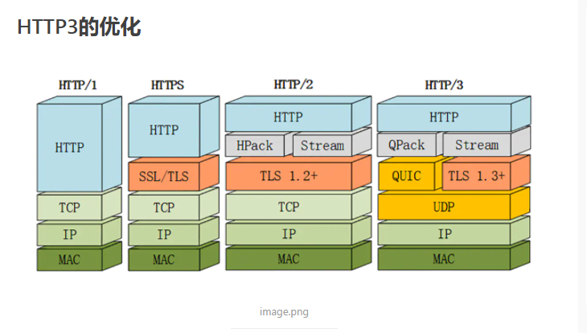
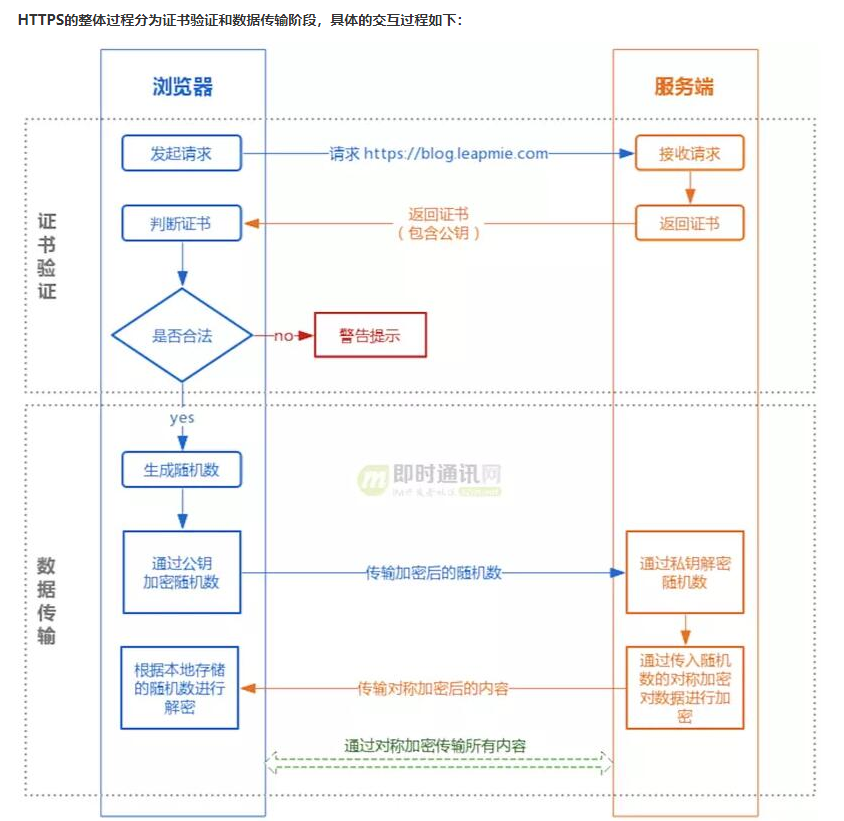
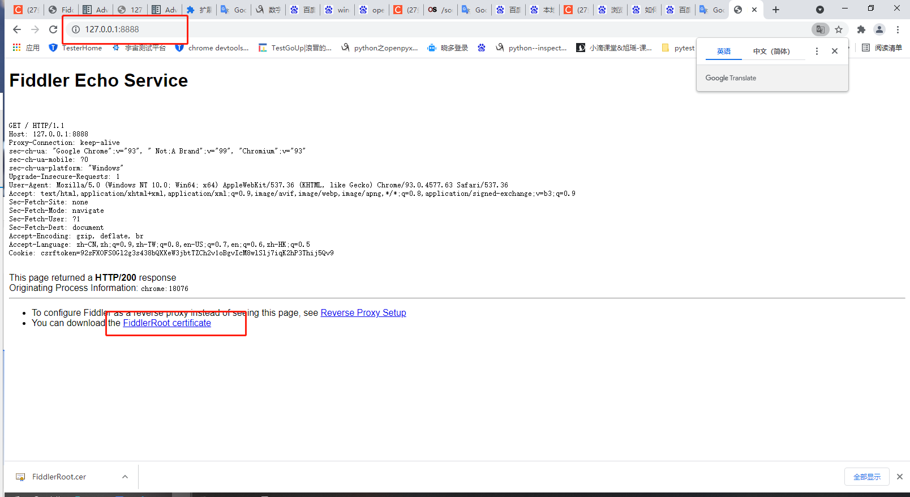
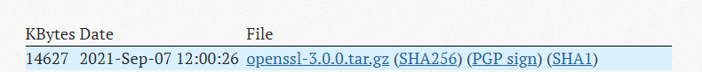

https://www.cnblogs.com/yxh168/p/9058043.html

# 一、[CA证书和SSL/TLS介绍及公钥私钥加密](https://www.cnblogs.com/yxh168/p/9058043.html)

**前言：公钥加密，私钥能解；私钥加密、公钥能解**


## 1.1 数字签名

  🔺用自己的私钥给数据加密就叫数字签名

## 1.2 公钥传输威胁

  在A和B的通信中,C可以把自己的公钥发给A,让A把C的公钥当成B的公钥,这样的话.B拿到加密数据反而无法解密,而C却可以解密出数据.从而实现C截获AB之间的数据

  所以在两者的通信中必须要对公钥的来源进行确认


 A和B如果想安全交换公钥,就必须通过CA(证书颁发机构) 证书的通信过程    A和B首先都内置了CA的公钥

 根,CA的证书是自己给自己签名的(自签名)

 

 

## 1.3 CA和证书 

 PKI: Public Key Infrastructure 

​    签证机构：CA（Certificate Authority） 

​    注册机构：RA 

​    证书吊销列表：CRL 

​    证书存取库： X.509：定义了证书的结构以及认证协议标准 

​                版本号  序列号  签名算法  颁发者  有效期限  主体名称  主体公钥  CRL分发点   扩展信息  发行者签名 


```
CA机构属于一个主体，比如：Gworg CA机构，然而CA机构可以颁发各种数字证书，其中包括SSL证书、邮件证书、加密证书、软件数字证书等等。
解释原因：

CA证书，是指CA颁发机构，颁发的数字证书。
CA机构主要业务是颁发数字证书。

SSL证书属于数字证书的一种，用于HTTPS加密协议。

解决办法：Gworg CA机构获得SSL证书。


证书管理机构CA，CA是PKI系统中通信双方都信任的实体，被称为可信第三方（Trusted Third Party，简称TTP）。CA作为可信第三方的重要条件之一就是CA的行为具有非否认性。CA通过证书证实他人的公钥信息，证书上有CA的签名。用户如果因为信任证书而导致了损失，证书可以作为有效的证据用于追究CA的法律责任。正是因为CA 愿意给出承担责任的承诺，所以也被称为可信第三方。
CA数字证书由CA签发和管理，能提供在Internet上进行身份验证的一种权威性电子文档，人们可以在互联网交往中用它来证明自己的身份和识别对方的身份。类似于现实世界的身份证
```


## 1.4 SSL

 SSL是Netscape开发的专门用于保护Web通讯的，目前版本为3.0。最新版本的TLS 1.0是IETF(工程任务组)制定的一种新的协议，它建立在SSL 3.0协议规范之上，是SSL 3.0的后续版本。两者差别极小，可以理解为SSL 3.1，它是写入了RFC的。SSL安全套接字和SSL证书不一样的。SSL是别人开发的协议，SSL证书是CA机构颁发的，收费的。。


 所以，SSL(Secure  Socket  Layer)和TLS(Transport  Layer Security )本身是一个东西

  实现功能: 机密性   认证  完整性   重放保护(正确同样的数据不能重复发送)

  两阶段协议，分为握手阶段和应用阶段 

  握手阶段(协商阶段):

​      客户端和服务器端认证对方身份（依赖于PKI体系，利用数字证书进行 身份认证）,并协商通信中使用的安全参数、密码套件以及主密钥.

​      后续通信使用的所有密钥都是 通过MasterSecret生成。 

   应用阶段:

​      在握手阶段完成后进入,在应用阶段通信双方使用握手阶段协商好的密钥进行安全通信 

  taobao 证书  https的通信过程

  taobao 证书内容包含 SCA(Ptaobao) 密钥加密签名过的taobao公钥 + CA证书描述+过期时间+证书其它信息 taobao网站把证书发给客户端

  客户端由于信任CA并且拿到了CA的公钥,就可以解密SCA(Ptaobao) 获得taobao的公钥 Ptaobao

  客户端(浏览器)会在本地生成一个对称密钥(key)用taobao的公钥加密发送给taobao Ptaobao(key)  sendto taobao

  taobao通过自己的私钥解密得到客户端发送过来的key  Staobao(Ptaobao(key)) = key 这样在客户端和服务端都存在相同的对称密钥key

  客户端和服务端就可以通过key(data)对大量的网页数据进行对称加密,实现通信双方的安全通信

 

## 1.5 OpenSSL 开源实现证书申请和颁发

  base64编码   是6bit编码    包含字符a-z,A-Z,/,+ 总共64个符号

  生成私钥 

​    openssl genrsa -out /PATH/TO/PRIVATEKEY.FILE NUM_BITS  (umask 077; openssl genrsa –out test.key –des 2048)  -des表示对密钥对称称加密

​    openssl rsa -in test.key –out test2.key     将加密key解密

  从私钥中提取出公钥 

​    openssl rsa -in PRIVATEKEYFILE –pubout –out PUBLICKEYFILE openssl rsa –in test.key –pubout –out test.key.pub 

 

## 1.6 实验:向CA申请证书

###### 建立Root CA

  \1. 创建CA重要的配置文件openssl的配置文件：/etc/pki/tls/openssl.cnf 

  \2. 默认CA的工作目录在   /etc/pki/CA 

 创建CA服务器

###### 用户或者服务器申请证书

 CA签发证书(客户端)

 

###### windows下查看生成的证书信息和安装证书

可以把证书cacert.pem下载到windows中进行可视化查看证书信息
需要.pem(cacert.pem)后缀名改成windows能识别的.cer(cacert.cer)或者.crt   点击安装证书可以把此证书安装到可信任的证书路径中


 

##   1.7 证书管理

   查看证书中的信息： 

   openssl x509 -in /PATH/FROM/CERT_FILE -noout   -text|issuer|subject|serial|dates 

   openssl ca -status SERIAL  查看指定编号的证书状态 

  吊销证书 

​    在客户端获取要吊销的证书的serial 

​       openssl x509 -in /PATH/FROM/CERT_FILE -noout -serial -subject 

​    在CA上,根据客户提交的serial与subject信息,对比检验是否与index.txt文件中的信息一致,吊 销证书： 

​      openssl ca -revoke /etc/pki/CA/newcerts/SERIAL.pem 

   指定第一个吊销证书的编号,注意:第一次更新证书吊销列表前,才需要执行 echo 01 > /etc/pki/CA/crlnumber 

   更新证书吊销列表 openssl ca -gencrl -out /etc/pki/CA/crl.pem 

   查看crl文件： openssl crl -in /etc/pki/CA/crl.pem -noout -text 

 

## 1.8 SSH安全服务  

  ssh: secure shell, protocol, 22/tcp, 安全的远程登录

  两种方式的用户登录认证： 

   1.基于password 

​       1.客户端向服务端发送SSH请求

​       2.服务端收到请求,发送公钥给客户端

​       3.客户端输入用户名和密码通过公钥加密回传给服务端

​       4.服务端通过私钥解密得到用户名和密码和本地的用户名密码进行验证匹配

 

   2.基于key

​       1.首先在客户端生成一对密钥对

​       2.客户端将公钥拷贝给服务端并重命名为 authorized_keys

​       3.客户端向服务端发送一个连接请求,信息包括ip,用户名

​       4.服务端得到客户端消息后,会到authorized_keys查找是否有对应信息并且随机生成一个字符串

​       5.服务端把随机生成的字符串用客户端公钥加密发送给客户端

​       6.客户端接收到加密字符串后用自己的私钥对字符串进行解密,并且把解密后的字符串发送给服务端

​       7.服务端会把接收到的字符串和原来自己生成的随机字符串进行验证匹配

 ssh客户端：

   1.客户端配置文件 /etc/ssh/ssh_config       ssh服务端的配置文件  /etc/ssh/sshd_config

   ssh客户端会在第一次连接的时候把远程主机的公钥下载到本机,如果需要冒充其它已经连接过的主机,需要把对方的私钥拷贝到本地来

 

## 1.9 实现基于ssh key的认证

  实现指定用户无密码连接,默认是root用户 在ssh-copy-id命令中指定特定的用户名就会把公钥文件拷贝到指定用户的家目录下

  ssh-copy-id  yxh@192.168.33.130

 View Code

 

多台主机之间实现相互key认证登录

   1.在一台主机A上生成一对密钥对所有主机使用同一密钥

   2.ssh-copy-id A

  *3.scp  -rp   /root/.ssh B:/root*

  **4.scp  -rp   /root/.ssh C:/root**

 

## 1.10 ssh key认证脚本自动化

 expect匹配输出规则：

   \#Are you sure you want to continue connecting (yes/no)?
   \#root@192.168.33.129's password:


## 二、`公钥和私钥加解密`

```
1.

鲍勃有两把钥匙，一把是公钥，另一把是私钥。

2.
鲍勃把公钥送给他的朋友们----帕蒂、道格、苏珊----每人一把。

3.

苏珊要给鲍勃写一封保密的信。她写完后用鲍勃的公钥加密，就可以达到保密的效果。

4.

鲍勃收信后，用私钥解密，就看到了信件内容。这里要强调的是，只要鲍勃的私钥不泄露，这封信就是安全的，即使落在别人手里，也无法解密。

5.

鲍勃给苏珊回信，决定采用"数字签名"。他写完后先用Hash函数，生成信件的摘要（digest）。

6.

然后，鲍勃使用私钥，对这个摘要加密，生成"数字签名"（signature）。

7.

鲍勃将这个签名，附在信件下面，一起发给苏珊。

8.

苏珊收信后，取下数字签名，用鲍勃的公钥解密，得到信件的摘要。由此证明，这封信确实是鲍勃发出的。

9.

苏珊再对信件本身使用Hash函数，将得到的结果，与上一步得到的摘要进行对比。如果两者一致，就证明这封信未被修改过。

10.

复杂的情况出现了。道格想欺骗苏珊，他偷偷使用了苏珊的电脑，用自己的公钥换走了鲍勃的公钥。此时，苏珊实际拥有的是道格的公钥，但是还以为这是鲍勃的公钥。因此，道格就可以冒充鲍勃，用自己的私钥做成"数字签名"，写信给苏珊，让苏珊用假的鲍勃公钥进行解密。

11.

后来，苏珊感觉不对劲，发现自己无法确定公钥是否真的属于鲍勃。她想到了一个办法，要求鲍勃去找"证书中心"（certificate authority，简称CA），为公钥做认证。证书中心用自己的私钥，对鲍勃的公钥和一些相关信息一起加密，生成"数字证书"（Digital Certificate）。

12.

鲍勃拿到数字证书以后，就可以放心了。以后再给苏珊写信，只要在签名的同时，再附上数字证书就行了。

13.

苏珊收信后，用CA的公钥解开数字证书，就可以拿到鲍勃真实的公钥了，然后就能证明"数字签名"是否真的是鲍勃签的。

14.

下面，我们看一个应用"数字证书"的实例：https协议。这个协议主要用于网页加密。

15.

首先，客户端向服务器发出加密请求。

16.

服务器用自己的私钥加密网页以后，连同本身的数字证书，一起发送给客户端。

17.

客户端（浏览器）的"证书管理器"，有"受信任的根证书颁发机构"列表。客户端会根据这张列表，查看解开数字证书的公钥是否在列表之内。

18.

如果数字证书记载的网址，与你正在浏览的网址不一致，就说明这张证书可能被冒用，浏览器会发出警告。

19.

如果这张数字证书不是由受信任的机构颁发的，浏览器会发出另一种警告。

```


# 三、`HTTPS`




# 四、RSA

RSA是一种加密算法，是由R（Rivest）S（Shamir ）A（Adleman ）这三个人发明的

https://blog.csdn.net/doujinlong1/article/details/82051986

https://blog.csdn.net/wilsonpeng3/article/details/86636605

## 4.1 数据加密方式

使用rsa加密算法，客户端公钥加密，服务端私钥解密
(若单次传输数据量过大，之后可引入aes rsa只加密iv部分)

数据加密步骤
示例代码为python

#### 1.使用zlib压缩目标数据

```python
eg:
import zlib
m = zlib.compress(message)
```

#### 2.rsa 私钥为1024bit，需将被密数据做分割处理

```python
eg:
def format_str(string, width):
    format_list = [string[x:x+width] for x in range(0,len(string),width)]
    return format_list

str_list = format_str(m,117)
```

#### 3.使用私钥加密,base64 encode数据并将\n替换为约定字符串(#dmp#),最后将list按约定分隔符(#fp#)合并为字符串

```python
eg:
data_list = []
for _str in str_list:
    data_list.append(base64.encodestring(rsa.encrypt(_str, pubkey)).replace('\n','#dmp#'))
    
encrypt_str = "#fp#".join(data_list)
```


## 4.2 数据解密步骤

**示例代码为python**

#### 1.将加密的最终结果按照约定分隔符(#xxd#)拆解为list,将约定字符串(#dmp#)还原为\n,base64 decode数据,最后使用私钥解密

```
eg:
data_list = encrypt_str.split("#fp#")
for data in data_list:
    _data_list.append(rsa.decrypt(base64.decodestring(data.replace('#dmp#','\n')), privkey))
```

#### 2.合并list，使用zlib解压数据

```
eg:
d = zlib.decompress("".join(_rsa_list))
print(d)

```


# 五、各种加密算法


- 几种对称性加密算法：AES,DES,3DES
	- DES是一种分组数据加密技术（先将数据分成固定长度的小数据块，之后进行加密），速度较快，适用于大量数据加密，而3DES是一种基于DES的加密算法，使用3个不同密匙对同一个分组数据块进行3次加密，如此以使得密文强度更高。现在基本使用AES
- 几种非对称性加密算法：RSA,DSA,ECC
	- RSA和DSA的安全性及其它各方面性能都差不多，而ECC较之则有着很多的性能优越，包括处理速度，带宽要求，存储空间等等
- 几种线性散列算法（签名算法）：MD5,SHA1,HMAC
	- 这几种算法只生成一串不可逆的密文，经常用其效验数据传输过程中是否经过修改，因为相同的生成算法对于同一明文只会生成唯一的密文，若相同算法生成的密文不同，则证明传输数据进行过了修改。通常在数据传说过程前，使用MD5和SHA1算法均需要发送和接收数据双方在数据传送之前就知道密匙生成算法，而HMAC与之不同的是需要生成一个密匙，发送方用此密匙对数据进行摘要处理（生成密文），接收方再利用此密匙对接收到的数据进行摘要处理，再判断生成的密文是否相同。

RSA建议采用1024位的数字，ECC建议采用160位，AES采用128为即可。


# 六、 HTTPS的实现原理

大家可能都听说过 HTTPS 协议之所以是安全的是因为 HTTPS 协议会对传输的数据进行加密，而加密过程是使用了非对称加密实现。但其实：HTTPS 在内容传输的加密上使用的是对称加密，非对称加密只作用在证书验证阶段。

### 6.1 HTTPS 实现原理



提出一个问题哈：如果我拦截了 返回的证书和公钥，可以伪装攻击？

答案:  能，请看charles的工作原理

博客：https://www.cnblogs.com/xiaonian8/p/13761230.html

博客（charles）：https://www.jianshu.com/p/3941410f7378


### 6.2 charles和fiddler实现抓包的原理

`Charles`作为一个“中间人代理”，当浏览器和服务器通信时，`Charles`接收服务器的证书，但动态生成一张证书发送给浏览器，也就是说`Charles`作为中间代理在浏览器和服务器之间通信，所以通信的数据可以被`Charles`拦截并解密。由于`Charles`更改了证书，浏览器校验不通过会给出安全警告，必须安装`Charles`的证书后才能进行正常访问。

返回证书的同时还会将服务器的公钥发送给客户端


# 七、Fiddler抓不到的包是怎么回事

### 1.分析原因

知己知彼，百战不殆。要搞清楚是怎么回事，最好的办法就是自己写一个程序，进行HTTPS请求，然后通过此方法抓自己的包，看看哪个地方出错。于是用最简单的Python代码进行测试：（前置条件：开启我们的fiddler）

```python
import requests
url = 'https://www.baidu.com/'
res = requests.get(url=url)
```

然而会报如下错误

```python
Traceback (most recent call last):
  File "C:\Users\zmz\AppData\Local\Programs\Python\Python36\lib\site-packages\urllib3\connectionpool.py", line 667, in urlopen
    self._prepare_proxy(conn)
  File "C:\Users\zmz\AppData\Local\Programs\Python\Python36\lib\site-packages\urllib3\connectionpool.py", line 932, in _prepare_proxy
    conn.connect()
  File "C:\Users\zmz\AppData\Local\Programs\Python\Python36\lib\site-packages\urllib3\connection.py", line 371, in connect
    ssl_context=context,
  File "C:\Users\zmz\AppData\Local\Programs\Python\Python36\lib\site-packages\urllib3\util\ssl_.py", line 384, in ssl_wrap_socket
    return context.wrap_socket(sock, server_hostname=server_hostname)
  File "C:\Users\zmz\AppData\Local\Programs\Python\Python36\lib\ssl.py", line 407, in wrap_socket
    _context=self, _session=session)
  File "C:\Users\zmz\AppData\Local\Programs\Python\Python36\lib\ssl.py", line 814, in __init__
    self.do_handshake()
  File "C:\Users\zmz\AppData\Local\Programs\Python\Python36\lib\ssl.py", line 1068, in do_handshake
    self._sslobj.do_handshake()
  File "C:\Users\zmz\AppData\Local\Programs\Python\Python36\lib\ssl.py", line 689, in do_handshake
    self._sslobj.do_handshake()
ssl.SSLError: [SSL: CERTIFICATE_VERIFY_FAILED] certificate verify failed (_ssl.c:841)

During handling of the above exception, another exception occurred:

Traceback (most recent call last):
  File "C:\Users\zmz\AppData\Local\Programs\Python\Python36\lib\site-packages\requests\adapters.py", line 449, in send
    timeout=timeout
  File "C:\Users\zmz\AppData\Local\Programs\Python\Python36\lib\site-packages\urllib3\connectionpool.py", line 727, in urlopen
    method, url, error=e, _pool=self, _stacktrace=sys.exc_info()[2]
  File "C:\Users\zmz\AppData\Local\Programs\Python\Python36\lib\site-packages\urllib3\util\retry.py", line 439, in increment
    raise MaxRetryError(_pool, url, error or ResponseError(cause))
urllib3.exceptions.MaxRetryError: HTTPSConnectionPool(host='www.baidu.com', port=443): Max retries exceeded with url: / (Caused by SSLError(SSLError(1, '[SSL: CERTIFICATE_VERIFY_FAILED] certificate verify failed (_ssl.c:841)'),))

During handling of the above exception, another exception occurred:

Traceback (most recent call last):
  File "<pyshell#3>", line 1, in <module>
    res = requests.get(url=url)
  File "C:\Users\zmz\AppData\Local\Programs\Python\Python36\lib\site-packages\requests\api.py", line 76, in get
    return request('get', url, params=params, **kwargs)
  File "C:\Users\zmz\AppData\Local\Programs\Python\Python36\lib\site-packages\requests\api.py", line 61, in request
    return session.request(method=method, url=url, **kwargs)
  File "C:\Users\zmz\AppData\Local\Programs\Python\Python36\lib\site-packages\requests\sessions.py", line 530, in request
    resp = self.send(prep, **send_kwargs)
  File "C:\Users\zmz\AppData\Local\Programs\Python\Python36\lib\site-packages\requests\sessions.py", line 643, in send
    r = adapter.send(request, **kwargs)
  File "C:\Users\zmz\AppData\Local\Programs\Python\Python36\lib\site-packages\requests\adapters.py", line 514, in send
    raise SSLError(e, request=request)
requests.exceptions.SSLError: HTTPSConnectionPool(host='www.baidu.com', port=443): Max retries exceeded with url: / (Caused by SSLError(SSLError(1, '[SSL: CERTIFICATE_VERIFY_FAILED] certificate verify failed (_ssl.c:841)'),))
```

我们看看最后的traceback，我们发现 raise SSLError(e, request=request)，根据上面charles和fiddler实现抓包的原理，我们知道，fiddler中为中间人代理，会将自己的证书发送给客户端。之前说到，Fiddler之所以能抓到并解密HTTPS包的内容，是因为Fiddler使用了中间人攻击的手段，该手段要能成功实施，有一个前提条件，就是客户端信任Fiddler提供的根证书，之前我们通过 [Actions] — [Trust Root Certificate] 让系统信任Fiddler的根证书后，大部分浏览器以及基于WinInet库进行HTTP通信的程序，都会信任操作系统中我们添加的Fiddler根证书。但如果第三方程序使用其它HTTP库进行通信，比如VC程序使用libcurl，JAVA程序使用JDK中的URLConnection或第三方OkHttp，C#使用System.Net.Http，Python使用requests，这些HTTP库一般自带了一套可信任的SSL根证书，它们不使用操作系统自带的SSL根证书，更不会使用我们向操作系统中添加的Fiddler根证书，于是就验证出错了。
以Python为例，这一点可以在requests文档中得到证实：

### 2.解决办法

那么解决的办法有两种

#### 2.1 一种是让HTTP客户端禁用证书验证：

```python
import requests
requests.get("https://www.baidu.com/", verify = False)
```

但是还是报错了

```python
Warning (from warnings module):
  File "C:\Users\zmz\AppData\Local\Programs\Python\Python36\lib\site-packages\urllib3\connectionpool.py", line 988
    InsecureRequestWarning,
InsecureRequestWarning: Unverified HTTPS request is being made to host '127.0.0.1'. Adding certificate verification is strongly advised. See: https://urllib3.readthedocs.io/en/latest/advanced-usage.html#ssl-warnings
```

给我们警告了，翻译过来就是：强烈建议添加证书验证

#### 2.2 让HTTP客户端信任Fiddler的根证书

**操作步骤：**

**第一步：打开fiddler**

**第二步：访问网站 [http://127.0.0.1:8888](http://127.0.0.1:8888/)**

当我们开启fiddler以后，他会自动去给我们设置系统代理，代理端口就是8888



**第三步：点击http://127.0.0.1:8888/页面中的`FiddlerRoot certificate`下载证书得到如下文件**


**第四步：转换成python支持的格式**

用openssl转换成Python requests支持的格式：

```python
openssl x509 -inform der -in FiddlerRoot.cer -out fiddler.pem
```


**第五步：转换证书格式**

由于window环境下是没有openssl安装包的，我们这是需要一台服务器（我自己买的华为云）

下载openssl

官方下载地址：[ https://www.openssl.org/source/](https://www.openssl.org/source/)




**第六步：将我们下载在window电脑上的openssl-3.0.0.tar.gz包上传到我们的服务器上**

在linux环境下使用rz命令上传

```bash
rz 
```

解压

```bash
tar -zxvf openssl-3.0.0.tar.gz
```

上传证书到linux服务器上

```bash
rz
```

转化格式，生成fiddler.pem文件

```BASH
openssl x509 -inform der -in FiddlerRoot.cer -out fiddler.pem
```

将fiddler.pem文件，导出到windows机器上的桌面上

```bash
sz fiddler.pem
```


**第七步：再次执行python命令**

```bash
import requests
res = requests.get("https://www.baidu.com/", verify='C://Users//zmz//Desktop//fiddler.pem')
```

这次成功了