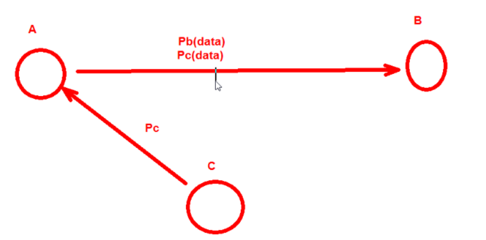
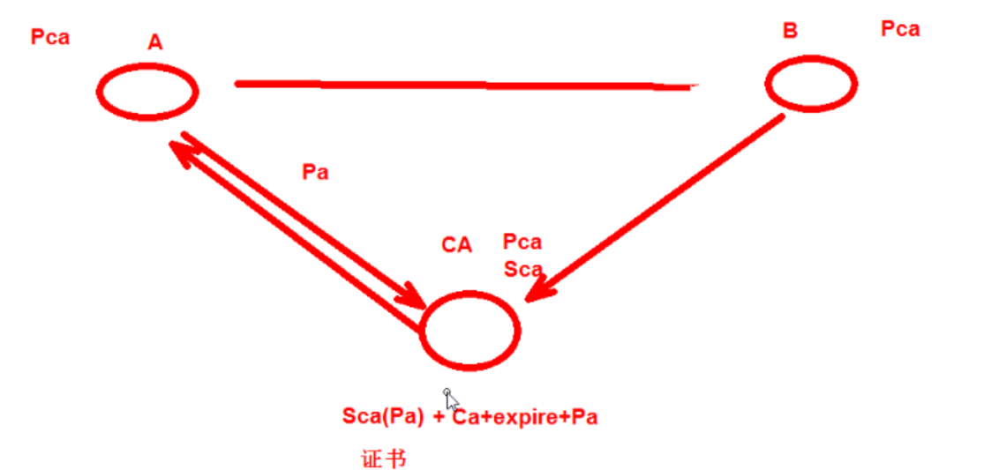
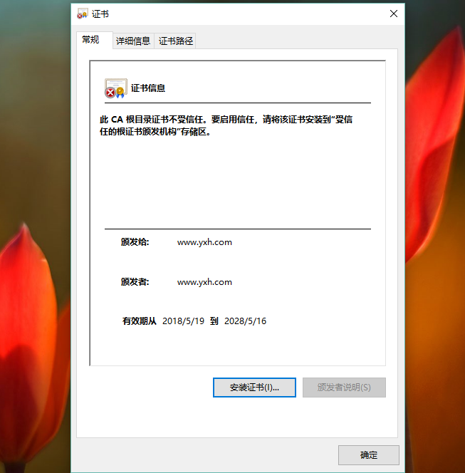

https://www.cnblogs.com/yxh168/p/9058043.html

# [CA证书和SSL/TLS介绍及公钥私钥加密](https://www.cnblogs.com/yxh168/p/9058043.html)

### 数字签名

  用自己的私钥给数据加密就叫数字签名

### 公钥传输威胁

  在A和B的通信中,C可以把自己的公钥发给A,让A把C的公钥当成B的公钥,这样的话.B拿到加密数据反而无法解密,而C却可以解密出数据.从而实现C截获AB之间的数据

  所以在两者的通信中必须要对公钥的来源进行确认

 A和B如果想安全交换公钥,就必须通过CA(证书颁发机构) 证书的通信过程    A和B首先都内置了CA的公钥

 根CA的证书是自己给自己签名的(自签名)

 

 

### CA和证书 

 PKI: Public Key Infrastructure 

​    签证机构：CA（Certificate Authority） 

​    注册机构：RA 

​    证书吊销列表：CRL 

​    证书存取库： X.509：定义了证书的结构以及认证协议标准 

​                版本号  序列号  签名算法  颁发者  有效期限  主体名称  主体公钥  CRL分发点   扩展信息  发行者签名 

 

### SSL

  SSL(Secure  Socket  Layer)和TLS(Transport  Layer Security )本身是一个东西

  实现功能: 机密性   认证  完整性   重放保护(正确同样的数据不能重复发送)

  两阶段协议，分为握手阶段和应用阶段 

  握手阶段(协商阶段):

​      客户端和服务器端认证对方身份（依赖于PKI体系，利用数字证书进行 身份认证）,并协商通信中使用的安全参数、密码套件以及主密钥.

​      后续通信使用的所有密钥都是 通过MasterSecret生成。 

   应用阶段:

​      在握手阶段完成后进入,在应用阶段通信双方使用握手阶段协商好的密钥进行安全通信 

  taobao 证书  https的通信过程

  taobao 证书内容包含 SCA(Ptaobao) CA密钥加密签名过的taobao公钥 + CA证书描述+过期时间+证书其它信息 taobao网站把证书发给客户端

  客户端由于信任CA并且拿到了CA的公钥,就可以解密SCA(Ptaobao) 获得taobao的公钥 Ptaobao

  客户端(浏览器)会在本地生成一个对称密钥(key)用taobao的公钥加密发送给taobao Ptaobao(key)  sendto taobao

  taobao通过自己的私钥解密得到客户端发送过来的key  Staobao(Ptaobao(key)) = key 这样在客户端和服务端都存在相同的对称密钥key

  客户端和服务端就可以通过key(data)对大量的网页数据进行对称加密,实现通信双方的安全通信

 

### OpenSSL 开源实现证书申请和颁发

  base64编码   是6bit编码    包含字符a-z,A-Z,/,+ 总共64个符号

  生成私钥 

​    openssl genrsa -out /PATH/TO/PRIVATEKEY.FILE NUM_BITS  (umask 077; openssl genrsa –out test.key –des 2048)  -des表示对密钥对称称加密

​    openssl rsa -in test.key –out test2.key     将加密key解密

  从私钥中提取出公钥 

​    openssl rsa -in PRIVATEKEYFILE –pubout –out PUBLICKEYFILE openssl rsa –in test.key –pubout –out test.key.pub 

 

### 实验:向CA申请证书

###### 建立Root CA

  \1. 创建CA重要的配置文件openssl的配置文件：/etc/pki/tls/openssl.cnf 

  \2. 默认CA的工作目录在   /etc/pki/CA 

 创建CA服务器

###### 用户或者服务器申请证书

 CA签发证书(客户端)

 

###### windows下查看生成的证书信息和安装证书

可以把证书cacert.pem下载到windows中进行可视化查看证书信息
需要.pem(cacert.pem)后缀名改成windows能识别的.cer(cacert.cer)或者.crt   点击安装证书可以把此证书安装到可信任的证书路径中

 

###   证书管理

   查看证书中的信息： 

   openssl x509 -in /PATH/FROM/CERT_FILE -noout   -text|issuer|subject|serial|dates 

   openssl ca -status SERIAL  查看指定编号的证书状态 

  吊销证书 

​    在客户端获取要吊销的证书的serial 

​       openssl x509 -in /PATH/FROM/CERT_FILE -noout -serial -subject 

​    在CA上,根据客户提交的serial与subject信息,对比检验是否与index.txt文件中的信息一致,吊 销证书： 

​      openssl ca -revoke /etc/pki/CA/newcerts/SERIAL.pem 

   指定第一个吊销证书的编号,注意:第一次更新证书吊销列表前,才需要执行 echo 01 > /etc/pki/CA/crlnumber 

   更新证书吊销列表 openssl ca -gencrl -out /etc/pki/CA/crl.pem 

   查看crl文件： openssl crl -in /etc/pki/CA/crl.pem -noout -text 

 

### SSH安全服务  

  ssh: secure shell, protocol, 22/tcp, 安全的远程登录

  两种方式的用户登录认证： 

   1.基于password 

​       1.客户端向服务端发送SSH请求

​       2.服务端收到请求,发送公钥给客户端

​       3.客户端输入用户名和密码通过公钥加密回传给服务端

​       4.服务端通过私钥解密得到用户名和密码和本地的用户名密码进行验证匹配

 

   2.基于key

​       1.首先在客户端生成一对密钥对

​       2.客户端将公钥拷贝给服务端并重命名为 authorized_keys

​       3.客户端向服务端发送一个连接请求,信息包括ip,用户名

​       4.服务端得到客户端消息后,会到authorized_keys查找是否有对应信息并且随机生成一个字符串

​       5.服务端把随机生成的字符串用客户端公钥加密发送给客户端

​       6.客户端接收到加密字符串后用自己的私钥对字符串进行解密,并且把解密后的字符串发送给服务端

​       7.服务端会把接收到的字符串和原来自己生成的随机字符串进行验证匹配

 ssh客户端：

   1.客户端配置文件 /etc/ssh/ssh_config       ssh服务端的配置文件  /etc/ssh/sshd_config

   ssh客户端会在第一次连接的时候把远程主机的公钥下载到本机,如果需要冒充其它已经连接过的主机,需要把对方的私钥拷贝到本地来

 

### 实现基于ssh key的认证

  实现指定用户无密码连接,默认是root用户 在ssh-copy-id命令中指定特定的用户名就会把公钥文件拷贝到指定用户的家目录下

  ssh-copy-id  yxh@192.168.33.130

 View Code

 

多台主机之间实现相互key认证登录

   1.在一台主机A上生成一对密钥对所有主机使用同一密钥

   2.ssh-copy-id A

  *3.scp  -rp   /root/.ssh B:/root*

  **4.scp  -rp   /root/.ssh C:/root**

 

### ssh key认证脚本自动化

 expect匹配输出规则：

   \#Are you sure you want to continue connecting (yes/no)?
   \#root@192.168.33.129's password: