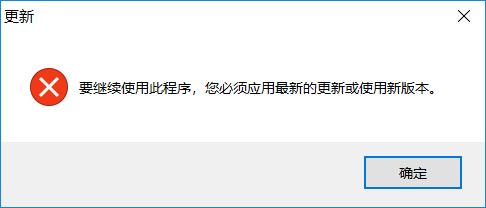
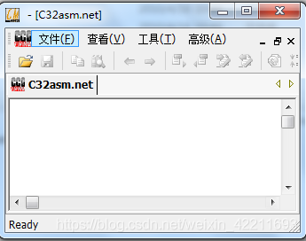
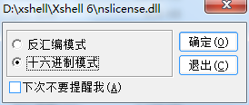
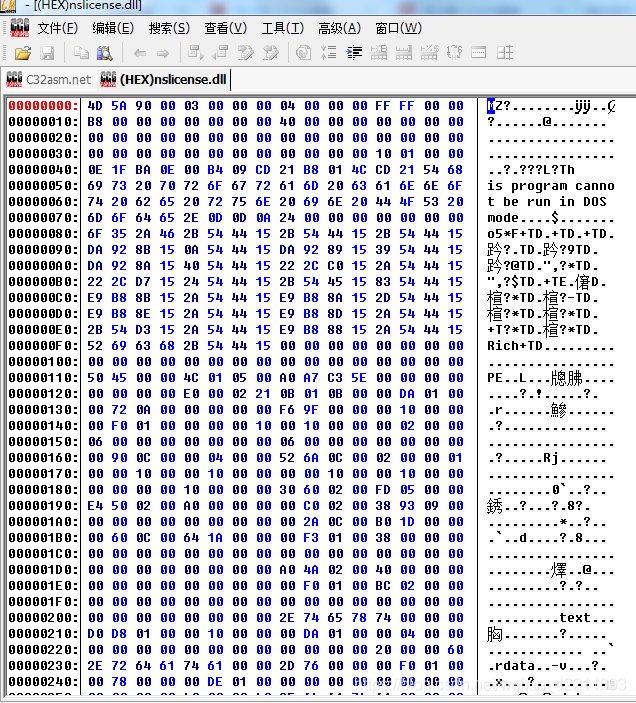
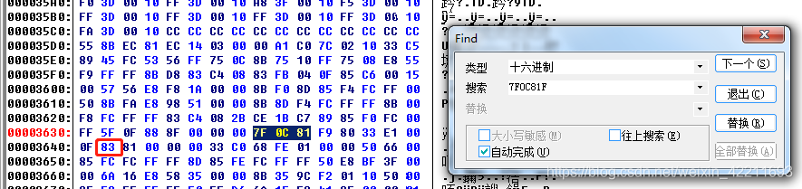

# 解决xshell6或者xftp6强制更新版本，但又无法下载文件的问题

今天又遇到下载安装了 Xshell 6 或者Xftp 6提示软件必须更新最新版否则不让使用！但是下载更新又提示下载文件失败？这是为啥呢？

解决方案如下：

软件加了时间判断今天过期，直接修改文件，让它不过期

**1.下载一个反汇编的软件c32asm，双击"C32Asm.exe"**，如下图

**2.找到xshell6或者xftp6安装目录下的nslicense.dll文件，用c32asm以16进制形式打开nslicense**

**3.快捷键"Ctrl+F"，搜索16进制"7F0C81F98033E1"**

将红框中原有的"86"修改成"83"，然后保存，并替换文件，重启xshell6即可，同样的xftp6也一样可用。

