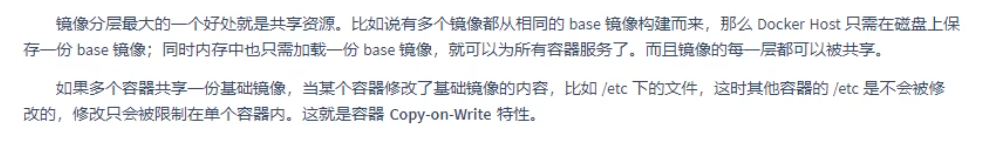
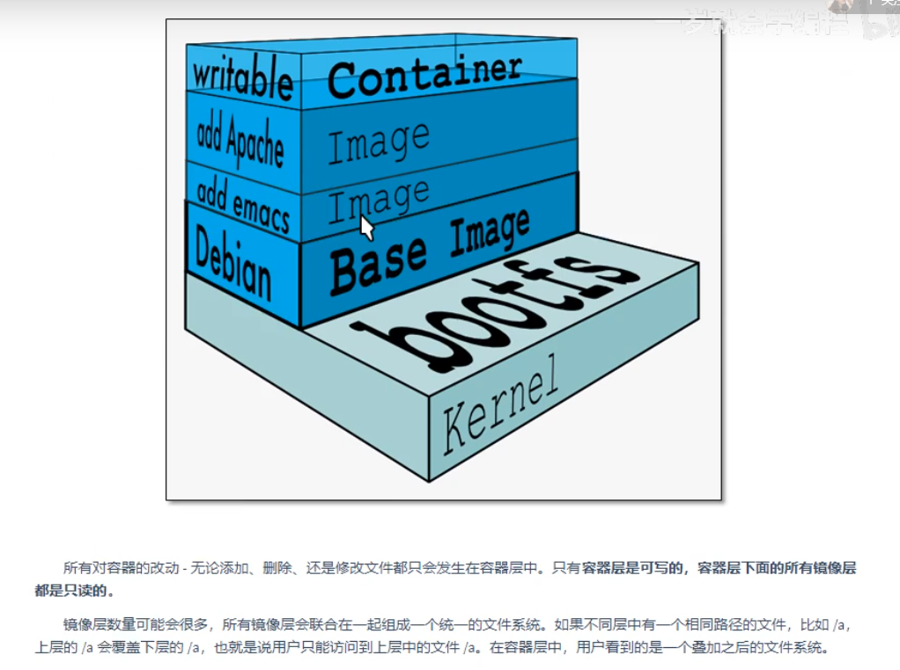
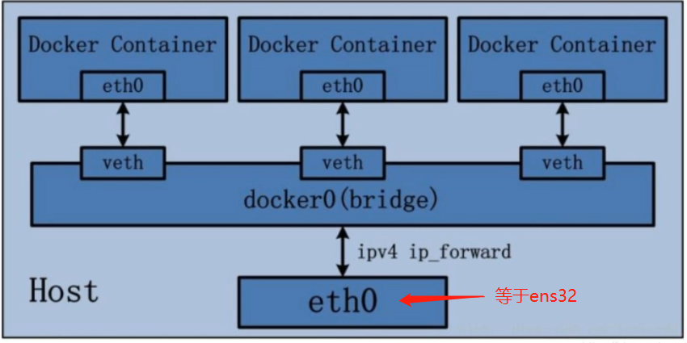
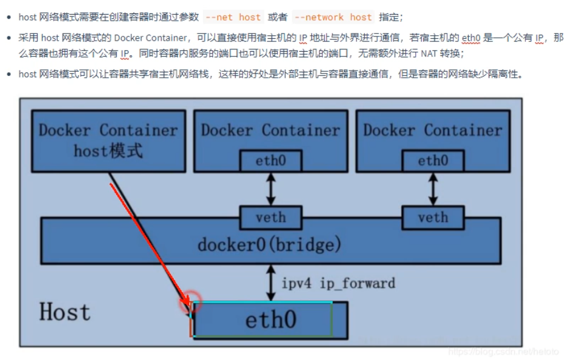
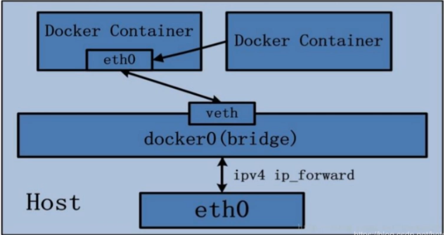

---

---

tar -zxvf apache...gz -C /usr/lcoal/tomcat    （-C 表示安装到指定目录下）

# 一.安装docker

**docker配置文件的路径**

```bash
/var/lib/docker/containers/[hash tag]/config.v2.json
#上面的config.v2.json是一个json串，我们用vim打开它，然后使用:%!python -m json.tool 将他格式化一下，这样才好看，以后再次打开，它还是格式化的
```


#### 1.1docker的仓库

https://www.docker.com/products/docker-hub


#### 1.2下载和安装

https://www.docker.com/products/docker-hub


# 二.安装教程官网

https://docs.docker.com/engine/install/centos/

下面的安装全是官方给我提供的方式

#### 2.1下载yum-config-manager的依赖yum-utils

```
yum install -y yum-utils
```


#### 2.2设置镜像源（使用阿里的镜像源）🔺很常用，把我们的docker镜像源设置成docker

```
sudo yum-config-manager --add-repo http://mirrors.aliyun.com/docker-ce/linux/centos/docker-ce.repo
```


#### 2.3Docker安装

​	下载最新的docker镜像

```
sudo yum install docker-ce docker-ce-cli containerd.io
```


#### 2.4启动docker

​	这是centos的命令了

```shell
systemctl start docker
```


#### 2.5参看docker的版本号

```bash
docker --version
```


#### 2.6官方建议检查一下docker是否真的运行

Verify that Docker Engine is installed correctly by running the `hello-world` image.

```bash
$ sudo docker run hello-world 
Unable to find image 'hello-world:latest' locally	# 本地没有找到hellow-world:latest镜像
latest: Pulling from library/hello-world			# 去远程镜像仓库拉了一下
b8dfde127a29: Pull complete 						# 拉取完成

"""
其实这说明了一个问题，docker首先会在自己的本地镜像仓库查看，有没有对应的镜像，有就使用，没有就去远程仓库拉取
"""
```

​	这个命令是去https://hub.docker.com/上拉去下来并马上安装


#### 2.7 拉取指定tag的镜像

​		如果你只想拉去下来，不想直接安装，可以docker pull hello-world

```
sudo docker pull hello-world:tag
```


#### 2.7docker的其他命令

```bash
# 启动 docker
sudo systemctl start docker

# 停止docker
sudo systemctl stop docker

#重启 docker
sudo systemctl restart docker

#设置开机启动
sudo systemctl enable docker

#查看docker状态
sudo systemctl status docker

#查看docker内容器的运行状态
sudo docker stats

#查看docker 概要信息	，可以查看我们配置的镜像源等等玩意
sudo docker info

#查看docker帮助文档
sudo docker --help

#查看docker的镜像
sudo docker images
```


# 三.配置镜像加速，设置国内镜像源

​		docker pull是从Docker Hub上拉取镜像， 因为是从国外获取，所以速度较慢

​		可以通过配置国内的镜像源的方式，从国内获取镜像，提高拉取速度。这里介绍中国科技技术大学的开业镜像: https://docker.mirrors.ustc.edu.cn 和 网易的开源镜像源: http://hub-mirror.c.163.com

​		USTC是老牌的Linux镜像服务提供者了， USTC的Docker镜像加速器速度很快。USTC和网易的优势之一就是不需要注册，属于真正的公共服务

​		


​	**编辑文件**  `daemon.json` 

```
vim /etc/docker/daemon.json

不存在自己创建一个，刚创建docker这个文件一般都是没有的，w
```


​	**添加mirror镜像源地址**如下

```json
{
    "registry-mirrors": ["https://docker.mirrors.ustc.edu.cn", "http://hub-mirror.c.163.com"]
}
```


​	**重新加载配置信息及重启docker服务**

```bash
#重新加载某个服务的配置文件
sudo systemctl daemon-reload

#重新启动 docker
sudo systemctl restart docker
```

这样就回去下载国内的资源了，速度快得的一匹


# 四.docker整体架构结构


**说一说docker的镜像分层技术**



共享资源，当你一改，必须修改配置，这个时候docker马上给你创建一个可写的容器层，新的可写容器层被加载到镜像的顶部。这一层通常称作“容器层”，容器层之下都叫镜像层




#### 4.1 image和container容器


#### 4.2 🔺服务的部署原则

```
遵循单一原则，一个容器只运行一个主进程。多个进程都部署在一个容器中话，弊端很多。比如更新某个进程的镜像时，其他进程也会被迫重启，如果一个进程出问题导致容器挂了，所有进程都将无法访问。再根据官网的提倡的原则而言。容器 = 应用 + 依赖的执行环境而不是像虚拟机一样，把一堆进程都部署在一起。

```


#### 4.3 Volume数据卷


​	说白了就是让容器与宿主机建立映射关系，容器中的数据映射到宿主机上， 我们**创建容器的时候**可以通过命令去指定数据卷， 但是不推荐在容器里面跑存储数据的服务比如Mysql Redis Es这些东西就老老实实的传统的弄，但是你想弄还是可以弄


#### 4.4 Registry 注册中心


###### 3.4.1 创建本地注册中心

​	去docker-hub上面拉取 创建本店注册中心的镜像来进行安装


# 五.常见的docker命令


#### 	1.2 删除镜像

```bash
#可以通过TAG或者IMAGE ID
docker rmi redis:5
docker rmi IMAGE ID
docker rmi redis #删除latest的redis

#删除容器
docker rm 容器名字或者容器ID号
```


#### 	1.3 搜索镜像

​	

```bash
#这个是直接查询仓库里面的镜像（docker-hub或者本地仓库，根据STARS来排序）
docker search redis
```


#### 	1.4 拉取镜像

​	

```
docker pull redis:TAG
```


# 六.常见的container命令


#### 	6.1 查看容器

```
docker ps --help
Usage:  docker ps [OPTIONS]

List containers

Options:
  -a, --all             显示所有的容器（不加-a仅仅显示运行的容器）
  -f, --filter filter   过滤输出
      --format string   Pretty-print containers using a Go template
  -n, --last int        显示n个上次创建的容器（包括所有状态） (默认-1)
  -l, --latest          显示最新创建的容器（包括所有状态）
      --no-trunc        不断输出显示（动态查询）
  -q, --quiet           仅显示容器ID
  -s, --size            显示总文件大小

```

​	演示：过滤已经退出的

```bash
docker ps -f status=exited
```

​	

​	演示：最后


​	演示：最后创建的两个容器组合使用

```
docker ps -l -n 2
```


# 七.🔺创建与启动容器

​	

```bash
#命令超级多，可以去官网上去查看https://docs.docker.com/engine/reference/commandline/run/
docker run --help  
docker run [OPTIONS] IMAGE [COMMAND] [ARG...]

简单的[options]如下
```

**🔺[options]如下**


#### 	7.1 创建并进入容器

​		以nginx为例子

###### 	运行容器，但是不能退出

```bash
#启动一个nginx容器，给他起个名字并映射一个端口（将linux的12345映射到容器的80端口上）,退出以后容器也跟着关闭了
docker run --name mynginx -p 12345:80 nginx	# 小写的p就需要自己指定映射了
```


```
docker run --name mynginx -P nginx # 大写的P，就是随机的将容器里面的80端口映射到宿主机上
```


###### 	🔺运行并进入命令行模式，但是不能退出，退出容器就关闭了，且外面还不能连

```bash
#进入容器内部, 必须写你到容器内部的位置，不然还是在外面跟不加 -it一样， 进入以后容器运行，但是nginx关闭了,退出以后容器也关闭了
docker -it run --name mynginx -p 12345:80 nginx /bin/bash
```


###### 	后台运行容器, 这个就很nice了

```bash
# -d就是daemon的意识
docker run -di --name mynginx -p 12345:80 nginx
```


###### 	进入容器，容器必须运行着才可以

```bash
#exec 就是英文execute的缩写
docker exec -it mynginx /bin/bash
```

​	

#### 7.2 启动和关闭已经创建的容器

```bash
docker start 容器名或者容器ID
docker stop  容器名或者容器ID
```


# 八.拷贝文件

###### 	前言：我可以将容器里面得拷贝到宿主机，也可以将宿主机里面得拷贝到容器里面

######  	注意：这些都是在宿主机中进行操作的

**如果我们需要将文件拷贝到容器内部可以使用cp命令**

```bash
docker cp 宿主机中需要拷贝的文件和目录 容器名称:容器目录
```


**可以将文件从容器里面拷贝出来**

```
docker cp 容器名称:容器目录 宿主机的目录
```


# 九.目录挂载（容器数据卷操作）

###### 	前言：

###### 			我们在创建容器的时候，将宿主机的目录与容器的目录进行映射，这样我们就可以通过修改宿主机的目录的文件从而去影响容器，而且这个操作是双向绑定的，也就是说容器内的操作也会影响到宿主机，实现备份功能

​			**但是容器被删除的时候，宿主机的内容并不会被删除。如果多个容器挂载同一个目录，其中一个容器被删除，其他容器的内容也不会收到影响**

> ​	容器与宿主机之间的数据卷属于引用的关系，数据卷是从外界挂载到容器内部中的，所以可以脱离容器的生命周期而独立存在，正式由于数据卷的生命周期并不等同于容器的生命周期，在容器退出或者删除以后，数据卷仍然不会受到影响，数据卷的生命周期会一直持续到没有容器使用他为止


```bash
#递归创建文件夹
mkdier -p /root/mytest
```


```bash
#指定目录挂载 ,双向改变
docker run -di --name nginx01 -p 21567:80 -v /usr/local/mytest/:/abc/123 nginx	
```


**匿名挂载，只需写容器的目录即可，宿主机的目录会在/var/lib/docker/volumes**

```bash
#匿名挂载
docker run -di --name nginx02 -p 21568:80 -v /us/local nginx #  镜像参数必须放在最后
```


**具名挂载，就是再/var/lib/docker/volumes 下面建立一个文件夹**

```bash
#具名挂载
docker run -di --name nginx03 -p 21569:80 -v my_mount_volumes:/usr/local/my_dir nginx #  镜像参数必须放在最后
```


**添加权限，只读和只写，一般设置成只读，读配置**

```bash
#只读
docker run -di --name nginx03 -p 21569:80 -v my_mount_volumes:/usr/local/my_dir:ro nginx	#  镜像参数必须放在最后

#读写
docker run -di --name nginx03 -p 21569:80 -v my_mount_volumes:/usr/local/my_dir:rw nginx	#  镜像参数必须放在最后
```


**挂载继承**

```bash
# 容器  centos7-01 指定目录挂载
docker run -di -v /mydata/docker_centos/data:/usr/local/data --name centos7-01 centos:7		#  镜像参数必须放在最后
#容器  centos7-04 和 centos7-05相当于继承centos7-01的容器挂载目录
docker run -di --volumes-from centos7-01 --name centos7-04 centos:7
docker run -di --volumes-from centos7-01 --name centos7-05 centos:7
```


**问题：如果我们在创建容器的时候没有挂载数据卷，这个时候我们也可改，通过配置文件**

```bash
docker inspect 容器名或者容器ID # 可以获取很多信息,这个命令很关键，很多东西都能在里面看到
#运行结果如下，我只截取了一部分，找到容器ID， 也可以通过docker ps或者docker ps -a 查看
[
    {
        "Id": "08fbe07aba0647173b824bbfaf66d47347d4f6ad967455a2d56d49657c33fe5f",
        "Created": "2021-07-18T14:44:50.279134978Z",
        "Path": "/docker-entrypoint.sh",
        "Args": [
            "nginx",
            "-g",
            "daemon off;"
        ],
```

- **第一步：先进入容器里面，创建一个目录用于挂载**
- **第二步: 关闭docker**
- **第三步：查看容器ID，通过docker inspect或者docker ps**
- **第四步：进入到对应容器的配置目录**

```bash
[root@iZ8vbjbq1n4ejerpoqat7zZ]#cd/var/lib/docker/containers/08fbe07aba0647173b824bbfaf66d47347d4f6ad967455a2d56d49657c33fe5f/
[root@iZ8vbjbq1n4ejerpoqat7zZ]# ls
checkpoints                                                                hostname         resolv.conf
config.v2.json                                                             hosts            resolv.conf.hash
```

- **第五步：vim config.v2.json修改如下，添加到MountPoints{}里面**

```bash
    "MountPoints": {
        "/usr/src": {	# 容器中要挂载的目录
            "Source": "/usr/src/python_src/test/tmp",	# 宿主机要挂载的目录
            "Destination": "/usr/src",					# 容器中要挂载的目录
            "RW": true,									# 读写模式
            "Name": "",
            "Driver": "",
            "Type": "bind",
            "Propagation": "rprivate",
            "Spec": {
                "Type": "bind",
                "Source": "/usr/src/python_src/test/tmp/",	# 宿主机中要挂载的目录
                "Target": "/usr/src"						# 容器中要挂载的目录
            },
            "SkipMountpointCreation": false
        }
    }
    
    
        "MountPoints": {"/usr/src": {"Source": "/usr/src/python_src/test/tmp","Destination": "/usr/src","RW": true,"Name": "","Driver": "","Type": "bind","Propagation": "rprivate","Spec": {"Type": "bind","Source": "/usr/src/python_src/test/tmp/","Target": "/usr/src"},"SkipMountpointCreation": false}}
```

**第六步：vim hostconfig.json,修改如下， 将容器目录/user/src绑定到主机/usr/src/python_src/test/tmp/**

```bash
vim hostconfig.json
{
    "Binds": [
        "/usr/src/python_src/test/tmp/:/usr/src"	# 就是这里
    ],
    "ContainerIDFile": "",
    "LogConfig": {
        "Type": "json-file",
        "Config": {}
    },
    "NetworkMode": "default",
    "PortBindings": {
        "80/tcp": [
            {
                "HostIp": "",
                "HostPort": "12345"
            }
        ]
    },
```

**得出结论，不得行。 看了一些贴吧，都是说，官方都没有给方法。。所以啊，还是老实干，停到docker，将重要得文件拷贝出来，重新建一个镜像挂载，旧的镜像不要删，以备不时之需**


# 十. 查看挂载关系

**第一步：进入/var/lib/docker/volumes**

```bash
[root@iZ8vbjbq1n4ejerpoqat7zZ volumes]# cd /var/lib/docker/volumes/
[root@iZ8vbjbq1n4ejerpoqat7zZ volumes]# ll
total 28
brw------- 1 root root 253, 1 Jul 18 21:12 backingFsBlockDev
drwx-----x 3 root root   4096 Jul 18 23:43 ea8111d647b32f00befa9127fc7eee8bf294eb8f6d6702cddac47801c75a0174
-rw------- 1 root root  32768 Jul 18 23:43 metadata.db
```

**第二步：执行命令参数**

```bash
[root@iZ volumes]# docker volume inspect ea8111d647b32f00befa9127fc7eee8bf294eb8f6d6702cddac47801c75a0174

[
    {
        "CreatedAt": "2021-07-18T23:45:21+08:00",
        "Driver": "local",
        "Labels": null,
        "Mountpoint": "/var/lib/docker/volumes/ea8111d647b32f00befa9127fc7eee8bf294eb8f6d6702cddac47801c75a0174/_data",
        "Name": "ea8111d647b32f00befa9127fc7eee8bf294eb8f6d6702cddac47801c75a0174",
        "Options": null,
        "Scope": "local"
    }
]
```

**问题：我们这么多对应的目录卷对应哪一个容器呢？**

**答案：通过docker inspect 容器名或者容器ID**

```bash
[root@iZ volumes]# docker insepct 容器名或者容器ID
        "Mounts": [	
            {
                "Type": "volume",
                "Name": "ea8111d647b32f00befa9127fc7eee8bf294eb8f6d6702cddac47801c75a0174",	# 这个就是
                "Source": "/var/lib/docker/volumes/ea8111d647b32f00befa9127fc7eee8bf294eb8f6d6702cddac47801c75a0174/_data",
                "Destination": "/usr/src",
                "Driver": "local",
                "Mode": "",
                "RW": true,
                "Propagation": ""
            }
        ],
```


# 十一. docker构建

#### 前言：

​			我们可以通过公共仓库拉取镜像使用，但是，有时候公共仓库拉取的镜像并不符合我们的需求，尽管已经从繁琐的部署工作中解放出来，但是实际开发时，我们可能希望镜像包含完整的环境，在其他机器上拉取打包完整的镜像，直接运行即可。

​			docker支持自己构建镜像，还支持将自己的镜像上传至公共仓库，镜像构建可以通过以下方式来实现：

- `docker commit`： 从容器创建一个新的镜像
- `docker build`: 配合dockerfile文件创建镜像


​			下面我们先通过`docker commit`来实现镜像构建

​			目标：接下来我们通过基础镜像centos:7,在该镜像中安装jdk和tomcat以后将其制作为一个新的镜像mycentos:7


## 1. 创建容器


```bash
# 拉取镜像
docker pull centos:7
# 创建容器
docker run -di --name centos7 centos:7	# 不需要暴露端口，制作成镜像，到时候通过镜像生成容器的时候自己指定
```


## 2. 拷贝资源

```bash
docker cp ./apache-tomcat-9.0.50.tar.gz centos7:/root
docker cp ./jdk-8u211-linux-x64.tar.gz centos7:/root
```


## 3. 安装资源

```bash
#进入容器
docker exec -it centos7 bash
-----------------以下操作都在容器内部执行------------------------
# 切换到 /root 目录
cd /root

# 创建 java 和 tomcat目录
mkdir -p /usr/local/java
mkdir -p /usr/local/tomcat

#将jdk和tomcat 解压至容器 /usr/local/java 和 /usr/local/tomcat 目录中
tar -zxvf apache-tomcat-9.0.50.tar.gz -C /usr/local/tomcat/
tar -zxvf jdk-8u211-linux-x64.tar.gz -C /usr/local/java/

#配置jdk环境变量
vi /etc/profile	# 这个镜像里面没有vim所有我们使用vi

#在环境变量中添加以下内容
export JAVA_HOME=/usr/local/java/jdk1.8.0_211
export PATH=$PATH:$JAVA_HOME/bin

# 重新加载环境变量文件
source /etc/profile

# 测试环境是否配置成功
java -version

# 删除容器内部jdk和tomcat
rm -rf /root/apache-tomcat-9.0.50.tar.gz
rm -rf /root/jdk-8u211-linux-x64.tar.gz
```


**补充：tomcat的启动命令**

```bash
cd /usr/local/tomcat/apache-tomcat-9.0.50/bin
bash startup.sh	# 别人的不需要加bash，卧槽了

curl http://localhost:8080	#测试tomcat是否安装完成
```


## 4. 构建镜像

```bash
docker commit [OPTIONS] CONTAINER [REPOSITORY[:TAG]]
docker commit -a="zhangmingzhu" -m="jdk9 and tomcat9" centos7 mycentos:7
```

- `-a`: 提交的镜像作者auther
- `-c`：使用dockerfile指令来创建镜像
- `m` : 提交时的说明文字（message）
- `-p`: 在commit时，将容器暂停
- `centos7`：我将要做成镜像的容器
- `mycentos:7`: mycentos是做成的镜像名，7是它的tag


**补充说明： 做成的镜像存放在本地，可以通过`docker images`来查看**

```bash
[root@iZ8vbjbq1n4ejerpoqat7zZ tmp]# docker images
REPOSITORY    TAG       IMAGE ID       CREATED         SIZE
mycentos      7         5e5ea80e951b   5 seconds ago   626MB	#这就是的
nginx         latest    4cdc5dd7eaad   12 days ago     133MB
redis         5         aec43d10ed3b   3 weeks ago     98.4MB
hello-world   latest    d1165f221234   4 months ago    13.3kB
centos        7         8652b9f0cb4c   8 months ago    204MB
```


## 5. 通过自己创建的镜像生成容器

```bash
# 生成容器
docker run -di --name cts7 -p 12345:8080 mycentos:7

#进入容器
docker exec -it cts7 bash

# 初始化配置文件
source /etc/profile		#  不知道为什么进来它不生效，奶奶个腿的

# 检查java是否配置成功
java -version			# 必须source /etc/profile 以后才可以，不知道为什么？ 下面解答
```

**为什么在/etc/profile中配置的环境变量在构建容器以后会会失效了**

```bash
如果在docker中设置了环境变量，肯定希望下次进入容器时自动生效。如果是在：

/etc/profile

中设置的，再次进入容器时环境变量会失效，解决办法是将环境变量设置在：

/root/.bashrc	#为什么不这样呢？这是为了后面的dockerfile演示用的

中，再次登录容器仍然有效。

更好的解决办法是使用Dockerfile构建镜像，并使用entrypoint进行配置。
```


## 6. 将自己的镜像推送到远程仓库

```bash
# 登录docker
docker login

# 重新构建镜像， 为什么重构了？因为如果我们要推送到远程dockerhub上必须在我们制作的镜像前面加上我们的dockerID
docker commit -a="zmz1054920870" -m="jdk8 and tomcat9" centos7 zmz1054920870/mycentos:007	# zmz1054920870/mycentos:007这里必须加上zmz1054920870这个dockerID

#推送到远程仓库
docker push zmz1054920870/mycentos:007	# zmz1054920870必须和docker login 登录时的用户名一致

```


# 十二. dockerfile

## 前言

​		上面我们构建自己的镜像的时候是怎么操作的呢？

```python
1.	去官网下载centos:7镜像
2.	根据官网的镜像创建了一个容器，进入容器创建目录
		mkdir -p /usr/lcoal/java
    	mkdir -p /usr/local/tomcat
3.	将宿主机的jdk和tomcat的资源拷贝到容器
4.	在容器内部安装了jdk和tomcat
        tar -zxvf tomcat...gz -C /usr/local/tomcat
        tar -zxvf apache...gz -C /usr/lcoal/tomcat
        vi /etc/profile	#配置环境变量
5.	将这个已安装jdk和tomcat的容器重新构建为一个新镜像 mycentos:7
```

​		上面是我们手动一步一步构建的，那么可以自动帮我们构建？答案是可以的。。docker提供了dockerfile来帮助我们偷懒


## 1. dockerfile常用指令


#### 1.1	FROM


​		语法:	`FROM <image>:<tag>`

​		指明构建的新镜像是来自于哪个基础镜像，如果没有选择tag，那么默认值为latest

```bash
FROM centos:7
```

> ​	如果不以任何镜像为基础，那么写法为FROM scratch . 官方说明： scratch 镜像是一个空镜像， 可以用于构建busybox等超小镜像，可以说真正的从零开始构建属于自己的镜像（容器开始工程师了）


#### 1.2	~~MAINTAINER(deprected)~~过时了

​		`maintainer：译 维护者`

​		语法:	`MAINTAINER <name>`

​		指明镜像维护者及联系方式（一般是邮箱地址）.官方已说明它过时了，推荐使用LABEL。

```bash
MAINTAINER zmz1054920870 <xxxx@163.com>
```


#### 1.2	ARG

​			语法：`ARG <name>[=<default value>]`

​			`ARG` 指令定义了一个变量，用户可以在构建时使用 `docker build` 命令使用`--build-arg <varname>=<value>` 标志将其传递给构建器(就是dockerfile中的其他命令可以使用这个参数)。如果用户指定了未在 Dockerfile 中定义的构建参数，则构建会输出警告。


#### 1.3	LABEL


​		语法:	`LABEL <key>=<value> <key>=<value> <key>=<value> ...`

​		功能是为镜像指定标签。也可以使用LABEL来指定镜像作者

```bash
LABEL	maintainer="zmz1054920870"
```


#### 1.4	WORKDIR


​		语法：`WORKDIR /path/workdir`

​		为RUN、CMD、ENTRYPOINT以及COPY和ADD设置工作目录，这些命令进来是在哪一个目录下执行的

```bash
WORKDIR /usr/local
```


​		

#### 1.5	RUN


​		语法:	`RUN <command>`

​		构建构建完容器之后运行shell命令，比如构建的容器中我们现在想在/usr/local目录下创建一个java目录

```bash
RUN mkdir -p /usr/local/java
```

> ​	Dokcerfile中的命令每执行一条即产生一个新的镜像，当前命令总是在最新的镜像上执行。如下Dockerfile：
>
> ```Dockerfile
> RUN cd /usr/share/ngnix/html
> RUN npm install
> ```
>
> 本来是想在/usr/share/nginx/html目录下执行npm install安装相关module的，但是第二条指令的执行目录并没有在我们希望的/usr/share/ngnix/html下，而是重新回到了/bin/sh(WORKDIR)根目录下执行。那么我们就必须得在同一条RUN指令中执行这两个命令，当然，也可以把相关目录直接拷贝到根目录下，不过这样会造成文件目录混乱，不建议使用这个办法。Dockerfile RUN同时执行多条命令格式如下所示：
>
> RUN /bin/sh -c 'cd /usr/share/nginx/html/ && npm install'
>
> RUN也可以分开写，dockerfile的细节请看docker单独讲解那一篇


#### 1.6	ADD（可以有多个）


​		语法：	`ADD 资源名 容器中的位置`

​		拷贝文件或者目录到镜像中。src可以是一个本地文件或者是一个本地压缩文件，压缩文件会自动解压。还可以是一个url，如果吧src写成一个url， 那么ADD就类似于wget命令， 然后自动下载和解压

```bash
ADD jdk-8u211-linux-x64.tar.gz /usr/local/java
ADD apache-tomcat-9.0.50.tar.gz /usr/lcoal/tomcat
```


#### 1.7 COPY


​		语法：	`COPY <src>...<dest>`

​		拷贝文件或目录到镜像中，只是不支持自动下载和解压

```bash
COPY jdk-8u211-linux-x64.tar.gz /usr/local/java
```


#### 1.8	EXPOSE

​		

​		语法:	`EXPOSE <post> [<port>/<protocol>...]`

​		暴露容器运行时的监听端口给外部， 可以指定端口是监听TCP还是UDP，如果为指定协议，则默认为TCP， 暴露出来以后才可以映射

```bash
EXPOSE 80 443 8080/tcp
```

> ​	如果想使用容器和宿主机的端口有映射关系，必须在容器启动的时候加上-p参数


#### 1.9	ENV(可以有多个)


​		语法: `ENV <key> <value>`添加单个 ， `ENV <key>=<value> ...`添加多个

​		设置容器内环境变量

```bash
ENV JAVA_HOME /usr/local/java/jdk1.8.0_211/
ENV PATH $PATH:$JAVA_HOME/bin
```


#### 1.10	CMD

​		语法:

- `CMD ["executablefile", "param1", "param2"]`

```bash
CMD ["/usr/local/tomcat/bin/catalina.sh", "run"]
```

- `CMD ["param1", "param2"]`

```bash
CMD ["echo", "$JAVA_HOME"]
```

- `CMD command param1 param2`

```BASH
CMD echo $JAVA_HOME
```

​		启动容器时执行的shell命令。dockerfile中只能有一条CMD指令。如果设置多条CMD， 只有最后一条CMD会生效

```BASH
CMD echo $JAVA_HOME
```

> ​	如果创建容器的时候指定了命令，则CMD命令被替代，加入镜像叫`centos:7`,创建容器时命令是`docker run -it --name centos7 centos:7 echo "helloworld"`或者 `docker run -it --name centos7 centos:7 /bin/bash`, 就不会输出`$JAVA_HOME`的环境变量信息了，因为CMD命令被`echo "hellowrold"`、`/bin/bash`覆盖掉了.


#### 1.11	ENTRYPOINT

​		

​		语法：

- `ENTRYPOINT ["executablefile", "param1", "param2"]`

```bash
ENTRYPOINT ["/usr/local/tomcat/bin/catalina.sh", "run"]
```

- `ENTRYPOINT command param1 param2`

```BASH
ENTRYPOINT echo $JAVA_HOME
```


​		启动容器时执行shell命令，同CMD类似，但是不会被docker run 命令行指定的参数所覆盖。 在dockerfile中只能有一条ENTRYPOINT指令。如果设置了多条ENTRYPOINT指令，只有最后一条ENTRYPOINT会生效

```bash
ENTRYPOINT echo $JAVA_HOME
```

> - ​	如果在dockerfile中同时写了ENTRYPOINT和CMD， 并且CMD指令不是一个完整的可执行命令，那么CMD指定的内容将会作为ENTRYPOINT的参数；
> - ​    如果dockerfile中同时写了ENTRYPOINT和CMD，并且CMD是一个完整的指令，那么它两会项目覆盖，谁在最后谁生效


#### 1.12	VOLUME

​		

​		指定容器挂载点到宿主机自动生成的目录或者其他容器。一般的使用场景为需要持续化存储数据时

```bash
# 容器 /var/lib/mysql 目录会在运行时自动挂载为匿名卷，匿名卷在宿主机的 /var/lib/docker/volumes 目录下
VOLUME ["/var/lib/mysql"]
```

> ​	一般不会在dockerfile中用到， 更常见的还是在docker run 的时候通过-v指定数据卷


# 十三. dockerfile实战(jdk + tomcat)


​		接下来我们通过基础镜像 `centos:7`, 在该镜像中安装jdk和tomcat以后将其制作为一个新的镜像`mycentos:7`

​		创建目录

```bash
mkdir -p /usr/local/dockerfile	#一般都会这么做，在这个目录下存放我们的Dockerfile文件，这个目录也不一定叫dockerfile
```

​		编写dockerfile文件

```bash
vi Dockerfile					#Dockerfile文件必须是大写的
```

​		Dockerfile文件 内容如下

```bash

# 指明构建的新镜像是来自于 centos:7 基础镜像
FROM centos:7

# 通过镜像标签声名作者的信息
LABEL maintainer="zmz1054920870"

#设置工作目录
WORKDIR /usr/local

# 新镜像创建成功以后创建指定目录
RUN mkdir -p /usr/local/java && mkdir -p /usr/local/tomcat

# 拷贝文件到镜像中并解压,这里不需要给定资源的具体路径，在build中进行指定
ADD apache-tomcat-9.0.50.tar.gz /usr/local/tomcat	# apache-tomcat-9.0.50.tar.gz我们不用写具体路径，直接给名字就行，因为在docker build的时候我才给定这个资源 的具体路径
ADD jdk-8u211-linux-x64.tar.gz /usr/local/java		# jdk-8u211-linux-x64.tar.gz我们不用写具体路径，直接给名字就行，因为为在docker build的时候我才给定这个资源 的具体路径

# 暴露容器运行时的 8080监听端口给外部
EXPOSE 8080

#设置容器内 JAVA_HOME环境变量
ENV JAVA_HOME /usr/local/java/jdk1.8.0_211
ENV PATH $PATH:$JAVA_HOME/bin

#容器启动时启动tomcat
CMD ["/usr/local/tomcat/apache-tomcat-9.0.50/bin/catalina.sh", "run"]	#catalina.sh run ，这个run是把日志任务阻塞并输出，占用前台任务（就是你现在毛都不能干，这个任务一致阻塞执行。举个通俗的例子，我们使用tar -zxvf 解压一个包的时候，在解压过程中，我们是不是啥都不能干，而且一直在跳解压的详细信息。这就是一个前台任务，前台阻塞就是前台一直被占用执行这个任务），为什么呢？ 因为容器里面必须要有前台任务在执行，否则容器直接就退出了。。 这里的tomcat如果我们使用startup执行，由于他是一个后台运行的任务，docker在使用该镜像创建容器之后，docker发现你都没有一个前台任务，马上给你退出了。。 
🔺那为什么我们docker exec -it mycentos7 bash 的时候没有发现前台任务呢？ 前台任务不是应该阻塞了我们进程。。我们应该啥也干不了才对啊。。 
解释： 因为我们是通过-it + bash 进入的，我们进入的是一个命令行，进入的是一个子进程当中，主进程中还是被tomcat的前台任务所占据着的


**容器里面必须要有前台任务在执行，否则容器直接就退出了**

- hello-world 镜像就是一个例子，你使用hello-world镜像创建一个容器，然后docker ps 你会发现它没有启动，因为这个镜像刚生成容器的那一刻，docker发现你一个前台任务都没有，docker会认为你没有必要开着，就给你退出了。
- 可以使用hello-world镜像试试很直观


```


​		构建镜像

```bash
docker build -f /usr/local/dockerfile/Dockerfile -t mycentos:7 /root/	#最后的这个/root/就是给前面的ADD中的资源apache-tomcat-9.0.50.tar.gz给定具体路径， 具体执行过程如下，它是安装Dockerfile中的步骤一步一步执行的

[root@iZ8vbjbq1n4ejerpoqat7zZ dockerfile]# docker build -f /usr/local/dockerfile/Dockerfile -t mycentos:7 /root/
Sending build context to Docker daemon  206.8MB
Step 1/10 : FROM centos:7
 ---> 8652b9f0cb4c
Step 2/10 : LABEL maintainer="zmz1054920870"
 ---> Running in 2223ea16b13a
Removing intermediate container 2223ea16b13a
 ---> 20c47a0cf656
Step 3/10 : WORKDIR /usr/local
 ---> Running in ac68f8818de3
Removing intermediate container ac68f8818de3
 ---> 5a8adbff358f
Step 4/10 : RUN mkdir -p /usr/local/java && mkdir -p /usr/local/tomcat
 ---> Running in 3892c41f80ef
Removing intermediate container 3892c41f80ef
 ---> 376a57cdf5d5
Step 5/10 : ADD apache-tomcat-9.0.50.tar.gz /usr/local/tomcat
 ---> d707babdf60b
Step 6/10 : ADD jdk-8u211-linux-x64.tar.gz /usr/local/java
 ---> c4d33a243c93
Step 7/10 : EXPOSE 8080
 ---> Running in 5eec3ad59bfe
Removing intermediate container 5eec3ad59bfe
 ---> 7db595c00380
Step 8/10 : ENV JAVA_HOME /usr/local/java/jdk1.8.0_211
 ---> Running in 2aaf40d3f34d
Removing intermediate container 2aaf40d3f34d
 ---> 3b780fa771be
Step 9/10 : ENV PATH $PATH:$JAVA_HOME/bin
 ---> Running in f53880db6d42
Removing intermediate container f53880db6d42
 ---> 62cd2ba76c57
Step 10/10 : CMD ["/usr/local/tomcat/bin/catalina.sh", "run"]
 ---> Running in d865beba7c4a
Removing intermediate container d865beba7c4a
 ---> e26c0acc1b7f
Successfully built e26c0acc1b7f
Successfully tagged mycentos:7

```

​		

# 一十四. Docker镜像的备份恢复迁移

​		为了备份镜像，我们有以下几个选择:

- 我们可以将指定镜像保存成tar归档文件，需要使用时将tar包恢复为镜像即可
- 登录DockerHub注册中心，将镜像推送至DockerHub仓库方便使用;
- 搭建私有镜像仓库，将镜像推送至私有镜像仓库方便使用


​		接下来我们通过tar归档文件的方式实现镜像的备份恢复迁移


## 1.镜像备份

​		使用 `docker save`将指定镜像保存成tar归档文件

```bash
docker save [OPTIONS] xxx.tar j
docker save -o /root/mycentos7.tar mycentos:7
```

- `-o` : 镜像打包后的归档文件输出的目录


## 2.镜像恢复

​		使用`docker load` 导入docker save 命令导出的镜像归档文件

```bash
docker load [OPTIONS]
docker load -i mycentos7.tar
```

- `--input， -i` ： 指定导入的文件
- `--quiet， -q` ： 精简输出信息


# 一十五. docker网络


## 1. 默认网络

​		安装docker以后，会默认创建三种网络， 可以通过`docker network ls`查看

```bash
[root@iZ8vbjbq1n4ejerpoqat7zZ dockerfile]# docker network ls
NETWORK ID     NAME      DRIVER    SCOPE
8dc057629674   bridge    bridge    local
78932057c8dd   host      host      local
b9c644a809b3   none      null      local
```


​		在学习docker网络之前， 我们有必要先来了解一下这几种网络模式都是什么意思

| 网络模式  | 简介                                                         |
| --------- | ------------------------------------------------------------ |
| bridge    | 为每一个容器分配、设置IP等，并将容器连接到一个 `docker0`虚拟 网桥，默认为该模式（停到容器以后，这个对等网桥就销毁了） |
| host      | 容器将不会虚拟出自己的网卡，配置自己的IP等，而是使用宿主机的ip和端口 |
| none      | 容器有独立的Network namespace。 但并没有对其进行任何网络配置，如分配veth pair 和网桥连接，IP等 |
| container | 新创建的容器不会创建自己的网卡和配置自己的IP，而是和一个指定的容器共享IP、端口范围等 |


#### 1.1	bridge 网络模式




​			 在该模式中，Docker守护经常创建了一个虚拟以太网桥`docker0`, 新建的容器会自动连接到这个接口上，附加在其上的任何网卡之间都能自动转发数据包。

​			默认情况下，守护进程会创建一对对等的虚拟设备接口`veth pair`， 将其中一个接口设置为容器的`eth0`接口（ 容器的网卡）, 另外一个接口放置在宿主机的命名空间中，以类似`vethxxx`这样的名字命名，从而将宿主机的所有容器连接到这个内部网络上

​			比如我运行一个基于`busybox`镜像构建的容器`bbx01`，查看`ip addr`

> 	<div bgcolor="yellow">busybox 被称为嵌入式Linux的瑞士军刀，整合了很小的unix下的通用功能到一个小的可执行文件中</div>

- veth 和容器的eth0 好像是在同一个网段，比如主机的docker0

🔺 在同一个宿主机之中，如果两个容器都采用bridge模式，在任意一个容器中都可以ping 通另外一个容器，因为他们docker0就相当于网关，这两个容器都是这个网关下同一个网段中的。。所以可以ping通，证明容器之间可以通信了

```
比如：
docker0 IP 		192.168.1.5
容器1 IP		   192.168.1.1
容器2 IP		   192.168.1.2	
```


#### 1.2 host网络模式


​			语法:

- ```bash
	docker run -it --name bbox02 --network host daocloud.io/library/busybox:1.26-glibc
	```

	- 通过`--network`来指定网络模式，默认是bridge，可以不用写
	- `daocloud.io/library/busybox:1.26-glibc`是`busybox`的镜像地址

- host模式直接使用的宿主机的网卡，所以我们在`busybox`容器中看到的网络配置和宿主机中看到的一样（ifconfig查看，发现配置一模一样）




#### 1.3	none网络模式


- none网络模式是指禁用网络功能，只有lo接口local的简写，代表127.0.0.1,即localhost本地环回接口，在创建容器时通过参数`--net none`或者`--network none`指定
- none网络模式即不为Docker Container创建任何的网络环境，容器内部就只有loopback网络设备，不会再有其他的网络资源。可以说none模式为Docker Container 做了极少的网络设定，但是俗话说得好，“少即是多”，在没有网络配置得情况下，作为docker开发者，才能在这个基础做其他无限多可能得网络定制开发。这也恰巧体现了docker设计理念得开放


​		语法

- ```bash
	docker run -it --name bbox03 --network none daocloud.io/library/busybox:1.26-glibc
	```


#### 1.4	container网络模式

- Container网络模式是Docker中一种较为特别的网络模式。在创建容器时通过参数`--net container:已运行的容器名称 |ID `或者`--network container:已运行的容器名称|ID`指定
- 处于这个模式下的docker容器会共享一个网络栈，这样两个容器之间可以使用localhost高效快速通信



​		container网络模式即新创建的容器不会创建自己的网卡，配置自己的IP，而是和一个指定的容器共享IP、端口范围等。同样两个容器除了网络方面相同之外，其他的如文件系统、进程列表等还是隔离


**例子：redis容器通过container使用nginx容器网卡**

创建一个nginx容器，暴露6379端口（为了给redis使用），nginx容器使用bridge网络模式

```bash
docker run -di --name ng01 -p 6379:6379 nginx
```


使用container网络模式创建redis容器(🔺注意这里就不要做端口映射了，因为我们使用的是ng01的网卡，前面ng01已经帮我们暴露出去了)

```bash
docker run -di --name redis --network container:ng01 redis:5
```


**问题：当我们把ng01容器关掉以后呢？redis容器是不是网络断开了**

**答案是：对的，断开**

还有一个现象就是，我们重启了ng01容器以后还是不能连接上，我还需要把redis容器重启一下，才能回复连接redis。。不知道为什么


## 2. 自定义网络

​			虽然Docker提供的默认网络使用比较简单，但是为了保证各个容器中应用的安全性，在实际开发过程中推荐使用自定义的网络进行容器管理，以及启用容器名称到IP地址的自动DNS解析

> ​		 从Docker1.10版本开始，docker daemon实现了一个内嵌的DNF server，使用容器可以直接通过容器名称进行通信。方法很简单，只要在创建容器时使用`--name`为容器命名即可（这也是为什么我们一直在创建容器的时候指定name）.
>
> ​		但是使用docker DNS 有个限制，只能在 `user-defined`网络中使用，也就是说，默认的bridge网络是无法使用DNS的，所以我们就需要自定义网络


#### 2.1 创建网络


​			通过`docker network create` 命令可以创建自定义网络模式，命令提示如下

```bash
[root@iZ8vbjbq1n4ejerpoqat7zZ dockerfile]# docker network --help
Commands:
  connect     Connect a container to a network		#将容器连接到网络
  create      Create a network						#创建一个网络
  disconnect  Disconnect a container from a network	#断开容器与网络的连接
  inspect     Display detailed information on one or more networks
  ls          List networks
  prune       Remove all unused networks			#删除所有未使用的网络
  rm          Remove one or more networks			#删除一个或多个网络

-----------------------------------------------------------------------------

[root@iZ8vbjbq1n4ejerpoqat7zZ dockerfile]# docker network create --help

Usage:  docker network create [OPTIONS] NETWORK

Create a network

Options:
      --attachable           Enable manual container attachment
      --aux-address map      Auxiliary IPv4 or IPv6 addresses used by Network driver (default map[])
      --config-from string   The network from which to copy the configuration
      --config-only          Create a configuration only network
  -d, --driver string        Driver to manage the Network (default "bridge")
      --gateway strings      IPv4 or IPv6 Gateway for the master subnet
      --ingress              Create swarm routing-mesh network
      --internal             Restrict external access to the network
      --ip-range strings     Allocate container ip from a sub-range
      --ipam-driver string   IP Address Management Driver (default "default")
      --ipam-opt map         Set IPAM driver specific options (default map[])
      --ipv6                 Enable IPv6 networking
      --label list           Set metadata on a network
  -o, --opt map              Set driver specific options (default map[])
      --scope string         Control the network's scope
      --subnet strings       Subnet in CIDR format that represents a network segment
```


​			创建一个基于bridge网络模式的自定义网络模式`custom_network`,完整命令如下:

```bash
docker network create custom_network		(默认使用-d bridge 网桥模式，上面有写)
```

​	

​			通过`docker network ls`查看所有网络模式

```bash
[root@iZ8vbjbq1n4ejerpoqat7zZ dockerfile]# docker network ls
NETWORK ID     NAME             DRIVER    SCOPE
8dc057629674   bridge           bridge    local
4ca002143e10   custom_network   bridge    local
78932057c8dd   host             host      local
b9c644a809b3   none             null      local
```


​			通过自定义网络模式`custom_network` 创建2个容器

```bash
docker run -di --name b1 --network custom_network nginx
docker run -di --name b2 --network custom_network nginx
```

​			这是，我们可以在bbox01的容器中通过`ping bbox02`来检查两个容器之间网络是否畅通。。这就达到了通过容器名自动解析IP的作用了


上面custom_network自定义网络，使用的是bridge桥接模式，这个是我们ip addr 看看呢？

```bash
[root@iZ8vbjbq1n4ejerpoqat7zZ ~]# ip addr
1: lo: <LOOPBACK,UP,LOWER_UP> mtu 65536 qdisc noqueue state UNKNOWN group default qlen 1000
    link/loopback 00:00:00:00:00:00 brd 00:00:00:00:00:00
    inet 127.0.0.1/8 scope host lo
       valid_lft forever preferred_lft forever
2: eth0: <BROADCAST,MULTICAST,UP,LOWER_UP> mtu 1500 qdisc pfifo_fast state UP group default qlen 1000
    link/ether 00:16:3e:0e:52:0a brd ff:ff:ff:ff:ff:ff
    inet 172.29.51.59/20 brd 172.29.63.255 scope global dynamic eth0
       valid_lft 314323469sec preferred_lft 314323469sec
3: docker0: <NO-CARRIER,BROADCAST,MULTICAST,UP> mtu 1500 qdisc noqueue state DOWN group default 
    link/ether 02:42:f7:f2:e3:6d brd ff:ff:ff:ff:ff:ff
    inet 192.168.1.5/24 brd 192.168.1.255 scope global docker0
       valid_lft forever preferred_lft forever
145: br-428d150d99f6: <BROADCAST,MULTICAST,UP,LOWER_UP> mtu 1500 qdisc noqueue state UP group default 
    link/ether 02:42:a0:6b:1b:c7 brd ff:ff:ff:ff:ff:ff
    inet 172.18.0.1/16 brd 172.18.255.255 scope global br-428d150d99f6		# 使用自定义的桥接，不在使用docker0了，这次使用的是145: br-428d150d99f6来替代docker0网卡，这个172.18.0.1将作为桥接网络容器的网关。。我们可以看看

```

- `docker network inspect custom_network`

```bash
[root@iZ8vbjbq1n4ejerpoqat7zZ ~]# docker network inspect custom_network
[
    {
        "Name": "custom_network",
        "Id": "428d150d99f69a55ae250c7c233d80766474f5d03cf8b1b61a571888587331a5",
        "Created": "2021-07-24T22:23:35.464776472+08:00",
        "Scope": "local",
        "Driver": "bridge",
        "EnableIPv6": false,
        "IPAM": {
            "Driver": "default",
            "Options": {},
            "Config": [
                {
                    "Subnet": "172.18.0.0/16",
                    "Gateway": "172.18.0.1"		# 🔺 这是自定义网桥时候docker0网卡的替代品145: br-428d150d99f6的IP，说明docker0和145: br-428d150d99f6都是做网关的作用，要来连接容器和eth0（宿主机网卡），从而是外部访问宿主机的IP就能访问到容器内部
                }
            ]
        },
        "Internal": false,
        "Attachable": false,
        "Ingress": false,
        "ConfigFrom": {
            "Network": ""
        },
        "ConfigOnly": false,
        "Containers": {
            "671e8b5fe7022d6783da6c7b8d3949df69bf4de29490f6fecb10764aba3a2a04": {
                "Name": "b1",	#🔺这是容器1
                "EndpointID": "99078349e3817c2089b72d663dbc34e756b4eb239d96b624126671f792aa5750",
                "MacAddress": "02:42:ac:12:00:02",
                "IPv4Address": "172.18.0.2/16",	🔺这是容器1的地址
                "IPv6Address": ""
            },
            "818193001b8cd49648c80b7e5c9930ea87ca462a06e90159e7e703d520772da2": {
                "Name": "b2",	#🔺这是容器2
                "EndpointID": "8665069cfc3dabc20c7111aa4c3308ec851e54ec3ceed75503ee505384f61392",
                "MacAddress": "02:42:ac:12:00:03",
                "IPv4Address": "172.18.0.3/16",	#🔺这是容器2的地址
                "IPv6Address": ""
            }
        },
        "Options": {},
        "Labels": {}
    }
]

```


```
东侧可
```


命令格式[operation] [motion] ，操作 + 动作 

| vim 模式   | 快捷键                 | 作用                                      | 备注                                  |
| ---------- | ---------------------- | ----------------------------------------- | ------------------------------------- |
| 普通模式   | x                      | 删除当前光标下的字符                      |                                       |
| 普通模式   | dd                     | 剪切一整行，单不进入insert模式            |                                       |
| 普通模式   | d3→                    | 剪切右边3个字符                           |                                       |
| 普通模式   | p(小写)                | 粘贴                                      | 在光标后面粘贴                        |
| 普通模式   | P(大写)                | 粘贴                                      | 在光标前面粘贴                        |
| 普通模式   | shift+a                | 在行的末尾添加                            | a->append                             |
| 普通模式   | y3→                    | 复杂我光标往右3个字符                     |                                       |
| 普通模式   | yi + w                 | 复制整个单词                              | 复杂 in word，复制这个单词            |
| 普通模式   | yi + "                 | 复制整个引号中的字符                      | yank 复制                             |
| 普通模式   | yy                     | 复制整行                                  |                                       |
| 命令行模式 | set nu                 | 显示行号                                  |                                       |
| 命令行模式 | set nu!                | 删除行号                                  |                                       |
| 普通模式   | u                      | 回退上一步操作                            |                                       |
| 普通模式   | w                      | 移动关闭到下一个词，光标放在词前面        |                                       |
| 普通模式   | e                      | 移动光标到下一个词,   光标放在词后面      |                                       |
| 普通模式   | c                      | 剪切并进入insert模式                      | change                                |
| 普通模式   | ci + " 或者 ci+w       | 改变                                      | change, 改变引号内得字符，改变        |
| 普通模式   | o                      | 光标移动到下一行                          |                                       |
| 普通模式   | v                      | 进入视图模式                              | 就是相当于鼠标左键按按住选中          |
| 命令行模式 | :%!python -m json.tool | 使用python格式化JSON字符串                |                                       |
| 普通模式   | 0 (number 0) / home    | 跳转行首                                  |                                       |
| 普通模式   | shift+$ / end          | 跳转行尾                                  |                                       |
| 普通模式   | gg                     | 跳转到文本得最前面一行的首字母            |                                       |
| 普通模式   | G                      | 跳转到文本的最后一行的首字母              |                                       |
| 普通模式   | f + 单字符             | 光标移动到当前行的 ”字符处“，从最近开始找 | 一般我们home一样，然后开始find        |
| 普通模式   | a                      | 在光标后面insert                          |                                       |
| 普通模式   | shift + a              | 在行的末尾insert                          | a->append                             |
| 普通模式   | i                      | 在光标前面插入                            | i ->insert                            |
| 普通模式   | number + ↓             | 下几行                                    |                                       |
| 普通模式   | number + ↑             | 上几行                                    |                                       |
| 普通模式   | /字符                  | 搜索字符                                  | 太会全部高亮，这个时候可以:nohlsearch |
|            |                        |                                           |                                       |


# 二十.逻辑理解和易错点

#### 1.安装yum-config-manager的时候报如下错误

```bash
vim /usr/bin/yum-config-manager	# 进入yum-config-manager文件
将 #!/usr/bin/python -tt 修改为 #!/usr/bin/python2 -tt # 然后保存退出，重新下载解决问题
```


# 二十一.docker的一些命令和关键点

## 21.1	linux命令

```python
# 启动 docker
sudo systemctl start docker

# 停止docker
sudo systemctl stop docker

#重启 docker
sudo systemctl restart docker

#设置开机启动
sudo systemctl enable docker

#查看docker状态
sudo systemctl status docker

```


## 21.2	docker客户端命令

```python
#查看docker内容器的运行状态
sudo docker stats

#查看docker 概要信息	，可以查看我们配置的镜像源等等玩意
sudo docker info

#查看docker帮助文档
sudo docker --help

#查看docker的镜像
sudo docker images

#删除镜像
docker rmi redis:5	#通过镜像tag
docker rmi IMAGE ID	# 通过镜像ID
docker rmi redis #删除latest的redis

#删除容器
docker rm 容器名字或者容器ID号

#这个是直接查询仓库里面的镜像（docker-hub或者本地仓库，根据STARS来排序）
docker search redis

#拉取镜像
docker pull redis:TAG
    
    
#查看docker容器
docker ps --help
Usage(用法的意思):  docker ps [OPTIONS]

List containers

Options:
  -a, --all             显示所有的容器（不加-a仅仅显示运行的容器）
  -f, --filter filter   过滤输出
      --format string   Pretty-print containers using a Go template
  -n, --last int        显示n个上次创建的容器（包括所有状态） (默认-1)
  -l, --latest          显示最新创建的容器（包括所有状态）
      --no-trunc        不断输出显示（动态查询）
  -q, --quiet           仅显示容器ID
  -s, --size            显示总文件大小
    

 #查看运行的容器
docker ps

#查看所有容器（运行和没有运行的容器）
docker ps -a

#查看最后创建的的容器
docker ps -l

#查看最后创建的几个容器
docker ps -n 5 #查看最后创建的5个容器

# 通过镜像创建容器并进入命令行（注意退出以后容器关闭，在docker start 容器名或者容器ID进入容器）
docker run -it --name mynginx -p 12345:80 nginx
    
#后台运行容器
docker run -di --name mynginx -p 12345:80 nginx
 

# 启动和关闭已运行的容器
docker start 容器名或者容器ID
docker stop  容器名或者容器ID

# 进入已经运行的容器
docker exec -it 容器名或者容器ID /bin/bash

# 从宿主机拷贝到容器
docker cp 宿主机中需要拷贝的文件和目录 容器名称:容器目录

# 从容器拷贝到宿主机
docker cp 容器名称:容器目录 宿主机的目录
🔺注意了： 拷贝都是在宿主机中完成的


#查看容器的配置
docker inspect 容器名或者容器ID

#查看镜像配置
docker inspect 镜像名:TAG（这里面可以看到镜像的挂载，工作m这些玩意）
------------------------------------------------------------------------------------------------  

#匿名挂载
docker run -di --name nginx02 -p 21568:80 -v /usr/local nginx #  镜像参数必须放在最后， /usr/local是容器里面的目录，宿主机的目录/var/lib/docker/volumes, 匿名挂载，只需写容器的目录即可，宿主机的目录会在/var/lib/docker/volumes

------------------------------------------------------------------------------------------------    
    
    
#具名挂载, 具名挂载，就是再/var/lib/docker/volumes 下面建立一个文件夹my_mount_volumes
docker run -di --name nginx03 -p 21569:80 -v my_mount_volumes:/usr/local/my_dir nginx #  镜像参数必须放在最后
 
------------------------------------------------------------------------------------------------  

#只读， **添加权限，只读和只写，一般设置成只读，读配置**
docker run -di --name nginx03 -p 21569:80 -v my_mount_volumes:/usr/local/my_dir:ro nginx	#  镜像参数必须放在最后

------------------------------------------------------------------------------------------------              
            
#读写   **添加权限，只读和只写，一般设置成只读，读配置**
docker run -di --name nginx03 -p 21569:80 -v my_mount_volumes:/usr/local/my_dir:rw nginx	#  镜像参数必须放在最后

------------------------------------------------------------------------------------------------              
            
#挂载继承
# 容器  centos7-01 指定目录挂载
docker run -di -v /mydata/docker_centos/data:/usr/local/data --name centos7-01 centos:7		#  镜像参数必须放在最后
#容器  centos7-04 和 centos7-05相当于继承centos7-01的容器挂载目录
docker run -di --volumes-from centos7-01 --name centos7-04 centos:7
docker run -di --volumes-from centos7-01 --name centos7-05 centos:7
    
------------------------------------------------------------------------------------------------  

#查看目录卷挂载关系
docker volume inspect 挂载卷名   # 挂载卷名通过docker inspect 容器名或者容器IDc

#volume的所有操作可以通过--help来获取
docker voulme --help

Commands:
  create      Create a volume
  inspect     Display detailed information on one or more volumes
  ls          List volumes
  prune       Remove all unused local volumes
  rm          Remove one or more volumes

#查看如何创建挂在卷，以后直接通过创建的挂在卷名字来使用挂载
docker network create --help


#查看网络模式
docker network inspect none/bridge/contain

#network的所有操作可以通过--help来获取
docker network --help
Commands:
  create      Create a volume
  inspect     Display detailed information on one or more volumes
  ls          List volumes
  prune       Remove all unused local volumes
  rm          Remove one or more volumes

#查看如何创建自定义网络，以后通过自定义网络名字来实现挂载
docker network create --help

#使用自定义网络创建容器
docker run -di --name xxx --network custom_network ngxin


#开机自启动容器
docker run -di --restart x
```


#### 2.2 连接网络

​			通过`docker network connect 网络名称 容器名称`     为容器连接 新的网络

​			语法

```bash
docker network connect [OPTIONS] NETWORK CONTAINER
```


**例子**

```
docker network connect bridge bbox05
```

**注意了：如果容器已经存在网络，这次再connect的话，这个容器就会有两个网络，我们一般如下语法来断开网络**

```bash
docker network disconnect custom_network bbox05	#先断开bbox5的自定义网络
docker network connect bridge bbox05			#再连接一个新的网络
```


#### 2.3 通过名称移除一个网络

```bash
docker network rm custom_network
```


# 十六. 实战: redis集群搭建


## 21.3	关键点

```
所有的镜像都存储再Docker宿主机的/var/lib/docker 目录下，可以通过docker images 查看IMAGE ID ，更加ID 对应镜像
```

