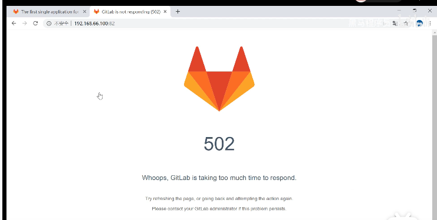

## 一、安装及配置

### 1.gitlab镜像拉取


```ruby
# gitlab-ce为稳定版本，后面不填写版本则默认pull最新latest版本
$ docker pull gitlab/gitlab-ce
```


拉取镜像

### 2.运行gitlab镜像


```csharp
$ docker run -d  -p 443:443 -p 80:80 -p 222:22 --name gitlab --restart always -v /home/gitlab/config:/etc/gitlab -v /home/gitlab/logs:/var/log/gitlab -v /home/gitlab/data:/var/opt/gitlab gitlab/gitlab-ce
# -d：后台运行
# -p：将容器内部端口向外映射
# --name：命名容器名称
# -v：将容器内数据文件夹或者日志、配置等文件夹挂载到宿主机指定目录
```

运行成功后出现一串字符串


运行成功

### 3.配置

按上面的方式，gitlab容器运行没问题，但在gitlab上创建项目的时候，生成项目的URL访问地址是按容器的hostname来生成的，也就是容器的id。作为gitlab服务器，我们需要一个固定的URL访问地址，于是需要配置gitlab.rb（宿主机路径：/home/gitlab/config/gitlab.rb）

```ruby
# gitlab.rb文件内容默认全是注释
$ vim /home/gitlab/config/gitlab.rb
```


```ruby
# 配置http协议所使用的访问地址,不加端口号默认为80
external_url 'http://192.168.199.231'

# 配置ssh协议所使用的访问地址和端口
gitlab_rails['gitlab_ssh_host'] = '192.168.199.231'
gitlab_rails['gitlab_shell_ssh_port'] = 222 # 此端口是run时22端口映射的222端口
:wq #保存配置文件并退出
```


修改gitlab.rb文件


```ruby
# 重启gitlab容器
$ docker restart gitlab
```

此时项目的仓库地址就变了。如果ssh端口地址不是默认的22，就会加上ssh:// 协议头
 打开浏览器输入ip地址(因为我的gitlab端口为80，所以浏览器url不用输入端口号，如果端口号不是80，则打开为：ip:端口号)，我们输入http://116.63.163.205/ 即可进行访问


### 4. 遇见的问题


**问题点一：external_url填写的是我们的华为云的地址**





**问题点二：遇见502不要慌，因为gitlab服务比较多，等待几十秒以后，我们刷新页面就可以了**


**问题点三：如果我们登陆的时候需要我们直接登录，这个时候我们就需要修改初始密码了**

用户名密码

 可能出现的问题：

1. 运行不了，提示502，访问时间长，导致访问不了，这个gitLab的部署要求，你的虚拟机，最好能是8个处理器，内存4G以上配置。

1. 2.访问进来，如果提示修改密码就修改，后登入

如果发现直接要求登入，这个时候我们需要进入gitLab中设置root账号的密码

步骤如下：

1. 进入容器

```bash
docker exec -it 01fb1dd86bb5 /bin/bash // 01fb1dd86bb5是容器id
```

2. 进入gitlab的bin目录 ：

```bash
cd /opt/gitlab/bin
```

3.进入gitlab控制台

```bash
gitlab-rails console
```

4.控制台中执行如下命令


```bash
# 找到root的用户，输入u=User.where(id:1).first，然后回车
irb(main):001:0> u=User.where(id:1).first
=> #<User id:1 @root>


# 修改password，输入u.password='12345678'，然后回车
irb(main):002:0> u.password='12345678'
=> "12345678"


#修改确认密码
irb(main):004:0> u.password_confirmation='12345678'
=> "12345678"


#保存修改，输入u.save，然后回车，等到输出true，这时，密码修改成功。
irb(main):005:0> u.save
Enqueued ActionMailer::MailDeliveryJob (Job ID: d4c64606-0597-46ae-a7b5-fa9bb01c2685) to Sidekiq(mailers) with arguments: "DeviseMailer", "password_change", "deliver_now", {:args=>[#<GlobalID:0x00007fe59ae70c98 @uri=#<URI::GID gid://gitlab/User/1>>]}
=> true
```

至此，密码修改成功，可以用12345678密码登录进去了


### 


# 二、gitlab的使用


### 1.Gitlab添加组、创建组、创建项目

#### 创建组

使用管理员root创建组，一个组里面可以有多个项目分支，可以将开发添加到组里面进行设置权限，不同的组就是公司不同的开发项目或者服务模块，不同的组添加不同的开发即可实现对开发设置权限的管理


第一次进入要输入新的root用户密码，设置好之后确定就行


gitlab页面

下面我们就可以新建一个项目了，点击Create a project


Create a project

创建完成后：


