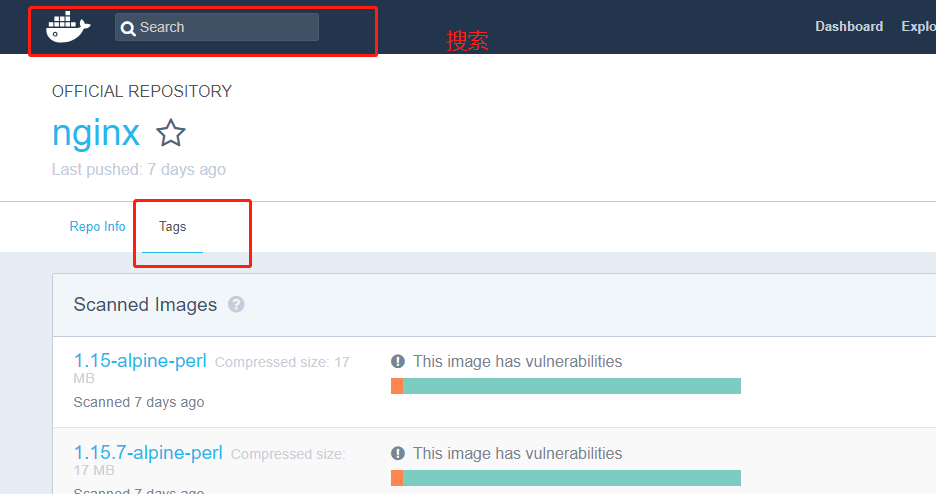
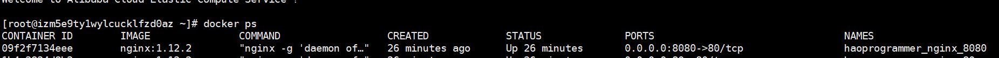
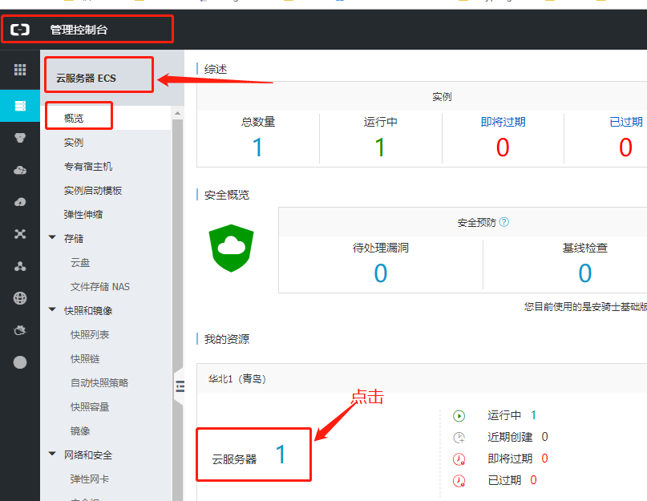
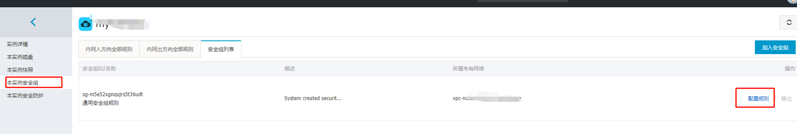
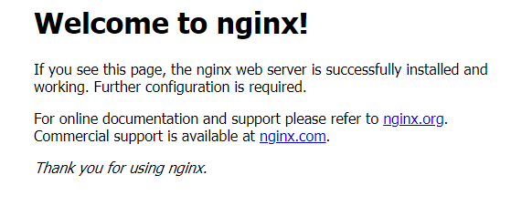

# 一、Docker拉取nginx镜像

```
docker pull nginx:``1.12``.``2
```

　　这里是下载的是nginx的1.12.2版本，其他版本的镜像请访问https://hub.docker.com/r/library/



## 二、启动nginx容器

```
docker run -di --name=haoprogrammer_nginx_80 -v /home/myroot/mydata/docker/nginx/:/test/nginx -p 80:80  nginx:1.12.2
```

大名鼎鼎的docker run，参数说明

-i  运行容器

-t  容器启动后会进入命令行，将入这两个参数后，容器创建壳登录进去，即分配一个伪终端

-d  创建守护式容器在后台运行（创建容器后不会自动登录容器，只加-i-t两个参数，创建后会自动进入容器）

-v  表示目录映射关系，前者是宿主机目录，后者是容器映射目录。可以使用多个--v做目录映射。注意，最好做目录映射，在宿主机上修改，然后共享到容器中

-p  标识端口映射，前者是宿主机端口，后者是容器映射端口。可使用多个-p做端口映射

 

## 三、查看是否启动成功

```
docker ps  
```

　　说明：

docker ps    //查看正在运行的容器

docker ps -a  //查看所有容器



 

##  四、配置阿里云服务器安全组策略

### 4.1 登录控制台，找到对应服务器



### 4.2 找到对应的实例，点击管理-->本实例安全组-->配置规则




### 4.3 配置安全组，点击添加安全组规则，开放相应的入口

 

注意：0.0.0.0/0 所有人都能访问要慎重

222.211.238.21是我的电脑的公网地址，设置以后，就只有我这台电脑可以访问


##  五、验证

浏览器输入公网ip+端口，即可出现熟悉的nginx页面



