🔺Git不会忽略空目录。 它忽略所有目录。 在Git中，目录仅通过其内容隐式存在。 空目录没有内容，因此不存在。

#### GIT的SSH详解

https://www.jianshu.com/p/33461b619d53

#### 整体结构图

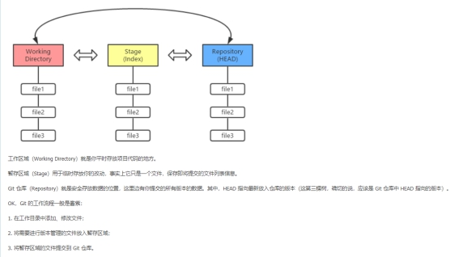

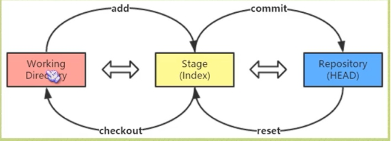 

**· git add 命令用于把工作目录的文件放入暂存区域**

**· git commit 命令用于把暂存区域的文件提交到 Git 仓库**

**· git reset命令用于把 Git 仓库的文件还原到暂存区域**

**· git checkout 命令用于把暂存区域的文件还原到工作目录**

****

 

#### 生成公钥私钥

**git config --global user.name "张明柱"**

**git config --global user.email "zhangmingzhu@xiaoduotech.com"**

**ssh-keygen -t rsa -C "zhangmingzhu@xiaoduotech.com"**

**ssh -T git@gitlab.com**   --- `ssh -T git@192.168.0.111 这用于私有部署`

****

 

 

####  常规操作

**1、git init 初始一个仓库**1

在所在的文件中生成一个.git的文件

然后我们在里面创建一个md格式的文件夹，里面写入this is a big project

 

**2、git add README.md**

讲README.md提交到暂存区域

**3、git commit -m “add a readme file”**

将暂存区域的README.md提交到git仓库

100表示这是一个普通文件，644表示这个文件的权限

**4、总结**

将工作目录的文件放到GIT仓库只需2步

-git add 文件

-git commit -m “你干了啥”

 

 

**5、查看状态 git status**

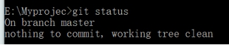 

解释：on branch master 表示你在一个master的分支里面，这个master是一个默认的分支

nothing to commit，working directory clean

表示，上次commit执行之后，这个工作目录里面的内容压根就没有被改动过

 

**6、版权申明**

我们采用MIT协议给予用户最大的权力，让世界的人都参与进来

在我们的git仓库创建一个LICENSE文件，将MIT协议写进去

然后执行git status

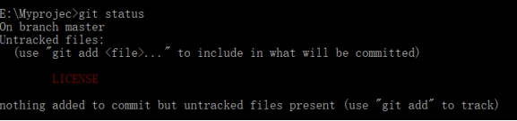 

这个LICENSE文件的状态是untracked files 未被跟踪，在我们的master分支里面，未追踪，就是哪些新添加的文件，未被添加到暂存区域或者未被提交的文件，他们处于一个逍遥法外的状态，一旦将他们加入到暂存区域或者git仓库，他们就受到git的跟踪，圆括号中就是git给我的建议

这里我们按照它的建议来

git add LICENSE

然后git status

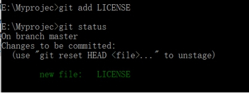 

 status这里又有一个圆括号提示了，

 (use "git reset HEAD <file>..." to unstage)表示，让你执行git reset HEAD（file）命令来恢复暂存区域，因为我们刚刚LICENSE添加到了暂存区域里面了，如果你反悔了，不想要git来跟踪你的LICENSE文件，你可以通过这个命令来反悔，这个命令表示将最后一次提交到git暂存区域的文件恢复到工作区域，换句话说就是将暂存区域恢复到先前状态

 

git reset HEAD <file> ：如果指定file，如果暂存区里面存在这个file，就是将这个file恢复到工作区域，将暂存区域恢复到原来状态，如果步加file就是，就是将最后一次提交的所有内容恢复到工作区域 

 

这里我们git reset HEAD，将LICENSE恢复到工作区域

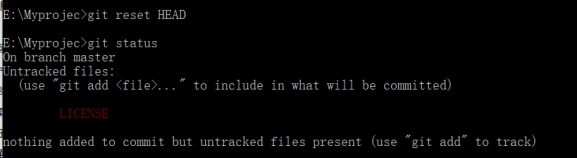 

然后git add LICENSE

git commit -m “add a LICESE file”

 

**7、上面我们已经将LICENSE提交到了git仓库，这个时候我来学习一下回滚**

场景1：我们这个时候手动修改我们电脑文件中的LICNESE文件

原始文件

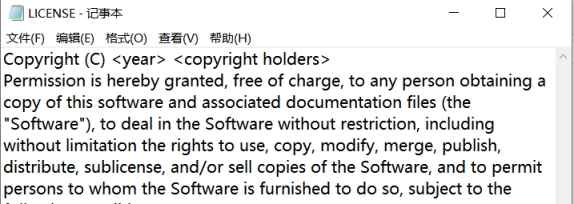 

修改后的文件

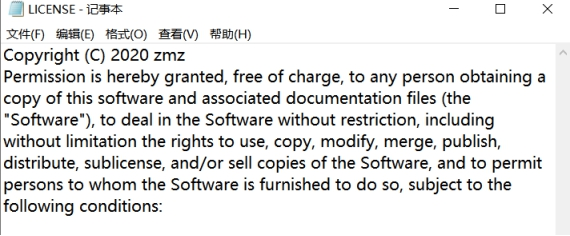 

这个时候我们执行git status

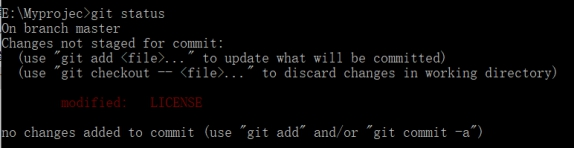 

由于你对工作目录的文件进行了修改，导致文件和git仓库的文件不匹配了，它给了你两条建议

Changes not staged for commit:以更改的内容未暂存，用以提交

1、(use "git add <file>..." to update what will be committed)，使用git add <file>.提交到暂存区，然后提交到git 仓库进行覆盖

2、(use "git checkout -- <file>..." to discard changes in working directory)，用checkout命令放弃工作目录中的修改

我们执行git checkout -- LICENSE

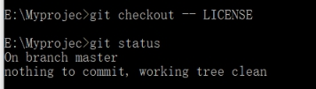 

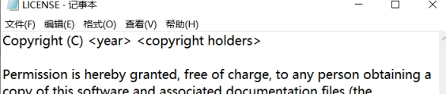 

 

 

场景2:前置条件LINCENSE文件已经被修改而且我们还使用了git add LICENSE 命令，这个时候我们不执行commit，我们再次来修改LICENSE文件

就变成了下面这个情况

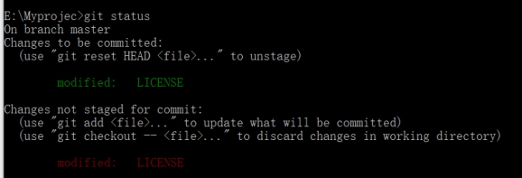 

解释：因为有三棵树，所以我们可以理解为三个文件夹，三个文件夹，中分别由三个版本的数据，所以上面绿色的表示暂存区的，红色的表示工作区域的

如果你在这个时候直接git commit -m 你就是将这个暂存区的提交到git仓库，如果你需要将暂存区的覆盖掉，你就可以使用git add LICENSE

 

这里我们进行覆盖：执行git add LICENSE

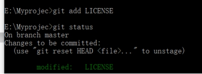。

这个时候就已经覆盖掉了，只有一个了。这个时候我们再git commit -m “change the LICENSE”

 

**8、查看历史提交**

我们一个劲的往git仓库提交文件，但是git仓库到底有多少个版本的文件呢？我们可以用git log来查看提交的历史提交纪录，它的排序是按时间从近到远的

git log，这个时候我们可以看看

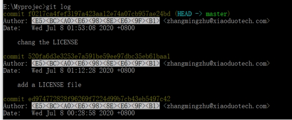 

 

 

**9、删除文件找回**

场景1：删除文件以后，未进行git add 和 git commit

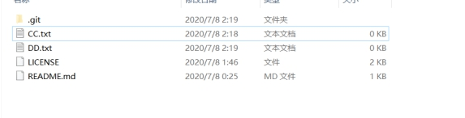 

这里删除CC.txt,然后执行git status，

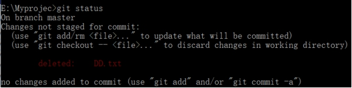 

然后执行git add

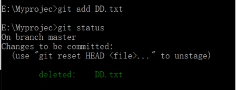 

然后git commit -m “删除DD”

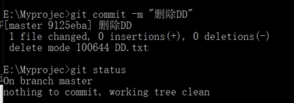 

找回操作：

1、查找被删除的文件

git log --diff-filter=D --summary

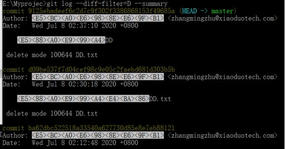 

git log 差不多，最上面的就是我们删除的

然后执行：git checkout 9125ebadeef6c2d7c9f302f3386868153f49685a~1 DD.txt

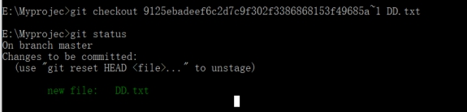 

然后，git commit 就回来了

 

 

**10、总结**

如果是暂存区是newfile  ，说明是新文件，这个时候就有git reset HEAD<file>来恢复暂存区，如果是modified file，就有git checkout -- <file> 来恢复暂存区

 

 

**11、reset 和 checkout**

 

· git add 命令用于把工作目录的文件放入暂存区域

· git commit 命令用于把暂存区域的文件提交到 Git 仓库

· git reset 命令用于把 Git 仓库的文件还原到暂存区域

· git checkout 命令用于把暂存区域的文件还原到工作目录

 

将仓库里面的head指针指向的版本，把他恢复回暂存区域

checkout将暂存区域的数据恢复回工作区域

 

**12、reset**

恢reset HEAD~ （一个波浪号表示回滚到上一个快照，多少个~就表示回滚到上N个快照） reset HEAD~10 表示10个波浪号，下面是reset HEAD~的结果

 

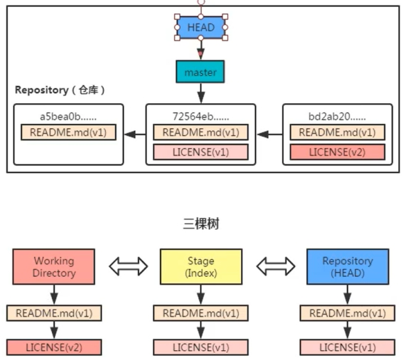 

 

· git add 命令用于把工作目录的文件放入暂存区域

· git commit 命令用于把暂存区域的文件提交到 Git 仓库

· git reset 命令用于把 Git 仓库的文件还原到暂存区域

· git checkout 命令用于把暂存区域的文件还原到工作目录

 

 

 

 

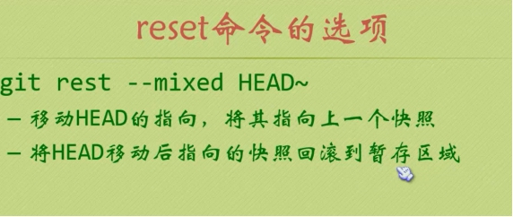 

--mixed 是默认的

· git add 命令用于把工作目录的文件放入暂存区域

· git commit 命令用于把暂存区域的文件提交到 Git 仓库

· git reset 命令用于把 Git 仓库的文件还原到暂存区域

· git checkout 命令用于把暂存区域的文件还原到工作目录

· 

Sofe

git reset --soft HEAD~ 命令就相当于只移动 HEAD 的指向，但并不会将快照回滚到暂存区域

Sofe相当于撤销上一次的提交

 

 

--hard 选项
加上 --hard 选项的结果是使得 reset 变“硬”……
你猜的不错，加上 --hard 选项，reset 不仅移动 HEAD 的指向，将快照回滚动到暂存区域，它还将暂存区域的文件还原到工作目录。


刚才执行完 git reset HEAD~ 命令后，Git 仓库里的数据是这样：

 

 

 

 

 

 

 

 

 

 

 

 

 

 

 

git checkout dev-zmz

 

git add .

 

git commit -m “”

 

 

git拷贝分支到新分支上面

https://www.cnblogs.com/wangfajun/p/10789231.html

 


#### 远程仓库关联


**1. 首选我们在我们的本地仓库，执行git bash here， 打开git bash 界面**


**2.检查远程仓库信息，git remote -v**

```bash
$ git remote -v
origin  git@github.com:zmz1054920870/-zhangming.git (fetch)
origin  git@github.com:zmz1054920870/-zhangming.git (push)
```

**2.1 查看远程仓库具体信息 git remote show [别名] 或者 [仓库地址]**

```bash
$ git remote show origin
* remote origin
  Fetch URL: git@github.com:zmz1054920870/-zhangming.git
  Push  URL: git@github.com:zmz1054920870/-zhangming.git
  HEAD branch: main
  Remote branches:
    main   new (next fetch will store in remotes/origin)
    master tracked
  Local ref configured for 'git push':
    master pushes to master (fast-forwardable)
```


**3. 如果git remote -v 是空， 我们就需要关联一下 git remote add [别名] [远程仓库地址]**

```bash
$ git remote add origin git@github.com:zmz1054920870/note.git
```

​	**origin** 为远程地址的别名

```
origin --- 远程仓库
```


**4.移除远程仓库别名和修改远程仓库别名**

```bash
git remote rm name  # 删除远程仓库
git remote rename old_name new_name  # 修改仓库名
```


**5. 推到远程仓库中 git push [远程仓库] [本地分支] [远程分支]**

```bash
git push origin master:master
```

