🔺Git不仅仅是忽略空目录。 它是忽略所有目录。 在Git中，目录仅通过其内容隐式存在。 空目录没有内容，因此不存在。


**Git暂存区是否需要执行commit提交，是通过当前暂存区与提交对象暂存区对比是否一致来判断的，一致不提示commit，不一致提示需要commit**

**Git工作区是否需要被暂存，是通过工作区假定生产的暂存区与当前暂存区是否一致来判断，一致不提示add暂存，不一致提示需要add暂存**


**🔺 git checkout 主要是用于移动HEAD,即.git目录下  HEAD的值，refs/branchs  中的值不会发生改变，既然不发生改变，那么git lol 时候，只有HEAD在移动，分支都没有动，因为refs/branchs  中的值不会发生改变，所以我们切换分支的时候，会发现其他分支依旧存在。。🔺其中git      checkout commitid filename 的时候，它不会改变refs/branchs中的值，所以我们用来进行工作区回滚或者后悔**

**🔺git reset --hard / --mixed /--soft  改变refs/branchs 中的值，由于.git目录下 HEAD文件中的值指向refs/branchs中的值，所以我们说，分支改变，带着HEAD一起移动**

## GIT

**学GIT两条主线**

> - ​	**三个区域（三棵树）**
> 	- **工作区**
> 	- **暂存区**
> 	- **版本库**
> - ​    **三个对象**
> 	- **git对象**
> 	- **树对象**
> 	- **提交对象**

总结：

1.文件内容发生改变，生成新的GIT对象，树对象，提交对象

2.文件名字发生改变，生成新的树对象，提交对象，GIT对象不变

3.切换分支或者刚克隆下来的项目，工作区的内容和暂存区的索引一一对应，暂存区存放的就是当前版本

4.切换分支，就是指针指向不同分支的不同提交对象，指针所指提交对象发生改变，暂存去的内容也发生对应的变化


5. git对象 -- 暂存区 -- 树对象 -- 提交对象 -- HEAD指针

6.删除一个工作区的文件，然后add commit 之后，暂存区的索引也会丢失，会生成新的提交对象，而object版本库中的git对象不会删除


**例子：初始仓库 - 新建test.txt文件 - 添加test.txt v1 字符串内容， git add .  git commit 后查看GIT对象内容，树对象内容，提交对象内容，暂存区内容**

**git对象内容如下:**

```bash
$ git cat-file -p 560a3d89bf36ea10794402f6664740c284d4ae3b
test.txt v1
```

**树对象内容如下:**

```bash
$ git cat-file -p 06e21bb0105e2de6c846725a9a7172f57dd1af96
100644 blob 560a3d89bf36ea10794402f6664740c284d4ae3b    test.txt
```

**提交对象内容如下:**

```bash
$ git cat-file -p bc11e086c64f0fffc42e85b8c7de2f35cea5c4f4
tree 06e21bb0105e2de6c846725a9a7172f57dd1af96
author zmz <1054920870@qq.com> 1622364162 +0800
committer zmz <1054920870@qq.com> 1622364162 +0800

first-comit
```

**最后暂存区内容如下:**

```bash
$ git ls-files -s
100644 560a3d89bf36ea10794402f6664740c284d4ae3b 0       test.txt
```


## 一、git对象

`GIT的核心部分就是一个简单的键值对数据库。你可以向该数据库插入任意类型的内容，它会返回一个键值，通过该键值可以在任意时刻再次 检索该内容`


### 1.1	GIT数据库

**数据库路径:\\.git\objects**

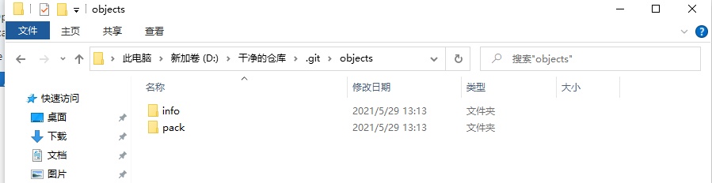


### 1.1	向版本库写入内容，并返回对应的键值

**命令：**`echo 'test content' | git hash-object -w --stdin`

> - ​	`-w` 选项， 它指示hash-object 命令存储数据对象；若不指定此选项，则该命令仅返回对应的键值，不会进行存储`存储位置\\.git\objects`
> -    `--stdin`选项， 它指示该命令从标准输入读取内容；若不指定此选项，则须在命令尾部给出一个文件，这个文件表示需要存入git数据库中的数据，来源于这个文件，说白了就是将这个文件中的所有数据存储到数据库中
> 	- `git hash-object -w 文件路径`
> 		- 存文件
> 	- `git hash-object 文件路径`
> 		- 返回对应的键值
> 		- d6704 60b4 b42aec5915....., 🔺这个哈希就是键， 对应的就是 'test content'这个值
> 			- d6是object数据中的一个文件夹， d6后面的数据就是d6目录下的一个文件，这个文件中存放了'test content'这个数据。。这就是git的存储方式


### 1.2	根据键值拉取数据

**命令：**`git cat-file -p 哈希值`  -- 读值

**命令：**`git cat-file -t 哈希值`  -- 查看类型

**命令：`git cat-file -p/-t HEAD` --读取/查看当前提交对象的内容**

**作用：由于存入的数据是压缩过的，通过`git cat-file -p 哈希值`命令解压才能看得懂**

> - ​	`-p`选项可指示该命令自动判断内容的类型，并为我们显示格式🔺相对友好的内容（基本还是看不懂-哈哈），返回文件的内容
> - ​    🔺`哈希值` = `object中的文件夹` + `这个文件中对应的文件名`
> - ​    `-t` 可以查看内容是一个什么对象
> 	- git内部是一个`blob`对象，是git自定义的一个数据类型


### 1.3	git对象总结

🔺🔺🔺🔺🔺🔺🔺🔺Git通过哈希值来记录每一次文件的改变，为什么这样呢？因为当我们文件名不变的时候，我们修改里面的内容，这时候就是一个新的版本了，如果通过修改文件名的方式来记录，那不跟我们自己备份记录一样了啊。这个时候git开发者想到，可以通过哈希值来给文件命令，因为只要两个文件不一样，哈希值就不一样。其实git对象就是一个文件而已（树对象也是），就是当文件发生改变，哈希值也发生改变，通过这个哈希值来给文件重新命名，进行管理的，而且还将原来的文件内容进行极致的压缩。。不光是git对象，树对象也一样。。。其实git对象和树对象，不能叫对象，就是一个个文件。。git对象，文件名是哈希，内容是压缩过的文件内容。。树对象，文件名是也是一个哈希，内容压缩过的索引内容，你没听错，树文件中存的只是索引关系

**问题：**

1. ​	记住文件的每一个版本对应的SHA-1 值是不现实的
2. ​    在Git中，文件名并没有被保存 --- 我们仅保存了文件的内容（文件变化git对象文件的文件名也变化了。原始名字被替换成了SHA-1）
3. ​    🔺一个Git对象只代表一个文件的内容
4. ​    <font color='red'>解决方案:树对象</font>


## 二、树对象

`树对象，🔺（官方解答）它能解决文件名保存的问题🔺，也允许我们将多个文件组织到一起（多个索引）。Git以一种类似于UNIX文件系统的方式存储内容。所有内容均以树对象加数据对象（git对象）的形式存储，其中树对象对应了UNIX中的🔺目录项（索引）🔺，数据对象（Git）对象则大致上对应文件内容。一个树对象包含了一条或多条记录（每条记录含有一个指向git对象或者子树对象的SHA-1指针，以及相应的模式、类型、文件名信息）。一个树对象也可以包含另外一个树对象`


### 2.1	构建树对象（暂存区就是一棵树，给暂存区拍个快照，就是将暂存区的内容（索引关系）以树的形式存入到一个文件当中（也叫生成树对象），文件名是一个哈希值，内容就是暂存区的内容）

`我们可以通过update-index；write-tree;read-tree等命令来构建树对象并塞入到🔺暂存区`

**🔺命令：查看暂存区当前的样子**

```bash
git ls-files -s
```

**🔺命令：查看版本库中的快照**

```bash
find ./.git/objects/ -type f
```

**🔺命令：查看哈希值的类型**

```bash
git cat-file -p 哈希（哈希==对象==快照）
```

**🔺命令：查看哈希值的内容**

```bash
git cat-file -t 哈希（哈希==对象==快照）
```


### 2.2	实战构建树对象（一整个流程，完全捕获整个版本管理的过程）


#### **操作--1：新增一个test.txt文件，用它的内容生成一个Git对象**

```
echo 'test.txt v1' > test.txt	# 创建text.txt 的第一个版本
git hash-object -w test.txt		# 生成git对象
```

此时 `find ./.git/objects/ -type f`  查看objects版本库中如下

```bash
$ find ./.git/objects/ -type f	#object版本库
./.git/objects/56/0a3d89bf36ea10794402f6664740c284d4ae3b	# test.txt文件的第一个版本快照(git对象)
```

此时`git ls-files -s`查看暂存区如下:(为空)

```bash
$ git ls-files -s			# 暂存区

```


#### **操作---2：把text.txt的Git对象在暂存区中建立一个索引关系**

`利用update-index命令 为test.txt 文件的首个版本在暂存区建立一个索引关系。并通过write-tree命令，利用暂存区的索引关系生成一个树对象存入object版本库中`


**操作2.1： 暂存区中建立索引**

**命令: `git update-index --add --cacheinfo 10064 560a3d89bf36ea10794402f6664740c28 test.txt `**

**🔺备注：将objects库里面的git对象放入暂存区，并给它一个别名作索引,建立索引关系，这个索引别名必须唯一，不然覆盖，但是此时object版本数据库中还没有记录，还在暂存区中（被版本数据库object记录以后才算被git管理）**

> 1. **文件模式**
> 	1. 100644, 表明这是一个普通文件
> 	2. 100755，表示这是一个可执行文件
> 	3. 120000, 表示一个符号连接
> 2. **`--add选项`**
> 	1. 🔺因为此前该索引文件名并不再暂存区中， 首次需要`--add`添加到暂存区
> 3. **`--cacheinfo选项`**
> 	1. 因为将要添加的文件位于Git数据库中，而不是位于当前目录下，所以需要 `cacheinfo`

此时 `find ./.git/objects/ -type f`  查看objects版本库中如下（不变）

```bash
$ find ./.git/objects/ -type f	#object版本库
./.git/objects/56/0a3d89bf36ea10794402f6664740c284d4ae3b		# test.txt文件的第一个版本快照(git对象)
```

此时`git ls-files -s`查看暂存区如下:

```bash
$ git ls-files -s	#暂存区
100644 560a3d89bf36ea10794402f6664740c284d4ae3b 0      test.txt	# test.txt第一个版本快照与test.txt索引名的关系
```


**操作2.2**：**将暂存区拍一个快照（以树的形式存入文件中，也叫生成树对象），存入objects版本库中**

**命令：`git write-tree`**（不会清空暂存区）

**备注：相当于给暂存区拍一个快照，这个快照是一个树对象，用一串哈希值表示这个树对象，然后将这个树对象（快照）存入objects版本数据库中。write-tree还会返回这个树对象（哈希值）**

**🔺🔺🔺🔺🔺🔺只有object版本数据空中记录的才是被git管理的**

**🔺🔺🔺🔺🔺🔺Git对象代表文件的一次次版本，tree对象代表项目的一次次管理**

此时 `find ./.git/objects/ -type f`  查看objects版本库中如下（不变）

```bash
$ find ./.git/objects/ -type f	# object版本库
./.git/objects/06/e21bb0105e2de6c846725a9a7172f57dd1af96	#	test.txt文件第一个版本在暂存区中的索引快照--项目的第一个版本快照（tree对象）
./.git/objects/56/0a3d89bf36ea10794402f6664740c284d4ae3b	#	test.txt文件的第一个版本快照(git对象)
```

此时`git ls-files -s`查看暂存区如下:

```bash
$ git ls-files -s	#暂存区
100644 560a3d89bf36ea10794402f6664740c284d4ae3b 0    test.txt   # test.txt第一个版本快照与test.txt索引名的关系
```


#### **操作---3：新增new.txt和test.txt 文件的第二个版本塞入暂存区。并通过write-tree命令 生成树对象**

**操作3-1：新增new.txt，生成Git对象**

```bash
echo 'new file' > new.txt
git hash-object -w new.txt
```

此时 `find ./.git/objects/ -type f`  查看objects版本库中如下

```bash
$ find ./.git/objects/ -type f
./.git/objects/06/e21bb0105e2de6c846725a9a7172f57dd1af96	#	test.txt文件第一个版本在暂存区中的索引快照--项目的第一个版本快照（tree对象）
./.git/objects/56/0a3d89bf36ea10794402f6664740c284d4ae3b	#	test.txt文件的第一个版本快照(git对象)
./.git/objects/ea/e614245cc5faa121ed130b4eba7f9afbcc7cd9	#	new.txt文件的第一个版本快照(git对象)
```

此时`git ls-files -s`查看暂存区如下:

```bash
$ git ls-files -s	#暂存区
100644 560a3d89bf36ea10794402f6664740c284d4ae3b 0    test.txt   # test.txt第一个版本快照与test.txt索引名的关系
```


**操作3-2：修改test.txt中的内容，然后生成git对象**

```bash
echo 'text.txt v2' >> text.txt	# 给text.txt中追加写入  text.txt v2数据
git hash-object -w new.txt
```

此时 `find ./.git/objects/ -type f`  查看objects版本库中如下

```bash
$ find ./.git/objects/ -type f
./.git/objects/06/e21bb0105e2de6c846725a9a7172f57dd1af96	#	test.txt文件第一个版本在暂存区中的索引快照--项目的第一个版本快照（tree对象）
./.git/objects/56/0a3d89bf36ea10794402f6664740c284d4ae3b	#	test.txt文件的第一个版本快照(git对象)
./.git/objects/ea/e614245cc5faa121ed130b4eba7f9afbcc7cd9	#	new.txt文件的第一个版本快照(git对象)
./.git/objects/c3/1fb1e89d8b6b3ef34cdb5a2f999d6e29b822ba	#	test.txt文件的第二个版本快照(git对象)
```

此时`git ls-files -s`查看暂存区如下:

```bash
$ git ls-files -s	#暂存区
100644 560a3d89bf36ea10794402f6664740c284d4ae3b 0    test.txt   # test.txt第一个版本快照与test.txt索引名的关系
```


**操作3-3：再次通过update-index和write-tree生成树对象**

**3-3-1 先将test.txt的第二次版本在暂存区中建立索引**

**命令：`git update-index --cacheinfo 100644 c31fb1e89d8b6b3ef34cdb5a2f999d6e29b822ba test.txt `**

> 1. ​	由于test.txt这个索引别名已经存在于暂存区了，此时不需要`--add`

此时 `find ./.git/objects/ -type f`  查看objects版本库中如下

```bash
$ find ./.git/objects/ -type f
./.git/objects/06/e21bb0105e2de6c846725a9a7172f57dd1af96	#	test.txt文件第一个版本在暂存区中的索引快照--项目的第一个版本快照（tree对象）
./.git/objects/56/0a3d89bf36ea10794402f6664740c284d4ae3b	#	test.txt文件的第一个版本快照(git对象)
./.git/objects/ea/e614245cc5faa121ed130b4eba7f9afbcc7cd9	#	new.txt文件的第一个版本快照(git对象)
./.git/objects/c3/1fb1e89d8b6b3ef34cdb5a2f999d6e29b822ba	#	test.txt文件的第二个版本快照(git对象)
```

此时`git ls-files -s`查看暂存区如下:（发生改变）

```bash
$ git ls-files -s
100644 c31fb1e89d8b6b3ef34cdb5a2f999d6e29b822ba 0       test.txt # test.txt第二个版本快照与test.txt索引名的关系，覆盖以前的
```


**3-3-2 将new.txt的第一次版本在暂存区中建立索引**

**命令：`git update-index --add --cacheinfo 100644 eae614245cc5faa121ed130b4eba7f9afbcc7cd9 new.txt `**

此时 `find ./.git/objects/ -type f`  查看objects版本库中如下

```bash
$ find ./.git/objects/ -type f
./.git/objects/06/e21bb0105e2de6c846725a9a7172f57dd1af96	#	test.txt文件第一个版本在暂存区中的索引快照--项目的第一个版本快照（tree对象）
./.git/objects/56/0a3d89bf36ea10794402f6664740c284d4ae3b	#	test.txt文件的第一个版本快照(git对象)
./.git/objects/ea/e614245cc5faa121ed130b4eba7f9afbcc7cd9	#	new.txt文件的第一个版本快照(git对象)
./.git/objects/c3/1fb1e89d8b6b3ef34cdb5a2f999d6e29b822ba	#	test.txt文件的第二个版本快照(git对象)
```

此时`git ls-files -s`查看暂存区如下:（添加new.txt的快照到暂存区，并建立索引）

```bash
$ git ls-files -s
100644 eae614245cc5faa121ed130b4eba7f9afbcc7cd9 0       new.txt
100644 c31fb1e89d8b6b3ef34cdb5a2f999d6e29b822ba 0       test.txt
```


**3-3-3 给暂存区拍个快照，存入object版本库**

**命令:git write-tree**

```bash
$ git write-tree
9d74ec4055e0f1edc1921d749c250380ca7b5ebd
```

此时 `find ./.git/objects/ -type f`  查看objects版本库中如下

```bash
$ find ./.git/objects/ -type f
./.git/objects/06/e21bb0105e2de6c846725a9a7172f57dd1af96	#	test.txt文件第一个版本在暂存区中的索引快照--项目的第一个版本快照（tree对象）
./.git/objects/56/0a3d89bf36ea10794402f6664740c284d4ae3b	#	test.txt文件的第一个版本快照(git对象)
./.git/objects/ea/e614245cc5faa121ed130b4eba7f9afbcc7cd9	#	new.txt文件的第一个版本快照(git对象)
./.git/objects/c3/1fb1e89d8b6b3ef34cdb5a2f999d6e29b822ba	#	test.txt文件的第二个版本快照(git对象)
./.git/objects/9d/74ec4055e0f1edc1921d749c250380ca7b5ebd	#	test.txt文件第二个版本在暂存区中的索引加new.txt文件第一个版本在暂存区中的索引 一起的一个快照  --- 项目的第二个快照（tree对象）：2片叶子
```


增添快照汇总

```bash
06e21bb0105e2de6c846725a9a7172f57dd1af96	#	test.txt文件第一个版本在暂存区中的快照--项目的第一个版本快照（tree对象）
560a3d89bf36ea10794402f6664740c284d4ae3b	#	test.txt文件的第一个版本快照(git对象)
eae614245cc5faa121ed130b4eba7f9afbcc7cd9	#	new.txt文件的第一个版本快照(git对象)
c31fb1e89d8b6b3ef34cdb5a2f999d6e29b822ba	#	test.txt文件的第二个版本快照(git对象)
9d74ec4055e0f1edc1921d749c250380ca7b5ebd	#	test.txt文件第二个版本在暂存区中的索引加new.txt文件第一个版本在暂存区中的索引 一起的一个快照  --- 项目的第二个快照（tree对象）：2片叶子
```


#### 2.3	树对象总结

Git对象 ： 	哈希 	对应   文件内容										代表文件的一次次版本

tree对象：	哈希	对应	一个或多个Git对象或树对象		代表项目的一次次版本


**问题：**

1. 现在有2个树对象（执行了两次write-tree）,分别代表了我们想要跟踪的不同项目快照，若想重用这些快照 ，我们必须记住这两个SHA-1值。（现在我们 是手动记录的），万一有超级多个版本快照呢？那不傻逼了啊
2. 我们也不知道是谁保存的这些快照，想追述对应的研发，都无从下手
3. 什么时候保存的也不知道
4. 🔺 <font color='red'>解决方案:提交对象</font>


## 三、提交对象


#### 3.1	命令

***

```
echo 'first commit' | git commit-tree 树对象 -p 前一次的commit-tree对象
```

我们可以通过调用commit-tree 命令创建一个提交对象，为此需要指定一个树对象的SHA-1值，已经此次提交的父提交对象（首次提交不需要指定父提交）


**操作：用第一次项目版本的快照，生成第一个提交对象**

> - ​	不需要指定父提交对象

```bash
zmz@DESKTOP-IVHSPRM MINGW64 /d/MyGit (master)
$ echo 'first commit' | git commit-tree 06e21bb0105e2de6c846725a9a7172f57dd1af96
94301216ef4ed9766a517a78bdeccd531dd8bc16

zmz@DESKTOP-IVHSPRM MINGW64 /d/MyGit (master)
$ git cat-file -t 94301216ef4ed9766a517a78bdeccd531dd8bc16
commit

zmz@DESKTOP-IVHSPRM MINGW64 /d/MyGit (master)
$ git cat-file -p 94301216ef4ed9766a517a78bdeccd531dd8bc16
tree 06e21bb0105e2de6c846725a9a7172f57dd1af96
author zmz <1054920870@qq.com> 1622294527 +0800
committer zmz <1054920870@qq.com> 1622294527 +0800

first commit
```


**操作：用第二次项目版本快照，生成第二个提交对象**

> - ​	需要指定父提交对象

```bash
zmz@DESKTOP-IVHSPRM MINGW64 /d/MyGit (master)
$ echo 'second commit' | git commit-tree 9d74ec4055e0f1edc1921d749c250380ca7b5ebd -p 94301216ef4ed9766a517a78bdeccd531dd8bc16
e4059a27254c1bc0e76d666aa56fc512e638cab2

zmz@DESKTOP-IVHSPRM MINGW64 /d/MyGit (master)
$ git cat-file -p e4059a27254c1bc0e76d666aa56fc512e638cab2
tree 9d74ec4055e0f1edc1921d749c250380ca7b5ebd
parent 94301216ef4ed9766a517a78bdeccd531dd8bc16
author zmz <1054920870@qq.com> 1622294769 +0800
committer zmz <1054920870@qq.com> 1622294769 +0800

second commit
```


**操作：git status**

```bash
$ git status
On branch master

No commits yet

Changes to be committed:
  (use "git rm --cached <file>..." to unstage)

        new file:   new.txt			# 绿色
        new file:   test.txt		# 绿色
```


🔺🔺🔺🔺🔺🔺🔺🔺🔺**总结：**🔺🔺🔺🔺🔺🔺🔺🔺🔺🔺🔺🔺🔺🔺🔺🔺🔺

**git add .**  === **git hash-objec** + **git update-index**   先到版本库，再到暂存区

**git commit** === **git write-tree**  +  **git commit-tree**  + '其他'

**暂存区一直不会清空，哪怕是我们关了git，重新打开，还是拉取别人的代码。因为暂存区表示的就是一个项目版本，那么一个项目版本我们就可以write-tree保存到object版本库中，但是它会校验write-tree生成的这个tree对象的哈希，如果哈希跟当前版本指针所指的一致，它就丢弃掉不执行，如果不一致，就生成一个新的tree对象**

- **git commit-tree ** 之后 git status 还是绿色的，这个不知道怎么破

**术语：项目的版本就是一个提交对象，本质上项目的快照应该是一个树对象**

```bash
zmz@DESKTOP-IVHSPRM MINGW64 /d/MyGit-2
$ git init
Initialized empty Git repository in D:/MyGit-2/.git/

zmz@DESKTOP-IVHSPRM MINGW64 /d/MyGit-2 (master)
$ echo 'test.txt v1' > test.txt

zmz@DESKTOP-IVHSPRM MINGW64 /d/MyGit-2 (master)
$ git status
On branch master

No commits yet

Untracked files:
  (use "git add <file>..." to include in what will be committed)

        test.txt	#红色

nothing added to commit but untracked files present (use "git add" to track)

zmz@DESKTOP-IVHSPRM MINGW64 /d/MyGit-2 (master)
$ git add .
warning: LF will be replaced by CRLF in test.txt.
The file will have its original line endings in your working directory

zmz@DESKTOP-IVHSPRM MINGW64 /d/MyGit-2 (master)
$ git status
On branch master

No commits yet

Changes to be committed:
  (use "git rm --cached <file>..." to unstage)

        new file:   test.txt	#绿色

zmz@DESKTOP-IVHSPRM MINGW64 /d/MyGit-2 (master)
$ find ./.git/objects/ -type f
./.git/objects/56/0a3d89bf36ea10794402f6664740c284d4ae3b

zmz@DESKTOP-IVHSPRM MINGW64 /d/MyGit-2 (master)
$ git ls-files -s
100644 560a3d89bf36ea10794402f6664740c284d4ae3b 0       test.txt

zmz@DESKTOP-IVHSPRM MINGW64 /d/MyGit-2 (master)
$ git commit -m 'first comiit'
[master (root-commit) c272bff] first comiit
 1 file changed, 1 insertion(+)
 create mode 100644 test.txt

zmz@DESKTOP-IVHSPRM MINGW64 /d/MyGit-2 (master)
$ git status
On branch master
nothing to commit, working tree clean

zmz@DESKTOP-IVHSPRM MINGW64 /d/MyGit-2 (master)
$ find ./.git/objects/ -type f
./.git/objects/06/e21bb0105e2de6c846725a9a7172f57dd1af96
./.git/objects/56/0a3d89bf36ea10794402f6664740c284d4ae3b
./.git/objects/c2/72bffdffb8feec571124ae5fa43046ccb1d881

zmz@DESKTOP-IVHSPRM MINGW64 /d/MyGit-2 (master)
$ git ls-files -s
100644 560a3d89bf36ea10794402f6664740c284d4ae3b 0       test.txt
```


## 四、工作区、暂存区、版本库具体位置

#### Git目录

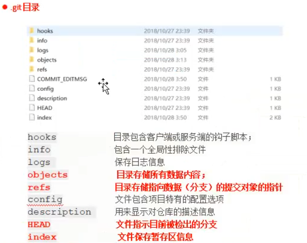

> - ​	refs 这个目录存储，指向数据的 提交对象的指针，就是分支


**工作区**

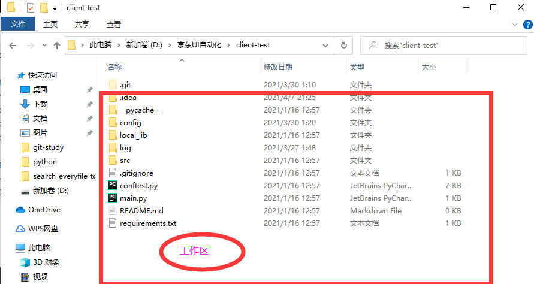


**暂存区：是一个index文件，正对应了暂存区存放的是索引**

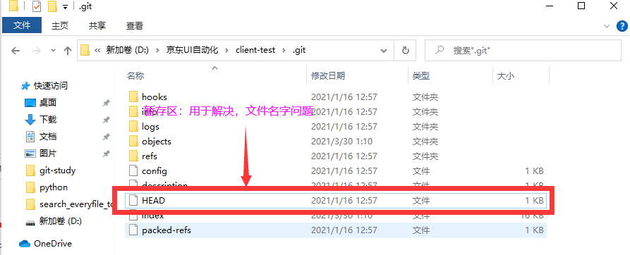

**版本库：存放内容**

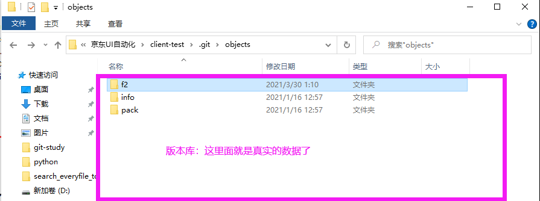


**🔺🔺🔺🔺🔺🔺🔺超级重点：项目的版本就是一个提交对象，本质上项目的快照应该是一个树对象🔺🔺🔺🔺🔺🔺🔺🔺**

**概论来了：**

> - ​	一个完整的流程，最少要包含一个git对象，一个树对象，一个提交对象
> -    一个提交，必定只有一个提交对象，一个树对象，git对象可以用很多
> -    git add . 流程是生成对应的git对象存放在版本库中，然后将这些git对象哈希值和别名放入暂存区中


**git add .** 

​		**git hash-objec** + **git update-index**   先到版本库，再到暂存区

**git commit -m '   '** 

​		**git write-tree**  +  **git commit-tree** 


## 五、高层命令


#### 5.1 工作区

***

**工作目录下的所有文件都不外乎两种状态：已<font color='red'>经跟踪</font>	或	<font color='red'>未跟踪</font>>**

- **已跟踪的文件**
	- **指本来就被纳入版本管理的文件，在上次快照中有他们的记录，工作一段时间后，已跟踪的文件他们的还有3种状态分别是<font color='red'>已修改</font>、<font color='red'>已暂存</font>或者<font color='red'>已提交</font>**       
- **未跟踪的文件**
	- **除开已跟踪的都是未跟踪的文件。他们既没有上次更新的快照，也不在当前暂存区域**

**初次克隆某个仓库时，工作目录中的所有文件都属于已跟踪文件，且状态为<font color='red'>已提交</font>；在编辑过某些文件之后，Git将这些文件标为<font color='red'>已修改</font>。我们逐步把这些修改过的文件放到暂存区域，直到最后一次性提交所有这些暂存起来的文件。**


#### 5.2	暂存区

***

**当出现如下情况时：Git add . 之后又修改了文件**

```bash
$ git status
On branch master

No commits yet

Changes to be committed:
  (use "git rm --cached <file>..." to unstage)

        new file:   test.txt	# 绿色

Changes not staged for commit:
  (use "git add <file>..." to update what will be committed)
  (use "git checkout -- <file>..." to discard changes in working directory)

        modified:   test.txt	# 红色
```

**出现上面这种情况的时候，我们通常就是再git add . 由于 test.txt名字，不变，所以会覆盖掉暂存区的索引。但是版本库中不会覆盖，会保留覆盖前的git对象**

**备注：工作区文件的状态，是根据暂存区的索引到的文件进行比较的出来的。。**


#### 5.3	查看已暂存和未暂存的更新

***

​		**实际上`git status`的显示比较简单，仅仅是列出了修改过的文件，如果要查看具体修改了什么地方，可以用`git diff` 命令。这个命令它已经能解决我们两个问题了： **

- **当前做的哪些更新还没有暂存**
	- **命令:`git diff(不加参数直接输入git diff)`**

- **有哪些更新已经暂存起来准备好了下一次提交了**
	- **命令:`git diff --cached`或者  `git diff --staged(1.6.1以上)`**


#### 5.4	`git commit 写超长注释`

**命令:`git commit` 回车：打开如下vim界面**

```bash

# Please enter the commit message for your changes. Lines starting
# with '#' will be ignored, and an empty message aborts the commit.
#
# On branch master
# Changes to be committed:
#       modified:   test.txt
#

```

**备注：我们就可以在里面写超级长的注释，写到#号后面 ，将会无效**


#### 5.5	删除一个文件

> - ​	**删除一个文件后,`git add . `不会在object版本管理库中生成新的git对象**
> - ​    **`git commit -m`之后,会生成一个新的树对象和一个提交对象**
> 	- **想想也是啊,暂存区存放的是上一次的项目版本,然后从里面删除了一个索引,哈希值变了,git write-tree的时候就会生成一个新的树对象,用这个新的树对象就可以生成一个新的commit提交对象**


#### 5.6	重命名一个文件

> - ​	**首选重名，git中认为是两个动作，先删除，再新建**

```bash
$ git status
On branch master
Changes not staged for commit:
  (use "git add/rm <file>..." to update what will be committed)
  (use "git checkout -- <file>..." to discard changes in working directory)

        deleted:    test.txt

Untracked files:
  (use "git add <file>..." to include in what will be committed)

        test-new.txt

no changes added to commit (use "git add" and/or "git commit -a")
```

> - ​	**`git add . `一下看看呢，其实还挺智能，哈哈，提示rename**

```bash
$ git status
On branch master
Changes to be committed:
  (use "git reset HEAD <file>..." to unstage)

        renamed:    test.txt -> test-new.txt
```


#### 5.7	Git命令取别名

***

```bash
git config --global alias.lol "log --oneline --graph --decorate --all"	# graph必须在--decorate 前面不然要b
```


## 六、Git分支操作（杀手功能）


#### 6.1	分支概念

***

分支就是一个活动的指针，这个指针就在提交对象前面，HEAD指向提交对象，他就是个指针，活动的指针，他不是个死的，当你提交对象一直再往前更新，这个指针也一直跟你往一直往前走，你提交对象最新在哪，它就跑到到哪里


master分支，它是默认就有的分支，叫主分支。当我们每一次提交代码的时候，HEAD指向最新一次的提交对象。


我们来看一眼：

git目录中有一个HEAD文件

当我们在master分支下的时候，我们看看HEAD中内容如下

```bash 
$ cat HEAD
ref: refs/heads/master
```

HEAD 指向master分支


refs 里面有两个目录，一个heads一个tags，heads里面有分支文件。每一个分支文件中都存放了每一条分支上最新一次的提交对象

> - ​	heads
> 	- master文件， 目前里面的内容是     `347bafa54863f0cf42925726ca37774ea4a71fe2`    ,最后一次的提交对象
> - ​    tags


分支是什么，是指向最新提交对象的一个指针


#### 6.2	创建分支

***

**命令：`git branch 分支名`**

**作用：**

> - ​	**为你创建一个新分支文件（存放在HEAD/heads下，文件名就是分支名，创建新分支的时候，文件中存放的是当前指针所指的提交对象）。比如，创建一个testing分支：`git branch testing`.这会在当前所在的提交对象上创建一个指针**
> - ​    **🔺此时refs下的heads目录中会生成一个testing，这个文件中存放了当前提交对象的哈希值**

🔺**注意：**

> - ​	**`git branch 分支名` 创建一个新的分支，并不会自动切换到新分支中去**
> - ​    **此时.git目录下面的HEAD文件中存放的还是     `ref: refs/heads/master                                                          `  这段数据，当我们切换到testing分支的时候，内容变成     `ref: refs/heads/testing                                                          `    **
> - ​    **当我们在master分支上再次提交，master指针会指向最新一次的提交对象（heads目录下master文件中，存放最新的提交对象），而testing指针不变**

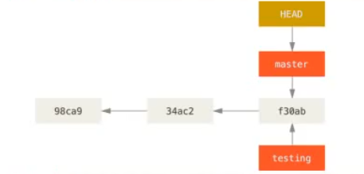

 

#### 6.3	切换分支

***

**命令：`git checkout testing`**

**备注：切换分支实际就是将git目录下的HEAD指针文件中的内容修改指向refs目录下/heads中的testing分支文件**


#### 6.4	**显示分支列表**

***

**命令：`git branch`**


#### 6.5	删除分支

***

**命令:`git branch -d 分支名`**

> - ​	**🔺不能再当前分支，删除当前分支**

```bash
$ git branch -d damu
error: The branch 'damu' is not fully merged.
If you are sure you want to delete it, run 'git branch -D damu'.
```

**备注报错：说damu分支完全没有被合并，如果你确定想删除它，请使用`git branch -D damu`**

**命令：`git branch -D 分支名`强制删除**


#### 6.6	查看完整的分支log（完整分支图） --- 起别名命令

****

**命令:`git log --oneline --decorate --graph --all `**

**🔺命令:`git config --global alias.别名 git log --oneline --decorate --graph --all `**


#### 6.7	查看每一个分支最后一次提交

**命令：`git branch -v`**

```bash
$ git branch -v
* damu   a3df16a damu.txt v2版本
  master b148797 删除test.txt , 新建damu.txt
```


#### 6.8 	新建一个分支并使分支指向对应的提交对象

**命令:`git branch 分支名 commitHash`**

**作用：回到过去，去看一下以前的代码，看完将有用的代码和文件拷贝出来，然后切到master分支，删除该分支。。。。。此方法叫回到过去**


## 七、切换分支细节讲解


#### 7.1	切换分支的细节

##### **命令：`git checkout -b 分支名`**

****

**备注：从当前位置创建一个分支，然后切到新建的分支中去**


#### **7.2	切换分支改变三个地方:**

> - ​	**HEAD指针指向**
> - ​    **暂存区**
> - ​    **工作目录**


#### **7.3	切换分支的最佳实践**

> - ​	**每次切换分支前，当前分支一定得是干净的（已提交状态）**


#### 🔺7.4	Git切换分支失败

**前置条件:现有两个分支,master和test, test分支最新一次提交中有c.txt这个文件**

**场景:我们切换分支到test分支,修改c.txt文件中的内容,不add不commit,然后切换分支**

**结果:切换失败,必须提交以后才能切换.**

**如何才会切换分支失败呢？：有时候是成功有时候失败？**

```bash
$ git checkout master
error: Your local changes to the following files would be overwritten by checkout:
        c.txt
Please commit your changes or stash them before you switch branches.	#请提交更改或存储更改，然后再切换分支
Aborting
```

**如何才会切换分支失败呢？：有时候是成功有时候失败？**

当我们的两条分支在一条线上的时时，我们在master和xx分支上面进行修改，这时是可以切换分支，且会把修改的内容带到另外一条分支上面。

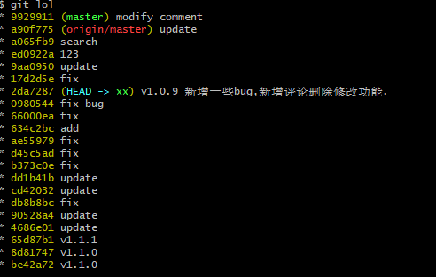


当我们两条分支不在一条线上的时候，这时候


#### **🔺7.5	坑(初始化一个文件后,不add不commit,也TM能切换分支成功,不受Git切换分支失败的约束)**

**前置条件:现有两个分支,master 和 test**

- 🔺🔺🔺初始文件(这个文件第一次在工作区中出现，或者暂存区 - 因为git checkout 切换分支相当于git reset --hard CommitHash的效果， ) -- 下面的坑就出在初始文件的时候🔺🔺🔺

**初始化文件的两个坑场景:**

> - ​	**第一种情况:我们在test分支上<font color='red'>创建</font>一个文件demo,不add不commit,然后切回到master分支.这个时候git出于数据安全的考虑它会将这个demo文件带到master分支上,还会把这个demo文件的状态也一起带过来.demo在test分支上处于未跟踪状态,切换到master分支以后,demo文件也处于未跟踪状态.虽然他是好心,但是这样太乱了.容易污染master分支(如果你不小心又给提交到master分支里面去了.上线以后爆炸了,那就损失惨重了)**
> - ​    **第二种情况:我们在test分支上<font color='red'>创建</font>一个文件demo,我们add一下,不commit,然后切换到master分支.这个时候git出于数据安全的考虑他会将这个demo文件代到master分支上,还会把这个demo文件的状态也一起带过来.demo在test分支上处于已暂存,待提交状态.切换到master分支以后,demo文件也处于已暂存,待提交状态.虽然他是好心,但是会污染master分支**

**结果:都能切换成功,而且很容易污染分支,这坑非常非常非常非常🔺🔺🔺🔺🔺🔺严重的,记住最佳实践,记住最佳实践**


## 八、合并分支

**案例:如下,以此案例引入merge合并分支功能**

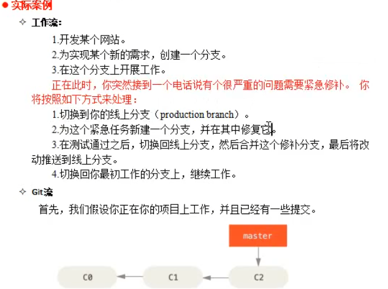


**前置条件:目前开发分支iss53 已经完成了50%, 线上BUG分支hotbug已经修复完成.流程图如下;**

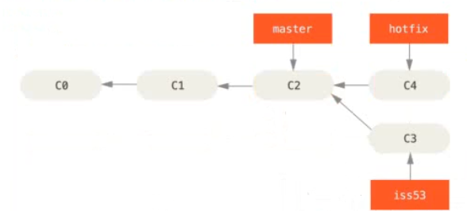


**现在我们要将hotfix分支合到master分支上;引入8.1 合并分支**


#### 8.1	快进分支合并(无冲突)

**命令:`git merge 分支名`**

> - ​	**如果我们要将上图分支图中的hotfix分支合并到master分支上,我们必须切换到master分支,然后执行`git merge hotfix`**
> -    **此时是快进合并,什么是快进合并,看下图**

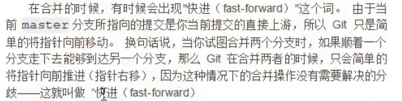

> - ​	**🔺🔺🔺快进合并是没有冲突的**
> 	- **🔺🔺🔺为什么没有冲突呢?因为hotfix是从master上拉取下来的,hotfix此时的修改相当于在master上修改(因为master可以通过线路直接走到hotfix)**

```bash
$ git merge hotbug
Updating b2b775d..2d75b08
Fast-forward	# 快进合并
 a.txt | 1 +
 1 file changed, 1 insertion(+)
```

```bash
$ git lol
* 2d75b08 (HEAD -> master, hotbug) 7 commit for a.txt v3 to fix hotbug
| * 1e2f5ef (iss53) 6 commit for iss53 50%
|/
* b2b775d 2 commit for a.txt
* bb51795 1 comimit for a.txt v1
```

**快进合并后得到如下分支图:**

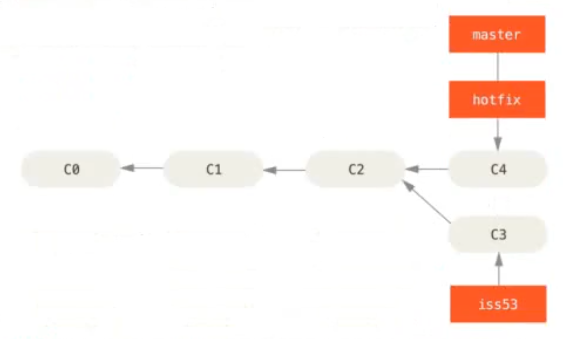


**案例问题:此时的iss53分支已经过期(相对于现在的master分支来说)**


#### 8.2 典型合并(有冲突)


**场景:此时我们在iss53分支上,再次修改再次提交,再次修改再次提交,然后把iss53合并到master分支上**

**命令:**

> - ​	**`git checkout master`**
> - ​    **`git merge iss53` 等到如下场景**

```bash
zmz@DESKTOP-IVHSPRM MINGW64 /d/MyGit3 (master)
$ git merge iss53
Auto-merging a.txt	#自动合并a.txt
CONFLICT (content): Merge conflict in a.txt #CONFLICT（内容）：合并 a.txt 中的冲突(这里就是冲突的文件)
Automatic merge failed; fix conflicts and then commit the result. #自动合并失败； 修复冲突，然后提交结果

zmz@DESKTOP-IVHSPRM MINGW64 /d/MyGit3 (master|MERGING)	# 这里
$
```

**我们`git status 看一眼`**

```bash
$ git status
On branch master
You have unmerged paths.
  (fix conflicts and run "git commit")
  (use "git merge --abort" to abort the merge)

Changes to be committed:

        new file:   iss53.txt	# 这个是新增的(相对于master来说)

Unmerged paths:
  (use "git add <file>..." to mark resolution)

        both modified:   a.txt	# 这个是修改的(相对于master来说),这就是冲突的文件
```

**此时我们打开a.txt 这个文件看一眼**

**`vim a.txt`**

```bash
a.txt v1
a.txt v2
<<<<<<< HEAD
a.txt v3
=======
a.txt v3 for iss53
>>>>>>> iss53
```


**我们保留hotfix的修改和我本次的修改,修改后如下**

**`vim a.txt`**

```bash
a.txt v1
a.txt v2
a.txt v3 for hotfix
a.txt v3 for iss53
```


**再次add一次, commit提交一次.这次才合并完成**


## 九、	开发分支的模式


#### 9.1	长期开发分支


> - ​	**不能直接在master分支上面改**
> - ​    **自己来一个分支，用自己的花名进行命名，比zmz、develop**
> - ​    **也不能在自己拉取的分支上改（develop）**
> - ​    **每开发一个功能，我们就在自己的分支上面再建一个子分支。等全部功能开发完成，就全部提交到自己的分支上，让交予测试，测试通过，稳定后，将自己的分支合并到master分支上。下次开发的时候再拉一个自己的分支，然后在自己的分支上开发功能，然后依次循环**


## 十、Git存储


**背景：**

​		**有时候，当你在项目的一部分上已经工作一段时间后，所有东西都进入了混乱的状态，而这时你想要切换到另外一个分支做一点别的事情。问题是,你不想做一次提交（因为这个功能还没开发完，一般开发完了才提提交）。针对这个问题的答案是`git stash`命令**


#### 10.1	git stash 命令

##### **10.1.1	命令：`git stash  栈存、压栈（谐音暂存，暂时存储）`** 

**单词记忆：**

> - ​	**`stack - 堆栈`**
> - ​    **`stash - 存储`**
> - ​    **记忆技巧：stash是存到stack栈上面。。。**

**备注：`git stash命令会将未完成的修改保存到一个栈上（遵循先进后出，压栈 --》弹栈），而你可以在任何时候重新应用 这些改动通过`git stash apply`)但是这个命令不常用**


**我们执行一下`git stash`， 下面这个按钮的前置条件是我们有已修改未暂存的文件、数据或内容**

```bash
$ git stash
warning: LF will be replaced by CRLF in demo.txt.
The file will have its original line endings in your working directory
Saved working directory and index state WIP on damu: f6ed02a 13 commit for demo.txt v2
#在damu上保存工作目录和索引状态WIP：f6ed02a 13 commit for demo.txt v2
```

**此时我们`git status`**

```bash
$ git status
On branch damu
nothing to commit, working tree clean
```

**此时我们git log完全无异常，但是我们使用 `git log --oneline --decorate --graph --all`的时候会发现如下情况：多了一条分支，而且还给我们合并过来。。**

```bash
$ git log --oneline --decorate --graph --all
*   85c5aa3 (refs/stash) WIP on damu: f6ed02a 13 commit for demo.txt v2 #快速合并
|\
| * cf676ce index on damu: f6ed02a 13 commit for demo.txt v2	#创建分支
|/
* f6ed02a (HEAD -> damu) 13 commit for demo.txt v2	#我们执行git stash的位置
```


**解释：其实`git stash`本质还是帮我们建了一个分支，然后采用快速合并，合并了一次代码，然后又将指针指向我们执行`git stash`位置的提交对象，重置了一次工作区，相当于一次版本回退**


##### **10.1.2	命令：` git stash apply 应用,默认应用栈顶的元素，不会执行弹栈（删除栈里面的元素），栈里面还有 不常用**


##### 10.1.3	命令：`git stash apply stash@{0}`不常用，知道就行

- **通过stash@{index}指定应用栈里面的哪一个元素**


##### **10.1.3	命令：`git stash list 查看栈中内容`**

```bash
$ git stash list
stash@{0}: WIP on damu: f6ed02a 13 commit for demo.txt v2
```


##### 10.1.5	命令：`git stash drop + stash@{index}` **移除指定的栈内元素**


##### 10.1.4	命令：`git stash pop` **应用栈顶的元素，并扔掉它**

🔺🔺🔺🔺🔺🔺🔺🔺🔺🔺🔺🔺🔺🔺🔺🔺🔺🔺🔺🔺🔺🔺🔺🔺

🔺🔺🔺🔺🔺🔺🔺🔺🔺🔺🔺🔺🔺🔺🔺🔺🔺🔺🔺🔺🔺🔺🔺🔺

**我们一般用这个玩意取栈然后删除，保证用一次删除一次。栈我们就搞这样，不需要搞太复杂，太复杂了。你自己会裂开。你自己都搞不清楚哪里是哪里了**


**🔺🔺常识：一般`git stash pop`配合`git checkout 文件名 --撤销工作区中的修改`**

**为什么呢？**

> - ​	**因为我们有时候会忘记，我们栈中还有东西就直接开始写代码了，这个时候，如果我们再去`git stash pop`就会报错。不让我们取，让我们提交了再取，那不是扯淡嘛，所以我们要撤销工作区的修改，然后取出来**
> -    **还有一种情况，也是我们忘记了，但是我们已经在工作区中写了很多很多了，这时候栈里面的已经完全落后了，我们可以使用`git stash drop + stash@{index}`来将栈里面的元素丢掉**


## 十一、后悔药

- **工作区 的后悔药**
- **暂存区 的后悔药**
- **版本库 的后悔药**


#### 11.1	工作区的后悔药

*****

**须知点：**

- ​	**在工作区的初始化文件，是不需要吃后悔药的，我们直接删除或者`Ctrl + z`就可以**
	- **因为他还没有被Git管理**
- ​    **工作区的后悔药是撤销工作区中的修改，以当前暂存区中的内容为标准**
- ​    **🔺🔺工作区撤销操作后的文件内容跟当前暂存区中对应文件的内容保持一致**


**命令：`git checkout filename`**

**注意：`git checkout filename`是以当前暂存区为基础进行恢复，为什么这么说呢？因为如果我们先修改一个文件中的内容，然后add，然后再次修改，这个时候我们`git checkout filename`将使工作区和add之后的暂存区保持一致，同理`git reset HEAD filename`是与当前提交对象保持一致**


#### 11.2	暂存区的后悔药

**命令：`git reset HEAD filename`**

**须知点：**

- ​	**🔺`git reset HEAD filename 以后,文件状态变成add前的状态，不会动工作区中文件的内容，只有自己去git checkout filename 去还原到当前暂存区中对应文件的内容`**
- ​    **这个时候再来一次git checkout filename 就给他打回完全的原型。因为git checkout filename后文件内容跟当前暂存区中对应文件的内容保持一致**
- ​    **🔺🔺🔺🔺🔺`git reset HEAD filename 只会去拉取当前提交对象对应的暂存区中，对应文件的索引或者说内容来覆盖本次的修改，从而达到后悔的目的。如果后悔后的暂存区的索引已和当前提交对象的暂存区索引内容一致的时候，无论你再执行多少次git reset HEAD filename 都不会再改变了`**
- ​    **只改变暂存区**


**本质：`git reset HEAD filename` 就跟他的字面意思一样刷新HEAD指针，就是刷新暂存区，从当前刷新会上一次的暂存区状态。**


#### 11.3	工作区+暂存区后悔的三种场景

```bash
对工作区中文件的修改分为三种情况：

（1）修改后还没有git add

（2）修改已经git add

（3）🔺🔺🔺🔺修改已经git add，并再次进行修改

对于第一种情况，直接使用git checkout -- 文件，即可撤销修改，撤销修改就回到和版本库一模一样的样子。

第三种情况 先使用git checkout filename 再git reset HEAD filename，然后再git checkout filename的操作和 先git reset HEAD filename再git checkout filename操作，最后文件的内容一致，所以啊，还是先git reset 然后再git checkout好点
```


#### 11.4	（版本库后悔药

**适合的场景**

> - ​	**注释写错了，想要后悔，又不想重新提交一次**
> - ​    **还有文件忘记提交了，又不想重新提交一次**
> - ​    **提交的某个文件还有错误，且还有某些文件未提交，又不想重新提交一次**

**场景1：提交注释写错了，进行注释后悔**

****

**命令：`git commit --amend`**，**执行该命令后，会出现如下注释vim编辑框，每一次进去，提交对象都要发生改变。因为时间戳发生了改变，但是分支线上会进行覆盖**

```bash
$ git commit --amend
# 下面是vim操作
 damu.txt v2版本	# 我们修改成 damu.txt v2版本

# Please enter the commit message for your changes. Lines starting
# with '#' will be ignored, and an empty message aborts the commit.
#
# Date:      Mon May 31 01:07:06 2021 +0800
#
# On branch master
# Changes to be committed:
#       modified:   a.txt
#
```

**利用`git log --oneline --decorate --graph --all`对比吃注释后悔药之前和之后的对比**

**之前：**

```bash
$ git lol
* a3df16a (HEAD -> damu) damu.txt v2版本	# 写错的注释
* 0b38599 damu.txt v1版本
* b148797 (master) 删除test.txt , 新建damu.txt
* 0060966 修改test的名字
* 2354526 test v1版本
```

**之后:**

```bash
$ git lol
* b865785 (HEAD -> damu) damu.txt v2版本 测试commit -amend命令	#  修改后的注释
* 0b38599 damu.txt v1版本
* b148797 (master) 删除test.txt , 新建damu.txt
* 0060966 修改test的名字
* 2354526 test v1版本
```

**结论：修改后提交会覆盖之前的提交，但是提交对象的哈希发生了改变**

***

**场景2：提交了一次，发现上次提交的文件中还有错误，而且还有一个文件没有提交。且这个时候我们又不想让分支中多一次提交**

**解决：重新修改在工作区修改错误的文件，然后将修改后的文件和上一次需要提交而没有提交的文件一起`git add `一下， 然后再`git commit --amend`就解决了这一次的问题了**


## 十二、reset 重置三部曲


**前置条件：假设我们修改了file.txt 文件三次并提交了三次。现在的历史查看起来是如下这样的**

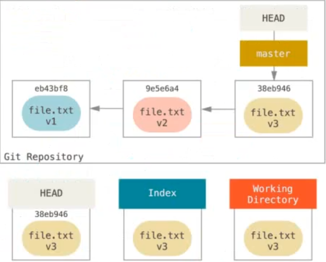


#### 12.1	第一部曲`git reset --soft HEAD~/提交对象哈希`

**执行动作：`--soft 只有一步`**

> 1. ​	**改变master内容，同时改变HEAD**


**备注：**

> - ​	🔺**`git checkout branchname`只移动/修改HEAD指针，不修改/移动master**
> - ​    🔺**`git reset --soft HEAD~`修改/移动master，带着HEAD一起改变，（这里我们以master分支为例）就是修改refs/heads目录中master文件中的内容。由于HEAD文件是指向master文件的，master文件中的内容改变。HEAD也就被带着一起改变了。所以叫HEAD和分支一起移动**
> - ​    **🔺`HEAD~`相当于一个别名，代表上一个的提交对象哈希，我们也可以直接用哈希值代替** 
> 	- **🔺`HEAD~ == 哈希`**   


**我们执行一次`git reset --soft HEAD~`历史记录就变成了下图这样**

**结论（所动区域）：**

> - ​	**暂存区和工作区都没有变**
> - ​    **🔺他只动master和HEAD，其他都不动,就是说动了提交区。**
> - ​    **改变了master，导致HEAD也变了（因为HEAD文件指向master文件）。所以我们说HEAD和master都变了。后面就这样说了**
> - ​    **🔺`git status`的时候我们发现有文件未被提交。这是因为执行`git reset --soft HEAD~`之后我们只动HEAD和master，其他都不变。执行`git status`的时候，git会去对比当前暂存区和版本库对应的暂存区，或者说master指向的提交对象所对应的暂存区，是否一致。当发现不一样，提示有已暂存待提交的文件**
> - ​    **`执行git status`的到如下**

```python
$ git status
On branch master
Changes to be committed:	# 需要被提交
  (use "git reset HEAD <file>..." to unstage)

        modified:   file.txt	#绿色
 """
 **Git暂存区是否需要执行commit提交，是通过当前暂存区与提交对象暂存区对比是否一致来判断的，一致不提示commit，不一致提示需要commit**, --soft只改master和HEAD（相当于只改变提交对象），所以不一致，提示需要提交

**Git工作区是否需要被暂存，是通过工作区假定生产的暂存区与当前暂存区是否一致来判断，一致不提示add暂存，不一致提示需要add暂存**  --soft不改变暂存区，所以不需要暂存
 """
```

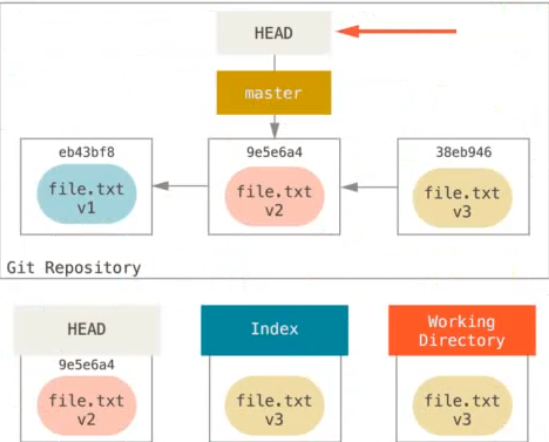


#### 12.2	第二部曲`git reset --mixed HEAD~/提交对象哈希`

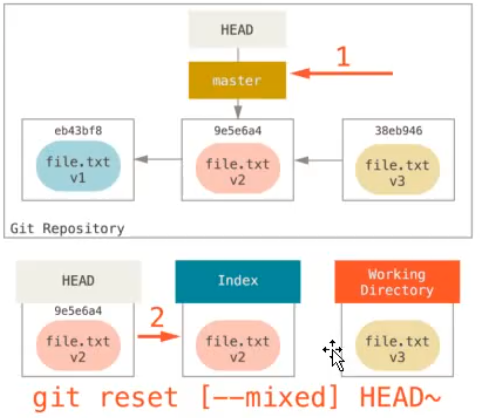

**执行动作：两步**

> 1. ​	**改变master文件中内容，移动HEAD指针**
> 2. ​    **用HEAD指针所指的提交对象的暂存区覆盖当前暂存区**


**所动区域**

> - ​	**`git  reset [--mixed] HEAD~/提交对象哈希` 动master （同时带着HEAD一起动)，也就是说动了提交区**
> - ​    **提交区**
> - ​    **动暂存区**
> - ​    **不动工作区**
> - ​    **执行`git status`得到如下(未暂存的文件)**

```python
$ git status
On branch master
Changes not staged for commit:	# 未暂存，需要add 暂存
  (use "git add <file>..." to update what will be committed)
  (use "git checkout -- <file>..." to discard changes in working directory)

        modified:   file.txt	# 红色
"""
 **Git暂存区是否需要执行commit提交，是通过当前暂存区与提交对象暂存区对比是否一致来判断的，一致不提示commit，不一致提示需要commit**, --mixed改master和HEAD（相当于改变提交对象），和暂存区。这时候暂存区和提交对象的暂存区都是HEAD所指向的，保持一致，不需要commit

**Git工作区是否需要被暂存，是通过工作区假定生产的暂存区与当前暂存区是否一致来判断，一致不提示add暂存，不一致提示需要add暂存**  --mixed要改变暂存区，这是工作区假定生成的暂存区与当前暂存区不一致，所以提示需要add
"""
```


**特殊讲解：`git reset [--mixed] commitid filename`, 只要后面加了filename，则提交区就不会改变，也就是说不管这个commitid是否是HEAD或者其他版本的提交对象，当指定了filename，提交区就不会变，这样写的意义是，指定暂存区还原成哪个版本的数据**

- **只动暂存区**


#### 12.3	**`--soft`和`--mixed`总结**

> - ​	**`soft`只动HEAD和master**
> - ​    **`--mixed`动HEAD和master还会去动暂存区，暂存区覆盖**
> - ​    **都不会去动工作区**
> - ​    **要想还原，就是从--soft后悔可从从--soft回去也可以从--mixed回去，而从--mixed后悔就从--mixed回去。如果用--soft你需要commit一次**
> - ​    **--soft一般用于线上回滚**


#### 12.4	第三部曲`git reset --hard HEAD~/提交对象哈希 `


**所动区域**

> - ​	**`git  reset --hard HEAD~/提交对象哈希` 动master （同时带着HEAD一起动）（改提交区--提交对象）**
> - ​    **动暂存区**
> - ​    **动工作区**
> - ​    **强制覆盖，工作区。如果有初始化文件，直接给你干掉。这个玩意是用丢数据的风险**


#### 12.5	路径reset xxx CommitHash（默认是HEAD，可以不写） +  filename/path

**语法：`reset xxx CommitHash（默认是HEAD） +  filename/path`**

**须知：只有`git reset [--mixed] HEAD 支持在后面加filename/path其他几个都不行。为什么还说呢？因为其他无法通过语法检查，但是还是有意义，方便理解它衍生出来的命令**

**备注：前面讲述了reset基本形式的行为，不过你还可以给它提供一个作用路径。若指定一个路径，<font color='red'>reset 将会跳过第一步操作（因为某人是当前HEAD，当前HEAD不变，所以相当于跳过，感觉跳过一词不准确）</font>，并且将他的作用范围限定为指定的文件或者文件集合。这样做自然有它的道理，因为HEAD只是一个指针，你无法让它同时指向两个提交中各自的一部分。不过索引和工作目录可以部分更新，所以重置会继续进行第2步骤（修改暂存区）**

​		  **现在，假如我们运行`git reset file.txt(这其实就是git reset --mixed HEAD file.txt的简写形式)`、它会：**

​		**移动HEAD分支的指向当前HEAD，由于是当前HEAD提交区和暂存区进行覆盖，由于加了file.txt,指名只覆盖file.tx的索引，从而实现file.txt的后悔操作。如果不加file，暂存区全部覆盖，文件全部后悔**


#### 12.5	reset 三部曲 对应 三种后悔药

**须知：只有`git reset [--mixed] HEAD 支持在后面加filename/path其他几个都不行，他们用其他命令替代`**


***


**`git reset HEAD filename`**				**`git reset [--mixed] HEAD path(filename)`**   (真等于)可以真实操作。三部曲中只有这一个支持这种写法。表示修改到HEAD指向的提交对象，覆盖path（filename）

***


**`git checkout filename`就是拿当前HEAD里面（当前提交对象）工作目录区替换**


# 十三、命令


```bash
"""
底层命令
"""
git hash-object -w 文件			# 生产git对象返回git对象哈希
git update-index --add --cacheinfo 10064 git对象哈希 索引名	# 在暂存区创建索引，啥也不返回
git write-tree					# 给暂存区拍个快照，生产树对象，返回树对象索引
git ls-files -s					# 参看暂存区， 暂存区就是一系列索引关系 git对象 : 索引名
git cat-file -t 哈希/HEAD		   #查看哈希对应的类型，HEAD代表最新一次提交对象的哈希
git cat-file -p 哈希/HEAD		   #查看哈希对应的内容，HEAD代表最新一次提交对象的哈希


"""
高层命令
"""
git commit					# 写超长注释，vim编辑框
git commit -m
git commit -a 				#跳过暂存区， 这个还是不要使用的好
git commit --amend			#注释后悔 -- 就是然你重新编辑注释
git log						# 查看提交日志， 按Q键退出
git log --pretty=oneline	#漂亮输出
git log --oneline			#也是漂亮输出
git log --oneline --decorate --graph --all	#查看完整的分支图
git reflog					#可以查看所有的commit和切换分支
git branch					#显示分支列表
git branch 分支名			  #创建分支
git branch -v				#查看每一个分支最后一次提交
git branch -d 分支名		  #删除一个分支(空分支,无内容的分支,或者已经被合并过的分支)
git branch -D 分支名 		  #强制删除一个分支(分支上有内容)
🔺git branch 分支名 + commitHash字符串 #新建一个分支，并使分支指向对应的提交对象，这个超级有用（在任意位置拉取分支）
git checkout 分支名		  #切换分支	
🔺git checkout -b 分支名		  #在当前位置创建一个分支并切换过去等价于git brancn 分支名； git checkout 分支名	
git checkout filename 		#工作区后悔，以当前暂存区为基础，恢复到和当前暂存区一样。如果是一个初始化的文件，执行该命令会报错，因为暂存区中都没有这个文件，无法匹配，所以报错
🔺git checkout -b 分支名 hashcommit	指定位置创建一个分支并切换过去

🔺git checkout HEAD filename  #工作区和暂存区后悔，以当前提交对象对应的暂存区为基础，进行恢复工作区后悔，以当前提交对象为基础进行暂存区后悔，相当于git reset --hard HEAD filename, 提交对象不变，工作区和暂存区后悔
🔺git checkout commitid filename # 工作区和暂存区中的filename进行后悔，提交对象不变，以commitid对应的提交对象为基础，进行后悔恢复filename
🔺git checkout .				#工作区全部文件后悔复原成当前暂存区的样子

🔺 git checkout 主要是用于移动HEAD,即.git目录下  HEAD的值，refs/branchs  中的值不会发生改变，既然不发生改变，那么git lol 时候，只有HEAD在移动，分支都没有动，因为refs/branchs  中的值不会发生改变，所以我们切换分支的时候，会发现其他分支依旧存在。。🔺其中git      checkout commitid filename 的时候，它不会改变refs/branchs中的值，所以我们用来进行工作区回滚或者后悔

🔺git reset --hard / --mixed /--soft  改变refs/branchs 中的值，由于.git目录下 HEAD文件中的值指向refs/branchs中的值，所以我们说，分支改变，带着HEAD一起移动


git merge					#合并分支
git stash					#存到栈里面	 用于切换分支时，又不想提交当前的东西，所以引入这个玩意，对于初始化的文件，需要add一下了才可以stash，对于已经被版本库管理的文件，add和不add都可以，stash
git stash list				#查看堆栈里面的内容
git stash pop				#弹栈（先引用后删除）
git stash drop stash@{index}#不引用直接丢掉

git reset [--mixed] commitid			# 版本回退，回退暂存区和提交区
git reset [--mixed] HEAD filename 		# 暂存区后悔
git reset [--mixed] commitid filename 	# 提交区不变，暂存区变成commitid 对应的暂存区
git reset --soft HEAD~			# 只修改提交区


git checkout filename			# 以当前暂存去为基础，进行后悔

git checkout HEAD filename 		# 以HEAD提交对象为基础，对filename进行 暂存区和工作去后悔

git checkout commiwwtid filename	# 以commitid提交对象为基础，对filename进行，暂存区和工作区得后悔，覆盖，这里有一个经典的问题，那就是如果我们创建了一个新文件，然后提交到暂存区，这个时候，如果使用这个方法会报错。因为我们是以提交区为基础，由于是新建的文件，提交区还没有这个文件，所以啊要报无法匹配改文件，这个时候只有使用git reset --mixed HEAD filename，这个其实暂存区也没有这个文件，但是t

git reset --hard HEAD~/commitid	# 工作区 暂存区  提交对象全部后悔成 commitid对应得数据


git diff ： 对比工作区(未 git add)和暂存区(git add 之后)
git diff file	:对比工作区区和暂存区指定文件不同之处

git diff --cached: 对比暂存区(git add 之后)和版本库(git commit 之后)
git diff --cached file	: 对比指定文件在暂存区和版本库中的不同

git diff HEAD: 对比工作区(未 git add)和版本库(git commit 之后)
git diff HEAD filne ： 对比指定文件在工作目录和版本库中的不同

git diff branch1 branch2 		# 比较两个分支不同,这两个分支可以是远程跟踪分支,一般这样用 git diff 当前本地分支 当前本地分支对于的远程跟踪分支   ， 这样来查看本地分支和远程分支的不同
git diff branch1 branch2 file  	# 两个分支版本库指定文件之间的不同


Git 清理无效的远程追踪分支（场景：本地存在,远程仓库已经删除的g）
git remote prune origin --dry-run	# 查看远程仓库已经没有，但本地还有的分支
git remote prune origin				# 删除

git revert commitid					# 是生成一个新的提交来撤销某次提交，此次提交之前的commit都会被保留
git reset ...						# 直接回滚回去，b
```


**`git stash`说明**

如果有一个文件deme.txt，我们修改demo.txt内容以后，git add demo.txt,   然后再次修改demo.txt文件。。,这个时候工作区和暂存区都发生了变化，这个时候我们git stash，暂存区和工作区都将变成上次提交的初始样子。git stash pop 后，我们发现，恢复的仅仅只有工作区，暂存区还是上次提交的初始样子


