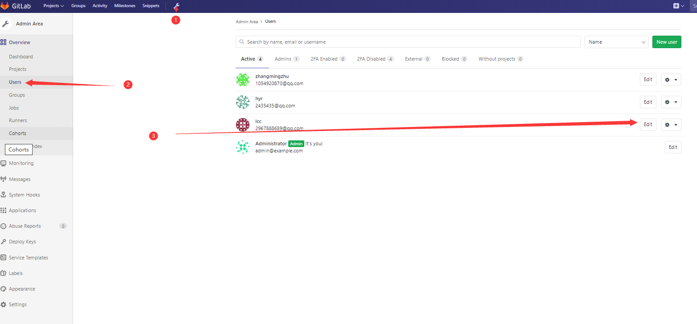
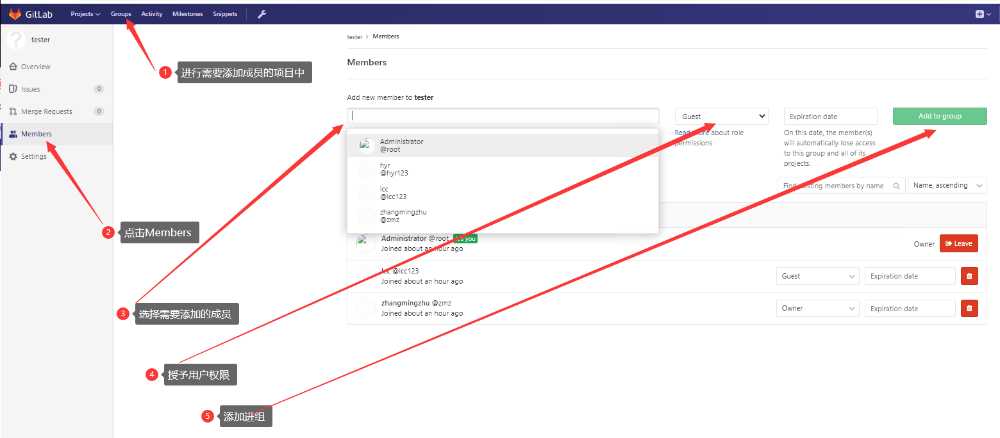

账号 root

密码 5iveL!fe


```
zhangmingzhu
zmz
1054920870@qq.com
zmz821218
```

```
root
zmz821218
```


Private token

```
C7jsfyjAzzqK7FFYSMW1
```

RSS token

```
AyXp-NqTr5DaUknsvH7o
```


## 一、远程仓库命令行说明

#### 1.1	Git global setup(全局设置)

```
git config --global user.name "Administrator"
git config --global user.email "admin@example.com"

#### 生成公钥私钥 完整版

**git config --global user.name "张明柱"**

**git config --global user.email "zhangmingzhu@xiaoduotech.com"**

**ssh-keygen -t rsa -C "zhangmingzhu@xiaoduotech.com"**

**ssh -T git@gitlab.com**   --- `ssh -T git@192.168.0.111 这用于私有部署`
```


#### 1.2	绑定远程分支

##### 1.2.1	给远程仓库绑定分支

```bash
git remote add origin http://192.168.0.111:54312/tester/study_git.git
```

##### 1.2.2	查看绑定情况

```bash
$ git remote -v
origin  http://192.168.0.111:54312/tester/study_git.git (fetch)
origin  http://192.168.0.111:54312/tester/study_git.git (push)
```

##### 1.2.3	其他remote命令

```bash
git remote rm name  # 删除远程仓库
git remote rename old_name new_name  # 修改仓库名
git remote show origin		#查看远程仓库的具体信息
```

##### 1.2.4	推到远程仓库中 git push [远程仓库] [本地分支] [远程分支]

```bash
git push origin master:master
```


#### 1.3	几种方法：将本地仓库和远程仓库关联

##### Create a new repository

```
git clone http://192.168.0.111:54312/client-test/README.md.git
cd README.md
touch README.md
git add README.md
git commit -m "add README"
git push -u origin master
```

##### 🔺Existing folder（主要用他）

**备注：本地有一个项目，我们想推到我们刚新建的远程仓库中**

```
cd existing_folder
git init
git remote add origin http://192.168.0.111:54312/client-test/README.md.git
git add .
git commit -m "Initial commit"
git push -u origin master
```

##### Existing Git repository

```
cd existing_repo
git remote add origin http://192.168.0.111:54312/client-test/README.md.git
git push -u origin --all
git push -u origin --tags
```


## 二、gitlab的基本使用

#### 2.1	gitlab添加用户、给用户修改密码




#### 2.2	gitlab通过root账号给，组内成员添加项目权限




## 三、git的config文件

**备注:我们首先给远程仓库取个别名`git add remote taobaohttp://192.168.0.111:54312/tester/study_git.git `然后用notepad++打开，如下(感觉像python的configparser生成的，格式一模一样)**

> - ​	**[core]：核心**
> - ​    **[remote "taobao"]**

```python
[core]
	repositoryformatversion = 0
	filemode = false
	bare = false
	logallrefupdates = true
	symlinks = false
	ignorecase = true
[remote "taobao"]
	url = http://192.168.0.111:54312/tester/study_git.git
	fetch = +refs/heads/*:refs/remotes/taobao/*
```


## 四、远程分支

> - ​	**远程分支**
> - ​    **远程跟踪分支**
> - ​    **本地分支**


#### 4.1	远程跟踪分支除开网络操作外（fetch、push、pull），他是不会变的

**案例：**

```
1. 我们在本地切换到远程跟踪分支上面，进行修改（比如删除一个文件），然后add 和 commit，这个时候只有HEAD移动，远程跟踪分支不会移动，相当于又创建了一个分支。这个时候我们将HEAD移动会
```


```bash
git pull [remote] [branch]			# 但我们在master分支上的时候，我们不用些remote 和 branch,但是在除master分支上的时候，必须写完整
git pull 实际上是执行了3个操作， 一个操作是git fetch [remote] [branch] 更新远程跟踪分支，然后 将远程跟踪分支合并到对应的分支上，使他们的HEAD指向同一个提交对象
git pull [remote] [branch]			# 操作对应的分支，不会影响其他的分支
```


```bash
git push [remote] [branch]			# 也是分了几步完成的
 1. 将远程跟踪分支合并过来
 2. 然后使他们的HEAD执行同一个提交对象
 3.	推到远程仓库
 4. 他不会永久关联远程分支
 git push --set-upstream [remote] [branch]	# 使所在的分支关联（永久关联了）对应的远程分支，并马上提交
 git branch -u [branch]	# 使所在的当前分支关联对应的远程分支（永久关联了）
```


```bash
git push --tags	
或
git push origin --tags
将本地的tag全部推到远程仓库

git push origin v1.0		#将本地v1.0的tag推送到远端服务器
git tag						# 在控制台打印出当前仓库的所有标签
git tag -d v1.0				# 删除v1.0这个tag
```


```bash
git add remote 别名 远程地址						#给远程仓库取别名
git remote show 别名							  #查看别名绑定的远程仓库具体信息
**********************************************************************************
git config --list								#查看所有p
git config -e									# 会打开该项目所属下的配置文件（.git目录下）(作用域最小，值针对当前项目有效，优先级就最高)
git config -e --global							# 会打开（C:\Users\XiaoRui\.gitconfig）下的配置文件(作用域中等，为登陆这台计算机的用户，比如我的电脑是zmz，就是zmz这电脑用户,优先级中等)。
git config -e --system							# 会打开D:\Program Files\Git\etc\gitconfig(作用域最大，整台计算机，不管登陆那个帐号，不管哪个项目,优先级最低)。
**********************************************************************************
git config user.name 'zmz'						# 配置用户名
git config user.name							# 查看用户名
git config -e									# 打开项目配置文件(默认vim打开,可编辑)
**********************************************************************************
git config --global user.name 'zmz'				# 配置全局用户名
git config --global user.name					# 查看全局用户名
git config -e --global							# 打开电脑用户配置文件(默认vim打开,可编辑)
**********************************************************************************
git config --system user.name 'zmz'				# 配置整个系统用户名
git config --system user.name					# 查看配置的系统用户名
git config -e --system							# 打开电脑系统配置文件(默认vim打开,可编辑)
**********************************************************************************
git config /--global/--system user.name 'zmz'	# （采用http/https/ssh的提交的时候）都可以乱取名，不用和你的登录账号对应，但是希望还是一一对应，方便人员跟踪
git config /--global/--system user.email 'zmz'	# （采用http/https/ssh的提交的时候）可以乱取邮箱，不用和你的登录账号对应，但是希望还是一一对应，方便人员跟踪
user.name 和 user.emali 就一个追踪提交信息的功能，不对登录授权有什么影响
**********************************************************************************
git config --global --unset user.name			# 删除user.name,主要目的
git config --global --unset user.name zmz		# 重置user.name 为 zmz
git config --global user.name zmz				# 这样也可以重置，上面的删除才是z
git config --global --unset user.email			# 删除user.email
git config --global --unset user.email 12@qq.com# 重置user.email 为 12@qq.com
```

