账号 root

密码 5iveL!fe

🔺 git checkout 主要是用于移动HEAD,即.git目录下  HEAD的值，refs/branchs  中的值不会发生改变，既然不发生改变，那么git lol 时候，只有HEAD在移动，分支都没有动，因为refs/branchs  中的值不会发生改变，所以我们切换分支的时候，会发现其他分支依旧存在。。🔺其中git      checkout commitid filename 的时候，它不会改变refs/branchs中的值，所以我们用来进行工作区回滚或者后悔

🔺git reset --hard / --mixed /--soft  改变refs/branchs 中的值，由于.git目录下 HEAD文件中的值指向refs/branchs中的值，所以我们说，分支改变，带着HEAD一起移动


```
zhangmingzhu
zmz
1054920870@qq.com
zmz821218
```

```
root
zmz821218
```


Private token

```
C7jsfyjAzzqK7FFYSMW1
```

RSS token

```
AyXp-NqTr5DaUknsvH7o
```


# 一、远程仓库命令行说明

## 1.1	Git global setup(全局设置)

```
git config --global user.name "Administrator"
git config --global user.email "admin@example.com"

#### 生成公钥私钥 完整版

**git config --global user.name "张明柱"**

**git config --global user.email "zhangmingzhu@xiaoduotech.com"**

**ssh-keygen -t rsa -C "zhangmingzhu@xiaoduotech.com"**

**ssh -T git@gitlab.com**   --- `ssh -T git@192.168.0.111 这用于私有部署`
```


## 1.2	绑定远程分支

#### 1.2.1	给远程仓库绑定分支

```bash
git remote add origin http://192.168.0.111:54312/tester/study_git.git
```

#### 1.2.2	查看绑定情况

```bash
$ git remote -v
origin  http://192.168.0.111:54312/tester/study_git.git (fetch)
origin  http://192.168.0.111:54312/tester/study_git.git (push)
```

#### 1.2.3	其他remote命令

```bash
git remote rm name  # 删除远程仓库
git remote rename old_name new_name  # 修改仓库名
git remote show origin		#查看远程仓库的具体信息
```

#### 1.2.4	推到远程仓库中 git push [远程仓库] [本地分支] [远程分支]

```bash
git push origin master
```


## 1.3	几种方法：将本地仓库和远程仓库关联

##### Create a new repository

```
git clone http://192.168.0.111:54312/client-test/README.md.git
cd README.md
touch README.md
git add README.md
git commit -m "add README"
git push -u origin master
```

##### 🔺Existing folder（主要用他）

**备注：本地有一个项目，我们想推到我们刚新建的远程仓库中**

```
cd existing_folder
git init
git remote add origin http://192.168.0.111:54312/client-test/README.md.git
git add .
git commit -m "Initial commit"
git push -u origin master
```

##### Existing Git repository

```
cd existing_repo
git remote add origin http://192.168.0.111:54312/client-test/README.md.git
git push -u origin --all
git push -u origin --tags
```


# 二、gitlab的基本使用

## 2.1	gitlab添加用户、给用户修改密码


## 2.2	gitlab通过root账号给，组内成员添加项目权限


# 三、git的config文件

**备注:我们首先给远程仓库取个别名`git add remote taobaohttp://192.168.0.111:54312/tester/study_git.git `然后用notepad++打开，如下(感觉像python的configparser生成的，格式一模一样)**

> - ​	**[core]：核心**
> - ​    **[remote "taobao"]**

```python
[core]
	repositoryformatversion = 0
	filemode = false
	bare = false
	logallrefupdates = true
	symlinks = false
	ignorecase = true
[remote "taobao"]
	url = http://192.168.0.111:54312/tester/study_git.git
	fetch = +refs/heads/*:refs/remotes/taobao/*
```


# 四、远程分支(命令)

> - ​	**远程分支**
> - ​    **远程跟踪分支**
> - ​    **本地分支**


## 4.1	远程跟踪分支除开网络操作外（fetch、push、pull），他是不会变的

**案例：**

```
1. 我们在本地切换到远程跟踪分支上面，进行修改（比如删除一个文件），然后add 和 commit，这个时候只有HEAD移动，远程跟踪分支不会移动，相当于又创建了一个分支。这个时候我们将HEAD移动会
```


```bash
git pull origin [branch]			# 但我们在master分支上的时候，我们不用些remote 和 branch,但是在除master分支上的时候，必须写完整
git pull 实际上是执行了3个操作， 一个操作是git fetch [remote] [branch] 更新远程跟踪分支，然后 将远程跟踪分支合并到对应的分支上，使他们的HEAD指向同一个提交对象
git pull [remote] [branch]			# 操作对应的分支，不会影响其他的分支
```


```bash
git push [remote] [branch]			# 也是分了几步完成的
 1. 将远程跟踪分支合并过来
 2. 然后使他们的HEAD执行同一个提交对象
 3.	推到远程仓库
 4. 他不会永久关联远程分支
 git push --set-upstream [remote] [branch]	# 使所在的分支关联（永久关联了）对应的远程分支，并马上提交，如果本地有一个test分支，而远程没有这个test分支得的时候，我们就要采用这种方式 === git push -u orgin branch
 git branch -u [branch]	# 使所在的当前分支关联对应的远程分支（永久关联了）
```


```bash
git push --tags	
或
git push origin --tags
将本地的tag全部推到远程仓库

git push origin v1.0		#将本地v1.0的tag推送到远端服务器
git tag						# 在控制台打印出当前仓库的所有标签
git tag -d v1.0				# 删除v1.0这个tag
```


```bash
git add remote 别名 远程地址						#给远程仓库取别名
git remote show 别名							  #查看别名绑定的远程仓库具体信息
**********************************************************************************
git config --list								#查看所有p
git config -e									# 会打开该项目所属下的配置文件（.git目录下）(作用域最小，值针对当前项目有效，优先级就最高)
git config -e --global							# 会打开（C:\Users\XiaoRui\.gitconfig）下的配置文件(作用域中等，为登陆这台计算机的用户，比如我的电脑是zmz，就是zmz这电脑用户,优先级中等)。
git config -e --system							# 会打开D:\Program Files\Git\etc\gitconfig(作用域最大，整台计算机，不管登陆那个帐号，不管哪个项目,优先级最低)。
**********************************************************************************
git config user.name 'zmz'						# 配置用户名
git config user.name							# 查看用户名
git config -e									# 打开项目配置文件(默认vim打开,可编辑)
**********************************************************************************
git config --global user.name 'zmz'				# 配置全局用户名
git config --global user.name					# 查看全局用户名
git config -e --global							# 打开电脑用户配置文件(默认vim打开,可编辑)
**********************************************************************************
git config --system user.name 'zmz'				# 配置整个系统用户名
git config --system user.name					# 查看配置的系统用户名
git config -e --system							# 打开电脑系统配置文件(默认vim打开,可编辑)
**********************************************************************************
git config /--global/--system user.name 'zmz'	# （采用http/https/ssh的提交的时候）都可以乱取名，不用和你的登录账号对应，但是希望还是一一对应，方便人员跟踪
git config /--global/--system user.email 'zmz'	# （采用http/https/ssh的提交的时候）可以乱取邮箱，不用和你的登录账号对应，但是希望还是一一对应，方便人员跟踪
user.name 和 user.emali 就一个追踪提交信息的功能，不对登录授权有什么影响
**********************************************************************************
git config --global --unset user.name			# 删除user.name,主要目的
git config --global --unset user.name zmz		# 重置user.name 为 zmz
git config --global user.name zmz				# 这样也可以重置，上面的删除才是z
git config --global --unset user.email			# 删除user.email
git config --global --unset user.email 12@qq.com# 重置user.email 为 12@qq.com
```


```bash
# 指定关联本地分支和远程分支
git branch --set-upstream-to=origin/remote_branch  local_branch
```


# 五、特性


```bash
使用 git clone克隆仓库，默认克隆下来的远程仓库的整个仓库（所有远程分支都有被克隆下来），但是只会在本地创建一个本地master分支
```


# 1.1 场景：clone一个项目之后，再master分支上创建一个新分支并推送到远程仓库

**步骤：**

- **克隆远程项目**

```bash
$ git clone git@github.com:zmz1054920870/test.git							# 克隆项目
Cloning into 'test'...
remote: Enumerating objects: 30, done.
remote: Counting objects: 100% (30/30), done.
remote: Compressing objects: 100% (18/18), done.
remote: Total 30 (delta 1), reused 30 (delta 1), pack-reused 0
Receiving objects: 100% (30/30), done.
Resolving deltas: 100% (1/1), done.

====================================================================

$ git lol																	# 查看提交日志
* 5abba9d (origin/Tom) add singleLink
* 5fefe55 (HEAD -> master, origin/test, origin/master, origin/HEAD) 1
* 6291141 3 commit for behavior && behavior2
* 7c2240a 2 commit for behavior1 && behavior2
* 45fb366 1 commit for behavior v1
* ead8dc1 3 commit for test.txt v3 && demo.txt v3
* 904e2f4 2 commit for test.txt v2 && demo.txt v2
* a67f108 1 commit for test.txt v1 && demo.txt v1

====================================================================
 
```


- **创建一个分支**

**备注：我们一般开发的时候，从master创建一个dev分支，然后开发的时候在dev分支上面再创建一个分支用于开发，开发完成以后，合并到dev分支上，交予测试，测试通过以后，合并到master分支上**

```bash
zmz@DESKTOP-IVHSPRM MINGW64 ~/Desktop/Json/test (master)
$ git branch dev-Json

```


- **推送到远程分支上**

```bash
zmz@DESKTOP-IVHSPRM MINGW64 ~/Desktop/Json/test (master)
$ git checkout dev-Json				# 切换到dev-Json分支
Switched to branch 'dev-Json'

====================================================================

zmz@DESKTOP-IVHSPRM MINGW64 ~/Desktop/Json/test (dev-Json)
$ git push origin dev-Json			# 推送到远程仓库，这时会再远程仓库创建一个新的分支,但是不做关联，需要做关联的话，需要 -u 参数， -u == --set-upstream
Total 0 (delta 0), reused 0 (delta 0)
remote:
remote: Create a pull request for 'dev-Json' on GitHub by visiting:
remote:      https://github.com/zmz1054920870/test/pull/new/dev-Json
remote:
To github.com:zmz1054920870/test.git
 * [new branch]      dev-Json -> dev-Json
```


# 1.2 删除本地分支和远程分支

- **切换到非目标分支上**

```bash
git checkout master		# 这里我们切换到master分支上，也可以切换到其他分支上，只要不是在目标分支上就行
```


- **删除本地分支**

```bash
git branch -d dev-Json
```


- **删除远程分支**

```bash
git push origin --delete dev-Json
```


# 1.3 建立远程关联

**先了解关联远程分支的两个命令**

```bash
git branch --set-upstream-to=origin/remote_branch  local_branch	# 远程origin/remote_branch 必须存在
git branch --unset-upstream dev-Json							# 删除关联
git push -u origin remote_branch_name							# 这个是在当前分支进行，这个就不需要了，如果远程分支不存在，创建一个，如果存在更好
```


**查看关联情况的命令**

```bash
$ git branch -vv
  dev-Json 5fefe55 [origin/dev-Json] 1
* master   5fefe55 [origin/master] 1
```


```bash
我不太赞同“脑子需要洗洗了”那位童鞋的说法。以我的记忆来看，upstream不是针对远程仓库的，而是针对branch的，这一点应了那位童鞋所说的第二句话。但是upstream和有几个远程库没有必然联系。比如远程库A上有3个分支branch1、branch2、branch3。远程库B上有3个分支branchx、branchy、branchz。本地仓库有2个分支local1和local2。那么当初始状态时，local1和local2和任何一个分支都没有关联，也就是没有upstream。当通过git branch --set-upstream-to A/branch1 local1命令执行后，会给local1和branch1两个分支建立关联，也就是说local1的upstream指向的是branch1。这样的好处就是在local1分支上执行git push（git pull同理）操作时不用附加其它参数，Git就会自动将local1分支上的内容push到branch1上去。同样，local2分支也可以和远程库A和远程库B上的任何一个分支建立关联，只要给local2分支设置了upstream，就可以在local2分支上用git push（git pull同理）方便地与目标分支推拉数据。综上所述，upstream与有几个远程库没有关系，它是分支与分支之间的流通道。再来说说git push -u和git branch --set-upstream-to指令之间的区别。举个例子：我要把本地分支mybranch1与远程仓库origin里的分支mybranch1建立关联。（如果使用下列途径1的话，首先，你要切换到mybranch1分支上（git checkout mybranch1））两个途径：1. git push -u origin mybranch1  2. git branch --set-upstream-to=origin/mybranch1 mybranch1这两种方式都可以达到目的。但是1方法更通用，因为你的远程库有可能并没有mybranch1分支，这种情况下你用2方法就不可行，连目标分支都不存在，怎么进行关联呢？所以可以总结一下：git push -u origin mybranch1 相当于 git push origin mybranch1 + git branch --set-upstream-to=origin/mybranch1 mybranch1
```


## 1.4 clone一个项目，然后继续再我们远程跟踪分支处开发

```bash
1. git checkout -b dev-Json origin/dev-Json	# 就这么简单
1. git checkout -b dev-Json commitid		# 这两种方式都行，其实有多种方法

# 我们还可以建立关联
git branch --set-upstream-to=origin/dev-Json dev-J
```


# 六、git pull


## 前言

工作中，我们会用到**git pull**来从远程仓库"同步"代码，通常有三种方式；

> git pull origin <remote_branch>：<local_branch>
> git pull origin <remote_branch>
> git pull

这三种用法充分诠释了什么是**简即繁**，**繁即简**；看上去简单的，往往背后蕴藏玄机；


```ruby
测试环境:
本地分支：master和dev
远程分支：master和dev

$ git branch -a
* dev
  master
  remotes/origin/HEAD -> origin/master
  remotes/origin/dev
  remotes/origin/master
```

#### 1.git pull origin <remote_branch>：<local_branch>

这种用法写起来最为繁琐，但最好理解：

> 场景：当本地的当前分支不是local_branch；
> 作用：将远程分支拉取到指定本地分支；

例如：当前分支是dev，但是你想把远程master”同步”到本地master，但又不想使checkout切换到master分支；
这时你就可以使用git pull origin master：master


```rust
zhangchangzhi@ZBXXXX /e/02.Workspace-test/gitTest (dev)
$ git pull origin master:master
From https://github.com/jinxintang/gitTest
   a09fdc4..941758f  master     -> master
Already up-to-date.
```

从上述代码可以看到，我当前分支为**dev**,但执行"同步”操作的却是在master分支；

#### 2.git pull origin <remote_branch>

有了上面的例子，这种使用方法的场景和作用就好理解了：

> 场景：在当前分支上进行同步操作；
> 作用：将指定远程分支同步到当前本地分支；

废话不说，上代码：


```rust
zhangchangzhi@ZBXXX /e/02.Workspace-test/gitTest (dev)
$ git pull origin master
From https://github.com/jinxintang/gitTest
 * branch            master     -> FETCH_HEAD
Already up-to-date.
```

把远程master分支同步到HEAD分支（HEAD分支指向当前位置）；

#### 3.git pull

这种写法最简单，也最常用，但是隐含的知识也是最多的；

> 场景：本地分支已经和想要拉取的分支建立了“关联”关系；
> 作用：拉取所有远程分支的新版本"坐标"，并同步当前分支的本地代码(具体根据关联分支而定)

#### 什么是"关联"分支?

首先我们先使用`git branch -vv` 查看一下目前分支的“关联”情况；


```csharp
$ git branch -vv
* dev    1a1b215 [origin/dev] Merge branch 'master' of https://github.com/jinxintang/gitTest into dev
  master a09fdc4 [origin/master] create pull 
```

可以看到我们的本地的dev关联的是远程(origin)的dev，本地的master关联的是远程(origin)的master;
那么这种关联是如何建立、是否可以修改呢；
配置本地分支与远程分支的三种方法：
1.检出时建立关联关系：`git checkout -b dev origin/dev`
当我们检查时，git会自动为我们检出的分支和远程分支建立关联关系；
2.提交时配置关联关系：`git push -u origin <remote_branch>`或`git push --set-upstream origin <remote_branch>`


```ruby
zhangchangzhi@ZB-PF0SB6DQ MINGW64 /e/02.Workspace-test/gitTest (dev_zcz)
$ git branch -vv
* dev_zcz 3b7001a [origin/dev] cm
  master  a09fdc4 [origin/master] create pull

zhangchangzhi@ZB-PF0SB6DQ MINGW64 /e/02.Workspace-test/gitTest (dev_zcz)
$ git push -u origin dev_zcz
Everything up-to-date
Branch dev_zcz set up to track remote branch dev_zcz from origin.

zhangchangzhi@ZB-PF0SB6DQ MINGW64 /e/02.Workspace-test/gitTest (dev_zcz)
$ git branch -vv
* dev_zcz 3b7001a [origin/dev_zcz] cm
  master  a09fdc4 [origin/master] create pull
```

通过上面的例子可以看到push前dev_zcz关联的是origin/dev,执行push -u 后管理分支改为origin/dev_zcz
注：默认配置下，提交时本地分支需和远程分支同名；

3.更改git/config文件：`git branch --set-upstream-to=<remote_branch>`


```dart
zhangchangzhi@ZB-PF0SB6DQ MINGW64 /e/02.Workspace-test/gitTest (dev_zcz)
$ git branch --set-upstream-to=origin/zcz
Branch dev_zcz set up to track local branch origin/zcz.

zhangchangzhi@ZB-PF0SB6DQ MINGW64 /e/02.Workspace-test/gitTest (dev_zcz)
$ git branch -vv
* dev_zcz    3b7001a [origin/zcz] cm
  master     a09fdc4 [origin/master] create pull
  origin/zcz 3b7001a [dev_zcz] cm
```

无论使用上述那种方法，本地分支和远程分支的“关联”最终都会写到config文件；


```bash
zhangchangzhi@ZB-PF0SB6DQ MINGW64 /e/02.Workspace-test/gitTest/.git (GIT_DIR!)
$ cat config
[core]
        repositoryformatversion = 0
        filemode = false
        bare = false
        logallrefupdates = true
        symlinks = false
        ignorecase = true
[remote "origin"]
        url = https://github.com/jinxintang/gitTest.git
        fetch = +refs/heads/*:refs/remotes/origin/*
[branch "master"]
        remote = origin
        merge = refs/heads/master
[branch "dev_zcz"]
        remote = .
        merge = refs/heads/origin/zcz
[branch "origin/zcz"]
        remote = .
        merge = refs/heads/dev_zcz
```

注：本项目的配置信息存放目录：项目所在目录/.git/config
看完这三种配置关联分支的方法，想必大家已经对“关联分支”有了一定了解；

> 关联分支：在git中表现为upstream,无论是使用push -u 或是 git branch --set-upstream-to方法，均会将这种对应关系写入.git/config配置文件，如果一个本地分支没有关联分支，则无法执行 git push 或 git pull指令；

没有"关联"分支的情况下，使用push会先让你设置一个upstream branch.


```dart
zhangchangzhi@ZB-PF0SB6DQ MINGW64 /e/02.Workspace-test/gitTest (dev_no_upstream)
$ git branch -vv
* dev_no_upstream 3b7001a cm
  dev_zcz         3b7001a [origin/zcz] cm
  master          a09fdc4 [origin/master] create pull
  origin/zcz      3b7001a [dev_zcz] cm

zhangchangzhi@ZB-PF0SB6DQ MINGW64 /e/02.Workspace-test/gitTest (dev_no_upstream)
$ git push
fatal: The current branch dev_no_upstream has no upstream branch.
To push the current branch and set the remote as upstream, use

    git push --set-upstream origin dev_no_upstream
```

那么建立了一个关联分支，是否就一定能使用git push呢？请阅读<git 实践(二)push的使用>


# 七、git pull 和 git fetch 的区别


# **八、代码回滚**

git代码库回滚: 指的是将代码库某分支退回到以前的某个commit id

【本地代码库回滚】：

git reset --hard commit-id :回滚到commit-id，讲commit-id之后提交的commit都去除

git reset --hard HEAD~3：将最近3次的提交回滚

 

【远程代码库回滚】：

这个是重点要说的内容，过程比本地回滚要复杂

应用场景：自动部署系统发布后发现问题，需要回滚到某一个commit，再重新发布

原理：先将本地分支退回到某个commit，删除远程分支，再重新push本地分支

操作步骤：

1、git checkout the_branch

2、git pull

3、git branch the_branch_backup //备份一下这个分支当前的情况

4、git reset --hard the_commit_id //把the_branch本地回滚到the_commit_id

5、git push origin :the_branch //删除远程 the_branch

6、git push origin the_branch //用回滚后的本地分支重新建立远程分支

7、git push origin :the_branch_backup //如果前面都成功了，删除这个备份分支

如果使用了gerrit做远程代码中心库和code review平台，需要确保操作git的用户具备分支的push权限，并且选择了 Force Push选项（在push权限设置里有这个选项）

另外，gerrit中心库是个bare库，将HEAD默认指向了master，因此master分支是不能进行删除操作的，最好不要选择删除master分支的策略，换用其他分支。如果一定要这样做，可以考虑到gerrit服务器上修改HEAD指针。。。不建议这样搞

## 方法一：

 

1、新建backup分支 作为备份，以防万一

1. git branch backup

2、将本地的backup分支　推送到远程的backup

1. git push origin backup:backup

3、本地仓库彻底回退到xxxxx版本，xxxxx版本之后的commit信息将丢失

1. git reset --hard xxxxx

4、删除远程的master分支 (注意master前有个:)

1. git push origin :master

主要远程仓库的master如果是保护分支将报错，请去掉对分支的保护设置：

1. remote: GitLab: You are allowed to deleted protected branches from this project. To http://gitlab.mogujie.org/shihao/afanty.git ! [remote rejected] master (pre-receive hook declined) error: failed to push some refs to 'http://gitlab.mogujie.org/xxxx/xxxx.git'

5、重新创建远程master分支(这跟第１次提交本地代码库给远程仓库的命令一样)

1. git push origin master

## 方法二：

1、本地代码回滚到上一版本（或者指定版本）

1. git reset --hard HEAD~1

2、加入-f参数，强制提交，远程端将强制跟新到reset版本

1. git push -f origin master

注：执行方法二之前建议如方法一那样备份当前git中的数据，个人推荐方法二


```
https://blog.csdn.net/mzl87/article/details/108292045
https://www.cnblogs.com/yangcx666/p/9201516.html
https://blog.csdn.net/weixin_41975655/article/details/82887273
https://blog.csdn.net/Tyro_java/article/details/79660240
https://www.cnblogs.com/573734817pc/p/10814768.html
https://www.cnblogs.com/zhouj850/p/7260558.html
https://www.cnblogs.com/lwcode6/p/14338043.html
```


# 九、git合并原理


## 1.1 git的合并策略


git会有很多合并策略，最常见的几种是 **Tree-Way Merge，Fast-foward，Recursice，Ours，Octopus** 。默认git会帮你自动挑选合适的合并策略，也可以通过`git merge -s 策略名字`来强指定使用的策略类型。了解 Git 合并策略的原理可以让你对 Git 的合并结果有一个准确的预期。


## 1.2 （Tree-Way Merge）三向合并

假设有两个同学在各自的分支上对同一个文件进行修改，如下图：

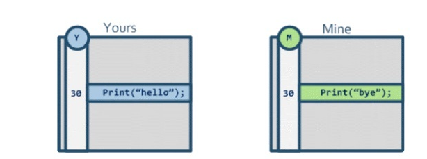

这个时候我们需要合并两个分支成一个分支，如果我们只对这两个文件进行对比，那么在代码合并时，只知道这两个文件在第30行有差异，却不知道应该采纳谁的版本。

如果我知道这个文件的“原件”，那么通过和“原件”代码的对比就能推算出应该采用谁的版本：

那么这个“原件”去哪里找呢？ 一般以分支节点交界处的版本库作为“原件”base

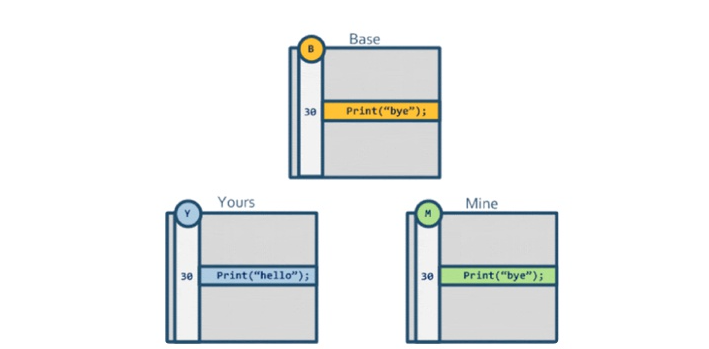

当然还有一种情况是三个文件的代码都不相同，这就需要我们自己手动去解决冲突了：

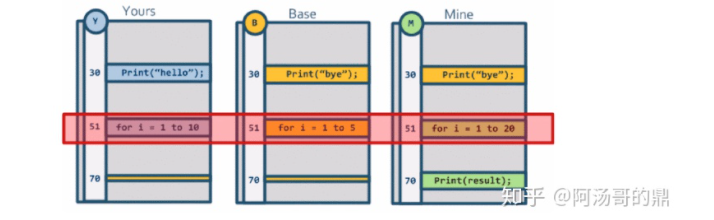

从上面的例子可以看出采用Tree-Way-Merge（也称为三向合并）原理来合并代码有个重要前提是可以找到两份代码的“原件”，而git因为记录了文件的提交历史，再通过自身的合并策略就可以找到两个commit的公共commit是哪个，从而通过比对代码来进行合并。


## 1.3 Fast-foward

Fast-forward是git在合并两个没有分叉的分支时的默认行为，如果你想禁用掉这种行为，明确拥有一次合并的commit记录，可以使用`git merge --no-ff branch_name`命令来禁用掉。

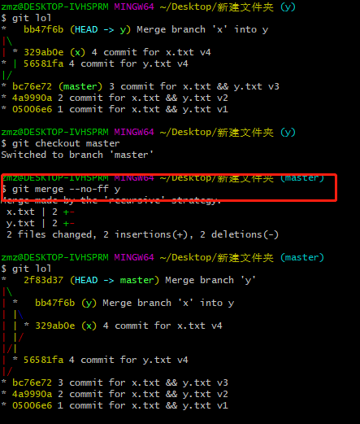


## 1.4 Recursive(递归策略)

recursive也是采用三向合并

Recursive是git中最重要也是最常用的合并策略，简单概述为：递归寻找路径最短的**唯一**共同祖先节点，然后以其为 base 节点进行递归三向合并

举个例子：圆圈里的字母为当前commit中的内容，当我们要合并2，3两个分支时，先找到他们的公共祖先节点1，接着和节点1的内容进行对比，因为1的内容是A，所以2并没有修改内容，而3将内容改成B，所以最后的合并结果的内容也是B。

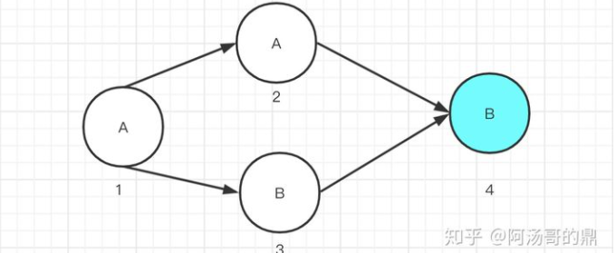

但实际的情况总是复杂的多的，会出现几个分支相互交叉的情况（Criss-Cross现象）

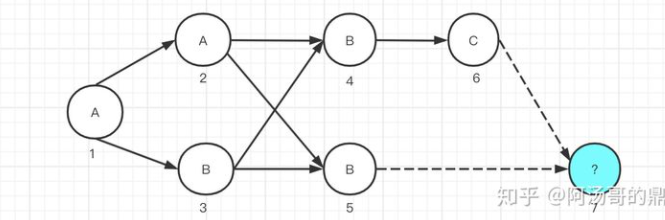

此时通过三向合并策略合并（base节点的内容是A，两个待合并分支节点的内容是B和C）我们是无法得出应该使用哪个节点内容的，需要自己手动解决冲突。

而如果使用节点3作为base节点，那么通过三向合并策略合并（base节点的内容是B，两个待合并分支节点的内容是B和C）可以得出应该使用C来作为最终结果：

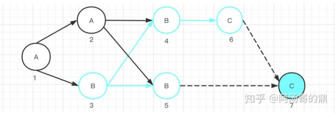

> 查看两个分支的最近公共祖先可以是使用命令`git merge-base --all branch_1 branch_2`

作为人类，其实我们很容易看出正确的合并结果应该是C，那么git要如何保证自己能找到正确的base节点，尽可能的减少代码的合并冲突呢？

实际上git在合并时，如果查找发现满足条件的祖先节点不唯一，那么git会首先合并满足条件的祖先节点们，将合并完的结果作为一个虚拟的base节点来参与接下来的合并。

如下图：git会首先合并节点2和节点3，找到他们的公共祖先节点1，在通过三项合并策略得到一个虚拟的节点8，内容是B，再将节点8作为base节点，和节点5，节点6合并，比较完后得出最终版本的内容应该是C。

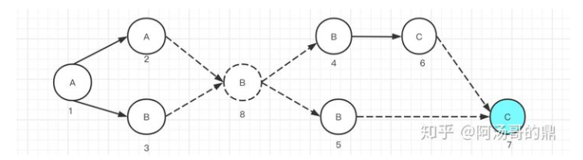


Recursive 策略已经被大量的场景证明它是一个尽量减少冲突的合并策略，我们可以看到有趣的一点是，对于两个合并分支的中间节点（如上图节点 4，5），只参与了 base 的计算，而最终真正被三向合并拿来做合并的节点，只包括末端以及 base 节点

需要注意 Git 只是使用这些策略尽量的去帮你减少冲突，如果冲突不可避免，那 Git 就会提示冲突，需要手工解决


## 1.5 -Xours 和 -Xtheirs 、Ours


#### 1.5.1 -Xours && -Xtheir

在合并时我们可以带上`-Xours`， `-Xtheirs`参数，表明合并遇到冲突时全部使用其中一方的更改。如下图在master分支下执行`git merge -Xours dev`，最后产生的节点内容将自动采取master分支上的内容而不需要你再手动解决冲突。

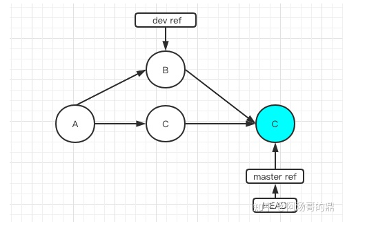

`-Xtheirs`参数和`-Xours`完全相反，遇到冲突时他会自动采取dev上的内容。**注意这两个参数只有遇到冲突时才会生效，这和我们下面提到的Ours策略不一样**


#### 1.5.2 Ours

Ours 策略和上文提到的`-Xours`参数非常相像，不同的是`-Xours`参数是只有合并遇到冲突时，git会自动丢弃被合并分支的更改保留原有分支上的内容，如果没有冲突，git还是会帮我们自动合并的。

而Ours策略是无论有没有冲突，git会完全丢弃被合并分支上的内容，只保留合并分支的上的修改，只是在commit的记录上会保留另一个分支的记录。

如下图在master分支下执行`git merge -s ours dev`，最后产生的合并节点其内容和master分支上一个节点完全一样。

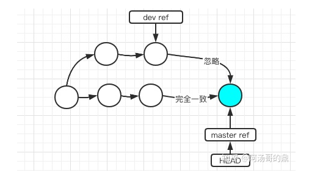

这种策略的应用场景一般是为了实现某个功能，同时尝试了两种方案，最终决定选择其中一个方案，而又希望把另一个方案的commit记录合进主分支里方便日后的查看。

**为什么没有Theirs策略?**

既然合并的时候即有`-Xtheirs`参数又有`-Xours`参数，所以下意识的觉得git即有 Ours 策略也会有 Theirs 策略，实际上git曾经有过这个策略后来舍弃了，因为Theirs会完全丢掉当前分支的更改，是一个十分危险的操作，如果你真的想丢弃掉自己的修改，可以使用reset命令来代替它。


## 1.6 实际案例

#### **故事时间**

在开始正文之前，先来听一下这个故事。

如下图，小明从节点 A 拉了一条 dev 分支出来，在节点 B 中新增了一个文件 http.js，并且合并到 master 分支，合并节点为 E。这个时候发现会引起线上 bug，赶紧撤回这个合并，新增一个 revert 节点 E'。过了几天小明继续在 dev 分支上面开发新增了一个文件 main.js，并在这个文件中 import 了 http.js 里面的逻辑，在 dev 分支上面一切运行正常。可当他将此时的 dev 分支合并到 master 时候却发现，**http.js 文件不见了**，导致 main.js 里面的逻辑运行报错了。但这次合并并没有任何冲突。他又得重新做了一下 revert，并且迷茫的怀疑是 Git 的 bug。

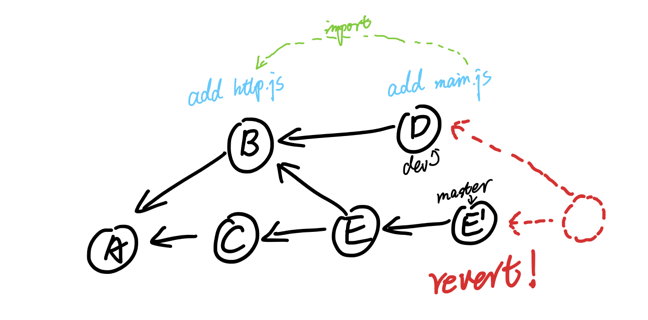

**总结**

现在我们再来看一下文章开头的例子，我们就可以理解为什么最后一次 merge 会导致 http.js 文件不见了。根据 Git 的合并策略，在合并两个有分叉的分支（上图中的 D、E‘）时，Git 默认会选择 Recursive 策略。找到 D 和 E’的最短路径共同祖先节点 B，以 B 为 base，对 D，E‘做三向合并。B 中有 http.js，D 中有 http.js 和 main.js，E’中什么都没有。根据三向合并，B、D 中都有 http.js 且没有变更，E‘删除了 http.js，所以合并结果就是没有 http.js，没有冲突，所以 http.js 文件不见了。

这个例子理解原理之后解决方法有很多，这里简单带过两个方法：1. revert 节点 E'之后，此时的 dev 分支要抛弃删除掉，重新从 E'节点拉出分支继续工作，而不是在原 dev 分支上继续开发节点 D；2. 在节点 D 合并回 E’节点时，先 revert 一下 E‘节点生成 E’‘（即 revert 的 revert），再将节点 D 合并进来。

Git 有很多种分支合并策略，本文介绍了 Fast-forward、Recursive、Ours/Theirs、Octopus 合并策略以及三向合并。掌握这些合并策略以及他们的使用场景可以让你避免发生一些合并问题，并对合并结果有一个准确的预期。


```bash
#强指定使用合并提交策略类型。
git merge -s 策略名字

# -s 后面可以跟如下几种内容
$ git merge -s octopus || ours ||  recursive || resolve || subtree
octopus     ours        recursive   resolve     subtree

========================================================================
#查看两个分支的最近公共祖先可以是使用命令
git merge-base --all branch_1 branch_2

$ git lol
*   b5ab644 (HEAD -> x) Merge commit '56581fa' into x
|\
| | *   ef72fc5 (y) Merge branch 'x' into y
| | |\
| |/ /
| | /
| |/
|/|
* | 329ab0e 4 commit for x.txt v4
| * 56581fa 4 commit for y.txt v4
|/
* bc76e72 (master) 3 commit for x.txt && y.txt v3
* 4a9990a 2 commit for x.txt && y.txt v2
* 05006e6 1 commit for x.txt && y.txt v1

zmz@DESKTOP-IVHSPRM MINGW64 ~/Desktop/新建文件夹 (x)
$ git merge-base --all x y									# 得到他们的提交对于commitid
56581fa9cc35ffcf7631745a4f35fc3625d63333
329ab0ed9057012c7937e7b51d57854657d9f492

========================================================================
# 遇见冲突时，使用我们分支上的数据，r在master分支下执行`git merge -Xours dev`，最后产生的节点内容将自动采取master分支上的内容而不需要你再手动解决冲突
git merge -Xours dev

```

