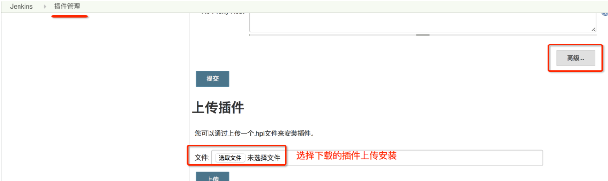

# 一、补充说明

### 1、无法启动我们的slave

🔺这里我遇见了一个坑，这里死活都启动不起来，那是因为，我的这一台slave上面没有安装jdk

🔺第二个坑，我随便找了个路径把我的jdk-8u211-linux-x64.tar.gz给解压出来了，然后配置环境变量，结果还是报错，那是因为我没有指定java路径，jenkins会自动到/user/local/bin目录下去找。所以我们要配置下面这个玩意（我们的java启动路径）


### 2、python项目需要的依赖

- python ：  我们需要去下载python。。我们U盘中有python3.6.6

- 由于我们安装是在linux上安装python，这个时候我们需要安装一些依赖

  >```python
  ># 编译依赖
  >yum install zlib-devel bzip2-devel openssl-devel ncurses-devel sqlite-devel readline-devel tk-devel gcc make
  >yum install libffi-devel -y
  >
  ># 配置编译
  >cd /usr/python/Python-3.8.0
  >./configure
  >
  ># 编译
  >make && make install 
  >
  ># 配置环境python环境
  >mv /usr/bin/python /usr/bin/python.bak #
  >ln -s /usr/local/bin/python3 /usr/bin/python
  >mv /usr/bin/pip /usr/bin/pip.bak （这个很容易出问题，但是不用管他）
  >ln -s /usr/local/bin/pip3 /usr/bin/pip
  >
  ># 使python3.8 和python2.7 共存
  >vim /usr/libexec/urlgrabber-ext-down
  >"""
  >将#! /usr/bin/python  改成#! /usr/bin/python2 ，保存退出
  >"""
  >vim /usr/bin/yum
  >"""
  >将#!/usr/bin/python  改成#!/usr/bin/python2
  >"""
  >
  >pip install -i https://pypi.tuna.tsinghua.edu.cn/simple --upgrade gevent==1.4.0	#这一句好像没有用，就是没用，这是给flask框架y
  >```
  >
  >

- git ： 因为我需要通过git去拉取代码， yum install -y git


### 3、插件安装

如我们要安装参数化插件，就需要安装dynamicparameter

安装网址：http://mirror.xmission.com/jenkins/plugins/dynamicparameter/


依赖插件 role-strategy，同样参照下面方法上传插件

安装网址：http://mirror.xmission.com/jenkins/plugins/role-strategy/


git的参数插git-parameter

安装网址：http://mirror.xmission.com/jenkins/plugins/git-parameter/latest/


Node和lable插件，用户可以通过参数选择项目构建运行节点（就是可以自己选择在哪一台机器上执行这个job）

安装网址：http://mirror.xmission.com/jenkins/plugins/nodelabelparameter/latest/

然后在jenkins的插件管理的高级设置中点击手动上传

目录：jenkins->插件管理->高级->高级->上传插件




#### 4、Dynamic Parameter 的简单使用

https://blog.csdn.net/qq744746842/article/details/49668799

这些参数都可以在下面的Execute Shell里面执行


#### 5、思路：allure + apache结合将我们的报告发送出来

```
allure generate ./allure_reports/ -o ./allure_reports/html/ --clean
```

