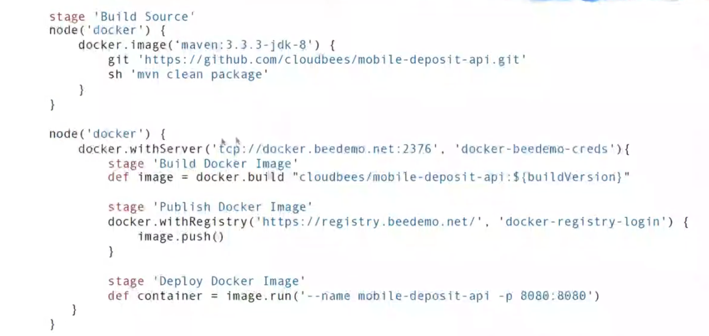
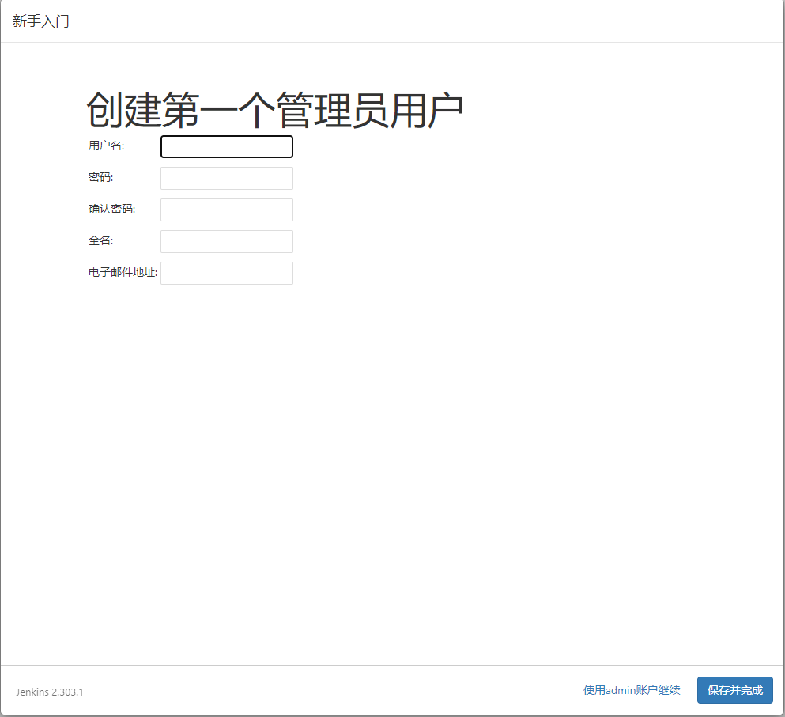
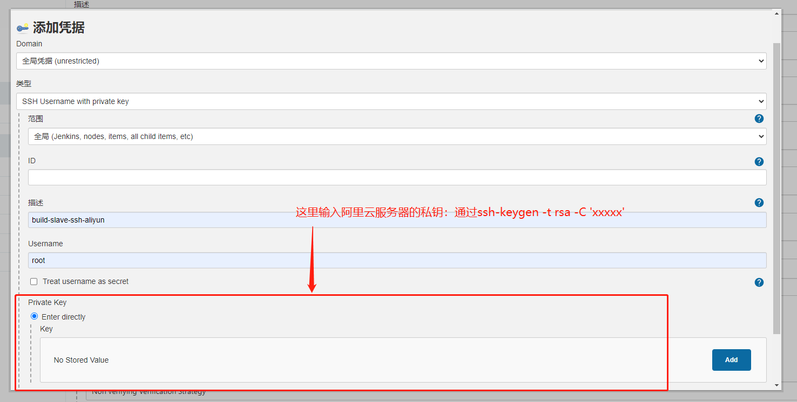

用户名：zhangmingzhu

密码：123456

电子邮箱：1054920870@qq.com


用户名：dev-zmz

密码：123456

全名：张铁柱

电子邮箱：2967888689@qq.com

# 一、Jenkins 概述

**官方文档地址：https://www.jenkins.io/zh/doc**


## 1.1 用途

强大的集成能力	+	可扩展工作流设计

快速简便实现集成：可以通过groovy命令调用git、maven（编译工具）、npm、gradle、shell、junit（单元测试）、sonarqube（代码质量分析）、ansibe、docker、openshift、k8s等插件

支持复杂的构建和发布流程：使用groovy脚本表述复杂的流程

一个构建流程：Maven编译  --  Junit单元测试 -- sonarqube代码质量分析 -- git 发布到二方库

## 1.2 DevOps的CI和CD总体思路

**DevOps设计	+	Jenkins执行**

**DevOps职责**

1. 完成构建定义/部署架构设计;
2. 生成构建定义/部署架构对于Jenkins pipline job配置文件（config.xml）;
3. 查询Jenkins执行Job的实时进度与结果

**Jenkins职责**

1. 根据config.xml创建Jenkins Pipeline job；
2. 执行pipeline job；
3. 提供查询job执行情况的Rest API


## 1.3 Jenkins Pipeline

前言：Pipeline as code 是jenkins的精髓

#### 1.3.1 Pipeline的概念

**下面是jenkins Pipeline 定义的一个示例（groovy脚本编写的）**



`stage` 块定义了在整个流水线的执行任务的概念性地不同的的子集(比如 "Build", "Test" 和 "Deploy" 阶段), 它被许多插件用于可视化 或Jenkins流水线目前的 状态/进展. [[6](https://www.jenkins.io/zh/doc/book/pipeline/#_footnotedef_6)]

##### **step**

基本操作单元，可以认为是一个脚本的调用或一个插件的调用，小到创建一个目录，大到构建一个Docker镜像，由各类Jenkins Plugin提供

比如上面的 git "https://github.com/cloudbess/mobile-deposit-api.gi" 或者 sh "mvn clean package"都是一个step


##### **Node**

运行期环境，一个Node就是一个Jenkins节点，是执行Step的具体运行期环境，node里的steps将会运行在node对应的agent上

。一个Pipeline job里面呢，可以有多个Node，就像上面示例里面一样，有两个Node，对于的需求呢，对于需求可以运行在不同的机器上


##### **Stage**

Step的逻辑分组，一个Pipeline可以划分为诺干个Stage，每个Stage代表一组操作。多个Stage可以在一个node中（也可以不在一个node中），1个stage也可以跨多个node。使得整个Pipeline job 呢，像管道一样更好的维护


#### 1.3.2 Pipeline重要特性

**前言：Jenkins搭建呢，采用的master slave的集群模式，面对大量引用的编译压力的时候呢，可以分散压力，能够保证编译的速度**

##### **Durable 持久性**

在构建或者部署流程执行过程中，如果jenkins挂掉了，正在运行的pipeline jon 仍然能够继续工作，不会受到影响，也就是说Pipeline的进程独立于Jenkins进程本身


**Pausable 可暂停性**

执行过程中可以暂停，等待用户确认后再继续执行，可以对重要的环节，进行认为的干预


**Rest API 可监控性**

我们可以通过Jenkins提供的Rest API获取每一个stage的执行情况


**基于插件的可扩展性**

jenkins提供了很多插件，是我们可以扩展jenkins


## 1.4 Jenkins 集成难点


#### 1.4.1 执行效率问题

我们的DevOps通过API启动Jenkins的时候，Jenkins是先排队调度，再执行的这种机制，造成启动非常慢，比如有时候等待5 - 6秒或者十几秒的情况都有，之后才会执行正在的脚本，用户使用体验就比较差。一般我们采用异步 + 队列的方式提高用户体验


#### 1.4.2 信息去重问题

由于jenkins采用的是 Master - Slave 集群模式，使得我们在多节点获取执行结果的时候，信息出现重复，需要进行去重的处理

。目前一般使用轮询 + 锁的方式来解决的


#### 1.4.3 信息扩展问题

从jenkins获取的结果都是日志形式的，jenkins没有很好的扩展机制来支持定制，比如说执行脚本，获取用户名密码，获取url地址等等。需要devops（运维）自己进行过滤和处理，目前我们呢，通过脚本写道日志里面，然后过滤日志进行提取


## 1.5 Jenkins的特征


- 易于安装部署配置：可以通过yum安装或者下载war包以及通过docker容器等快速实现安装部署，可方便web界面配置管理
- 消息通知及测试报告：集成RSS/E-mail通过Rss发布构建结果或当构建完成时通过e-mail通知，生成Junit/TestNG测试报告
- 分布式构建：master/slave 主从集群，能够让多台计算机一起构建/测试
- 文件识别：Jenkins能够跟踪哪次构建生成哪些jar，哪次构建使用哪个版本的jar等
- 丰富的插件支持：支持扩展插件，你可以开发适合自己团队使用的工具，如git，svn，maven，dokcer等


# 二、jenkins的搭建

我们采用linux机器，采用docker的方式搭建

#### 第一步：下载镜像文件

```
docker pull jenkins/jenkins:lts-jdk11
```


#### **第二步：运行容器**

```
docker run ^
  -u root ^
  --rm ^
  -d ^
  -p 8080:8080 ^
  -p 50000:50000 ^
  -v jenkins-data:/var/jenkins_home ^
  -v /var/run/docker.sock:/var/run/docker.sock ^
  jenkins/jenkins:lts-jdk11
```

参数说明：


#### 第三步：激活

我们在浏览器中输入http://116.63.163.205:8080/

然后进行初始化激活，这里有三种方式获取激活密码。

第一种：配置文件中获取激活密码

由于我们采用的了具名挂载，我们可以在/var/lib/docker/volumes/jenkins-data/_data/secrets下cat initialAdminPassword 获取密码。也可以进入容器中，在

/var/jenkins_home目录下的 initialAdminPassword 文件中查看


#### 第四步：按照插件（建议直接按照建议来，安装建议性插件）


#### 第五步：创建一个管理员用户

最后，在[customizing Jenkins with plugins](https://www.jenkins.io/zh/doc/book/installing/#customizing-jenkins-with-plugins)之后，Jenkins要求您创建第一个管理员用户。 . 出现“ **创建第一个管理员用户** ”页面时， 请在各个字段中指定管理员用户的详细信息，然后单击 **保存完成** 。 . 当 **Jenkins准备好了** 出现时，单击*开始使用 Jenkins*。

**Notes:** * 这个页面可能显示 **Jenkins几乎准备好了!** 相反，如果是这样，请单击 **重启** 。 * 如果该页面在一分钟后不会自动刷新，请使用Web浏览器手动刷新页面。如果需要，请使用您刚刚创建的用户的凭据登录到Jenkins，并准备好开始使用Jenkins！



用户名：zhangmingzhu

密码：123456

电子邮箱：1054920870@qq.com

#### 第六步：实例配置（暂时不知道有什么用）


# 三、jenkins的Job


Freestyle project 主要用于自我定制

Maven Project 主要是用于一些需要编译的项目,python不需要，python是解释型语言，不需要编译

Pipeline: 流水线项目，基于流水线和代码的方式，将整个构建，发布，这个软件的生命周期，可视化的展示出来（一般运维来弄了）

最典型的就是freestyle和pipeline这种Job，可以自己进行配置实现哪些功能。

对于我们测试的话，我们还是学习freestyle job


## 1、freestyle job


General

名字，跑在哪个机器上


## 2、添加节点nodes


**注意：我们是不推荐在master上面去执行一些任务的，因为jenkins的master还是主要进行一个管理的作用，而且jenkins是一个非常耗费资源的一个java应用。所以我们要设置一些节点**


**尽可能使用这个节点**：任何job只要发现这个节点是空闲的，就会把任务调度过来

**只允许绑定到这台机器的job**：那你在这个job的配置里面呢，就必须指定，把这个job跑在那一台机器上，它才会去调度过来

尽量将job绑定到slave上面


### 2.1 系统配置 - 管理节点

- **路径：系统管理 - 管理节点**
- **节点(Node/Slave),给master添加slave有两种方式**


**SSH方式：是jenkins的master主动去发起连接，去连接slave**

**JNLP方式：是slave客户端反向挂载进来的，jenkins的master并不知道，只是在需要的时候呢，slave通过一些客户端命令，反向把一些节点挂载到jenkins的master上面来。主要的场景就是容器化，，动态集群，动态节点，都是动态生成，这样节点才是按需生成和按需挂载的**


### 2.2 系统配置 - Credentials（证书）管理

下面是一个基于username with password的方式创建slave连接后，Credentials的效果展示

- **Username with password**
- **适用于http协议下载代码以及slave连接**


### 2.3 实战：挂载slave到master上

- **1是将我的阿里云挂载进来，2是将我的华为云二挂载进来**
- **阿里云的机器使用SSH Username with private key的方式**
- **华为云采用Username with password的方式**

#### 2.3.1 Username with password的方式

##### **第一步：新建节点**


##### **第二步：配置**

如下是几个主要配置

- 远程工作目录： 这个目录就是我们的slave上，到时候的工作目录。如果路径不存在，会给你自动创建

- 标签：这个标签还是很重要的，因为我们一个job可以绑定到这个标签上去执行的，如果我这个标签里面有多个节点，他会在这个资源池里面，帮我自动去调度。就是一个一对多的关系。jenkins自动调度到这个标签下哪一个slave去执行

- 用法

	- use this node as much as possible 尽可能的使用这个节点

	- Only build jobs with label expressions matching this node 只运行绑定到这台机器的job

- 启动方式：

	- Launch agents via SSH


最后哪个host，就是当我们进行SSH登录的时候，他要询问localhost，让我们输入yes，我们就把这个关闭了


##### 第三步：启动


##### 第四步：处理遇见的坑

🔺这里我遇见了一个坑，这里死活都启动不起来，那是因为，我的这一台slave上面没有安装jdk

🔺第二个坑，我随便找了个路径把我的jdk-8u211-linux-x64.tar.gz给解压出来了，然后配置环境变量，结果还是报错，那是因为我没有指定java路径，jenkins会自动到/user/local/bin目录下去找。所以我们要配置下面这个玩意（我们的java启动路径）


#### 2.3.2 SSH Username with private key的方式

就是如下不同



🔺好像我采用的是docker构建的jenkins，整个jenkins里面好像没有  ssh服务


## 3、集中配置

我们可以进入到/var/lib/docker/volumes/jenkins-data/_data/jobs/jobname 文件夹中，将config.xml文件拷贝给别人，别人直接加载这个文件，别人一下就可以使用你的job配置了，不需要自己手动去配置了


## 4、如何选择node进行构建


第一个是最常规的，系统自带的

如果节点非常的多，我们可以通过Node and Lable parameter plugin插件来使用，可以复选。如下


🔺🔺🔺🔺🔺🔺🔺🔺🔺🔺🔺🔺🔺🔺🔺下面这些就是跟job相关了

# 四、如何指定Source Code Management（版本库）

SCM是在创建一个job的时候进行设置， 指定node执行build构建任务，也是在job里面进行设置的


🔺当我们创建节点后，然后启动代理之后，会在我们设定的构建工作目录下生成如下几个文件，我的华为云slave的工作目录设置的是/root/jenkins_home, 在jenkins_home下面有如下三个文件，前面第一个是记录连接日志这些的，第二个是用于和master进行连接的，第三个就是重点了


workspace里面存放了一些，以我们job名字相同的文件夹


这两个job文件夹，里面啥也没有的，因为我的任务太简单了，啥也没有留下来。


### 1、实战：将我们github上的代码拉取下来

我的SCM采用的是，SSH的方式，跟前面slave一样，将我华为云2上面的私钥拷贝进去。就行了，奶奶的阿里云就是不行，但是华为云这里就可以，不求知道为什么。大爷的。

🔺这下我们来看看华为云的/root/jenkins_home/workspace/test-auto-interface文件下面。


我们发现这个这里面有我的代码了。我们再看看jenkins的test-auto-interface这个job界面里的工作区


我们会发现，我们的代码，在这里面了。这是因为，我们配置了git的SCM，jenkins自动去把代码拉取下来了。其实这里有很多问题的。请看第2节


### 2、问题讲解和拓展

- **上面的配置是默认将所有的分支都给拉取下来，这样文件太大了**
- **第二点就是，我们使用的是python，linux使用的是python2.7,无法运行啊**
- **第三点，我们还没有配置，python的运行环境，比如要运行的包**
- **第四点，每次执行任务，都要去clone，会不会存在冲突**


### 3、拉取指定分支


**看看第八章第二节，使用参数来管理，git拉取的分支，要下载Environment Injector和Git Parameter插件**


### 4、干掉前面的clone，重新clone一份


这样可以使我们每次，都重新去弄一份代码下来，可以避免上次遗留的东西，造成不可控


# 五、Git全局配置

比如在我们的slave机器上安装各种java的依赖jdk啊这些骚操作，和git这些玩意，还可以实现自动安装，比如说它在调起一个slave的时候，把一些相应的工具给你安装好


# 六、如何清理历史记录

我们采用的master - slave的方式，所有的构建产物，最后都是会传回来master上进行保存的

jenkins在启动起来的时候，可能会执行非常多的任务，可能要归档一些产物，构建产物如构建历史信息，日志，所有可能导致这个master的磁盘啊可能有一些内存的问题。在下面这个配置，可以进行自动清理这些build的历史记录

archive就是历史信息


# 七、邮件通知


定向通知


# 八、自动化的构建（正文开始了）


## 1、在哪里设置参数？

🔺使用参数还是在job的配置里面哈

**jenkins提供的类型**

- Boolean    布尔型
- Choice       选择型
- String         字符型
- Multi-line String  多行字符串型
- File            文件参数
- 其他


## 2、参数值如何使用?

- **构建参数，会自动添加为构建过程环境的环境变量**
- **可以通过$parameter或者${parameter}的形式使用，跟shell脚本一样嘛**
- **在job配置的构建中进行使用**

**


🔺我们安装Environment Injector环境插件和Git Parameter插件


### 3、环境变量


Job injected参数，我理解的就是在job配置中页面中的shell中定义的


# 九、权限管理

我们要安装一个插件：Role-based Authorization Strategy

