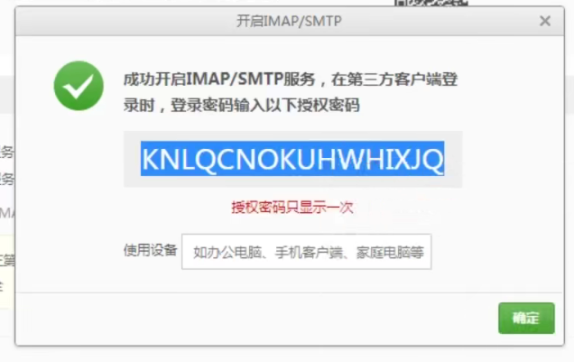
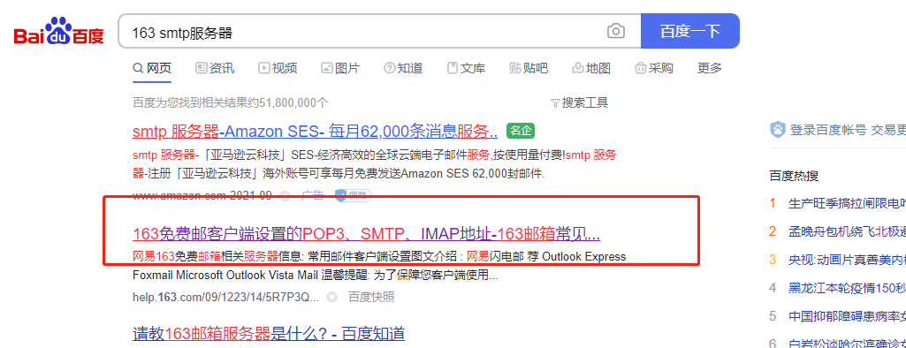
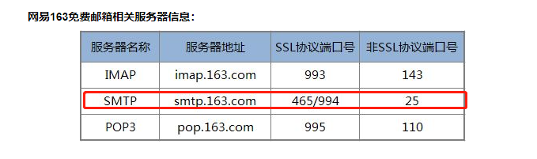
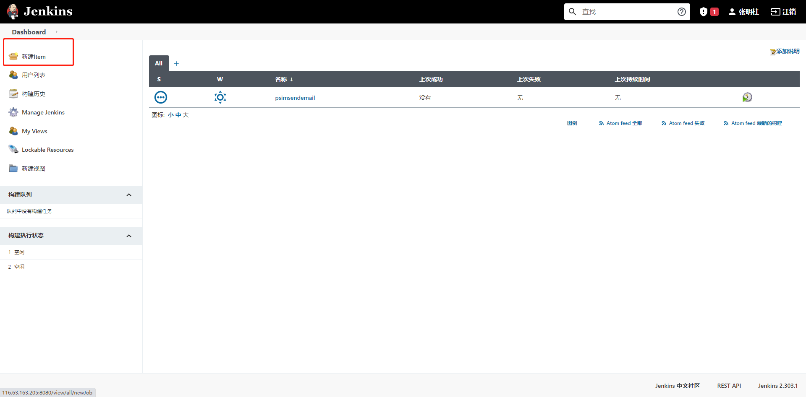
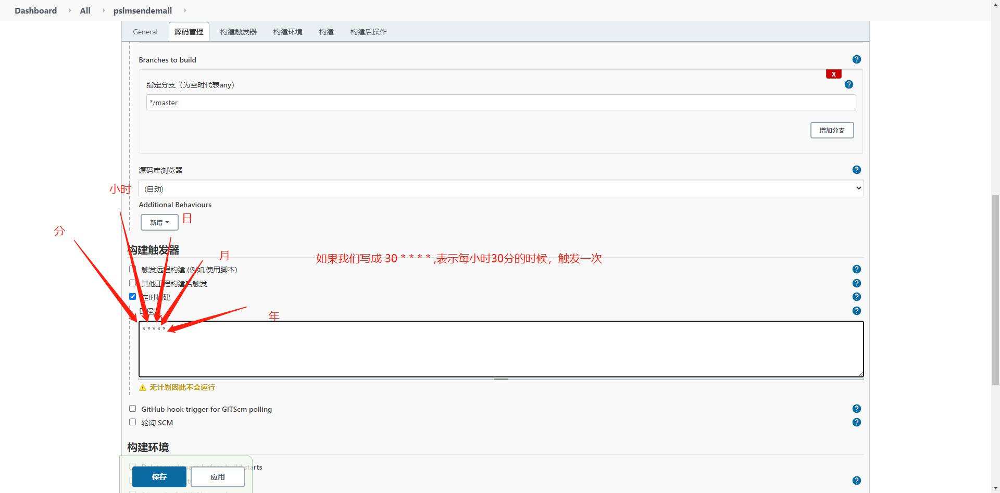

# 一、开通协议

我们不管是企业邮箱还是QQ邮箱，还是网易邮箱，我们要想通过代码给他发送邮件，就必须给这个邮箱开通SMTP和POP3协议

SMTP：是发送邮件的协议

POP3: 接收右键的协议


开启SMTP协议的时候他会给一个第三方授权密码，这个一定要记住了



我的163邮箱授权密码：UPZMWDCEBQULAMUL

我的163邮箱：zmz1054920870@163.com


我QQ邮箱的三分授权登录密码：hozmhyhuzcmwbdgj

我的QQ邮箱:1054920870@qq.com


查看163 的smtp的服务器：

怎么查看呢？

我们直接百度



点击进去




# 二、编写脚本

**先看看源码**

```python
class MIMEText(MIMENonMultipart):
    """Class for generating text/* type MIME documents."""

    def __init__(self, _text, _subtype='plain', _charset=None, *, policy=None):
    
    
_text : 是我们要传入的文件流,二进制 如 _text = open(report.html, 'rb').read()
_subtype='plain' : 文件的类型	如 _subtype='html'
_charset=None : 文件的编码格式	   如 _charset='utf-8'
```


**伟伟写的**

```python

import smtplib
import base64
from email.mime.text import MIMEText


def encryption(st):
    encode = base64.b64encode(st.encode('utf-8'))
    return str(encode, 'utf-8')


def decrypt(st):
    decode = base64.b64decode(st)
    return str(decode, 'utf-8')


def send(a, maillist):
    email_host = 'smtp.exmail.qq.com'  # 邮箱地址
    email_user = decrypt("aGV4aWFuZ3h1YW5AeGlhb2R1b3RlY2guY29t")  # 发送者账号
    email_pwd = decrypt("aFhYNTIwLnRpbmc=")  # 发送者的密码
    # 收件人邮箱，多个账号的话，用逗号隔开
    me = email_user
    msg = MIMEText(a)  # 邮件内容
    msg['Subject'] = '创新效率测试组的bug和测试任务（自动发送，无需回复）'  # 邮件主题
    msg['From'] = me  # 发送者账号
    msg['To'] = ','.join(maillist)  # 接收者账号列表
    smtp = smtplib.SMTP(email_host, port=25)  # 连接邮箱，传入邮箱地址，和端口号，smtp的端口号是25
    smtp.login(email_user, email_pwd)  # 发送者的邮箱账号，密码
    smtp.sendmail(me, maillist, msg.as_string())
    # 参数分别是发送者，接收者，第三个是把上面的发送邮件的内容变成字符串
    smtp.quit()  # 发送完毕后退出smtp
    print('email send success.')
```


**怀宇写的**

```python
def sendmail(file, title, mail_to):
    mail_from = "mon@xiaoduotech.com"
    msg = MIMEText(file, _subtype='html', _charset='utf-8')
    msg['Subject'] = title
    msg['From'] = mail_from
    msg['To'] = mail_to
    msg['date'] = time.strftime('%a, %d %b %Y %H:%M:%S %z')
    try:
        smtp = smtplib.SMTP_SSL("smtp.exmail.qq.com", 465)
        smtp.login('mon@xiaoduotech.com', 'CDxddev2189')
        smtp.sendmail(mail_from, mail_to.split(","), msg.as_string())
        smtp.quit()
        print('email sent')
    except SMTPDataError as e:
        print(e)
        raise
```


**我写的**

```python
import smtplib
from email.mime.multipart import MIMEMultipart
from email.mime.text import MIMEText

class EmailManage(object):

    def __init__(self, filename):
        self.filename = filename

    def send_email(self):
        # 定义SMTP服务器
        smtpserver = 'smtp.163.com'

        # 发送邮件的用户名和客户端密码
        username = 'zmz1054920870@163.com'
        password = 'UPZMWDCEBQULAMUL'

        # 接收邮件的邮箱
        reveiver = '1054920870@qq.com'		# 要发送给多个人，使用逗号隔开如:reveiver = '1054920870@qq.com,2967888689@qq.com'

        # 邮件的标题或者主题
        subject = '淘宝接口自动化测试报告'

        # 创建邮箱内容对象
        message = MIMEMultipart('related')

        # 邮件的附件，主要用于发送测试报告
        fujian = MIMEText(_text=open(self.filename, 'rb').read(), _subtype='html', _charset='utf8')

        # 添加邮箱内容
        message['subject'] = subject
        message['from'] = username
        message['to'] = reveiver
        message.attach(fujian)

        # 登录smtp服务器并发送邮件
        smtp = smtplib.SMTP()
        smtp.connect(smtpserver)  # connect(self, host='localhost', port=0, source_address=None):

        smtp.login(username, password)
        smtp.sendmail(username, reveiver,
                      message.as_string())  # (self, from_addr, to_addrs, msg, mail_options=[],rcpt_options=[]):

        # 发送完成以后我们就退出这个服务器
        smtp.quit()

if __name__ == '__main__':
    EmailManage('C:\\Users\zmz\\Desktop\\test-tb-jenkins\\report.html').send_email()
```


# 三、jenkins定时任务






可以采用H来平滑过渡

H 17 * * *  每天下午五点，jenkins会根据当前master机器的负载情况来跟你分配构建执行时间

