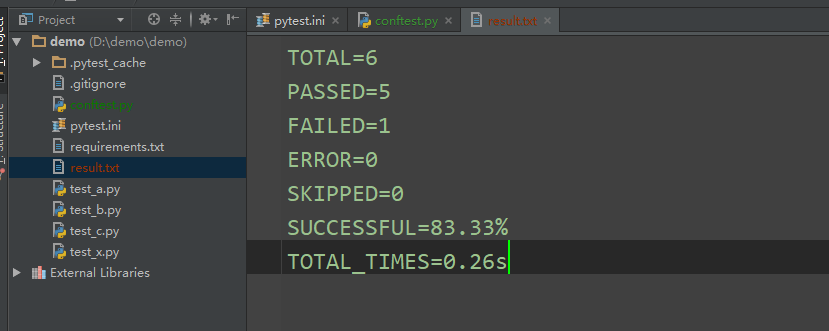
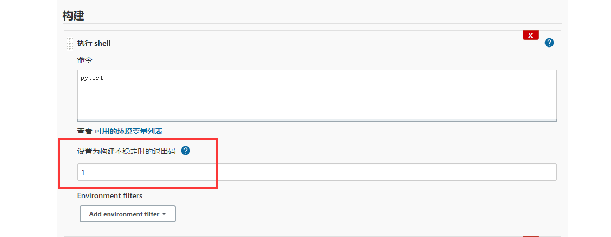
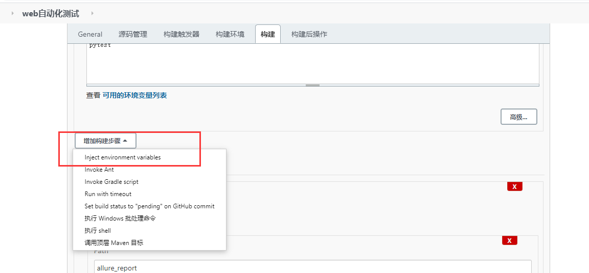
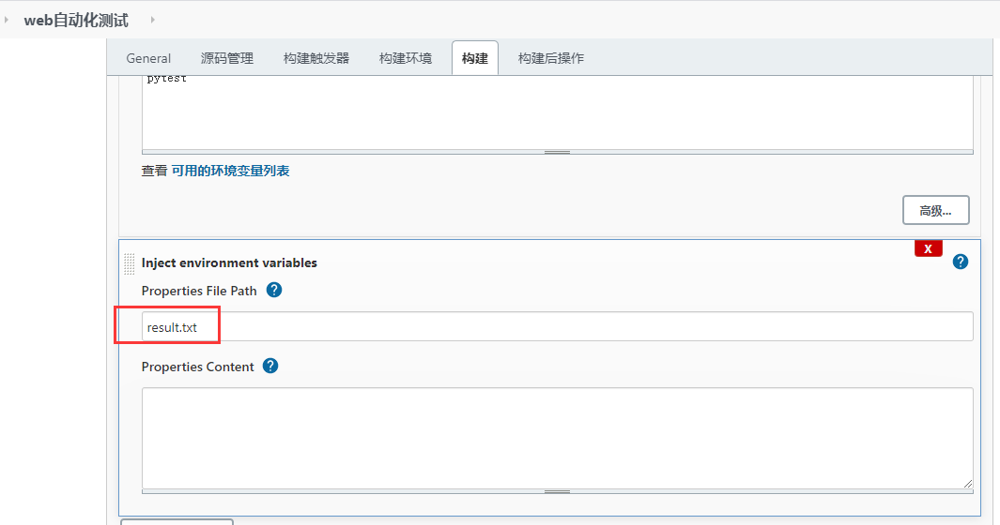
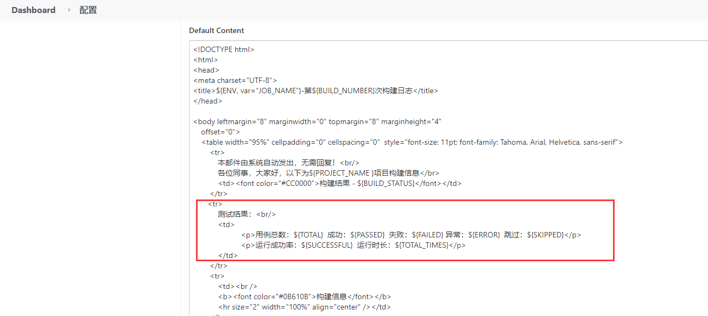
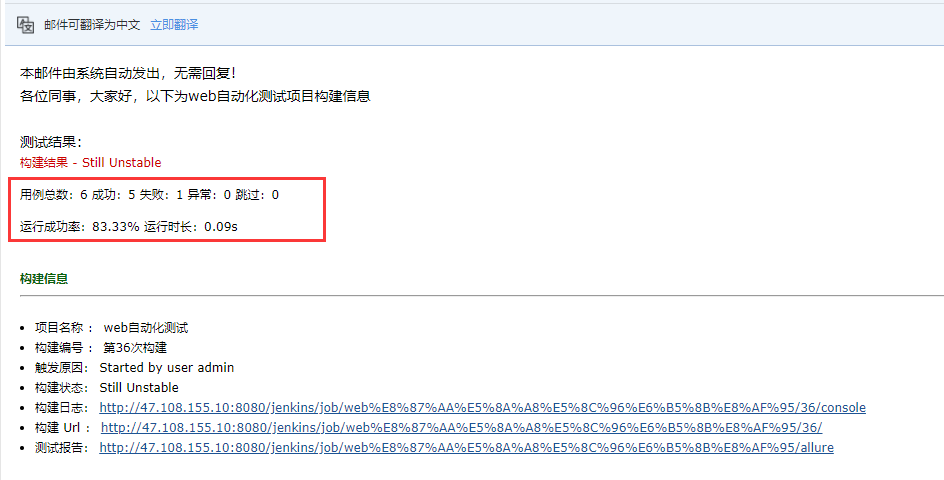

# [jenkins学习18 - 把 pytest 运行结果通过 jenkins 发送到邮件正文里](https://www.cnblogs.com/yoyoketang/p/14956235.html)

# 前言

pytest 运行用例后会在终端最后一行打印总的运行结果类似于：===== 1 failed, 5 passed in 0.52s ====
这个运行的接口是可以通过 pytest_terminal_summary 这个hook函数拿到的，拿到后如何给到jenkins发邮件的报告里面呢？

# pytest_terminal_summary

第一步先拿到pytest运行的测试结果，通过pytest_terminal_summary 这个hook函数
在项目根目录conftest.py文件下写如下代码

```
import time
from _pytest import terminal
# 作者-上海悠悠 QQ交流群:717225969
# blog地址 https://www.cnblogs.com/yoyoketang/


def pytest_terminal_summary(terminalreporter, exitstatus, config):
    '''收集测试结果'''
    # print(terminalreporter.stats)
    print("total:", terminalreporter._numcollected)
    print('passed:', len([i for i in terminalreporter.stats.get('passed', []) if i.when != 'teardown']))
    print('failed:', len([i for i in terminalreporter.stats.get('failed', []) if i.when != 'teardown']))
    print('error:', len([i for i in terminalreporter.stats.get('error', []) if i.when != 'teardown']))
    print('skipped:', len([i for i in terminalreporter.stats.get('skipped', []) if i.when != 'teardown']))
    print('成功率：%.2f' % (len(terminalreporter.stats.get('passed', []))/terminalreporter._numcollected*100)+'%')

    # terminalreporter._sessionstarttime 会话开始时间
    duration = time.time() - terminalreporter._sessionstarttime
    print('total times: %.2f' % duration, 'seconds')
```

运行后的结果

```
------------------------------------------------ Captured stdout call -------------------------------------------------
22222222
total: 6
passed: 5
failed: 1
error: 0
skipped: 0
成功率：83.33%
total times: 0.26 seconds
=============================================== short test summary info ===============================================
FAILED test_b.py::test_b - assert 1 == 2
============================================= 1 failed, 5 passed in 0.27s =============================================
```

到这一步实际上已经拿到结果了，很多小伙伴有疑问如何取出来？那么接下来我们只需要写个open函数把结果保存到项目根目录本地即可

# result.txt保存本地

```
import time
from _pytest import terminal
# 作者-上海悠悠 QQ交流群:717225969
# blog地址 https://www.cnblogs.com/yoyoketang/


def pytest_terminal_summary(terminalreporter, exitstatus, config):
    '''收集测试结果'''
    # print(terminalreporter.stats)
    total = terminalreporter._numcollected
    passed= len([i for i in terminalreporter.stats.get('passed', []) if i.when != 'teardown'])
    failed=len([i for i in terminalreporter.stats.get('failed', []) if i.when != 'teardown'])
    error=len([i for i in terminalreporter.stats.get('error', []) if i.when != 'teardown'])
    skipped=len([i for i in terminalreporter.stats.get('skipped', []) if i.when != 'teardown'])
    successful = len(terminalreporter.stats.get('passed', []))/terminalreporter._numcollected*100
    # terminalreporter._sessionstarttime 会话开始时间
    duration = time.time() - terminalreporter._sessionstarttime
    print('total times: %.2f' % duration, 'seconds')

    with open("result.txt", "w") as fp:
        fp.write("TOTAL=%s" % total+"\n")
        fp.write("PASSED=%s" % passed+"\n")
        fp.write("FAILED=%s" % failed+"\n")
        fp.write("ERROR=%s" % error+"\n")
        fp.write("SKIPPED=%s" % skipped+"\n")
        fp.write("SUCCESSFUL=%.2f%%" % successful+"\n")
        fp.write("TOTAL_TIMES=%.2fs" % duration)
```

保存后txt内容


# jenkins 执行shell

执行shell，输入运行pytest用例的命令


用于执行用例失败后，退出码为1，导致后面的步骤不会执行，于是设置为构建不稳定时的退出码：1

# 添加环境变量（Environment Injector）

添加构建操作 Environment Injector variables


Properties File Path 引用本地文件


到这一步前面执行完pytest生成的result.txt会把相关键值对添加到环境变量

# 邮件引用变量

系统管理-系统配置，配置邮件Default Content

```
<tr>    
            测试结果：<br/>            
            <td>
                       <p>用例总数：${TOTAL}  成功：${PASSED}  失败：${FAILED} 异常：${ERROR}  跳过：${SKIPPED}</p>
                       <p>运行成功率：${SUCCESSFUL}  运行时长：${TOTAL_TIMES}</p>
            </td>   
        </tr> 
```



构建job后收到的邮件


参考资料：
pytest Hooks函数pytest_terminal_summary https://www.cnblogs.com/yoyoketang/p/12741564.html
jenkins 添加环境变量 Environment Injector https://www.cnblogs.com/yoyoketang/p/14955965.html
jenkins 配置邮件发送 Email Extension Plugin https://www.cnblogs.com/yoyoketang/p/12174056.html