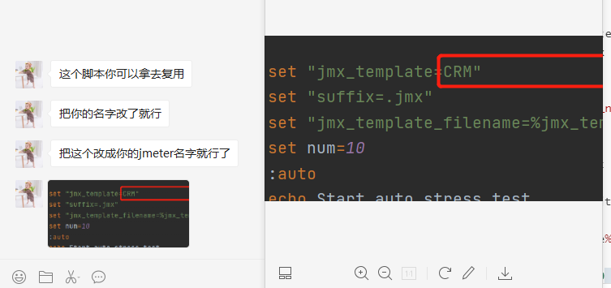

```SQL
#!/usr/bin/env bash

# 压测脚本模板中设定的压测时间应为60秒
export jmx_template="crm"
export suffix=".jmx"
export jmx_template_filename="${jmx_template}${suffix}"
export os_type=`uname`

# 需要在系统变量中定义jmeter根目录的位置，如下
# export jmeter_path="/your jmeter path/"

echo "自动化压测开始"

# 压测并发数列表
thread_number_array=(10 20 30)
for num in "${thread_number_array[@]}"
do
    # 生成对应压测线程的jmx文件
    export jmx_filename="${jmx_template}_${num}${suffix}"
    export jtl_filename="test_${num}.jtl"
    export web_report_path_name="web_${num}"

    rm -f ${jmx_filename} ${jtl_filename}
    rm -rf ${web_report_path_name}

    cp ${jmx_template_filename} ${jmx_filename}
    echo "生成jmx压测脚本 ${jmx_filename}"

    if [[ "${os_type}" == "Darwin" ]]; then
        sed -i "" "s/thread_num/${num}/g" ${jmx_filename}
    else
        sed -i "s/thread_num/${num}/g" ${jmx_filename}
    fi

    # JMeter 静默压测
    ${jmeter_path}/bin/jmeter -n -t ${jmx_filename} -l ${jtl_filename}

    # 生成Web压测报告
    ${jmeter_path}/bin/jmeter -g ${jtl_filename} -e -o ${web_report_path_name}

    rm -f ${jmx_filename} ${jtl_filename}
done
echo "自动化压测全部结束"
```


```SQL
@echo off


set "jmx_template=CRM"
set "suffix=.jmx"
set "jmx_template_filename=%jmx_template%%suffix%"
set num=10
:auto
echo Start auto stress test.

set "jmx_filename=%jmx_template%_%num%%suffix%"
set "jtl_filename=test_%num%.jtl"
set "web_report_path_name=web_%num%"

del %jmx_filename% %jtl_filename%
rd /s /q %web_report_path_name%

COPY %jmx_template_filename% %jmx_filename%
echo Generate jmx file %jmx_filename%


sed -i "s/thread_num/%num%/g" %jmx_filename%


call jmeter -n -t %jmx_filename% -l %jtl_filename%

call jmeter -g %jtl_filename% -e -o %web_report_path_name%

del %jmx_filename% %jtl_filename%

set /a num=num+10
if %num% LEQ 30 goto auto

echo End of the auto stress test
```





**查看Nginx的所有接口请求**

```
cat var/log/nginx/access.log |awk 'awk{print $7}'|sort |uniq -c |sort -k 1 nr
```

