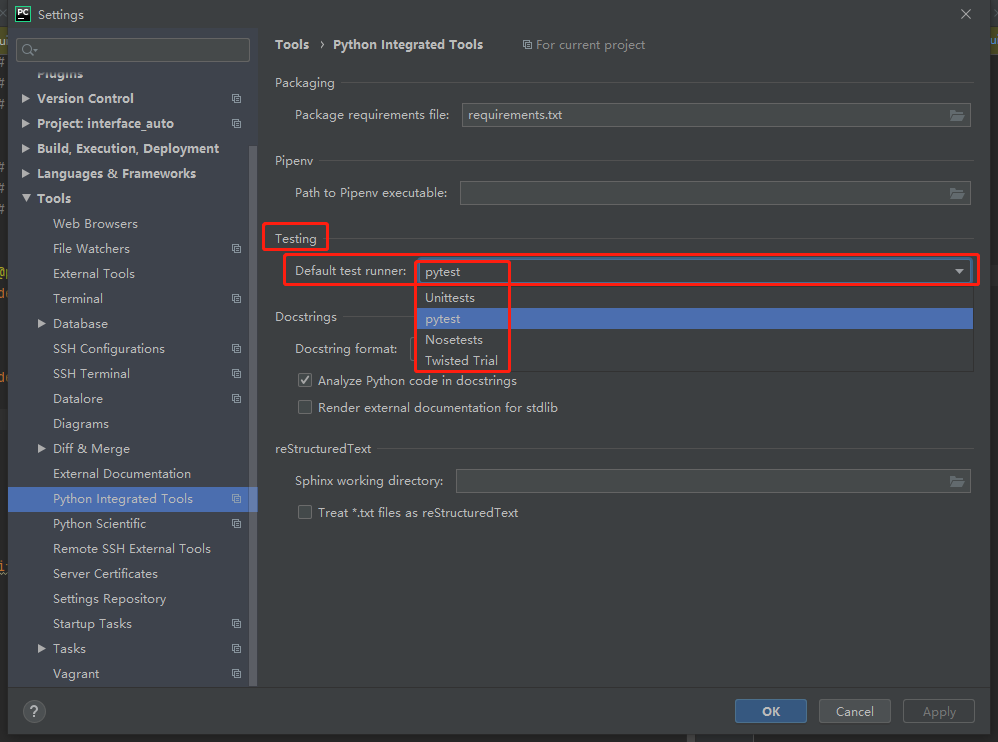
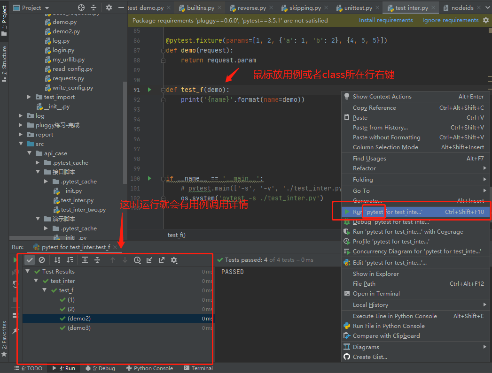
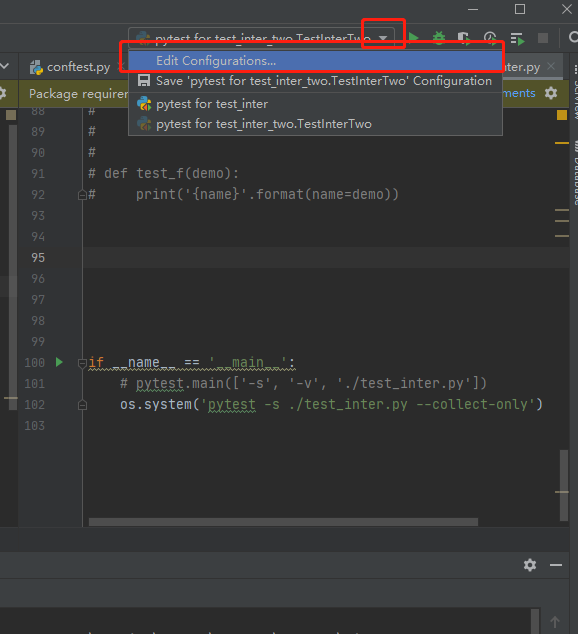
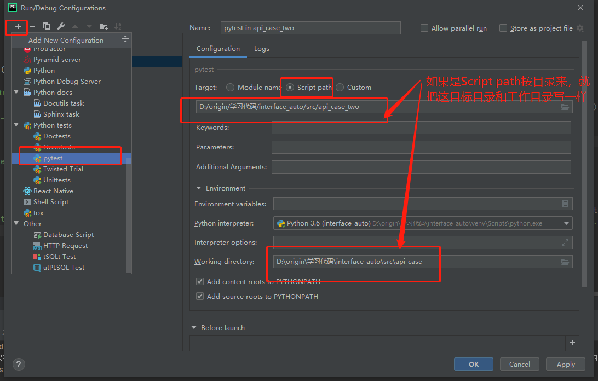
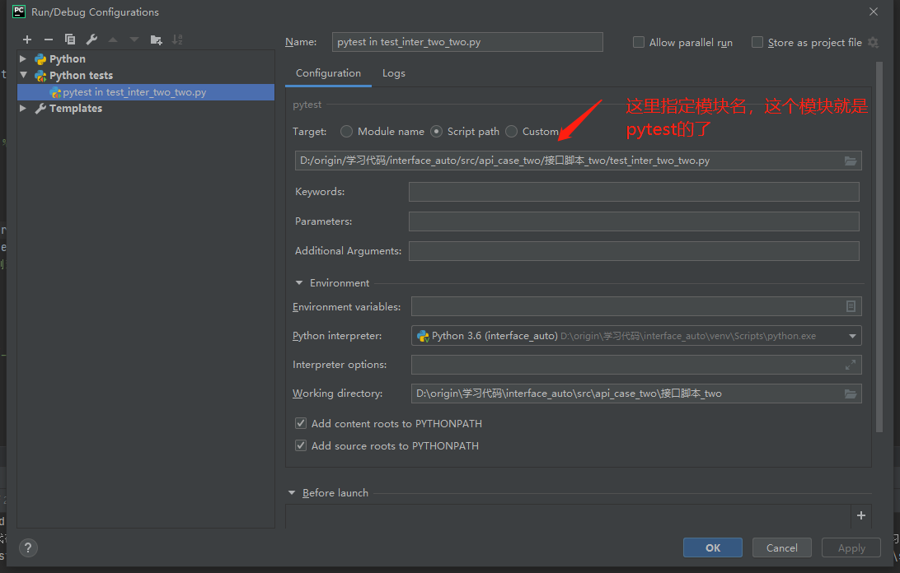
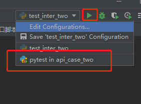

## 一、如何将我们的项目设置成pytest项目


**第一步：进入`pycharm`工程项目设置运行器页面**

```
file->Setting->Tools->Python Integrated Tools->Default test runner
```




**第二步：将Default test runner设置为`pytest`**

想关闭它，可以讲pytest改成Unittersts

**第三步：运行**

**备注:这样运行以后，就会出现用例调用详情展示框**




**备注： 这个时候我们的整个项目都变成了一个pytest项目，这个时候**

`if __name__ == '__main__'`好像都不生效了, 是真不生效了。。刚刚测试了


## 二、将局部项目用例集设置成pytest集合


**第一步：打开解释编辑配置**




**第二步：添加指定配置**

**2.1	按目录配置或者模块**



**备注：这样配置以后，在右上角选择要执行的模板，点击它三角形执行，它就执行该目录，按`pytest`的方式，并显示用例调用详情**



****


