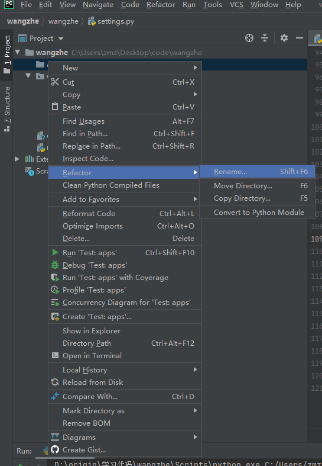

# 一、search for references 和search in comments and strings以及Move Copy Safe delete的介绍

### 1.1 Rename

在学习python时，用pycharm工具时，重命名一个文件时用到了选择要修改的地方然后右击～refactor下的rename，然后出现了这些东西，引起了我的疑问。

refactor：n.重构

就是重构，就是牵一发而动全局。

你修改一个变量的名称，所有使用该变量名称的所有地方都能自动修改，免去了手动修改的麻烦。 动一而动全的 比较麻烦的一个。

所以如果你仅仅想修改这个名字，而不改变其他的东西，那么就去掉勾选，以pycharm为例，我当时只想改变这个包名，而不想改变其他和这个名字相同的变量，注释等东西，那么就勾选掉这个～search for references 和search in comments and strings 。当然这个是针对单独项目这样做。

如果你整个项目都用到了这个包名或者类名，你要重命名的话，需要勾选这两个选项，因为毕竟这之间有联系。

- search for references：搜索引用

- search in comments and strings：搜索注释和字符串

只要在这两种方式下搜到的和原先名字一样的东西都会被替换掉，所以你在修改之前需要慎重，你是准备全修改还是单独修改，存在这个的会不会有联系。

### 1.2 Move 、Copy 

Move的重构和Rename的重构类似，它可以把一个元素从一个地方移动到另一个地方，Move的重构主要用来移动一个类到不同的包下。

