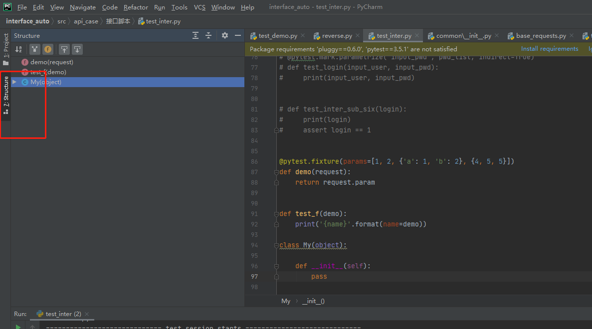

```python
编辑代码的时候经常的要换下一行，但是光标没有在行末，可以用这个命令直接换行：Shift+Enter
行注释/取消行注释：Ctrl+/
块注释：Ctrl+Shift+/ 
快速查看文档：Ctrl + q  
非常实用的一个命令，编码过程中快速复制当前行，大大提升编码效率：Crtl+D 
代码快速格式化，让代码简洁规整：Ctrl + Alt + L
自动缩进：Ctrl + Alt + I 
进/取消缩进：Tab / Shift + Tab


移动当前行	ctrl + shift + ↑ 或者 ↓
移动到上次光标所在的位置 ctrl + alt + ←或者→

按快捷键Ctrl + Shift + F或从从菜单Edit-》Find-》Find in Path进入全局查找界面。 一般這個快捷鍵位都被占用了，所以我们还是手动q
```


查看代码结构




查看执行顺序