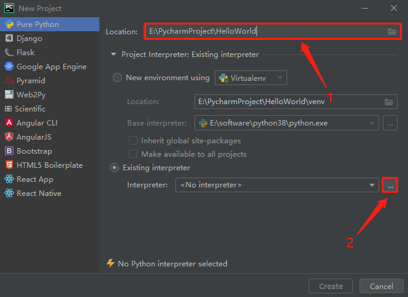

https://www.cnblogs.com/xuexianqi/p/12378617.html

#  Pycharm2019.3.3的安装破解

# 一：什么是Pycharm

```
　　PyCharm是一种Python IDE，带有一整套可以帮助用户在使用Python语言开发时提高其效率的工具，比如调试、语法高亮、Project管理、代码跳转、智能提示、自动完成、单元测试、版本控制。

　　此外，该IDE提供了一些高级功能，以用于支持Django框架下的专业Web开发。

　　Pycharm分为2个版本：专业版（Professional）和 社区版（Community）。

　　专业版功能齐全，但是要收费、要激活；社区版只有基本功能，免费。
```


# 二：Pycharm的下载

## 1.下载Pycharm

### Pycharm官网：https://www.jetbrains.com/pycharm/download/#section=windows

## 2.打开官网后，点击 “Dodwnload”


# 三：Pycharm的安装

## 10.安装完毕后重启，点击第二个 “Do not import settings”，点击 “OK”


## 11.打上 “√”，点击 “Continue”


## 12.点击 “Don't send”


## 13.喜欢深色或者浅色的都可以，然后点击“Next: Featured plugins”


## 14.点击 “Start using PyCharm”


# 四：Pycharm的激活

## 1.接下来，就是激活步骤了

### ①打开网站：[lookdiv.com](http://lookdiv.com/)，输入密钥“lookdiv.com”，点击 “提交”


### ②点击 “点击获取激活码”


### ③复制框中激活码


## 2.打开Pycharm，点击 “Activation code”，复制到框中，点击 “Activate”，点击 “Continue”


## 3.新建一个项目，点击 “Create New Project”


## 4.上面的框是项目的存放路径，可以自定义。下面的是Python解释器的录几个，点击打开设置




## 5.点击右上角的 “···”，在找到Python3.8.2的安装路径，点击 “python.exe”，点击 “OK”，再点击外层的 “OK”


## 6.点击 “Create”，创建项目


## 7.稍等片刻


## 8.把 “Show tips on start” 的 “√”去掉，然后点击 “Close”


## 9.点击 “Help”，点击 “About”


## 10.这里可以查看PyCharm的激活状态和激活持续时间


## 11.如果想要更换激活码，点击 “Help，”点击 “Register”


## 12.此处可以查看和更改激活码


