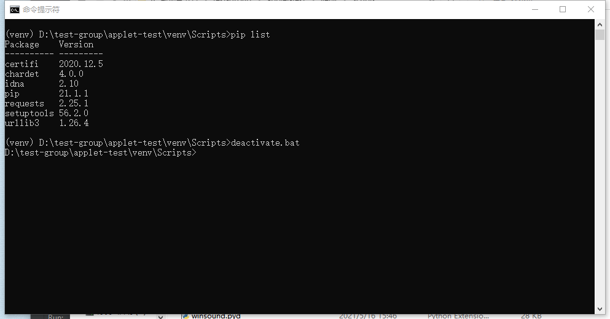

#### python的官方下载地址

🔺`https://pypi.org/search/`


#### python包手动下载

> ​	我们以requests包为例


> - ​	**第一步下载zip格式的包，linux环境下，下载tar.gz格式的**

```
先下载requests包 https://github.com/kennethreitz/requests
```


> - ​	**解压requests安装包**

```python
1. 进入到我们虚拟环境的site-packages目录下
		cd D:\test-group\applet-test\venv\Lib\site-packages
2. 将我们下载的requests安装包，解压到site-packages目录下,解压后目录结构如下：
	-requests-master(因为我下载的是master节点的zip包)
	
3. 进入到request-master目录下：
4. 在该目录下编译：python setup.py build （一般不需要，如果直接第五步不行的报错，我可以这样弄一下）
5. 在该目录下执行python setup.py install 进行安装
```


#### pycharm进入和退出虚拟环境

- **第一步：进入虚拟环境的Script目录中(windows环境下)**

```bash
cd /d D:\test-group\applet-test\venv\Scripts
```

- **第二步：执行activate进入虚拟环境**
- **第三步：执行deactivate.bat退出虚拟环境**


#### CMD进入和退出虚拟环境

- **第一步：进入虚拟环境的Script目录中(windows环境下)**

```bash
cd /d D:\test-group\applet-test\venv\Scripts
```

- **第二步：执行activate进入虚拟环境**
- **第三步：执行deactivate.bat退出虚拟环境**




#### window环境下怎么解压tar.gz格式打包压缩的文件

##### 第一种方法：

```
使用7Z解压，7z是真的强啊
```


##### 第二种方法：

```
使用Git Bash
然后 tar -zxvf requests.taz
```
