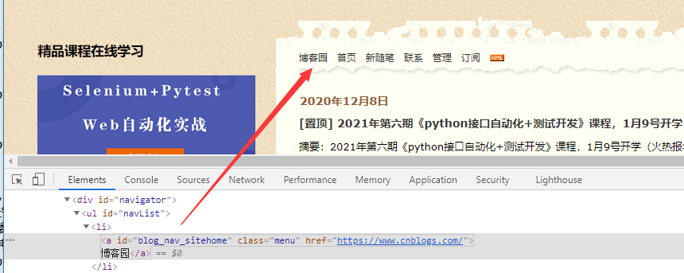
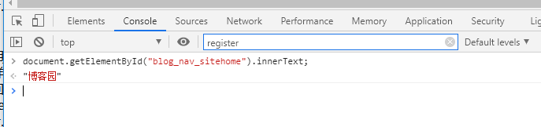

# 前言

之前经常使用 execute_script() 方法执行 JavaScript 的来解决页面上一些 selenium 无法操作的元素，但是一直无法获取执行的返回值。
最近翻文档，发现 execute_script 是可以拿到 JavaScript 执行后的返回值的

# 演示案例

以打开https://www.cnblogs.com/yoyoketang/网页为示例，使用 JavaScript 来定位元素



目标元素元素属性

```
<a id="blog_nav_sitehome" class="menu" href="https://www.cnblogs.com/">
博客园</a>
```

我们可以在浏览器 Console 执行 JavaScript 获取到元素的文本属性值

> document.getElementById("blog_nav_sitehome").innerText;



但是在代码里面执行的时候，却拿不到返回值

```
from selenium import webdriver
# 作者-上海悠悠 QQ交流群:717225969
# blog地址 https://www.cnblogs.com/yoyoketang/

driver = webdriver.Chrome()
driver.get("https://www.cnblogs.com/yoyoketang/")

# 定位博客首页 "博客园" 按钮
# <a id="blog_nav_sitehome" class="menu" href="https://www.cnblogs.com/">博客园</a>

js_blog = 'document.getElementById("blog_nav_sitehome").innerText;'
blog = driver.execute_script(js_blog)
print(blog)
```

运行后结果返回 None,之前一直没找到解决办法，最近翻文档发现需在 JavaScript 脚本前面加 return 即可解决

# return 返回值

在 JavaScript 脚本前面加 return 获取返回值,修改后如下

```
from selenium import webdriver
# 作者-上海悠悠 QQ交流群:717225969
# blog地址 https://www.cnblogs.com/yoyoketang/

driver = webdriver.Chrome()
driver.get("https://www.cnblogs.com/yoyoketang/")

# 定位博客首页 "博客园" 按钮
# <a id="blog_nav_sitehome" class="menu" href="https://www.cnblogs.com/">博客园</a>

js_blog = 'return document.getElementById("blog_nav_sitehome").innerText;'
blog = driver.execute_script(js_blog)
print(blog)
```

再次执行就能得到结果：博客园

# 返回 JavaScript 元素对象

JavaScript 定位到的元素对象也能返回给 selenium, 拿到元素对象后也可以继续操作

```
from selenium import webdriver
# 作者-上海悠悠 QQ交流群:717225969
# blog地址 https://www.cnblogs.com/yoyoketang/

driver = webdriver.Chrome()
driver.get("https://www.cnblogs.com/yoyoketang/")

# 定位博客首页 "博客园" 按钮
# <a id="blog_nav_sitehome" class="menu" href="https://www.cnblogs.com/">博客园</a>

js_blog = 'return document.getElementById("blog_nav_sitehome");'
blog = driver.execute_script(js_blog)
print(blog)  # 返回元素对象

# 获取元素属性
t = blog.text
print(t)
# 获取元素 href 属性
link = blog.get_attribute("href")
print(link)
# 点击元素
blog.click()
```

运行后结果：

```
<selenium.webdriver.remote.webelement.WebElement (session="a56f9aee265dd471eaa45655dfbfdbb9", element="39c918ab-1ca1-4e09-ba8d-a6979595a917")>
博客园
https://www.cnblogs.com/
```

# jquery 使用

上面的 JavaScript 方法同样适用于 jquery 定位元素和操作元素

```
from selenium import webdriver
# 作者-上海悠悠 QQ交流群:717225969
# blog地址 https://www.cnblogs.com/yoyoketang/

driver = webdriver.Chrome()
driver.get("https://www.cnblogs.com/yoyoketang/")

# 定位博客首页 "博客园" 按钮
# <a id="blog_nav_sitehome" class="menu" href="https://www.cnblogs.com/">博客园</a>
# js_blog = 'return document.getElementById("blog_nav_sitehome");'

# jquery 也适用
jq_blog = "return $('#blog_nav_sitehome')[0];"

blog = driver.execute_script(jq_blog)
print(blog)  # 返回元素对象

# 获取元素属性
t = blog.text
print(t)
# 获取元素 href 属性
link = blog.get_attribute("href")
print(link)
# 点击元素
blog.click()
```

运行后结果：

```
<selenium.webdriver.remote.webelement.WebElement (session="a56f9aee265dd471eaa45655dfbfdbb9", element="39c918ab-1ca1-4e09-ba8d-a6979595a917")>
博客园
https://www.cnblogs.com/
```

需要注意的是 jquery 并不是适用所有的 web 网页，需页面有加载 jquery 的 js 文件