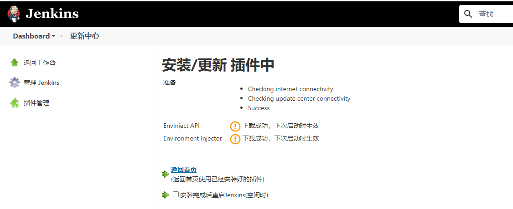
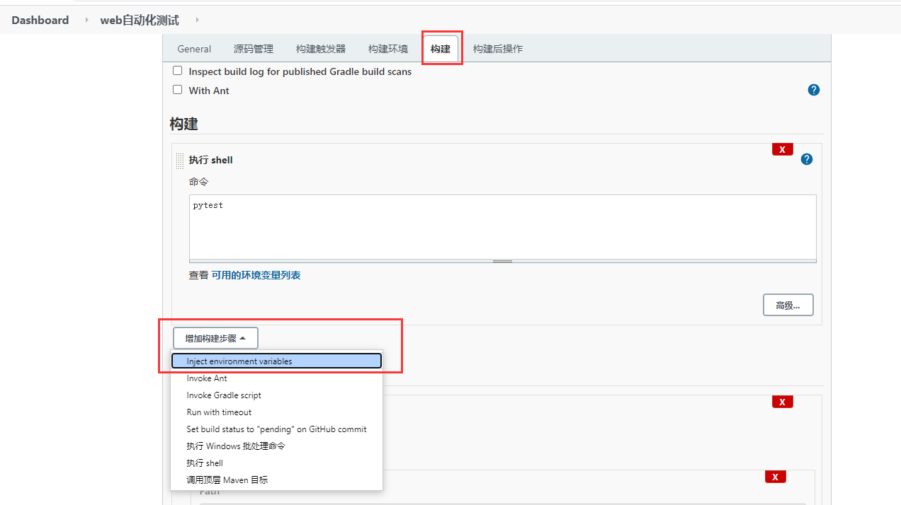

# [jenkins学习17 - 添加环境变量（Environment Injector）](https://www.cnblogs.com/yoyoketang/p/14955965.html)

# 前言

jenkins在构建job的时候，可以自己添加一些环境变量，在后续的构建步骤中引用环境变量，比如在测试报告中引用
Environment Injector 插件可以在在构建步骤中添加环境变量

- Properties Content 自定义环境变量
- Properties File Path 引用本地文件作为环境变量

# Environment Injector 插件

搜索插件：Environment Injector


安装成功后，重启jenkins生效


# Properties Content 自定义环境变量

添加构建步骤 - Inject environment variables


Properties Content 可以写成如下键值对的格式

```
AUTHOR=yoyo
TEL=132*****123
EMAIL=283340479@qq.com
```


在邮件报告模板中引用环境变量


于是收到的邮件，就会有相关信息


# Properties File Path 引用本地文件

我们也可以引用本地的txt文件作为环境变量，先在服务器上找个任意路径发info.txt文件,编辑如下内容

```
[root@iZ2vchn8sk983jm605yhshZ ~]# vi info.txt
[root@iZ2vchn8sk983jm605yhshZ ~]# cat info.txt 
AUTHOR=yoyo
TEL=132*****123
EMAIL=283340479@qq.com
[root@iZ2vchn8sk983jm605yhshZ ~]# pwd
/root
```

在邮件报告模板中引用环境变量


于是收到的邮件，就会有相关信息


# 潜在的问题

如果在构建执行shell的时候，退出代码为0，也就是构建成功，那是没有问题的

如果在构建执行shell的时候，退出代码为1，也就是构建失败，那么后面的Inject environment variables 这一步就不会执行了，导致后面的环境变量拿不到

解决办法：
在执行shell的时候，脚本执行后会有个exit code ，状态为0 和1 ，0是表示代码执行成功，1表示执行失败。
jenkins在构建脚本可以认为1是不稳定的构建，于是设置为构建不稳定时的退出码：1


构建结果: Unstable


更多资料参考https://plugins.jenkins.io/envinject/