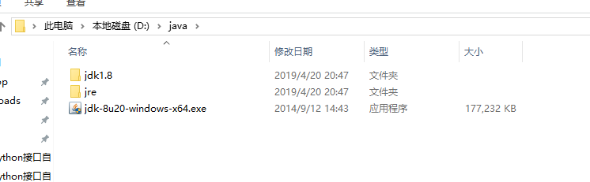
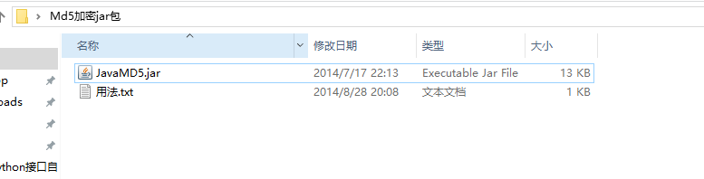

# [Python 如何正确调用 jar 包加密，得到加密值？](https://www.cnblogs.com/yoyoketang/p/15126652.html)

# 前言

在做接口自动化的时候，经常会遇到一些参数是需要加密的，比如密码参数。
加密规则一般开发也不愿意告诉你，会直接给你一个jar包，让你调用jar包得到加密值，在jmeter上是可以直接引用jar包的，但python调用jar包会有点麻烦。

# 环境准备

我的电脑环境：

- windows10
- python3.6.6 （64位）
- jdk 1.8.0_20 (64位）

安装jdk的时候，也会顺带安装了jre, 安装目录结构如下（jdk的安装自己网上找详细教程）


安装完成后检查版本号和jar命令

```
C:\Users\dell>java -version
java version "1.8.0_20"
Java(TM) SE Runtime Environment (build 1.8.0_20-b26)
Java HotSpot(TM) 64-Bit Server VM (build 25.20-b23, mixed mode)

C:\Users\dell>jar
用法: jar {ctxui}[vfmn0Me] [jar-file] [manifest-file] [entry-point] [-C dir] files ...
选项:
    -c  创建新档案
    -t  列出档案目录
    -x  从档案中提取指定的 (或所有) 文件
    -u  更新现有档案
    -v  在标准输出中生成详细输出
    -f  指定档案文件名
    -m  包含指定清单文件中的清单信息
    -n  创建新档案后执行 Pack200 规范化
    -e  为绑定到可执行 jar 文件的独立应用程序
        指定应用程序入口点
    -0  仅存储; 不使用任何 ZIP 压缩
    -M  不创建条目的清单文件
    -i  为指定的 jar 文件生成索引信息
    -C  更改为指定的目录并包含以下文件
如果任何文件为目录, 则对其进行递归处理。
清单文件名, 档案文件名和入口点名称的指定顺序
与 'm', 'f' 和 'e' 标记的指定顺序相同。

示例 1: 将两个类文件归档到一个名为 classes.jar 的档案中:
       jar cvf classes.jar Foo.class Bar.class
示例 2: 使用现有的清单文件 'mymanifest' 并
           将 foo/ 目录中的所有文件归档到 'classes.jar' 中:
       jar cvfm classes.jar mymanifest -C foo/ .
```

# 加密jar包

以最简单的md5加密jar包为例


java引用方法

```
import com.ndktools.javamd5.Mademd5;

String password = "admin";
Mademd5 md = new Mademd5();
System.out.println(md.toMd5(password));
```

# python 调用jar

安装依赖包jpype1 (后面要加一个1)

```
> pip install jpype1
```

启动JVM，打印"hello world"

```
import jpype
# 作者-上海悠悠 QQ交流群:717225969
# blog地址 https://www.cnblogs.com/yoyoketang/


# 获取JVM安装路径
jvmPath = jpype.getDefaultJVMPath()
# 启动JVM
jpype.startJVM(jvmPath)
# 执行java代码
jpype.java.lang.System.out.println("hello world!")
# 关闭JVM
jpype.shutdownJVM()
```

运行后能正确打印出"hello world"，说明环境安装没问题了

# 调用加密jar包

jpype.JClass方法导入需要调用的class

```
import com.ndktools.javamd5.Mademd5;

String password = "admin";
Mademd5 md = new Mademd5();
System.out.println(md.toMd5(password));
```

把java代码翻译成python就是如下代码

```
import jpype
# 作者-上海悠悠 QQ交流群:717225969
# blog地址 https://www.cnblogs.com/yoyoketang/


# 获取JVM安装路径
jvmPath = jpype.getDefaultJVMPath()
jarPath = 'JavaMD5.jar'  # jar包路径，可以放代码同一目录
# 启动JVM
jpype.startJVM(jvmPath, "-Djava.class.path=%s" % jarPath)
# 执行java代码
# jpype.java.lang.System.out.println("hello world!")
# 调用java class对象,先导入包
md5class = jpype.JClass("com.ndktools.javamd5.Mademd5")
password = "yoyo"
md = md5class()   # 实例化
md5_password = md.toMd5(password)
print(md5_password)
# 关闭JVM
jpype.shutdownJVM()
```

运行结果：48DC8D29308EB256EDC76F25DEF07251

# 导入的jar包有多个的时候

当导入的jar包只有一个的时候，用上面的方法进行了，如果有多个jar包需要导入，先合并jar
合并 JAR 分为 2 步：

- 解压 JAR
- 合并所有源码

安装 JDK 之后，通过 jar -xvf 命令去解压单个 JAR，这样会按包名在同级目录下生成 JAVA 编译后的 class 文件

```
# 先挨个解压jar,生成class文件
jar -xvf a.jar
jar -xvf b.jar
jar -xvf c.jar
```

使用 jar -cvfM 命令，将本地所有的 class 文件生成一个新的 JAR

```
jar -cvfM demo.jar .
```

命令最后面有个点(.),demo.jar就是合并后新生成的jar包了

参考资料: https://zhuanlan.zhihu.com/p/341747142
参考资料:https://www.cnblogs.com/botoo/p/8038507.html