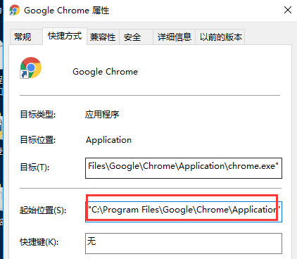
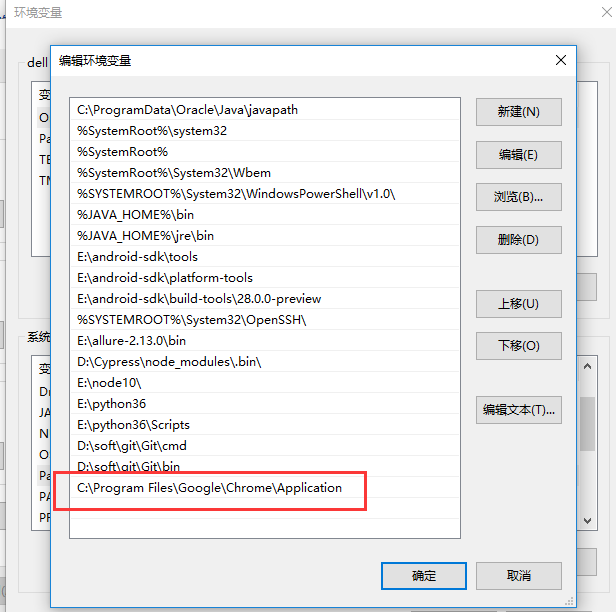
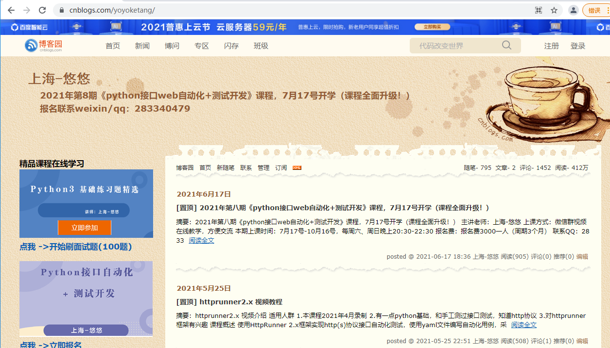

# [selenium+python自动化105 - selenium 如何在已打开的浏览器上继续运行自动化脚本？](https://www.cnblogs.com/yoyoketang/p/15132889.html)

# 前言

使用selenium 做web自动化的时候，经常会遇到这样一种需求，是否可以在已经打开的浏览器基础上继续运行自动化脚本？
这样前面的验证码登录可以手工点过去，后面页面使用脚本继续执行，这样可以解决很大的一个痛点。

# 命令行启动浏览器

首先右键Chrome浏览器桌面图标，找到chrome.exe的安装路径


复制地址`C:\Program Files\Google\Chrome\Application` 添加到环境变量Path下


打开cmd输入命令启动chrome浏览器

- --remote-debugging-port 是指定运行端口，可以设置容易端口，只要没被占用就行
- --user-data-dir 指定运行浏览器的运行数据，新建一个干净目录，不影响系统原来的数据

```
"C:\Program Files\Google\Chrome\Application\chrome.exe" --remote-debugging-port=9222 --user-data-dir="D:\selenium_chrome"

--remote-debugging-port=9222 --user-data-dir="D:\selenium_chrome" 如上,j
```

执行后会启动chrome浏览器


# selenium运行已打开浏览器

在已打开的浏览器上输入我的博客地址：`https://www.cnblogs.com/yoyoketang/`


新建py文件，可以接着浏览器上直接运行，不用重新启动浏览器

```
from selenium import webdriver
from selenium.webdriver.chrome.options import Options

chrome_options = Options()
chrome_options.add_experimental_option("debuggerAddress", "127.0.0.1:9222")
driver = webdriver.Chrome(chrome_options=chrome_options)
# 接着运行
print(driver.current_url)
print(driver.title)
```

运行结果

```
https://www.cnblogs.com/yoyoketang/
上海-悠悠 - 博客园
```

通过此方法就可以解决登录页面验证码的问题了，验证码手工操作，后面的页面继续用代码操作。

标签: [selenium](https://www.cnblogs.com/yoyoketang/tag/selenium/)