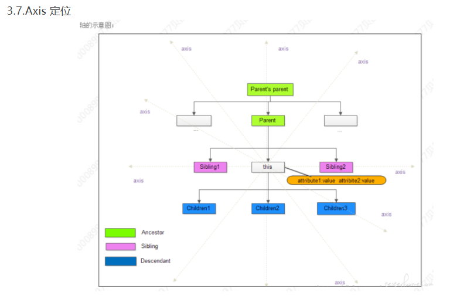
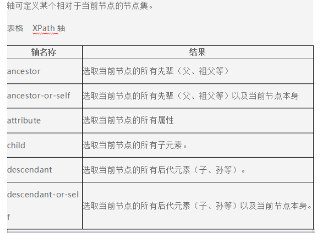
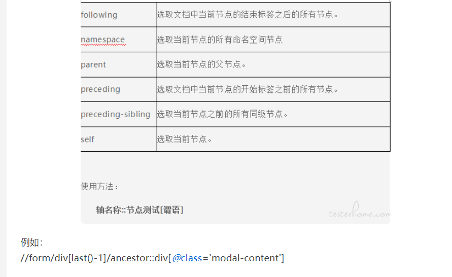
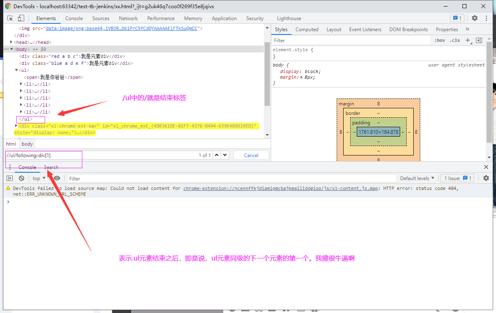
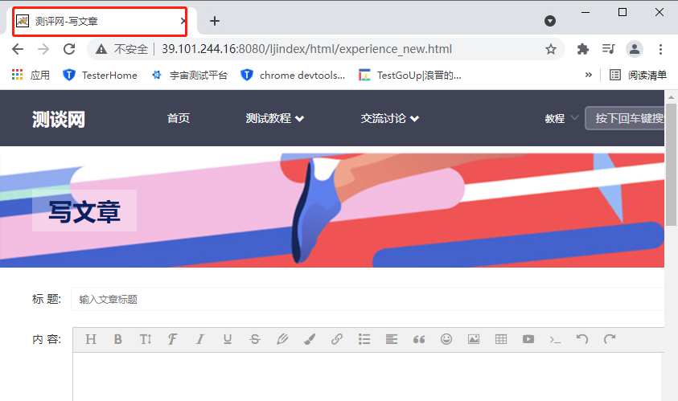
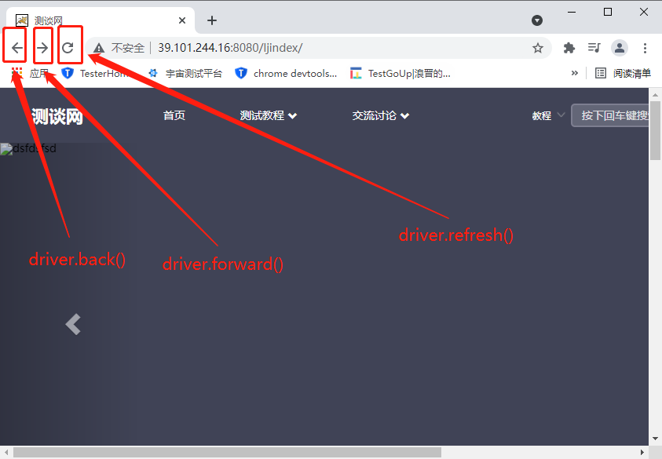
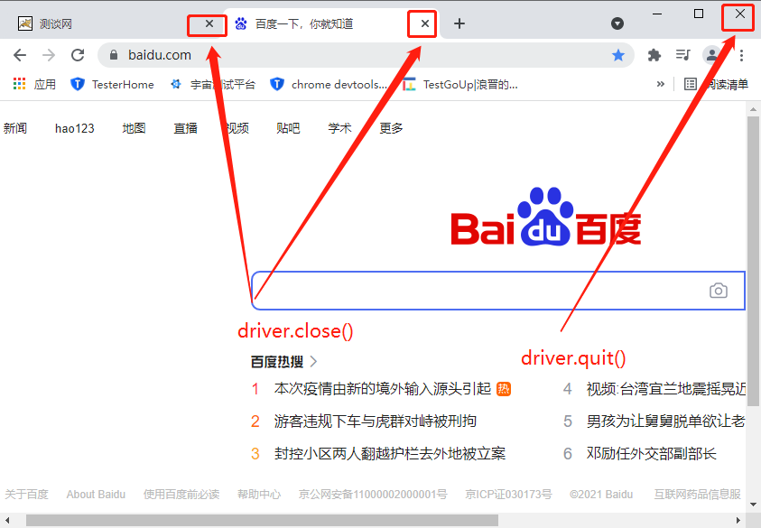

https://edu.csdn.net/learn/25654?spm=1002.2001.3001.4157


[Selenium](https://testerhome.com/topics/node73) XPATH 定位最全总结🔺

https://testerhome.com/topics/20296


XPath常用定位节点元素语句总结

https://www.bbsmax.com/A/Ae5R96KYJQ/


xpath定位中详解id 、starts-with、contains、text()和last() 的用法

https://www.cnblogs.com/unknows/p/7684331.html


selenium进阶之四大操作和三大切换

https://blog.csdn.net/fbher/article/details/107090171


🔺🔺🔺练习selenium的网站 -- 很牛逼的，什么样式的别人都给你准备了

https://www.sahitest.com/demo/


# 一、定位

### 1、CSS选择器定位

**前言：css选择器采用`css_object=document.querySelectorAll(css选择器表达式)`或者`css_object=document.querySelector(css选择器表达式)`来实现**

- `document.querySelectorAll`返回的是所有满足条件的HTML元素列表，通过`css_object[index]`的方式获取元素
- `document.queryselector`返回的是第一个被查找到的HTML元素

```python
1.	id选择器（id是唯一的只能有一个）
	作用：根据元素的id属性值选中一个元素
	语法:#id属性值
	a=document.querySelectorAll('#translate-button')
    a=document.querySelectorAll('div#translate-button')
    a=document.querySelectorAll('html>div#translate-button')

2.	class选择器  ----以后主要使用
	作用:根据元素的class属性值选中一组元素
	语法: .class属性值
	b=document.querySelector('.anticon')
    b=document.querySelector('div.anticon')
    b=document.querySelector('html>div.anticon')


3. 	复合选择器(seletor)
	作用:选中同时复合多个条件的元素
	语法：标签#id.class
special example:
	<style>
		.a.b.c{
            	color:red;
				}
	</style>
	<div class="red a b c">我是元素div</div>
一个元素可以有多个类名，书写格式class = "A B C"
	a = document.querySelectorAll('.red.a.b.c')
    a[0]
    

4.	子元素选择器
	作用：选中父元素指定的子元素(所用子元素)
	语法：father > child  or  爷爷 > 老子 > 儿子
	表示：比father小一级目录的child标签
    a = document.querySelectorAll('html>div[id]:first-child')
    
    

5.	后代元素选择器
	作用：选中指定元素的后代（这里不光只有子元素，它包括所有后代比如：孙子、曾孙）,对他的后代生效
	语法：祖先 后代
	表示：比祖先目录等级低的所以后代元素

6.	兄弟选择器
	作用：前一个的下一个
	语法：前一个 + 下一个
	注意：样式只对“下一个生效”
	注意：出现这种
		span + span 这种的两个相同元素相加，表示只要是存在两个span连续的元素，都被设定样式,同理A+B 只要满足的就生成样式，对“+”号后面的生效
    a = document.querySelectorAll('div+div.a')    
     

7.	属性选择器(class 和 id 也是属性，但是他们有专门的标记了就排除)
	Syntax: [attr] [attr=value] [attr~=value] [attr|=value] [attr^=value] 						[attr$=value] [attr*=value]
	Example: [autoplay] will match all elements that have the autoplay attribute 				set (to any value).
	前面还可以加一个标签元素,反正就是灵活使用
	Syntax: div[attr] div[attr=value] div[attr~=value] div[attr|=value] 					div[attr^=value] div[attr$=value] [attr*=value]
前面不加div，相当于是*[value]

div[attr^=value ]  	---- 表示div中属性值以value开头的
div[attr$=value]	---- 表示div中属性值以value结尾的
[attr*=value]		---- 表示属性值中包含value的


$("div[dataId]");            //拥有属性dataId的div列表
$("div[dataId=test]");       //属性dataId为"test"的div列表
$("div[dataId!=test]");      //属性dataId不等于"test"或没有title属性的div列表
$("div[dataId^=test]");      //属性dataId以"test"开始的div列表
$("div[dataId$=test]");      //属性dataId以"test"结束的div列表
$("div[dataId*=test]");      //属性dataId含有"test"的div列表
$("div[dataId|=test]");      //属性dataId等于"test"或以"test-"开头的div列表
$("div[dataId~=test]");      //属性dataId用空格分割的值中包含test的div列表
$("div[id][dataId$=test]");  //包含属性id，同时属性title以"test"结束的div列表,不光指id其他属性也可以
example ----> img[src][alt='图片1']


8. Pseudo class 选择器（伪类选择器）
:first-child  				第一个子元素
:last-child					最好一个子元素
:nth-child(digital)			从头部计数开始，选中第n个子元素
:nth-last-child(digital)	从尾部计数开始，选中第n个子元素
	digital = 2n or even	表示选中偶数个子元素
	digital = 2n+1 or odd 	表示奇数个子元素
	<style>
        li:nth-child(2n+1){
            color:rgb(255,0,0)
        }

	</style>
	<ul>
        <span>我是你爸爸</span>
        <li>第一个</li>
        <li>第二个</li>
        <li>第三个</li>
        <li>第四个</li>
        <li>第五个</li>
    </ul>
前面的选择器先进行定位，然后满足定位的的范围内，nth-child对级下的所有元素参与进行筛选
🔺：这里有一个问题哈，nth-childe的时候，会将其他的元素也加入到计数里面，比如上面的例子，本来是选取奇数的，但是由于span的加入，变成了选偶数的li了

    
下面这几个就是同类型的了
:fist-of-type
:last-of-type
:nth-of-type
:nth-last-of-type()
    
:not()否定伪类
	- 将符合条件的元素从选择器中剔除
	li:nth-of-type(2n):not(:nth-child(5)){
    color: red;
	}    
```

a = document.querySelectorAll('html>div[id]:first-child')


### 2、XPath查询

采用document.evaluate来查找

```
a = document.evaluate('/html/body/svg[1]', document.documentElement, null, XPathResult.ORDERED_NODE_SNAPSHOT_TYPE, null)
```


> ID精准定位

```js
//*[@id="icon-base-open"]			# 定位所有元素中id=icon-base-open的元素
```


>其他属性定位

```JS
/html/div[@class='translate-button']	# 定位html元素下一级目录中class等于translate-button的div元素
/html//div[@class='translate-button']	# 定位html元素下级(一级或者多级)目录中class等于translate-button的div元素
```


> index

```js
/html/div[@class='translate-button'][1]			# 定位html元素下一级目录中class等于translate-button的div元素的第一个
/html/div[@class='translate-button'][2]			# 定位html元素下一级目录中class等于translate-button的div元素的第二个
/html/div[@class='translate-button'][last()]	# 定位html元素下一级目录中class等于translate-button的div元素的第最后一个

/html/div[@class='translate-button'][last()-1]	# 定位html元素下一级目录中class等于translate-button的div元素的到倒数第二个
```


> Xpath结合Axis定位,实现上面的CSS的定位

通过Xpath结合Axis，我们可以将XPath的功能进行扩展









```
//ul/following::div[1]
```



注意：我们一般要用索引号，因为他是结束标签以后的所有元素，这个所有范围很大，不是同级的也算在里面。按HTML文档树的结构，后面的全都算，所以我们一般采用索引的方式。找到相邻的


**总结：**

Xpath 的功能非常强大，不仅能够完成界面定位的任务，而且能保证稳定性，实际自动化测试中，能够识别界面元素是重要的，更重要的是要保证版本间的稳定性，减少脚本的维护工作。
如下规则请参考：
特征越少越好
特征越是界面可见的越好
不能使用绝对路径
避免使用索引号
擅用 console 调试
相对路径，属性值，文本内容，Axis 可以任意组合，当然属性值和文本内容的模糊匹配也支持和上述方式任意组合，Axis 可以嵌套使用。

```js
1. //NODE[not(@class)] 所有节点名为node,且不包含class属性的节点
2. //NODE[contains(text(),substring] 所有节点名为node,且其文本中包含substring的节点
3. //NODE[contains(name(),'C')] 所有名字中包含字母C的节点
4. //ul[count(li)=2] 所有包含两个li孩子节点的ul节点
5. //*[name()='div'] 所有名字为div的节点，等同于//div
6. //div[count(div)=5]/*[name()='div' and position() mod 2=1]	所有奇数位置的div节点
7. //div[position() mod 2 = 0] 偶数位置的d节点
8. //span[text()='收到的商品有某种问题']/ancestor::div[last()]	   span的父类最后一个
9. //span[text()='收到的商品有某种问题']/ancestor::div[last()-1]	   span的父类倒数第二个
```


# 二、参数说明

```python
driver = webdriver.Chrome(executable_path='C://Users//zmz//Desktop//chromedriver.exe')

    def __init__(self, executable_path="chromedriver", port=0,
                 options=None, service_args=None,
                 desired_capabilities=None, service_log_path=None,
                 chrome_options=None, keep_alive=True):
        """
        Creates a new instance of the chrome driver.

        Starts the service and then creates new instance of chrome driver.

        :Args:
         - executable_path - path to the executable. If the default is used it assumes the executable is in the $PATH
         - port - port you would like the service to run, if left as 0, a free port will be found.
         - options - this takes an instance of ChromeOptions
         - service_args - List of args to pass to the driver service
         - desired_capabilities - Dictionary object with non-browser specific
           capabilities only, such as "proxy" or "loggingPref".
         - service_log_path - Where to log information from the driver.
         - chrome_options - Deprecated argument for options
         - keep_alive - Whether to configure ChromeRemoteConnection to use HTTP keep-alive.
        """
```


https://www.cnblogs.com/yoyoketang/p/14084401.html

https://www.cnblogs.com/yoyoketang/p/15132889.html	# 怎么使用selenium操作已经打开的chrome浏览器


#### 2.1 样例

```python
import allure
import pytest
from selenium import webdriver
from selenium.webdriver.chrome.options import Options as CH_Options
from selenium.webdriver.firefox.options import Options as FF_Options
from config.globalparam import pro_ini_path
from local_lib.API.common import readconfig
from local_lib.UI.page.page_common import PageCommon

read = readconfig.ReadConfig(pro_ini_path)
driver_type = read.getValue('UIConfig', 'driver_type')
driver = None

# 启动浏览器
# chromedriver各大版本下载地址 http://npm.taobao.org/mirrors/chromedriver/
@pytest.fixture(scope='session')
def browser():
    """
    全局定义浏览器驱动
    :return:
    """
    global driver
    global driver_type

    if driver_type == "chrome":
        # 本地chrome浏览器
        driver = webdriver.Chrome()
        driver.maximize_window()

    elif driver_type == "firefox":
        # 本地firefox浏览器
        driver = webdriver.Firefox()
        driver.set_window_size(1920, 1080)

    elif driver_type == "chrome-headless":
        # chrome headless模式
        chrome_options = CH_Options()
        chrome_options.add_argument("--headless")
        chrome_options.add_argument('--disable-gpu')
        chrome_options.add_argument("--window-size=1920x1080")
        driver = webdriver.Chrome(options=chrome_options)

    elif driver_type == "firefox-headless":
        # firefox headless模式
        firefox_options = FF_Options()
        firefox_options.headless = True
        driver = webdriver.Firefox(firefox_options=firefox_options)
    else:
        raise NameError("driver驱动类型定义错误！")
    url = PageCommon().get_login_url()
    driver.get(url)
    yield driver
    driver.quit()
    print("test end!")


# # ui自动化基础网址
# # @pytest.fixture(scope="session")
# # def base_url():
# #     url = PageCommon().get_login_url()
# #     return url

# @pytest.hookimpl(tryfirst=True, hookwrapper=True)
# def pytest_runtest_makereport(item, call):
#     outcome = yield
#     rep = outcome.get_result()
#     if rep.when == "call" and rep.failed:
#         mode = "a" if os.path.exists("failed_screenshots") else "w"
#         with open("failed_screenshots", mode) as f:
#             if "tmpdir" in item.fixturenames:
#                 extra = "(%s)" % item.funcargs["tmpdir"]
#             else:
#                 extra = ""
#             f.write(rep.nodeid + extra + "\n")
#         with allure.step("添加失败截图"):
#             allure.attach(driver.get_screenshot_as_png(), "失败截图", allure.attachment_type.PNG)
```


# 二十、命令集合


#### 1、driver的属性

```python
# 获取当前页面url
driver.current_url

# 获取当dirver的名字, 输出Chrome或者 FireFox
driver.name
```


```python
# 获取当前页面的title， 如下图红色矩形包裹的范围
driver.title
```




```python
# 获取页面的源码
driver.page_source
```


```python
# 获取当前的句柄
driver.current_window_handle
CDwindow-E3AA380ECDF8A599B6B4E33A9C7C4F0C

# 获取所有window句柄
driver.window_handles
['CDwindow-E3AA380ECDF8A599B6B4E33A9C7C4F0C']
```


#### 2、driver的方法

```python
driver.back()

driver.forward()

driver.refresh()
```




```python
# 关闭窗口
driver.close()


# 退出浏览器
driver.quit()
```




```python
# 切换到内联框
driver.switch_to.frame()

# 切换到活动元素
driver.switch_to.active_element()

# 切换到alter弹窗
driver.switch_to.alter()

# 切换到默认的内容
driver.switch_to.default_content()

# 切换到
driver.switch_to.window()
```


#### 3、 webElement的属性-- 元素的属性

