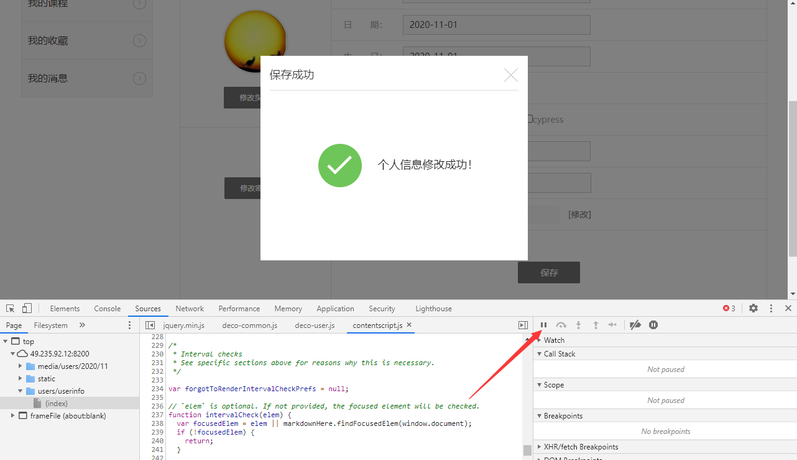

# [selenium+python自动化103-一闪而过的dialog如何定位](https://www.cnblogs.com/yoyoketang/p/14206256.html)

# 前言

web页面操作的时候经常会遇到一闪而过的 dialog 消息，这些提示语一般只出现了几秒,过后元素节点就会在DOM中消失了。
本篇讲解下用chrome 浏览器如何定位一闪而过的 dialog 消息

# dialog 场景

当点保存按钮后，页面弹出保存成功的提示框，这个提示框过1-2秒会自动消失


首先我们需要定位到此元素上，查看元素的属性相关信息，按f12 后鼠标还没来得及指上去就消失了，或者刚指上去，dom里面的元素就不见了。

# 暂停 dialog

打开chrome 浏览器，f12 后查看，打开 Source 项，在右侧有个暂停按钮，如下图



当 dialog 提示语出现的时候，点下暂停按钮，此时页面就不会动了


于是就可以在 Elements 里面用鼠标指到 dialog 元素上了


元素相关信息

```
<div class="successbox dialogbox" id="jsSuccessTips" style="display: block; margin-top: 93.5px;">
            <h1>保存成功</h1>
            <div class="close jsCloseDialog"></div>
            <div class="cont">
                <h2>个人信息修改成功！</h2>
                <p></p>
            </div>
        </div>
```

# 代码实现

获取dialog的时候，先定位该元素，通过上面抓出来的元素信息 `<h2>个人信息修改成功！</h2>`
定位这个元素的话，它没什么属性，但是可以定位它上面的一层div,甚至再上一层的`class="successbox dialogbox" id="jsSuccessTips"` 这2个属性定位

```
from selenium import webdriver
import time
# 作者-上海悠悠 QQ交流群:717225969
# blog地址 https://www.cnblogs.com/yoyoketang/


driver = webdriver.Chrome()
driver.get("http://x.x.x.x:8000/users/login/")

# 前面操作省略，进入到保存页面

# 点保存按钮
driver.find_element_by_id("jsEditUserBtn").click()

# 点击保存按钮后，dialog 不会立马出现会有一点点的延迟，可以先sleep下
time.sleep(0.2)
# 定位dialog 用css的层级定位
dialog = driver.find_element_by_css_selector("#jsSuccessTips>.cont").text
print(dialog)
```

打印结果：个人信息修改成功！