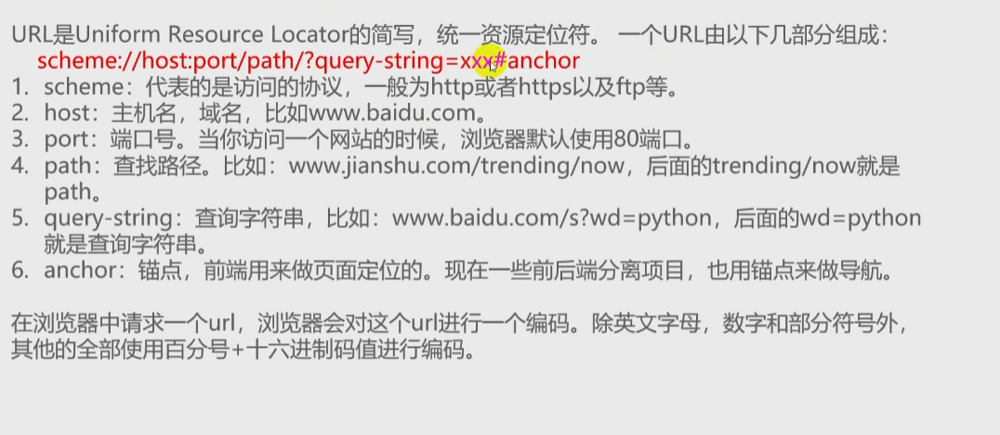
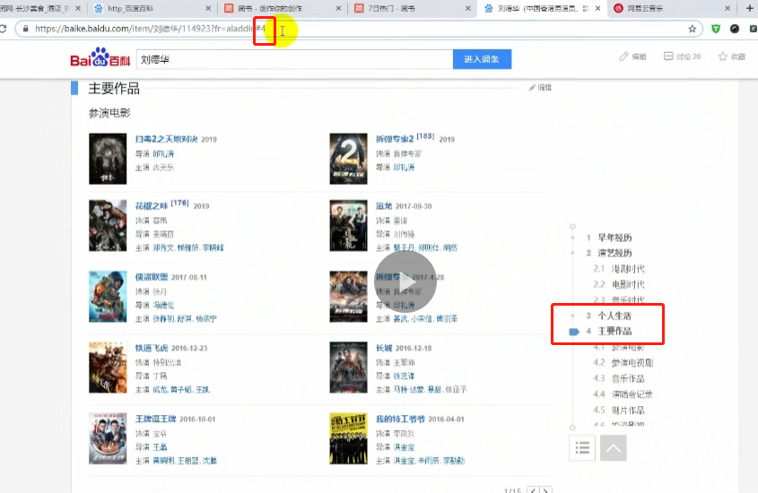
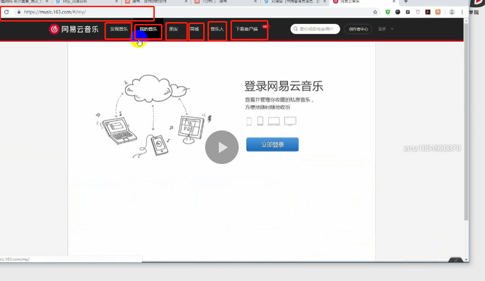
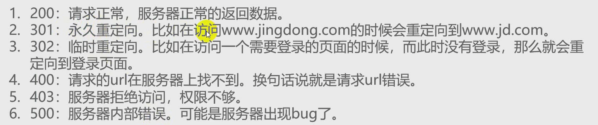
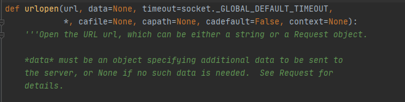
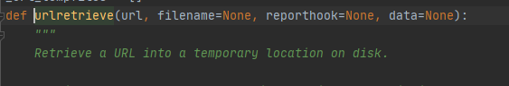
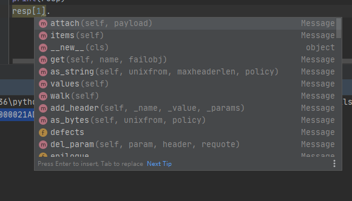

# 一、HTTP




1、 HTTP协议是80端口，默认不用写，写了也没问题

2、 HTTPS协议端口是443，默认不用写，写了也没问题

3、 锚点：定位的例子，百度百科、网易云， #value前端定位， #/value 导航（根据这个锚点去请求数据）






4、 url参数使用；号进行分割比如'http://www.xyz.com/aa.html;aoteman?param=xxx#bb.html'，aoteman就是参数

**状态码**



一般重定向302，见到的比较多


# 二、request

在python3的urllib库中，所有和网络请求相关的方法，都被集到urllib.request模块下面了，以先来看一下urlopen函数基本使用

```python
from urllib import request
resp = request.urlopen('http://www.baidu.com')
print(resp.read())								# 返回的是一个字节数据，要进行编码
```

一个基本的url请求对应的python代码真的非常简单。上面的代码，返回的不是百度的源码，因为百度本来就是一个做爬虫的，别人一下就把我给识破了，返回了其他的东西


## 1、request.urlopen



```
def urlopen(url, data=None, timeout=socket._GLOBAL_DEFAULT_TIMEOUT,
            *, cafile=None, capath=None, cadefault=False, context=None):
```

创建一个表示远程url的类的文件对象，然后像本地文件一样操作这个类文件对象来获取远程数据

1、url： 请求的url

2、data：请求的data，如果设置了这个值，那么将变成post请求

3、返回值：返回值是一个http.client.HTTPResponse对象，这个对象是一个类文件句柄对象。有read(size)、 readline、readlines以及getcode等方法. read()以后，文件指针就指向末尾了，再次read就会读出一个空字符。跟读文件很想，但是我试了seek方法，没用，说没有这个方法。


## 2、request.urlretrieve



```python
def urlretrieve(url, filename=None, reporthook=None, data=None):
```

这个函数可以方便的将网页上的一个文件保存到本地

```
from urllib import request
res = request.urlretrieve('https://www.xxx.jpg', 'xxxxx.jpg')	# 将一个图片保存到当前目录下xxxxx.jpg文件中
```

res是一个元组

```
('xxxxx.jpg', <http.client.HTTPMessage object at 0x0000021AD2DC5EF0>)
```

res[1]有很多个方法



我们来看看res[1]到底是个什么东西

```python
print(res[1])	# 感觉像一个响应头

Server: JSP3/2.0.14
Date: Tue, 05 Oct 2021 19:39:26 GMT
Content-Type: image/jpeg
Content-Length: 24005
Connection: close
Last-Modified: Fri, 18 Oct 2019 12:01:16 GMT
Expires: Thu, 16 Sep 2021 19:08:15 GMT
Age: 736
Accept-Ranges: bytes
Content-MD5: jMYJYqqTdB7QQOhyaJ7Zrg==
Vary: Accept
x-bce-debug-id: y7vvi1mTbZVSooaLBjeS5BNwJvk8gBHUIKMvtiN1kYtb75g1OF7elAgkBco8QwrzOmJXPJXtteC8Q7xMlgbvxg==
x-bce-image-info: width=220;height=298
x-bce-request-id: c55af2fd-de2f-4298-ad26-213258c75586
x-bce-storage-class: STANDARD
Access-Control-Allow-Origin: *
Timing-Allow-Origin: *
Ohc-Cache-HIT: dy2ct54 [4], bdix156 [4]
Ohc-File-Size: 24005
```


# 二、编码解码


## 1、 parse.urlencode

urlencode可以把字典数据转换为url编码数据。示例代码如下：

```python
from urllib import parse
data = {'name': '爬虫基础', 'greet': 'hello world', 'age': 100}
qs = parse.urlencode(data)
print(qs)
name=%E7%88%AC%E8%99%AB%E5%9F%BA%E7%A1%80&greet=hello+world&age=100
```

🔺备注：返回的qs是很有意思的

- 汉字被变成了十六进制的hex()，并用%替代了0x
- 如果参数有空格，用加号替代空格，有几个空格，就用几个加号


为什么要编码呢？因为我们请求的url，必须满足url编码规则，什么是url编码规则呢？

url编码规则

- 采用ASCII码进行编码url，才能进行传输（国际规范），所以对汉字不友好，我们在使用浏览器的时候，是浏览器帮我们进行处理了，所以我们没有什么感知
- 浏览器是这样处理的，将汉字进行采用utf8编码，然后取它的hex(),然后用百分号替代0x

我手动来处理一下

```python
>>> from urllib import parse
>>> a = '张明柱'

>>> b = a.encode('utf8')
>>> b
b'\xe5\xbc\xa0\xe6\x98\x8e\xe6\x9f\xb1'

>>> c = [hex(i) for i in b]
>>> c
['0xe5', '0xbc', '0xa0', '0xe6', '0x98', '0x8e', '0xe6', '0x9f', '0xb1']

>>> d = ''.join(c)
>>> c = d.replace('0x', '%')
>>> c
'%e5%bc%a0%e6%98%8e%e6%9f%b1'

>>> parse.unquote(c)
'张明柱'

>>> parse.quote('张明柱')
'%E5%BC%A0%E6%98%8E%E6%9F%B1'
```

同理，当我们要我们传入一个字典，这个数据如果要加入到url当中的时候，我们就需要处理。urllib给我们提供了一个他们封装的方法，那就是urlencode（），urlencode必须传入键值关系的序列如果字典或者mapping对象（enumerate），我试了试好像就只有字典和enumerate对象

🔺注意：如果一个url已经被编码了，我们执行quote编码，它很有可能是要报错的，因为它会把前面的url也编码了。所以啊，我们一般采用上面的方式只针对汉字去执行quote，不要把整个url来使用quote，不然你的url整体都变了。


## 2、parse.unquote 和 parse.parse_qs、parse.parse_qsl

**parse.unquote**

> 会将百分号编码的进行还原，返回一个解码后的字符串
>
> ```python
> a = '%E7%9F%B3%E5%8E%9F%E9%87%8C%E7%BE%8E'
> parse.unquote(a)
> '石原里美'
> ```
>
> 🔺unquote我们使用的时候，可以直接将url放进来，urllib会自动帮我们分析。跟quote使用的时候，还是不太一样，quote不会进行判断。


****

**parse.parse_qs**

>会将整个url进行拆分，拆分成一个键值对的字典
>
>```python
>a = 'https://www.baidu.com/s?ie=utf-8&f=8&rsv_bp=1&rsv_idx=1&tn=baidu&wd=%E7%9F%B3%E5%8E%9F%E9%87%8C%E7%BE%8E'
>parse.parse_qs(a)
>{'https://www.baidu.com/s?ie': ['utf-8'], 'f': ['8'], 'rsv_bp': ['1'], 'rsv_idx': ['1'], 'tn': ['baidu'], 'wd': ['石原里美']}
>```


****

**parse.parse_qsl**

> 会将整个url拆分，拆分长一个列表，列表里面套一个元素
>
> ```python
> a = 'https://www.baidu.com/s?ie=utf-8&f=8&rsv_bp=1&rsv_idx=1&tn=baidu&wd=%E7%9F%B3%E5%8E%9F%E9%87%8C%E7%BE%8E'
> parse.parse_qsl(a)
> [('https://www.baidu.com/s?ie', 'utf-8'), ('f', '8'), ('rsv_bp', '1'), ('rsv_idx', '1'), ('tn', 'baidu'), ('wd', '石原里美')]
> ```


## 3、其他

urlparse模块主要是把url拆分为6部分，并返回元组。并且可以把拆分后的部分再组成一个url。主要有函数有urljoin、urlsplit、urlunsplit、urlparse等。

#### 1、urlparse

- 是基于namedtuple，是tuple的子类。它支持通过名字属性或者索引访问的部分URL，每个组件是一串字符，也有可能是空的
- **#**号是分段的标识

```python
>>> a
'http://www.xyz.com/aa.html?param=xxx#bb.html'
>>> b = parse.urlparse(a)
ParseResult(scheme='http', netloc='www.xyz.com', path='/aa.html', params='', query='param=xxx', fragment='bb.html')

# 获取元素可以通过索引或者key进行获取
>>> b.scheme
'http'
>>> b[0]
'http'

# 如果allow_fragments = False的时候,分段将会被归入query里面
>>> parse.urlparse(a, allow_fragments=False)
ParseResult(scheme='http', netloc='www.xyz.com', path='/aa.html', params='aoteman', query='param=xxx#bb.html', fragment='')
```


#### 2、urlunparse

- 从一个元组构建一个url，元组类似urlparse返回的，它接收元组(scheme, netloc, path, parameters, query, fragment)后，会重新组成一个具有正确格式的URL，以便供Python的其他HTML解析模块使用

- 就是urlparse的逆向

```python
>>> a
'http://www.xyz.com/aa.html?param=xxx#bb.html'
>>> b = parse.urlparse(a)
ParseResult(scheme='http', netloc='www.xyz.com', path='/aa.html', params='', query='param=xxx', fragment='bb.html')

>>> parse.urlunparse(b)
'http://www.xyz.com/aa.html?param=xxx#bb.html'
```

这里我们引入ParseResult元组

```python
c = parse.ParseResult(scheme='http', netloc='www.xyz.com', path='/aa.html', params='aoteman', query='param=xxx', fragment='bb.html')

# 然后使用urlunparse进行组合
>>> parse.urlunparse(c)
'http://www.xyz.com/aa.html;张明柱?param=xxx#bb.html'
```

同理还有其他的Result元组比如

- parse.DefragResult(url, fragment)
- parse.SplitResult(scheme, netloc, path, query, fragment)


#### 3、urlparse.urlsplit(urlstring[, scheme[, allow_fragments]])

主要是分析urlstring，返回一个包含5个字符串项目的元组：协议、位置、路径、查询、片段。allow_fragments为False时（默认是True），该元组的组后一个项目总是空，不管urlstring有没有片段，省略项目的也是空。urlsplit()和urlparse()差不多。不过它不切分URL的参数。适用于遵循RFC2396的URL，每个路径段都支持参数。这样返回的元组就只有5个元素。

```python
a = 'http://www.xyz.com/aa.html;aoteman?param=xxx#bb.html'
>>> parse.urlsplit(a)
SplitResult(scheme='http', netloc='www.xyz.com', path='/aa.html;aoteman', query='param=xxx', fragment='bb.html')

>>> parse.urlparse(a)
ParseResult(scheme='http', netloc='www.xyz.com', path='/aa.html', params='aoteman', query='param=xxx', fragment='bb.html')

# 如果allow_fragments = False的时候,分段将会被归入query里面
>>> parse.urlsplit(a, allow_fragments=False)
SplitResult(scheme='http', netloc='www.xyz.com', path='/aa.html;aoteman', query='param=xxx#bb.html', fragment='')
```


#### 4、urlunsplit

```python
a = 'http://www.xyz.com/aa.html;aoteman?param=xxx#bb.html'
>>> parse.urlunsplit(parse.urlsplit(a, allow_fragments=False))
'http://www.xyz.com/aa.html;aoteman?param=xxx#bb.html'
```

引入SplitResult

```python
>>> a = parse.SplitResult(scheme='http', netloc='www.xyz.com', path='/aa.html;aoteman', query='param=xxx#bb.html', fragment='')

>>> parse.urlunsplit(a)
'http://www.xyz.com/aa.html;aoteman?param=xxx#bb.html'
```


#### 5、urljoin

url拼接，需要注意的是如果base地址址并非以字符/结尾的话，那么URL基地址最右边部分就会被这个相对路径所替换。如果希望在该路径中保留末端目录，应确保URL基地址以字符/结尾。

```python
>>> import urlparse
>>> urlparse.urljoin('http://www.oschina.com/tieba','index.php')
'http://www.oschina.com/index.php'			# tieba没了

>>> urlparse.urljoin('http://www.oschina.com/tieba/','index.php')
'http://www.oschina.com/tieba/index.php'	#tiebah
```

